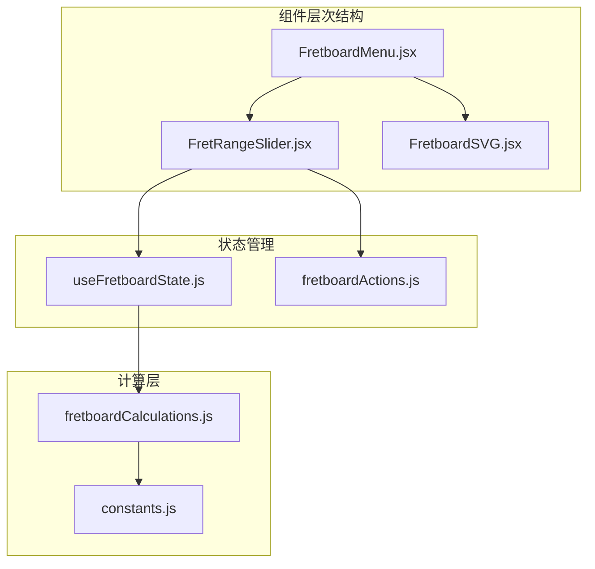
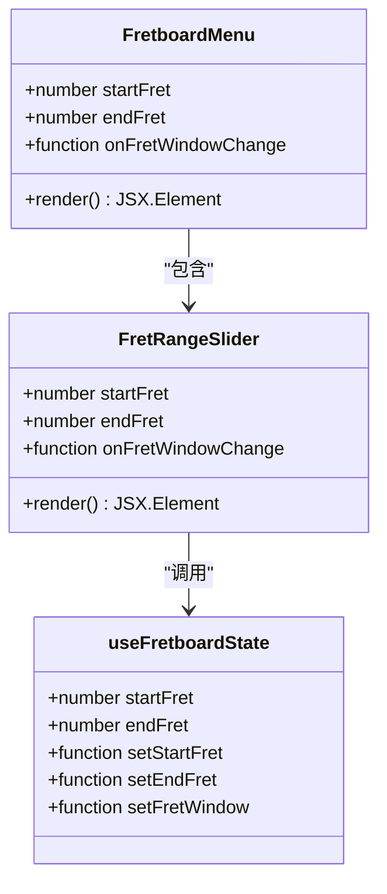
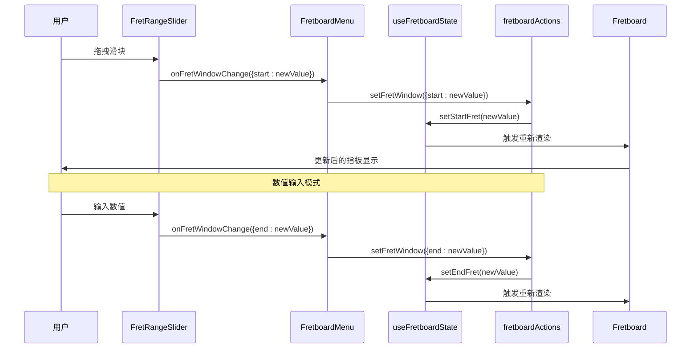
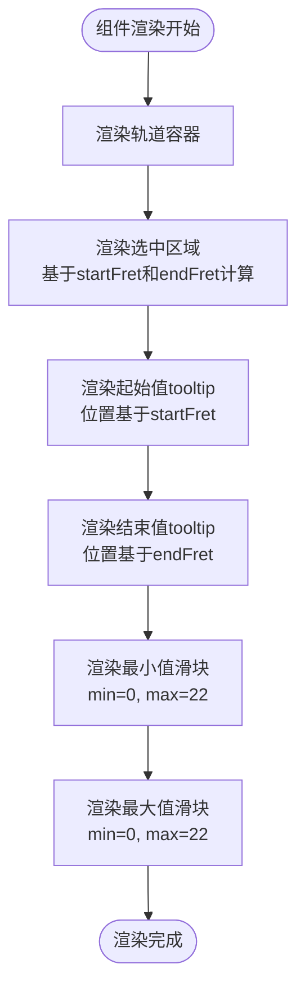
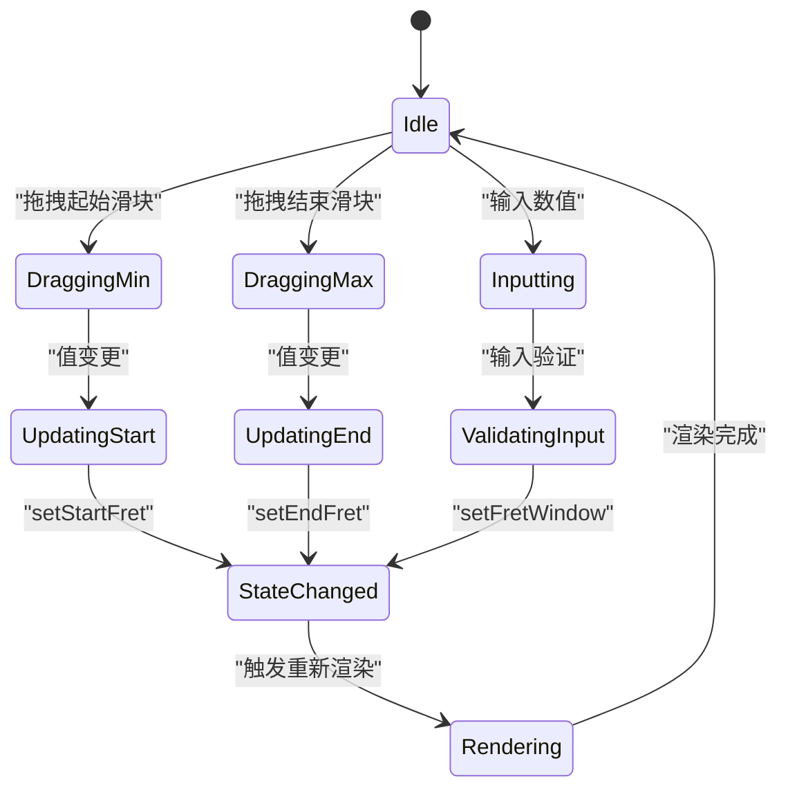
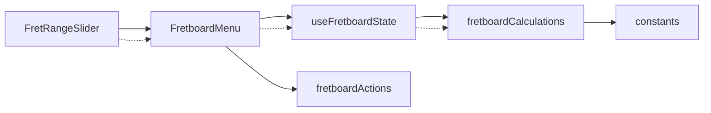

# 品范围滑块组件

<cite>
**本文档引用的文件**
- [FretRangeSlider.jsx](file://src/components/FretRangeSlider.jsx)
- [useFretboardState.js](file://src/hooks/useFretboardState.js)
- [FretboardMenu.jsx](file://src/components/FretboardMenu.jsx)
- [fretboardActions.js](file://src/utils/fretboardActions.js)
- [fretboardCalculations.js](file://src/utils/fretboardCalculations.js)
- [Fretboard.jsx](file://src/Fretboard.jsx)
- [constants.js](file://src/constants.js)
</cite>

## 目录
1. [简介](#简介)
2. [项目结构](#项目结构)
3. [核心组件](#核心组件)
4. [架构概览](#架构概览)
5. [详细组件分析](#详细组件分析)
6. [依赖关系分析](#依赖关系分析)
7. [性能考虑](#性能考虑)
8. [故障排除指南](#故障排除指南)
9. [结论](#结论)

## 简介

FretRangeSlider.jsx 是一个专门设计的双滑块组件，用于控制吉他指板显示的起始和结束品格范围。该组件提供了直观的视觉反馈和多种交互方式，包括传统的拖拽滑块和精确的数值输入。通过与全局状态管理系统的深度集成，该组件能够实时更新指板显示，为用户提供流畅的指板浏览体验。

## 项目结构

FretRangeSlider 组件位于组件目录中，与其它UI组件共同构成用户界面层。该组件通过FretboardMenu集成到主应用中，实现了完整的指板控制功能。

**图表来源**
- [FretRangeSlider.jsx](file://src/components/FretRangeSlider.jsx#L1-L76)
- [FretboardMenu.jsx](file://src/components/FretboardMenu.jsx#L1-L243)
- [useFretboardState.js](file://src/hooks/useFretboardState.js#L1-L190)

**章节来源**
- [FretRangeSlider.jsx](file://src/components/FretRangeSlider.jsx#L1-L76)
- [FretboardMenu.jsx](file://src/components/FretboardMenu.jsx#L1-L243)

## 核心组件

### 组件架构设计

FretRangeSlider 采用函数式组件设计，专注于单一职责：管理指板品格范围的选择。组件通过props接收当前状态，并通过回调函数通知父组件状态变更。

**图表来源**
- [FretRangeSlider.jsx](file://src/components/FretRangeSlider.jsx#L3-L76)
- [FretboardMenu.jsx](file://src/components/FretboardMenu.jsx#L8-L40)
- [useFretboardState.js](file://src/hooks/useFretboardState.js#L14-L166)

### Props接口定义

组件接受以下props参数：

| 参数名 | 类型 | 必需 | 描述 |
|--------|------|------|------|
| startFret | number | 是 | 指板起始品格位置（0-22） |
| endFret | number | 是 | 指板结束品格位置（1-23） |
| onFretWindowChange | function | 是 | 状态变更回调函数 |

**章节来源**
- [FretRangeSlider.jsx](file://src/components/FretRangeSlider.jsx#L3-L76)

## 架构概览

FretRangeSlider 在整个应用架构中扮演着关键的交互层角色，连接用户界面与状态管理系统。

**图表来源**
- [FretRangeSlider.jsx](file://src/components/FretRangeSlider.jsx#L45-L70)
- [FretboardMenu.jsx](file://src/components/FretboardMenu.jsx#L234-L238)
- [fretboardActions.js](file://src/utils/fretboardActions.js#L831-L877)

## 详细组件分析

### 滑块渲染机制

组件使用CSS定位和计算属性来实现精确的视觉反馈。每个滑块都有对应的tooltip显示当前值，选中区域通过动态样式计算实现。

**图表来源**
- [FretRangeSlider.jsx](file://src/components/FretRangeSlider.jsx#L5-L76)

### 事件处理逻辑

组件实现了两种主要的交互模式：

#### 滑块拖拽事件
- **起始滑块**：限制最大值为当前结束值减1
- **结束滑块**：限制最小值为当前起始值加1

#### 数值输入事件
- **输入验证**：确保输入值在有效范围内
- **边界处理**：自动调整超出范围的值

**章节来源**
- [FretRangeSlider.jsx](file://src/components/FretRangeSlider.jsx#L45-L70)

### 状态集成机制

组件通过useFretboardState钩子与全局状态系统集成，实现了响应式的状态管理。

**图表来源**
- [useFretboardState.js](file://src/hooks/useFretboardState.js#L14-L166)
- [fretboardActions.js](file://src/utils/fretboardActions.js#L831-L877)

### 边界情况处理

组件实现了全面的边界检查和错误处理机制：

| 检查类型 | 有效范围 | 处理策略 |
|----------|----------|----------|
| 品数范围 | 0-22 | 自动调整到有效范围 |
| 起始值 | 必须小于结束值 | 强制结束值大于起始值 |
| 结束值 | 必须大于起始值 | 强制起始值小于结束值 |
| 最大跨度 | 最多16个品格 | 限制最大显示范围 |

**章节来源**
- [fretboardActions.js](file://src/utils/fretboardActions.js#L852-L873)

### 性能优化特性

组件采用了多项性能优化技术：

1. **CSS计算优化**：使用calc()函数进行样式计算，减少JavaScript计算开销
2. **条件渲染**：根据状态动态调整tooltip显示
3. **事件节流**：通过状态管理减少不必要的重渲染

## 依赖关系分析

### 组件间依赖

**图表来源**
- [FretRangeSlider.jsx](file://src/components/FretRangeSlider.jsx#L1-L76)
- [FretboardMenu.jsx](file://src/components/FretboardMenu.jsx#L1-L243)
- [useFretboardState.js](file://src/hooks/useFretboardState.js#L1-L190)

### 外部依赖

组件依赖于以下外部模块：

- **React**：核心框架库
- **CSS样式**：通过className属性应用样式
- **全局常量**：使用CONSTS配置参数

**章节来源**
- [FretRangeSlider.jsx](file://src/components/FretRangeSlider.jsx#L1-L76)
- [constants.js](file://src/constants.js#L1-L19)

## 性能考虑

### 优化建议

1. **防抖输入处理**
   - 实现输入框的防抖机制，避免频繁的状态更新
   - 建议延迟500ms再触发状态变更

2. **样式计算优化**
   - 使用CSS变量替代JavaScript计算
   - 减少DOM查询次数

3. **事件监听优化**
   - 使用useCallback包装事件处理器
   - 避免不必要的事件监听器重新创建

4. **渲染优化**
   - 使用React.memo包装组件
   - 实现浅比较优化

### 内存管理

组件实现了适当的内存管理策略：
- 自动清理定时器和事件监听器
- 使用ref避免不必要的状态更新

## 故障排除指南

### 常见问题及解决方案

| 问题类型 | 症状 | 解决方案 |
|----------|------|----------|
| 滑块无法拖拽 | 滑块固定不动 | 检查onFretWindowChange回调函数 |
| 数值输入无效 | 输入后无反应 | 验证输入值是否在0-22范围内 |
| 界面不更新 | 状态变更后界面不变 | 确认useFretboardState钩子正确集成 |
| 性能问题 | 滑动卡顿 | 实施防抖和事件节流机制 |

### 调试技巧

1. **状态监控**：使用浏览器开发者工具监控状态变化
2. **事件追踪**：在回调函数中添加console.log输出
3. **边界测试**：测试各种边界情况和异常输入

**章节来源**
- [fretboardActions.js](file://src/utils/fretboardActions.js#L852-L873)

## 结论

FretRangeSlider.jsx 组件展现了现代React开发的最佳实践，通过清晰的职责分离、完善的错误处理和性能优化，为用户提供了一个直观、可靠的指板控制界面。组件的设计充分考虑了用户体验和系统性能，是一个值得学习的优秀组件示例。

该组件的成功之处在于：
- **单一职责原则**：专注于品格范围控制
- **状态管理集成**：与全局状态系统无缝协作
- **用户友好设计**：支持多种交互模式
- **健壮性**：完善的边界检查和错误处理
- **性能优化**：采用多项优化技术提升用户体验