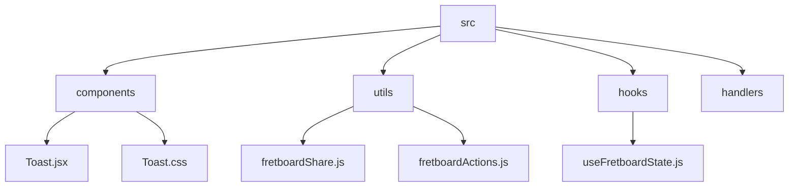
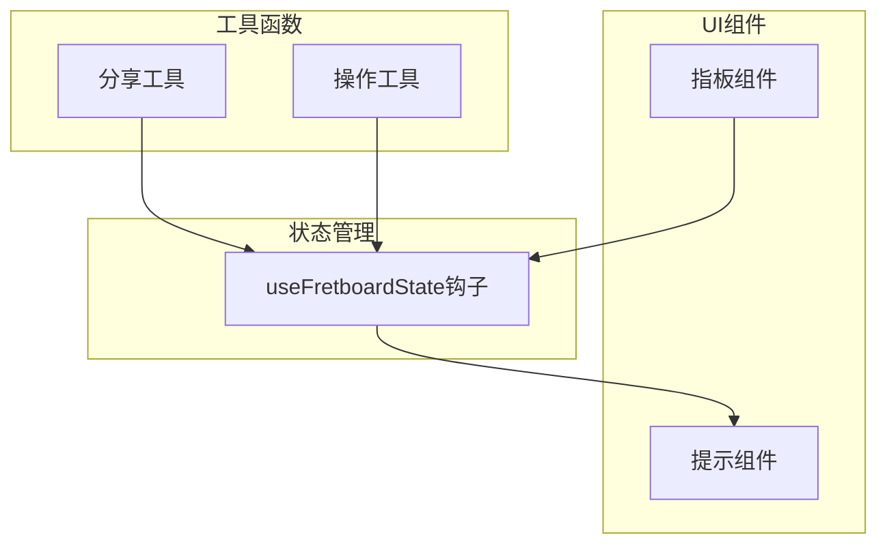
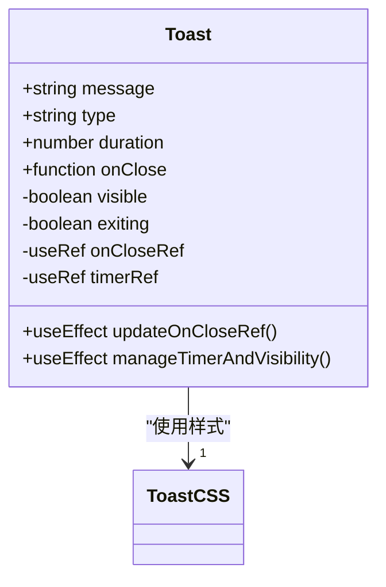
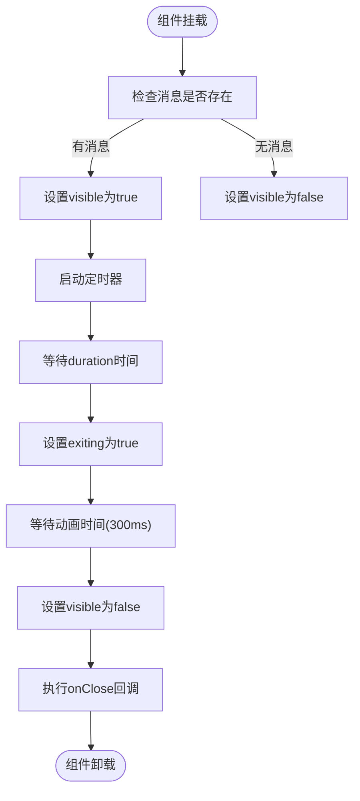
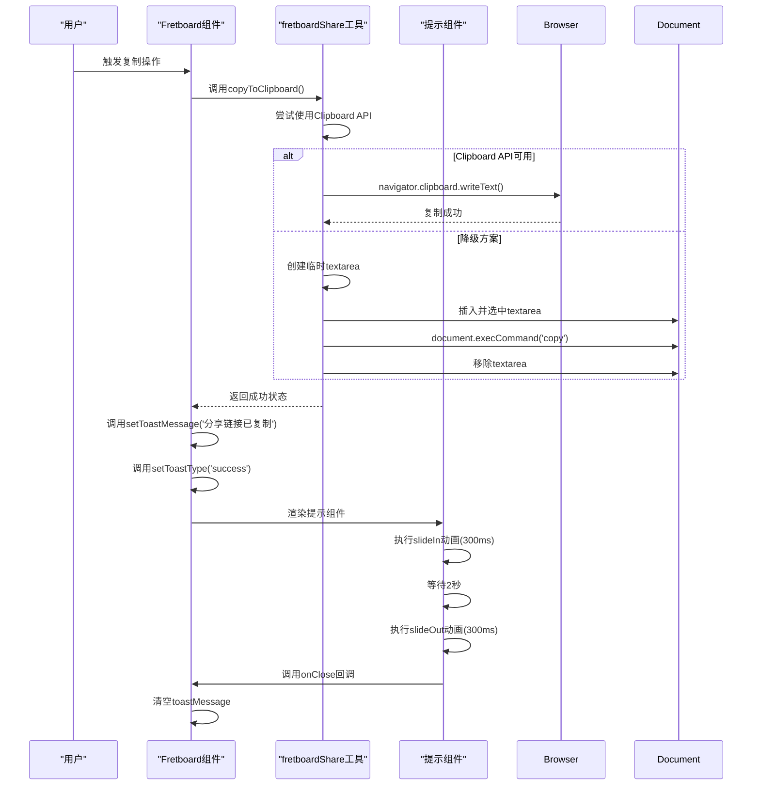

# 提示组件

<cite>
**本文档引用的文件**
- [Toast.jsx](file://src/components/Toast.jsx)
- [Toast.css](file://src/components/Toast.css)
- [fretboardShare.js](file://src/utils/fretboardShare.js)
- [Fretboard.jsx](file://src/Fretboard.jsx)
- [useFretboardState.js](file://src/hooks/useFretboardState.js)
- [fretboardActions.js](file://src/utils/fretboardActions.js)
</cite>

## 目录
1. [简介](#简介)
2. [项目结构](#项目结构)
3. [核心组件](#核心组件)
4. [架构概述](#架构概述)
5. [详细组件分析](#详细组件分析)
6. [依赖分析](#依赖分析)
7. [性能考虑](#性能考虑)
8. [故障排除指南](#故障排除指南)
9. [结论](#结论)
10. [附录](#附录)（如有必要）

## 简介
提示组件（Toast）是一个轻量级的通知系统，用于在用户界面上显示临时消息。该组件在用户执行特定操作（如复制分享链接）后提供即时反馈。它通过淡入淡出的CSS动画实现平滑的视觉效果，并支持多种消息类型（信息、成功、错误、警告）。该组件设计为可复用且易于集成，通过props控制其行为和外观。

## 项目结构
该项目采用基于功能的文件组织结构，将组件、工具函数、钩子和处理程序分离到不同的目录中。核心UI组件位于`src/components/`目录下，而业务逻辑和工具函数则分布在`src/utils/`和`src/hooks/`目录中。这种结构提高了代码的可维护性和可读性，使得开发人员可以轻松找到相关功能的实现。



**图源**
- [Toast.jsx](file://src/components/Toast.jsx)
- [fretboardShare.js](file://src/utils/fretboardShare.js)
- [useFretboardState.js](file://src/hooks/useFretboardState.js)

**节源**
- [Toast.jsx](file://src/components/Toast.jsx)
- [fretboardShare.js](file://src/utils/fretboardShare.js)

## 核心组件
提示组件（Toast）是本项目中的核心UI反馈机制。它通过`message`、`visible`、`duration`和`onClose`等props进行配置，实现了自动关闭定时器和手动关闭事件的处理。组件使用React的`useEffect`钩子来管理生命周期，确保在消息显示期间正确设置和清除定时器。CSS动画通过`slideIn`和`slideOut`关键帧实现，提供了流畅的用户体验。

**节源**
- [Toast.jsx](file://src/components/Toast.jsx#L4-L60)
- [Toast.css](file://src/components/Toast.css#L1-L78)

## 架构概述
整个应用的架构围绕着Fretboard主组件构建，该组件通过自定义钩子（如`useFretboardState`）管理状态。提示组件作为全局通知系统集成在主组件中，通过状态管理实现跨组件通信。当用户执行操作（如复制分享链接）时，相关工具函数会更新状态，触发提示组件的显示。这种架构模式确保了状态的一致性和可预测性。



**图源**
- [Fretboard.jsx](file://src/Fretboard.jsx#L23-L810)
- [useFretboardState.js](file://src/hooks/useFretboardState.js#L5-L188)

## 详细组件分析

### 提示组件分析
提示组件是一个功能完整的轻量级通知系统，用于向用户提供即时反馈。它通过props接收配置参数，并使用React的函数组件和钩子实现其功能。

#### 组件属性
提示组件接受以下props：
- `message`: 要显示的消息文本
- `type`: 消息类型（info、success、error、warning）
- `duration`: 消息显示的持续时间（毫秒）
- `onClose`: 消息关闭时的回调函数



**图源**
- [Toast.jsx](file://src/components/Toast.jsx#L4-L60)

#### CSS动画实现
提示组件的动画效果通过CSS关键帧实现，提供了流畅的用户体验。组件使用`slideIn`和`slideOut`动画，从右侧滑入并滑出。动画持续时间为300毫秒，使用`ease-out`和`ease-in`缓动函数，确保视觉效果自然。



**图源**
- [Toast.jsx](file://src/components/Toast.jsx#L15-L47)
- [Toast.css](file://src/components/Toast.css#L46-L68)

#### 自动关闭定时器管理
提示组件使用`useEffect`钩子来管理自动关闭定时器。当`message`或`duration`发生变化时，组件会清除之前的定时器并设置新的定时器。这确保了即使在频繁触发提示的情况下，也不会出现多个定时器同时运行的情况。

**节源**
- [Toast.jsx](file://src/components/Toast.jsx#L15-L47)

### 集成示例分析
提示组件在`fretboardShare.js`文件中的复制功能中得到了实际应用。当用户成功复制分享链接时，系统会显示一个成功的提示消息。

#### 复制功能流程


**图源**
- [fretboardShare.js](file://src/utils/fretboardShare.js#L112-L141)
- [Fretboard.jsx](file://src/Fretboard.jsx#L800-L805)

**节源**
- [fretboardShare.js](file://src/utils/fretboardShare.js#L112-L141)
- [Fretboard.jsx](file://src/Fretboard.jsx#L800-L805)

## 依赖分析
提示组件的实现依赖于React的核心功能，特别是函数组件和钩子（useState、useEffect、useRef）。这些依赖确保了组件的状态管理和生命周期控制。在项目层面，提示组件与`useFretboardState`钩子紧密集成，通过状态传递实现跨组件通信。

```mermaid
dependency-graph
Toast[Toast.jsx] --> React[React]
Toast --> ToastCSS[Toast.css]
Fretboard[Fretboard.jsx] --> Toast
Fretboard --> useFretboardState[useFretboardState.js]
useFretboardState --> Toast
fretboardActions[fretboardActions.js] --> useFretboardState
fretboardShare[fretboardShare.js] --> useFretboardState
```

**图源**
- [Toast.jsx](file://src/components/Toast.jsx)
- [Fretboard.jsx](file://src/Fretboard.jsx)
- [useFretboardState.js](file://src/hooks/useFretboardState.js)

**节源**
- [Toast.jsx](file://src/components/Toast.jsx)
- [Fretboard.jsx](file://src/Fretboard.jsx)
- [useFretboardState.js](file://src/hooks/useFretboardState.js)

## 性能考虑
提示组件的设计考虑了性能优化。通过使用`useRef`来存储`onClose`回调函数，避免了因回调函数变化而导致的不必要的`useEffect`重新运行。定时器的管理也经过优化，确保在组件卸载时正确清除，防止内存泄漏。CSS动画的使用比JavaScript动画更高效，因为它们可以在GPU上运行。

## 故障排除指南
当提示组件无法正常工作时，可以检查以下常见问题：
1. 确保`toastMessage`状态被正确设置
2. 检查`setToastMessage`和`setToastType`函数是否正确传递
3. 验证CSS文件是否正确导入
4. 确认定时器逻辑没有被意外中断

**节源**
- [Toast.jsx](file://src/components/Toast.jsx)
- [Fretboard.jsx](file://src/Fretboard.jsx)

## 结论
提示组件是一个设计精良、功能完整的轻量级通知系统。它通过简洁的API和流畅的动画效果，为用户提供即时的反馈。组件的实现充分利用了React的现代特性，如钩子和函数组件，确保了代码的可维护性和性能。通过与项目其他部分的紧密集成，提示组件在用户复制分享链接等关键操作中发挥了重要作用，提升了整体用户体验。

## 附录

### 可访问性实践
提示组件的设计考虑了可访问性需求：
- **屏幕阅读器支持**：虽然当前实现中没有显式的ARIA属性，但可以通过在未来的版本中添加`role="alert"`来增强屏幕阅读器的支持
- **焦点管理**：组件不会干扰页面的正常焦点流，因为它是一个临时的、非模态的元素
- **颜色对比度**：不同类型的提示使用高对比度的颜色（如蓝色、绿色、红色），确保色觉障碍用户也能识别

### 未来改进方向
1. 添加ARIA属性以增强可访问性
2. 支持更多动画效果和自定义选项
3. 增加对多语言消息的支持
4. 实现提示队列，支持连续显示多个消息