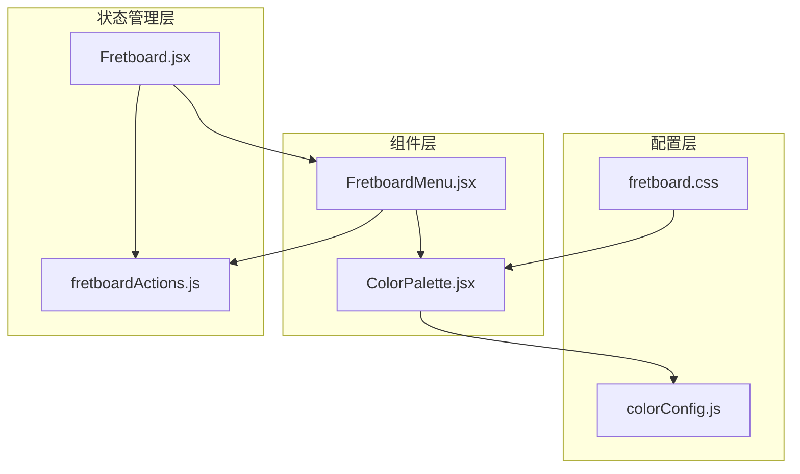
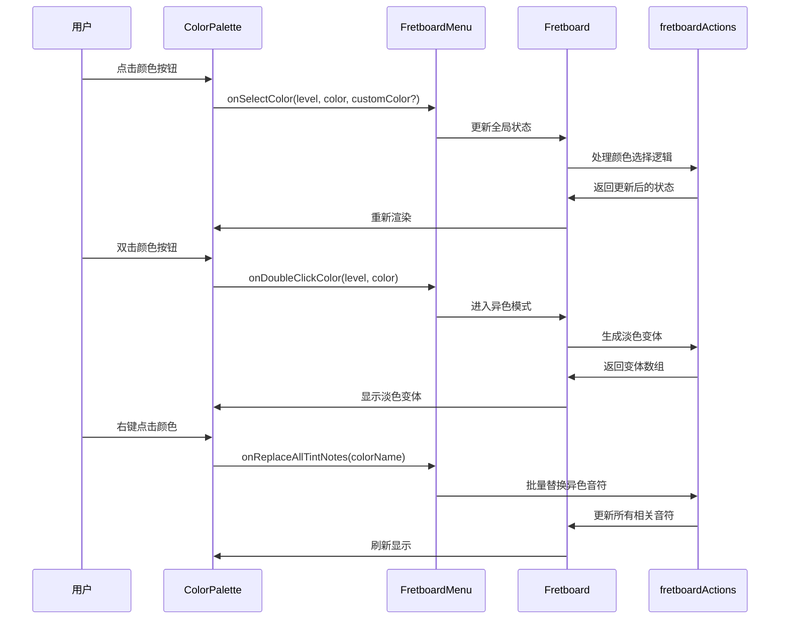
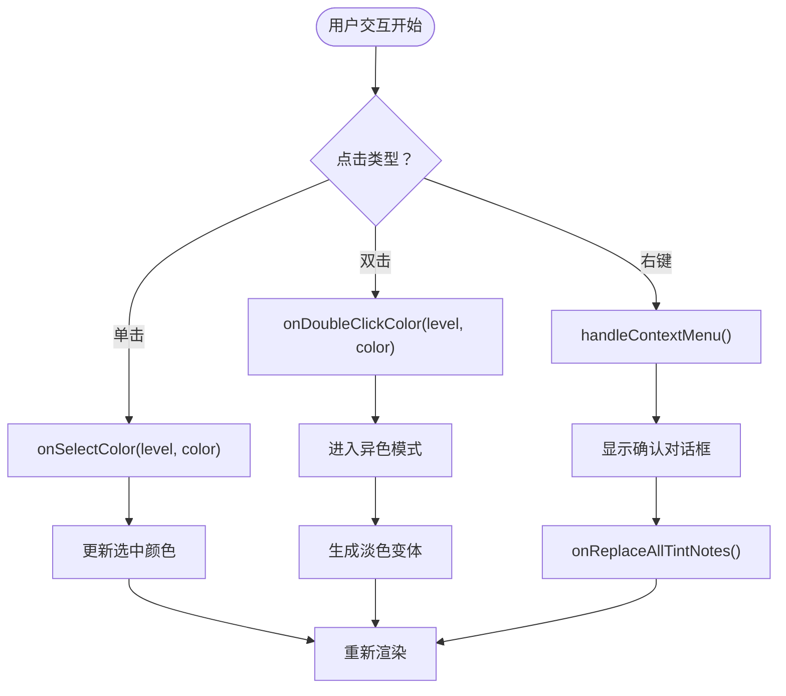
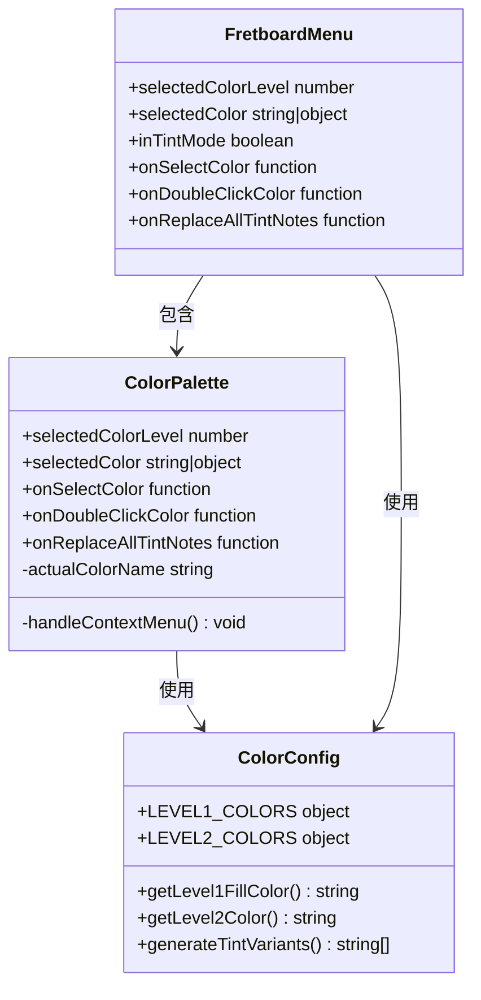
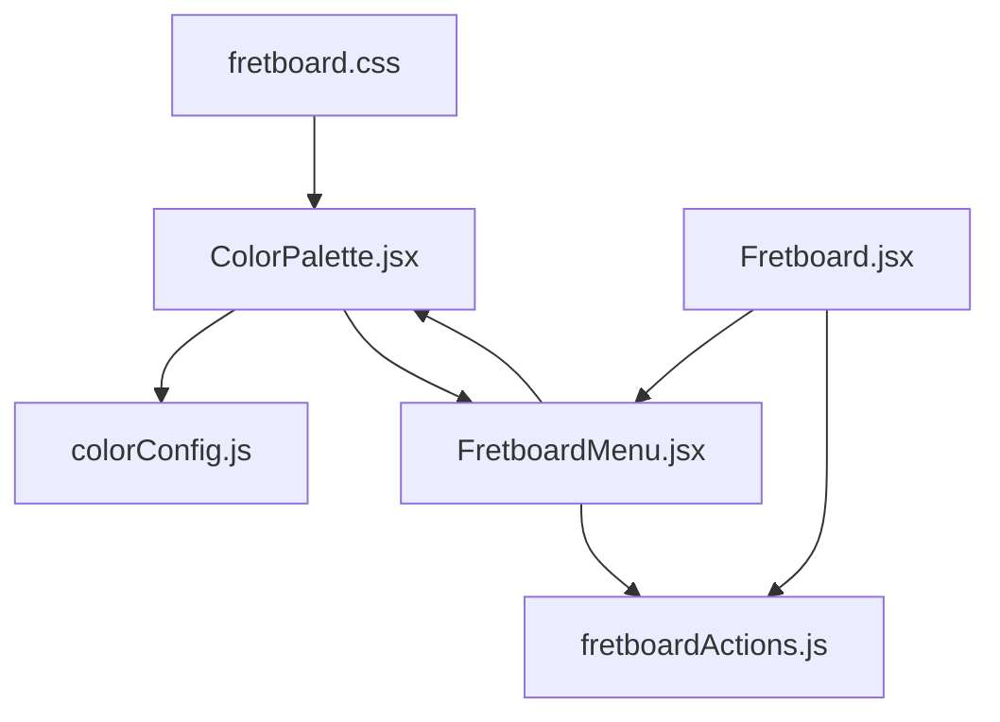

# 调色盘组件

<cite>
**本文档引用的文件**
- [ColorPalette.jsx](file://src/components/ColorPalette.jsx)
- [FretboardMenu.jsx](file://src/components/FretboardMenu.jsx)
- [colorConfig.js](file://src/colorConfig.js)
- [fretboard.css](file://src/fretboard.css)
- [Fretboard.jsx](file://src/Fretboard.jsx)
- [fretboardActions.js](file://src/utils/fretboardActions.js)
</cite>

## 目录
1. [简介](#简介)
2. [项目结构](#项目结构)
3. [核心组件](#核心组件)
4. [架构概览](#架构概览)
5. [详细组件分析](#详细组件分析)
6. [依赖关系分析](#依赖关系分析)
7. [性能考量](#性能考量)
8. [故障排除指南](#故障排除指南)
9. [结论](#结论)

## 简介
ColorPalette.jsx 是一个专门用于渲染颜色选择界面的 React 组件，支持用户为音符或标签选择颜色。该组件提供了完整的颜色选择体验，包括基础颜色选择、异色版本选择（淡色变体）以及批量替换功能。

## 项目结构
ColorPalette 组件位于组件目录中，与 FretboardMenu 组件紧密协作，共同构成音符颜色管理系统的核心部分。



**图表来源**
- [ColorPalette.jsx](file://src/components/ColorPalette.jsx#L1-L61)
- [FretboardMenu.jsx](file://src/components/FretboardMenu.jsx#L1-L243)
- [colorConfig.js](file://src/colorConfig.js#L1-L162)

**章节来源**
- [ColorPalette.jsx](file://src/components/ColorPalette.jsx#L1-L61)
- [FretboardMenu.jsx](file://src/components/FretboardMenu.jsx#L1-L243)

## 核心组件
ColorPalette 组件是一个纯函数组件，负责渲染颜色选择界面。它接收父组件传递的回调函数，并通过这些回调与父组件进行通信。

### 主要特性
- **双层颜色系统**：支持第一层（音符填充）和第二层（描边）颜色选择
- **异色版本支持**：提供颜色的淡色变体（5个层次）
- **批量替换功能**：支持将所有异色音符替换为目标颜色的对应变体
- **键盘快捷键**：为常用颜色提供快捷键映射

**章节来源**
- [ColorPalette.jsx](file://src/components/ColorPalette.jsx#L16-L60)

## 架构概览
ColorPalette 组件在整个应用架构中扮演着关键角色，它与多个模块协同工作以提供完整的颜色选择功能。



**图表来源**
- [ColorPalette.jsx](file://src/components/ColorPalette.jsx#L16-L60)
- [FretboardMenu.jsx](file://src/components/FretboardMenu.jsx#L99-L106)
- [Fretboard.jsx](file://src/Fretboard.jsx#L338-L395)
- [fretboardActions.js](file://src/utils/fretboardActions.js#L78-L266)

## 详细组件分析

### Props 接口定义
ColorPalette 组件接受以下 props 参数：

| 参数名 | 类型 | 必需 | 描述 |
|--------|------|------|------|
| selectedColorLevel | number | 是 | 当前选中的颜色层级（1或2） |
| selectedColor | string/object | 是 | 当前选中的颜色，可以是字符串或包含自定义颜色的对象 |
| onSelectColor | function | 是 | 颜色选择回调函数 |
| onDoubleClickColor | function | 否 | 双击颜色回调函数 |
| onReplaceAllTintNotes | function | 否 | 批量替换异色音符回调函数 |

### 内部状态管理
ColorPalette 组件采用无状态设计，主要通过 props 与父组件通信。内部状态包括：
- 实际颜色名称解析：处理自定义颜色对象的提取
- 右键菜单处理：提供批量替换功能
- 快捷键映射：为常用颜色提供键盘快捷键

### 事件处理机制
组件实现了多种交互事件：



**图表来源**
- [ColorPalette.jsx](file://src/components/ColorPalette.jsx#L20-L30)

**章节来源**
- [ColorPalette.jsx](file://src/components/ColorPalette.jsx#L16-L60)

### 颜色系统架构
ColorPalette 与 colorConfig.js 模块紧密集成，支持两级颜色系统：



**图表来源**
- [ColorPalette.jsx](file://src/components/ColorPalette.jsx#L1-L61)
- [colorConfig.js](file://src/colorConfig.js#L1-L162)
- [FretboardMenu.jsx](file://src/components/FretboardMenu.jsx#L1-L243)

**章节来源**
- [colorConfig.js](file://src/colorConfig.js#L1-L162)

### 样式系统与定制
ColorPalette 组件使用 CSS 类名系统实现样式控制：

| CSS 类名 | 用途 | 特性 |
|----------|------|------|
| `.color` | 基础颜色按钮 | 圆形，40px × 40px |
| `.color.level2` | 第二层颜色按钮 | 空心边框，6px宽度 |
| `.color.color-tint` | 异色版本按钮 | 32px × 32px，浅色版本 |
| `.selected` | 选中状态 | 高亮边框效果 |
| `#color-selector` | 容器样式 | 400px宽度，垂直布局 |

**章节来源**
- [fretboard.css](file://src/fretboard.css#L272-L444)

### 实际使用示例
ColorPalette 组件在 FretboardMenu 中的标准集成方式：

```javascript
// 在 FretboardMenu 中的使用
<ColorPalette 
    selectedColorLevel={selectedColorLevel}
    selectedColor={selectedColor}
    onSelectColor={selectColorMemo}
    onDoubleClickColor={doubleClickColorMemo}
    onReplaceAllTintNotes={replaceAllTintNotesMemo}
/>
```

**章节来源**
- [FretboardMenu.jsx](file://src/components/FretboardMenu.jsx#L100-L106)

## 依赖关系分析

### 组件间依赖


**图表来源**
- [ColorPalette.jsx](file://src/components/ColorPalette.jsx#L1-L61)
- [FretboardMenu.jsx](file://src/components/FretboardMenu.jsx#L1-L243)
- [colorConfig.js](file://src/colorConfig.js#L1-L162)
- [fretboardActions.js](file://src/utils/fretboardActions.js#L1-L878)

### 外部依赖
- **React**：组件库基础
- **colorConfig.js**：颜色配置和变体生成
- **fretboardActions.js**：颜色选择和状态管理逻辑

**章节来源**
- [ColorPalette.jsx](file://src/components/ColorPalette.jsx#L1-L61)

## 性能考量
ColorPalette 组件具有良好的性能特征：

### 渲染优化
- **无状态设计**：减少不必要的状态更新
- **条件渲染**：仅在需要时显示异色版本
- **事件委托**：通过回调函数处理用户交互

### 内存管理
- **函数式组件**：避免类组件的内存开销
- **合理的数据结构**：使用简单的字符串和对象结构

## 故障排除指南

### 常见问题诊断

#### 颜色选择无响应
**症状**：点击颜色按钮无反应
**排查步骤**：
1. 检查 `onSelectColor` 回调函数是否正确传入
2. 验证父组件是否正确处理颜色状态更新
3. 确认组件是否重新渲染

**解决方案**：
```javascript
// 确保回调函数正确绑定
const handleColorSelect = useCallback((level, color, customColor) => {
    // 处理颜色选择逻辑
}, []);
```

#### 异色模式不工作
**症状**：双击颜色无异色变体显示
**排查步骤**：
1. 检查 `inTintMode` 状态是否正确设置
2. 验证 `generateTintVariants` 函数是否正常工作
3. 确认颜色变体数组是否正确生成

**解决方案**：
```javascript
// 确保异色模式正确切换
const doubleClickColorMemo = useCallback((level, color) => {
    const baseColor = level === 1 
        ? getLevel1FillColor(color) 
        : getLevel2Color(color);
    const variants = generateTintVariants(baseColor);
    // 设置异色模式和默认变体
}, [selectedColorLevel, selectedColor, setSelectedColorLevel, setSelectedColor]);
```

#### 批量替换功能异常
**症状**：右键菜单无法替换异色音符
**排查步骤**：
1. 检查 `onReplaceAllTintNotes` 回调函数实现
2. 验证目标颜色名称是否有效
3. 确认异色音符的识别逻辑

**解决方案**：
```javascript
// 确保批量替换逻辑正确
const replaceAllTintNotesMemo = useCallback((targetColorName) => {
    replaceAllTintNotes(targetColorName, data, setData, notesElementRef, updateNote);
}, [data, setData]);
```

### 调试技巧
1. **使用浏览器开发者工具**：检查组件 props 和状态
2. **添加日志输出**：在关键回调函数中添加 console.log
3. **单元测试**：为颜色选择逻辑编写测试用例

**章节来源**
- [fretboardActions.js](file://src/utils/fretboardActions.js#L171-L266)

## 结论
ColorPalette.jsx 组件是一个设计精良的颜色选择组件，具有以下特点：

### 优势
- **模块化设计**：独立的功能模块，易于维护和测试
- **灵活的接口**：清晰的 props 接口和回调机制
- **丰富的功能**：支持基础颜色、异色版本和批量替换
- **良好的性能**：无状态设计和优化的渲染策略

### 最佳实践
1. **正确处理自定义颜色**：始终检查颜色对象的结构
2. **合理使用回调函数**：确保回调函数的正确绑定和参数传递
3. **状态同步**：保持组件状态与父组件状态的一致性
4. **错误处理**：为异步操作和用户交互提供适当的错误处理

该组件为音符颜色管理提供了完整而优雅的解决方案，是整个音符编辑系统的重要组成部分。