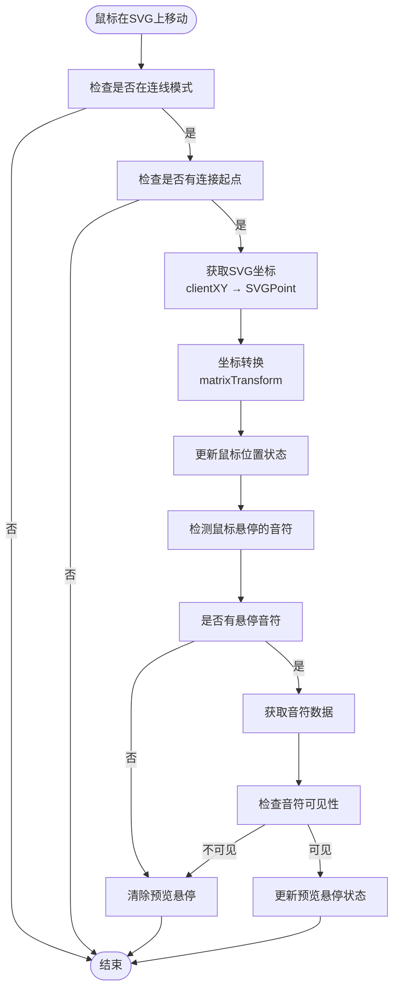

# SVG事件处理

<cite>
**本文档引用的文件**  
- [svgHandlers.js](file://src/handlers/svgHandlers.js)
- [FretboardSVG.jsx](file://src/components/FretboardSVG.jsx)
- [useConnectionState.js](file://src/hooks/useConnectionState.js)
- [connectionUtils.js](file://src/utils/connectionUtils.js)
- [utils.js](file://src/utils.js)
- [constants.js](file://src/constants.js)
- [Fretboard.jsx](file://src/Fretboard.jsx)
</cite>

## 目录
1. [简介](#简介)
2. [项目结构](#项目结构)
3. [核心组件](#核心组件)
4. [架构概述](#架构概述)
5. [详细组件分析](#详细组件分析)
6. [依赖分析](#依赖分析)
7. [性能考虑](#性能考虑)
8. [故障排除指南](#故障排除指南)
9. [结论](#结论)

## 简介
本文档深入分析了基于SVG的指板图应用中容器级别的事件处理逻辑。重点解析了点击、右键、鼠标移动、鼠标按下和滚轮事件的处理策略，以及这些事件如何协同工作以实现复杂的用户交互功能，如连线模式、颜色层级切换和实时预览。文档基于`svgHandlers.js`的实现，详细说明了事件委托、坐标转换、preventDefault调用等关键技术点，并提供调试方法和性能优化建议。

## 项目结构
项目采用模块化设计，将事件处理逻辑分离到专门的处理程序文件中。SVG相关的事件处理集中在`src/handlers/svgHandlers.js`中，通过工厂函数创建事件处理器。状态管理通过自定义hooks（如`useConnectionState.js`）实现，确保事件处理器能够访问和修改应用状态。UI组件（如`FretboardSVG.jsx`）负责注册这些事件处理器到SVG容器上。

```mermaid
graph TB
subgraph "事件处理"
svgHandlers[svgHandlers.js]
end
subgraph "状态管理"
useConnectionState[useConnectionState.js]
end
subgraph "UI组件"
FretboardSVG[FretboardSVG.jsx]
end
svgHandlers --> useConnectionState : "依赖状态"
FretboardSVG --> svgHandlers : "使用事件处理器"
FretboardSVG --> useConnectionState : "获取状态"
```

**图表来源**  
- [svgHandlers.js](file://src/handlers/svgHandlers.js)
- [useConnectionState.js](file://src/hooks/useConnectionState.js)
- [FretboardSVG.jsx](file://src/components/FretboardSVG.jsx)

**章节来源**  
- [svgHandlers.js](file://src/handlers/svgHandlers.js)
- [useConnectionState.js](file://src/hooks/useConnectionState.js)
- [FretboardSVG.jsx](file://src/components/FretboardSVG.jsx)

## 核心组件
核心组件包括事件处理工厂函数（如`createSvgClickHandler`）、连接状态管理hook（`useConnectionState`）和SVG渲染组件（`FretboardSVG`）。这些组件通过参数传递和状态共享紧密协作，实现了复杂的交互逻辑。事件处理器通过闭包捕获必要的状态和函数引用，确保在事件触发时能够正确访问和修改应用状态。

**章节来源**  
- [svgHandlers.js](file://src/handlers/svgHandlers.js#L4-L200)
- [useConnectionState.js](file://src/hooks/useConnectionState.js#L21-L64)
- [FretboardSVG.jsx](file://src/components/FretboardSVG.jsx#L9-L800)

## 架构概述
系统采用事件驱动架构，SVG容器作为主要的事件监听器，通过事件委托机制处理所有子元素的交互。事件处理链路清晰：用户交互 → SVG事件触发 → 事件处理器执行 → 状态更新 → UI重新渲染。这种架构实现了关注点分离，使事件逻辑与UI渲染逻辑解耦，提高了代码的可维护性和可测试性。


**图表来源**  
- [svgHandlers.js](file://src/handlers/svgHandlers.js)
- [Fretboard.jsx](file://src/Fretboard.jsx)
- [FretboardSVG.jsx](file://src/components/FretboardSVG.jsx)

## 详细组件分析
本节深入分析SVG事件处理的核心组件，包括点击、右键、鼠标移动、鼠标按下和滚轮事件的处理逻辑。

### 点击事件处理分析
`createSvgClickHandler`负责处理SVG容器的点击事件，主要功能包括取消选中状态和退出连线模式。


**图表来源**  
- [svgHandlers.js](file://src/handlers/svgHandlers.js#L4-L54)

**章节来源**  
- [svgHandlers.js](file://src/handlers/svgHandlers.js#L4-L54)
- [FretboardSVG.jsx](file://src/components/FretboardSVG.jsx#L80)

### 右键事件处理分析
`createSvgContextMenuHandler`处理右键点击事件，主要用于在连线模式下取消连线工具。


**图表来源**  
- [svgHandlers.js](file://src/handlers/svgHandlers.js#L57-L79)

**章节来源**  
- [svgHandlers.js](file://src/handlers/svgHandlers.js#L57-L79)
- [FretboardSVG.jsx](file://src/components/FretboardSVG.jsx#L83)

### 鼠标移动事件处理分析
`createSvgMouseMoveHandler`实现实时连线预览功能，是用户体验的关键部分。



**图表来源**  
- [svgHandlers.js](file://src/handlers/svgHandlers.js#L82-L118)

**章节来源**  
- [svgHandlers.js](file://src/handlers/svgHandlers.js#L82-L118)
- [FretboardSVG.jsx](file://src/components/FretboardSVG.jsx#L81)

### 鼠标按下事件处理分析
`createSvgMouseDownHandler`处理鼠标按下事件，特别实现了中键在连线模式下切换color2层级的功能。


**图表来源**  
- [svgHandlers.js](file://src/handlers/svgHandlers.js#L122-L156)

**章节来源**  
- [svgHandlers.js](file://src/handlers/svgHandlers.js#L122-L156)
- [FretboardSVG.jsx](file://src/components/FretboardSVG.jsx#L251-L270)

### 滚轮事件处理分析
`createSvgWheelHandler`处理滚轮事件，在连线模式下切换color2层级，提供另一种交互方式。


**图表来源**  
- [svgHandlers.js](file://src/handlers/svgHandlers.js#L159-L182)

**章节来源**  
- [svgHandlers.js](file://src/handlers/svgHandlers.js#L159-L182)
- [FretboardSVG.jsx](file://src/components/FretboardSVG.jsx)

## 依赖分析
事件处理系统依赖于多个核心模块的协同工作。`svgHandlers.js`依赖`useConnectionState.js`提供的状态管理，依赖`utils.js`中的辅助函数（如`detectNoteAtPosition`），并通过参数传递依赖`Fretboard.jsx`中的各种状态和函数。


**图表来源**  
- [svgHandlers.js](file://src/handlers/svgHandlers.js)
- [useConnectionState.js](file://src/hooks/useConnectionState.js)
- [utils.js](file://src/utils.js)
- [constants.js](file://src/constants.js)
- [Fretboard.jsx](file://src/Fretboard.jsx)
- [FretboardSVG.jsx](file://src/components/FretboardSVG.jsx)

**章节来源**  
- [svgHandlers.js](file://src/handlers/svgHandlers.js)
- [useConnectionState.js](file://src/hooks/useConnectionState.js)
- [utils.js](file://src/utils.js)

## 性能考虑
SVG事件处理系统的性能主要受坐标转换和频繁状态更新的影响。`createSVGPoint().matrixTransform()`是计算密集型操作，应避免在高频事件（如mousemove）中进行不必要的计算。建议在非连线模式下禁用mousemove处理器，或使用节流（throttle）技术限制处理频率。状态更新应尽量批量进行，避免每次事件都触发不必要的重新渲染。

## 故障排除指南
### 事件处理链路调试方法
1. **检查事件绑定**：确认SVG元素正确绑定了事件处理器
2. **验证状态同步**：检查`useConnectionState`中的状态是否正确更新
3. **调试坐标转换**：在`createSvgMouseMoveHandler`中添加日志，验证SVG坐标转换是否正确
4. **检查preventDefault**：确保在需要阻止默认行为的地方正确调用了`preventDefault()`
5. **验证状态依赖**：确认事件处理器捕获的状态是最新的

### 常见问题及解决方案
- **问题**：连线预览不显示
  - **检查**：`connectionMode`和`connectionStartNote`状态
  - **检查**：`mousePosition`是否正确更新
  - **检查**：`previewHoverNote`的检测逻辑

- **问题**：color2层级切换无效
  - **检查**：目标音符是否有`color2`属性
  - **检查**：`useColor2Level`状态是否正确更新
  - **检查**：UI组件是否正确响应`useColor2Level`变化

- **问题**：右键菜单无法取消连线模式
  - **检查**：`preventDefault()`是否被正确调用
  - **检查**：`connectionMode`状态是否正确重置

**章节来源**  
- [svgHandlers.js](file://src/handlers/svgHandlers.js)
- [useConnectionState.js](file://src/hooks/useConnectionState.js)
- [FretboardSVG.jsx](file://src/components/FretboardSVG.jsx)

## 结论
SVG容器级别的事件处理系统通过精心设计的工厂函数和状态管理机制，实现了复杂而流畅的用户交互。事件委托模式减少了事件监听器的数量，提高了性能。坐标转换技术确保了精确的交互定位。`preventDefault()`和`stopPropagation()`的恰当使用保证了用户体验的一致性。该系统展示了如何通过模块化设计和关注点分离来构建可维护的复杂交互逻辑。