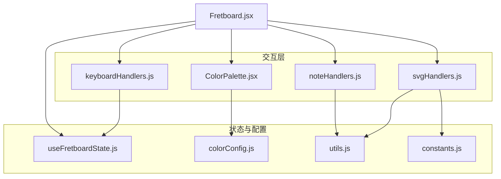
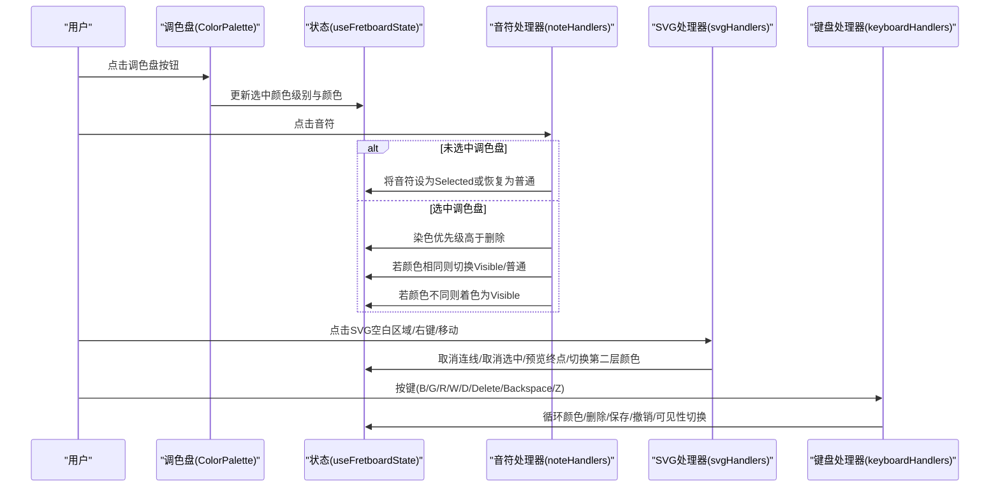
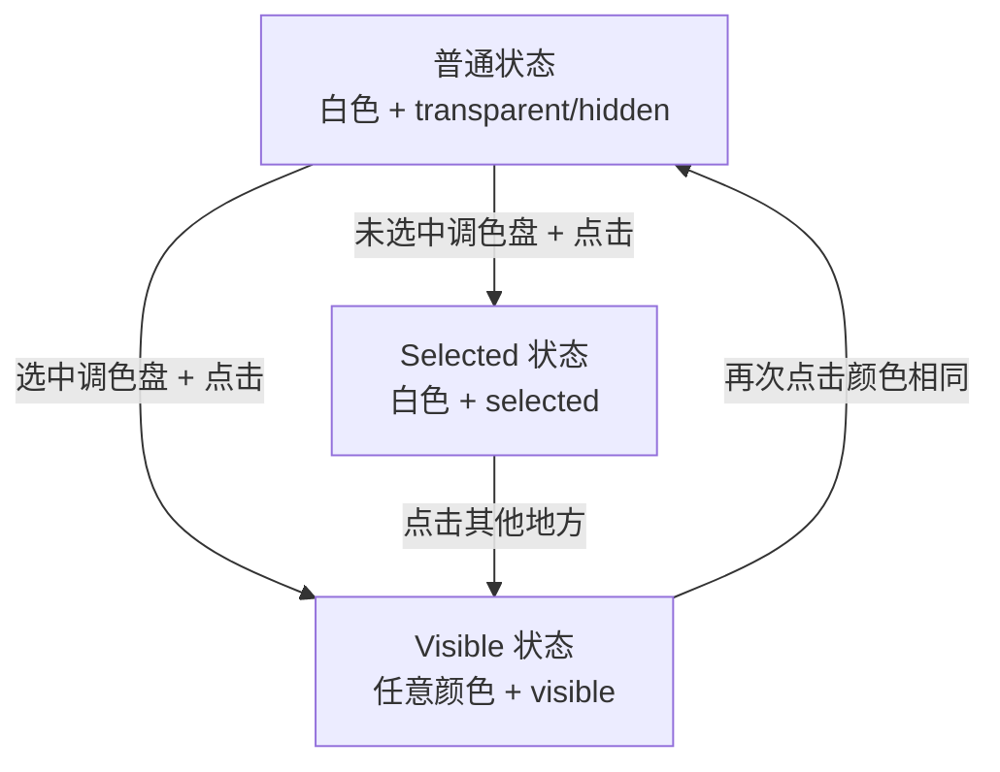
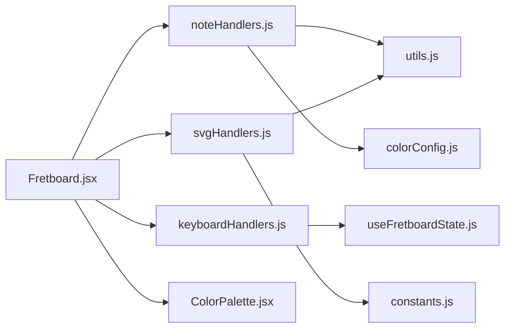

# 交互模式

<cite>
**本文引用的文件列表**
- [INTERACTION_GUIDE.md](file://INTERACTION_GUIDE.md)
- [ColorPalette.jsx](file://src/components/ColorPalette.jsx)
- [noteHandlers.js](file://src/handlers/noteHandlers.js)
- [keyboardHandlers.js](file://src/handlers/keyboardHandlers.js)
- [svgHandlers.js](file://src/handlers/svgHandlers.js)
- [useFretboardState.js](file://src/hooks/useFretboardState.js)
- [colorConfig.js](file://src/colorConfig.js)
- [utils.js](file://src/utils.js)
- [constants.js](file://src/constants.js)
- [Fretboard.jsx](file://src/Fretboard.jsx)
</cite>

## 目录
1. [简介](#简介)
2. [项目结构](#项目结构)
3. [核心组件](#核心组件)
4. [架构总览](#架构总览)
5. [详细组件分析](#详细组件分析)
6. [依赖关系分析](#依赖关系分析)
7. [性能考量](#性能考量)
8. [故障排查指南](#故障排查指南)
9. [结论](#结论)

## 简介
本文件围绕指板图的用户交互逻辑进行系统化文档化，严格依据 INTERACTION_GUIDE.md 的状态机模型，完整覆盖音符三种状态（普通、Visible、Selected）及其转换规则；详述 ColorPalette.jsx 调色盘的交互机制与“先选调色盘再点音符”的规则及染色优先级；并文档化 noteHandlers.js 的音符点击逻辑、keyboardHandlers.js 的快捷键处理（B/D/G/W/R/Delete 等）、svgHandlers.js 的 SVG 事件处理。文末提供具体交互示例与状态转换图，帮助开发者与使用者快速理解与维护交互行为。

## 项目结构
本项目采用以功能域划分的组织方式，交互相关的核心文件分布如下：
- 组件层：ColorPalette.jsx（调色盘 UI 与交互）
- 处理器层：noteHandlers.js（音符点击/右键/删除）、keyboardHandlers.js（键盘快捷键）、svgHandlers.js（SVG 区域点击/右键/鼠标移动/滚轮）
- 状态钩子：useFretboardState.js（全局状态与默认选中调色盘）
- 工具与配置：colorConfig.js（颜色配置与层级）、utils.js（DOM 更新、颜色计算、检测）、constants.js（常量）
- 主入口：Fretboard.jsx（组装状态、处理器与事件）

图表来源
- [Fretboard.jsx](file://src/Fretboard.jsx#L1-L200)
- [ColorPalette.jsx](file://src/components/ColorPalette.jsx#L1-L61)
- [noteHandlers.js](file://src/handlers/noteHandlers.js#L1-L550)
- [keyboardHandlers.js](file://src/handlers/keyboardHandlers.js#L1-L227)
- [svgHandlers.js](file://src/handlers/svgHandlers.js#L1-L200)
- [useFretboardState.js](file://src/hooks/useFretboardState.js#L1-L190)
- [colorConfig.js](file://src/colorConfig.js#L1-L162)
- [utils.js](file://src/utils.js#L1-L553)
- [constants.js](file://src/constants.js#L1-L19)

章节来源
- [Fretboard.jsx](file://src/Fretboard.jsx#L1-L200)

## 核心组件
- 音符状态与可见性
  - 普通状态：白色 + 全局可见性（transparent/hidden）
  - Visible 状态：任意颜色 + visible
  - Selected 状态：保持原有颜色 + selected（虚线边框）
- 调色盘交互
  - 默认选中第一层级第一个颜色（透明色）
  - 支持点击切换、双击替换全部异色、右键菜单确认
- 快捷键
  - B/G/R/W/D：选择对应颜色；W 反向循环；A/D：第二层级循环；Delete：删除选中音符；Backspace：删除悬停音符或连线
- SVG 事件
  - 点击空白区域取消连线/取消选中；右键取消连线；鼠标移动预览连线终点；中键/滚轮切换第二层颜色

章节来源
- [INTERACTION_GUIDE.md](file://INTERACTION_GUIDE.md#L3-L197)
- [useFretboardState.js](file://src/hooks/useFretboardState.js#L5-L25)
- [ColorPalette.jsx](file://src/components/ColorPalette.jsx#L16-L60)
- [keyboardHandlers.js](file://src/handlers/keyboardHandlers.js#L3-L227)
- [svgHandlers.js](file://src/handlers/svgHandlers.js#L4-L200)

## 架构总览
交互控制流以 Fretboard.jsx 为核心，通过事件处理器与状态钩子协调各模块：
- 用户在调色盘选择颜色（ColorPalette.jsx）→ 更新全局选中颜色状态（useFretboardState.js）
- 用户点击音符（noteHandlers.js）→ 根据是否选中调色盘与当前音符状态执行着色/切换/删除
- 用户在 SVG 区域交互（svgHandlers.js）→ 处理连线模式、取消选中、预览与中键/滚轮切换第二层颜色
- 用户使用快捷键（keyboardHandlers.js）→ 执行颜色循环、删除、保存/撤销、可见性切换等

图表来源
- [Fretboard.jsx](file://src/Fretboard.jsx#L1-L200)
- [ColorPalette.jsx](file://src/components/ColorPalette.jsx#L16-L60)
- [noteHandlers.js](file://src/handlers/noteHandlers.js#L7-L442)
- [svgHandlers.js](file://src/handlers/svgHandlers.js#L4-L183)
- [keyboardHandlers.js](file://src/handlers/keyboardHandlers.js#L3-L227)
- [useFretboardState.js](file://src/hooks/useFretboardState.js#L5-L25)

## 详细组件分析

### 音符状态与转换规则
- 普通状态：白色 + 全局可见性（由 Toggle 控制 transparent/hidden）
- Visible 状态：任意颜色 + visible，用于高亮显示
- Selected 状态：保持原有颜色 + selected（虚线边框），用于编辑/删除等操作

状态转换图（基于 INTERACTION_GUIDE.md）：

图表来源
- [INTERACTION_GUIDE.md](file://INTERACTION_GUIDE.md#L174-L188)

章节来源
- [INTERACTION_GUIDE.md](file://INTERACTION_GUIDE.md#L3-L197)

### 调色盘交互机制（ColorPalette.jsx）
- 颜色选项：蓝色、绿色、红色、白色、黑色（透明色）
- 默认状态：黑色（透明）调色盘默认被选中（来自 useFretboardState.js）
- 交互规则：
  - 点击任意调色盘按钮，按钮高亮（带边框与阴影）
  - 再次点击已选中的调色盘按钮可取消选中
  - 双击调色盘按钮触发“替换全部异色”确认对话框
  - 右键调色盘按钮（除透明色外）弹出确认对话框，确认后调用 onReplaceAllTintNotes 回调

章节来源
- [ColorPalette.jsx](file://src/components/ColorPalette.jsx#L16-L60)
- [useFretboardState.js](file://src/hooks/useFretboardState.js#L7-L10)

### 音符点击逻辑（noteHandlers.js）
- 连线模式优先：若处于连线模式且点击的音符为 Visible，则进入连线逻辑（记录起点/终点、计算颜色、创建连接）
- 选中调色盘时的点击：
  - 第一层颜色（含异色）：若与当前音符颜色相同，执行清除或切换 Visible/普通；若不同则着色为 Visible
  - 第二层颜色：仅对 color2 生效，相同则清除第二层颜色，不同则应用第二层颜色
- 未选中调色盘时的点击：
  - 普通状态音符：变为 Selected（带虚线边框）
  - Visible 状态音符：恢复为普通状态（白色 + 全局可见性）
- 自动选中透明色：若未选中任何调色盘，点击音符时自动选中第一层第一个颜色（透明色），并按透明色着色

章节来源
- [noteHandlers.js](file://src/handlers/noteHandlers.js#L7-L442)

### 快捷键处理（keyboardHandlers.js）
- 颜色选择与循环：B/G/R/W/D 分别选择对应颜色；W 支持 Shift 反向循环；A/D 切换第二层颜色
- 删除：Delete 删除选中音符；Backspace 删除悬停音符或连线
- 可见性：Z 切换全局可见性（transparent/hidden）
- 连线工具：S 切换连线模式，退出时清理状态
- 保存/撤销/重置：Ctrl+S/Ctrl+Shift+S 保存状态；Ctrl+Z/ Ctrl+Shift+Z 撤销/重做；Ctrl+D 重置

章节来源
- [keyboardHandlers.js](file://src/handlers/keyboardHandlers.js#L3-L227)

### SVG 事件处理（svgHandlers.js）
- 点击空白区域：取消连线模式、取消选中、关闭连线工具栏
- 右键：在连线模式下取消连线工具
- 鼠标移动：在连线模式下检测悬停音符，仅 Visible 音符可作为预览终点
- 中键/滚轮：在连线模式下，若悬停音符有第二层颜色，切换使用第二层颜色层级

章节来源
- [svgHandlers.js](file://src/handlers/svgHandlers.js#L4-L183)

### 右键重命名与删除
- 右键音符：弹出编辑框，修改音符标签文本，按 Enter 或点击外部区域保存
- 删除：选中音符后点击删除按钮或按 Delete/Backspace 键，音符恢复为普通状态并清除自定义文本

章节来源
- [noteHandlers.js](file://src/handlers/noteHandlers.js#L444-L550)

## 依赖关系分析
- noteHandlers.js 依赖：
  - utils.js：updateNote（更新 DOM 类名与属性）、detectNoteAtPosition（连线模式悬停检测）、calculateConnectionColor（连线颜色计算）
  - colorConfig.js：LEVEL1_COLORS（颜色顺序）、getLevel1FillColor/getLevel2Color（颜色值）
- svgHandlers.js 依赖：
  - utils.js：detectNoteAtPosition（悬停检测）
  - constants.js：circleRadius（检测半径）
- keyboardHandlers.js 依赖：
  - useFretboardState.js：selected、visibility、connectionMode 等状态
  - utils/fretboardActions（颜色循环、可见性切换、保存等）
- Fretboard.jsx 作为装配者，将上述模块整合并注入事件处理器与状态钩子

图表来源
- [noteHandlers.js](file://src/handlers/noteHandlers.js#L1-L31)
- [svgHandlers.js](file://src/handlers/svgHandlers.js#L1-L21)
- [keyboardHandlers.js](file://src/handlers/keyboardHandlers.js#L3-L31)
- [Fretboard.jsx](file://src/Fretboard.jsx#L1-L22)
- [utils.js](file://src/utils.js#L1-L80)
- [colorConfig.js](file://src/colorConfig.js#L1-L56)
- [constants.js](file://src/constants.js#L1-L19)
- [useFretboardState.js](file://src/hooks/useFretboardState.js#L1-L25)

## 性能考量
- DOM 更新最小化：通过 updateNote 统一更新类名与属性，减少多次重排
- 状态同步：dataRef 与 selectedTimeoutRef 避免闭包与定时器泄漏
- 检测范围优化：detectNoteAtPosition 使用圆半径阈值，避免全量遍历
- 连线计算：calculateConnectionColor 与 updateConnectionColors 在状态变更时批量更新

章节来源
- [utils.js](file://src/utils.js#L105-L165)
- [useFretboardState.js](file://src/hooks/useFretboardState.js#L27-L33)

## 故障排查指南
- 无法着色
  - 确认已选中调色盘（默认透明色已选中，可直接点击音符着色）
  - 检查音符是否为 Visible 状态（连线模式下需 Visible 才能参与连线）
- 删除无效
  - Delete 需要选中音符；Backspace 需悬停在 Visible 音符或连线
- 连线异常
  - 仅 Visible 音符可作为连线起点/终点；起点/终点需满足可见性条件
- 右键菜单不出现
  - 右键仅在调色盘按钮（非透明色）与音符右键弹窗生效
- 快捷键冲突
  - Ctrl+D 重置与 D 键选择透明色冲突，注意按键组合

章节来源
- [noteHandlers.js](file://src/handlers/noteHandlers.js#L444-L550)
- [svgHandlers.js](file://src/handlers/svgHandlers.js#L57-L80)
- [keyboardHandlers.js](file://src/handlers/keyboardHandlers.js#L86-L93)

## 结论
本交互体系以明确的状态机与优先级规则为基础，结合调色盘选择、音符点击、SVG 事件与快捷键，形成统一而灵活的编辑体验。noteHandlers.js 的“染色优先级大于删除”与 svgHandlers.js 的“连线模式优先”保证了复杂场景下的行为一致性；keyboardHandlers.js 与 ColorPalette.jsx 则提供了高效的操作入口。建议在后续迭代中持续关注 DOM 更新粒度与状态同步的稳定性，以进一步提升性能与可维护性。