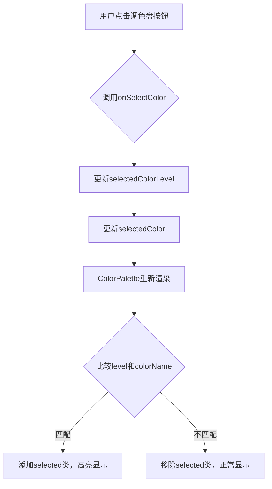
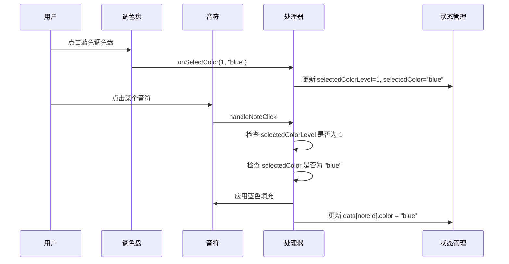
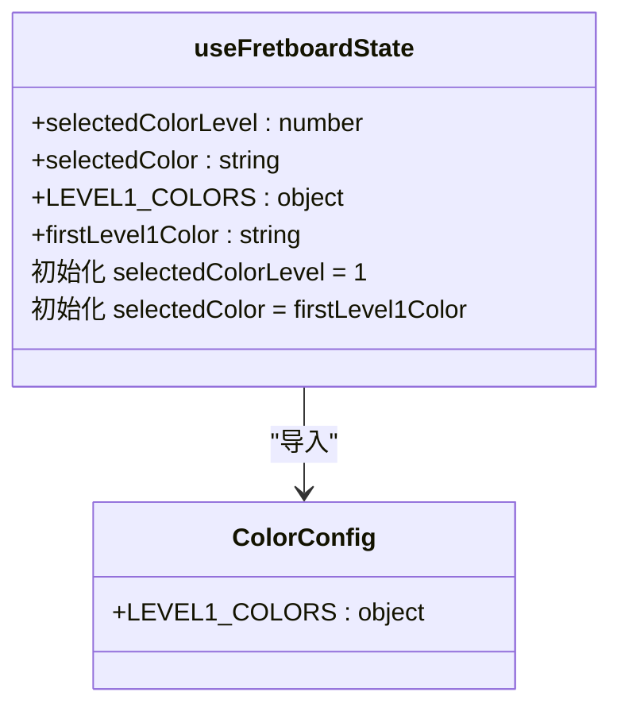

# 调色盘交互

<cite>
**本文档引用的文件**   
- [ColorPalette.jsx](file://src/components/ColorPalette.jsx)
- [noteHandlers.js](file://src/handlers/noteHandlers.js)
- [colorConfig.js](file://src/colorConfig.js)
- [useFretboardState.js](file://src/hooks/useFretboardState.js)
- [Fretboard.jsx](file://src/Fretboard.jsx)
- [keyboardHandlers.js](file://src/handlers/keyboardHandlers.js)
- [fretboardActions.js](file://src/utils/fretboardActions.js)
</cite>

## 目录
1. [引言](#引言)
2. [调色盘组件结构与颜色配置](#调色盘组件结构与颜色配置)
3. [调色盘选择逻辑与状态管理](#调色盘选择逻辑与状态管理)
4. [音符点击交互机制](#音符点击交互机制)
5. [调色盘高亮与选中行为](#调色盘高亮与选中行为)
6. [默认黑色调色盘初始化](#默认黑色调色盘初始化)
7. [快捷键与调色盘交互](#快捷键与调色盘交互)
8. [染色优先级与状态耦合](#染色优先级与状态耦合)
9. [实际交互场景与调试建议](#实际交互场景与调试建议)

## 引言
本文档详细阐述了 `ColorPalette.jsx` 组件的交互机制，重点分析五种颜色（蓝、绿、红、白、黑/透明）的选择逻辑。文档解释了“先选调色盘再点音符”的核心规则和染色优先级原则，说明了调色盘按钮的高亮显示、选中与取消选中行为，以及默认黑色调色盘的初始化逻辑。结合 `noteHandlers.js` 中的 `selectedColorLevel` 和 `selectedColor` 状态管理，阐述调色盘选择如何影响后续音符点击行为。同时，提供用户通过点击或快捷键选择调色盘后的状态流转过程，以及调色盘与音符状态之间的耦合关系，并给出实际交互场景的代码追踪和调试建议。

## 调色盘组件结构与颜色配置

`ColorPalette.jsx` 组件渲染了两个层级的调色盘按钮，分别对应第一层颜色（用于音符填充）和第二层颜色（用于描边）。其结构和颜色配置由 `colorConfig.js` 文件定义。

第一层颜色（`LEVEL1_COLORS`）包括透明色（`trans`）、蓝色（`blue`）、红色（`red`）、绿色（`green`）、棕色（`brown`）和灰色（`gray`）。其中，`trans` 的填充色被设置为 CSS 变量 `--background-color`，在深色主题下表现为黑色，因此在交互逻辑中常被称为“黑色调色盘”。第二层颜色（`LEVEL2_COLORS`）包括橙色、蓝色、红色、绿色、黄色和白色。

调色盘按钮的渲染顺序由 `LEVEL1_COLOR_ORDER` 和 `LEVEL2_COLOR_ORDER` 数组决定，确保了颜色按钮的固定排列。调色盘通过 `getLevel1FillColor` 和 `getLevel1ButtonColor` 函数从 `colorConfig.js` 中获取对应的颜色值。

**Section sources**
- [ColorPalette.jsx](file://src/components/ColorPalette.jsx#L1-L61)
- [colorConfig.js](file://src/colorConfig.js#L1-L162)

## 调色盘选择逻辑与状态管理

调色盘的核心交互逻辑围绕 `selectedColorLevel` 和 `selectedColor` 两个状态展开。这两个状态由 `useFretboardState.js` 钩子管理，并通过 `Fretboard.jsx` 组件传递给 `ColorPalette.jsx`。

当用户点击一个调色盘按钮时，会触发 `onSelectColor` 回调函数。该函数会更新 `selectedColorLevel`（1 或 2）和 `selectedColor`（颜色名称）。`ColorPalette.jsx` 组件通过比较当前选中的 `selectedColorLevel` 和 `selectedColor` 与按钮的 `level` 和 `colorName`，来决定是否为按钮添加 `selected` CSS 类，从而实现高亮显示。

**Diagram sources **
- [ColorPalette.jsx](file://src/components/ColorPalette.jsx#L35-L57)
- [useFretboardState.js](file://src/hooks/useFretboardState.js#L9-L11)

**Section sources**
- [ColorPalette.jsx](file://src/components/ColorPalette.jsx#L16-L61)
- [useFretboardState.js](file://src/hooks/useFretboardState.js#L5-L190)

## 音符点击交互机制

音符的染色行为由 `noteHandlers.js` 中的 `createNoteClickHandler` 函数控制。该函数的执行严格遵循“先选调色盘再点音符”的核心规则。

当用户点击一个音符时，处理器会首先检查 `selectedColorLevel` 是否为非空值。如果未选择任何调色盘（`selectedColorLevel` 为 null），系统会自动触发一个默认行为：将 `selectedColorLevel` 设置为 1，并将 `selectedColor` 设置为第一层颜色中的第一个颜色，即 `trans`（透明/黑色）。随后，该音符会被染成 `trans` 色。

如果已经选择了调色盘，则根据 `selectedColorLevel` 的值进行不同的染色操作：
- **第一层染色**（`selectedColorLevel === 1`）：将音符的 `color` 属性设置为 `selectedColor`。
- **第二层染色**（`selectedColorLevel === 2`）：将音符的 `color2` 属性设置为 `selectedColor`。

此机制确保了染色操作必须通过调色盘发起，实现了明确的交互流程。

**Diagram sources **
- [noteHandlers.js](file://src/handlers/noteHandlers.js#L399-L438)
- [noteHandlers.js](file://src/handlers/noteHandlers.js#L194-L396)

**Section sources**
- [noteHandlers.js](file://src/handlers/noteHandlers.js#L7-L442)

## 调色盘高亮与选中行为

调色盘按钮的高亮与选中行为是其交互反馈的核心。高亮通过 CSS 类 `selected` 实现，当按钮的 `level` 和 `colorName` 与全局状态 `selectedColorLevel` 和 `selectedColor` 匹配时，该类会被添加。

选中行为是瞬时的，用户点击一个按钮即完成选中。取消选中并非通过再次点击同一按钮实现，而是通过选择另一个调色盘按钮来完成。当用户选择一个新的颜色时，旧颜色的 `selected` 类会被移除，新颜色的 `selected` 类会被添加。

值得注意的是，调色盘本身没有“未选中”的视觉状态。当用户尚未进行任何选择时，由于 `selectedColor` 的初始值为 `trans`，`trans` 按钮会默认处于高亮状态，这为用户提供了明确的初始操作指引。

**Section sources**
- [ColorPalette.jsx](file://src/components/ColorPalette.jsx#L39-L40)
- [ColorPalette.jsx](file://src/components/ColorPalette.jsx#L52-L53)

## 默认黑色调色盘初始化

默认黑色调色盘的初始化逻辑在 `useFretboardState.js` 钩子中实现。该逻辑确保了应用启动时，调色盘处于一个可用且直观的初始状态。

具体实现如下：
1.  从 `colorConfig.js` 中导入 `LEVEL1_COLORS`。
2.  使用 `Object.keys(LEVEL1_COLORS)[0]` 获取第一层颜色对象的第一个键，即 `trans`。
3.  将 `selectedColorLevel` 的初始状态设置为 `1`（第一层）。
4.  将 `selectedColor` 的初始状态设置为上一步获取的 `firstLevel1Color`，即 `trans`。

此初始化过程使得 `trans` 按钮在应用加载后立即处于高亮状态，符合“先选调色盘”的交互原则，用户可以立即开始使用黑色（透明）调色盘进行标记。

**Diagram sources **
- [useFretboardState.js](file://src/hooks/useFretboardState.js#L8-L10)

**Section sources**
- [useFretboardState.js](file://src/hooks/useFretboardState.js#L5-L190)

## 快捷键与调色盘交互

除了鼠标点击，用户还可以通过快捷键来选择调色盘，这极大地提升了操作效率。快捷键的映射和处理在 `keyboardHandlers.js` 文件中定义。

第一层颜色的快捷键直接映射到其首字母：
-   `B` 键：选择蓝色（blue）
-   `G` 键：选择绿色（green）
-   `R` 键：选择红色（red）
-   `W` 键：选择白色（white）
-   `D` 键：循环第二层颜色（在 `keyboardHandlers.js` 中实现为 `cycleLevel2Color`，但 `LEVEL1_SHORTCUTS` 中 `black` 映射为 `D`，存在逻辑关联）

当用户按下快捷键时，`createKeyboardHandler` 会调用 `selectColor` 工具函数，该函数与鼠标点击调用的是同一个底层逻辑，即更新 `selectedColorLevel` 和 `selectedColor` 状态。这保证了无论通过鼠标还是键盘，调色盘的状态管理和音符的染色行为都是一致的。

**Section sources**
- [ColorPalette.jsx](file://src/components/ColorPalette.jsx#L8-L13)
- [keyboardHandlers.js](file://src/handlers/keyboardHandlers.js#L158-L222)
- [fretboardActions.js](file://src/utils/fretboardActions.js#L78-L82)

## 染色优先级与状态耦合

调色盘与音符状态之间存在紧密的耦合关系，其染色优先级原则体现在 `noteHandlers.js` 的 `createNoteClickHandler` 中。

核心优先级原则是：**音符的染色行为完全由当前 `selectedColorLevel` 和 `selectedColor` 的状态决定**。处理器在点击音符时，会读取这两个全局状态，并据此修改音符数据对象（`data`）中的 `color` 或 `color2` 属性。

这种设计实现了状态驱动的交互模式。调色盘组件是状态的“生产者”，它通过 `onSelectColor` 回调改变全局状态。音符组件是状态的“消费者”，它通过 `handleNoteClick` 响应并应用这些状态。两者通过 `Fretboard.jsx` 这个父组件进行状态传递和协调，形成了清晰的单向数据流。

这种耦合关系确保了交互的一致性和可预测性。例如，当用户选择了绿色调色盘后，所有后续的音符点击都会应用绿色，直到用户选择其他颜色为止。

**Section sources**
- [noteHandlers.js](file://src/handlers/noteHandlers.js#L33-L441)
- [Fretboard.jsx](file://src/Fretboard.jsx#L267-L278)

## 实际交互场景与调试建议

### 实际交互场景
1.  **场景一：标记和弦音符**
    -   用户点击蓝色调色盘（或按 `B` 键）。
    -   蓝色调色盘按钮高亮。
    -   用户依次点击构成和弦的几个音符。
    -   所有被点击的音符均被染成蓝色。

2.  **场景二：使用默认黑色标记**
    -   用户打开应用，`trans`（黑色）调色盘已默认高亮。
    -   用户直接点击一个音符。
    -   该音符被染成黑色（透明）。

3.  **场景三：切换颜色**
    -   用户当前选中红色调色盘。
    -   用户点击绿色调色盘。
    -   红色调色盘取消高亮，绿色调色盘开始高亮。
    -   后续点击的音符将被染成绿色。

### 调试建议
-   **检查状态**：在浏览器开发者工具中，检查 `useFretboardState` 提供的 `selectedColorLevel` 和 `selectedColor` 的值，确认它们是否与用户操作一致。
-   **追踪事件**：在 `ColorPalette.jsx` 的 `onSelectColor` 回调和 `noteHandlers.js` 的 `createNoteClickHandler` 入口处设置断点，观察函数调用和状态更新的流程。
-   **验证数据**：检查 `data` 对象中特定音符的 `color` 和 `color2` 属性，确认染色操作是否正确地更新了数据模型。
-   **CSS 类检查**：检查调色盘按钮的 DOM 元素，确认 `selected` CSS 类是否在正确的时间被添加和移除。

**Section sources**
- [Fretboard.jsx](file://src/Fretboard.jsx#L267-L278)
- [noteHandlers.js](file://src/handlers/noteHandlers.js#L33-L441)