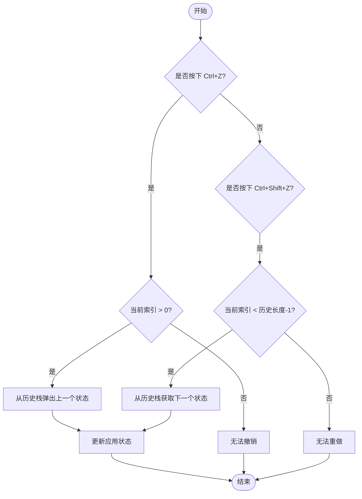
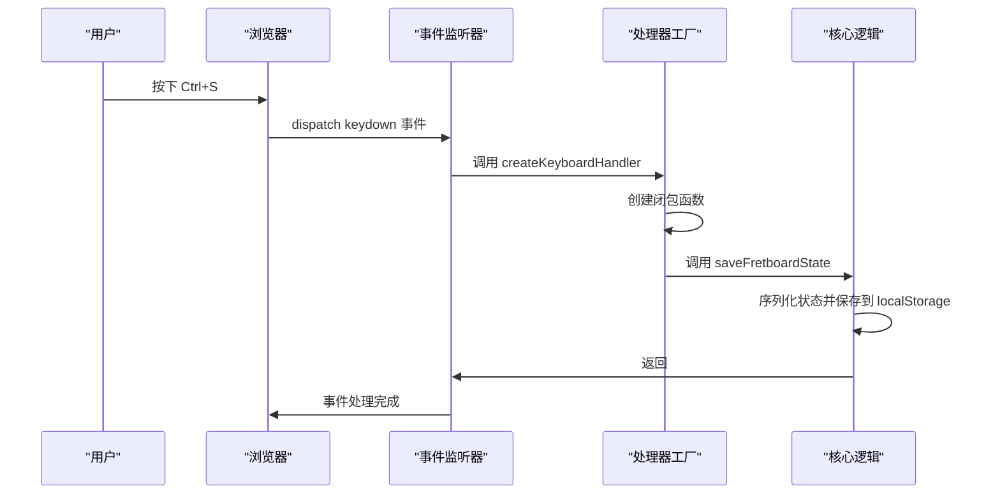

# 键盘快捷键

<cite>
**本文档中引用的文件**  
- [keyboardHandlers.js](file://src/handlers/keyboardHandlers.js)
- [Fretboard.jsx](file://src/Fretboard.jsx)
- [fretboardActions.js](file://src/utils/fretboardActions.js)
- [useHistory.js](file://src/hooks/useHistory.js)
- [fretboardHistory.js](file://src/utils/fretboardHistory.js)
- [colorConfig.js](file://src/colorConfig.js)
- [App.jsx](file://src/App.jsx)
</cite>

## 目录
1. [简介](#简介)
2. [核心快捷键功能](#核心快捷键功能)
3. [技术实现机制](#技术实现机制)
4. [快捷键冲突处理与可访问性](#快捷键冲突处理与可访问性)
5. [使用示例与常见问题](#使用示例与常见问题)
6. [结论](#结论)

## 简介
本系统文档详细说明了指板图生成器中的键盘快捷键功能及其底层实现机制。文档涵盖了颜色选择、删除操作、撤销重做、保存功能、可见性切换等核心快捷键，深入分析了基于`keyboardHandlers.js`的事件处理逻辑，包括事件监听、`preventDefault`调用和组合键处理。同时，文档还探讨了快捷键冲突处理策略和可访问性考虑，为用户提供全面的使用指南和问题解决方案。

## 核心快捷键功能

### 颜色选择功能 (B/G/R/W/D键)
系统通过B、G、R、W、D等单字母快捷键实现快速颜色选择。当用户按下相应按键时，系统会调用`selectColor`函数，将当前选中的音符设置为指定颜色。这些快捷键直接映射到第一层级的颜色配置，如蓝色(B)、绿色(G)、红色(R)、白色(W)和黑色(D)。颜色配置在`colorConfig.js`中定义，确保了颜色的一致性和可维护性。

**Section sources**
- [keyboardHandlers.js](file://src/handlers/keyboardHandlers.js#L158-L223)
- [colorConfig.js](file://src/colorConfig.js#L6-L31)

### 删除操作 (Delete/Backspace键)
系统支持Delete和Backspace键进行删除操作。Delete键用于删除当前选中的音符，而Backspace键则具有更智能的行为：当鼠标悬停在连线上时，删除该连线；当悬停在可见音符上时，将该音符重置为白色并删除所有相关连线。这种设计提供了更精细的控制，允许用户在不选中音符的情况下快速删除元素。

**Section sources**
- [keyboardHandlers.js](file://src/handlers/keyboardHandlers.js#L95-L152)
- [fretboardActions.js](file://src/utils/fretboardActions.js#L268-L297)

### 撤销与重做 (Ctrl+Z/Ctrl+Shift+Z)
系统实现了完整的撤销(Ctrl+Z)和重做(Ctrl+Shift+Z)功能。该功能基于状态历史记录机制，每次用户操作后，当前状态会被保存到历史栈中。撤销操作会将应用状态回滚到前一个历史记录，而重做则会前进到下一个记录。历史记录的最大数量限制为50条，以防止内存过度消耗。

**Diagram sources**
- [useHistory.js](file://src/hooks/useHistory.js#L36-L83)
- [keyboardHandlers.js](file://src/handlers/keyboardHandlers.js#L61-L75)

**Section sources**
- [useHistory.js](file://src/hooks/useHistory.js#L3-L109)

### 保存功能 (Ctrl+S)
Ctrl+S快捷键用于保存当前指板状态。系统区分了两种保存模式：普通保存(Ctrl+S)和强制新建保存(Ctrl+Shift+S)。普通保存会更新当前选中的历史状态，而强制新建保存则会创建一个新的历史状态。保存操作会将当前的音符数据、颜色、可见性等所有状态信息序列化并存储到localStorage中，同时生成缩略图以便在历史画廊中显示。

**Section sources**
- [keyboardHandlers.js](file://src/handlers/keyboardHandlers.js#L52-L58)
- [fretboardHistory.js](file://src/utils/fretboardHistory.js#L38-L173)

### 可见性切换 (Z键)
Z键用于切换未选中音符的可见性状态。该功能在"hidden"（隐藏）和"transparent"（透明）模式之间切换。当处于隐藏模式时，未选中的音符完全不可见；当处于透明模式时，未选中的音符以半透明形式显示。此快捷键不与Ctrl、Alt或Shift等修饰键组合，确保了快速访问。

**Section sources**
- [keyboardHandlers.js](file://src/handlers/keyboardHandlers.js#L77-L83)
- [fretboardActions.js](file://src/utils/fretboardActions.js#L146-L165)

### W键与Shift+W键的循环行为
W键和Shift+W键实现了颜色的循环切换功能，其行为根据当前选中的颜色层级而变化。当第一层级被选中时，W键会按顺序循环第一层级的颜色，而Shift+W会反向循环；当第二层级被选中时，则循环第二层级的颜色。如果没有选中任何层级，系统默认循环第一层级的颜色。这种设计允许用户在不使用鼠标的情况下快速浏览和选择颜色。

**Section sources**
- [keyboardHandlers.js](file://src/handlers/keyboardHandlers.js#L187-L211)
- [fretboardActions.js](file://src/utils/fretboardActions.js#L84-L113)

### 连线模式切换 (S键)
S键用于切换连线工具模式。当用户按下S键时，系统会进入或退出连线模式。在连线模式下，用户可以点击一个音符作为起点，然后点击另一个音符作为终点，系统会自动在这两个音符之间创建一条连线。此功能通过`setConnectionMode`状态管理，确保了模式切换的清晰性和一致性。

**Section sources**
- [keyboardHandlers.js](file://src/handlers/keyboardHandlers.js#L166-L181)
- [Fretboard.jsx](file://src/Fretboard.jsx#L56-L68)

### 重置功能 (Ctrl+D)
Ctrl+D快捷键用于重置整个指板状态。该操作会清除所有音符的颜色和自定义设置，将它们重置为白色，并删除所有连线。同时，指板的品格范围会被重置为默认值（0-15），但显示模式和根音等设置保持不变。这是一个危险操作，因此需要组合键来防止误触。

**Section sources**
- [keyboardHandlers.js](file://src/handlers/keyboardHandlers.js#L86-L92)
- [fretboardActions.js](file://src/utils/fretboardActions.js#L268-L315)

## 技术实现机制

### 事件监听与处理
系统的键盘事件监听机制在`Fretboard.jsx`组件中实现。通过`useEffect`钩子，系统在组件挂载时注册全局的`keydown`事件监听器，并在组件卸载时正确移除。事件处理器使用`createKeyboardHandler`工厂函数创建，该函数接收当前应用状态和操作函数作为参数，返回一个闭包函数来处理键盘事件。

**Diagram sources**
- [Fretboard.jsx](file://src/Fretboard.jsx#L477-L490)
- [keyboardHandlers.js](file://src/handlers/keyboardHandlers.js#L33-L227)

**Section sources**
- [Fretboard.jsx](file://src/Fretboard.jsx#L466-L490)

### preventDefault调用
系统在处理键盘快捷键时广泛使用`event.preventDefault()`来阻止浏览器的默认行为。这对于防止Backspace键导航到上一页、阻止Ctrl+C触发浏览器复制对话框等至关重要。`preventDefault`调用通常在条件检查通过后立即执行，确保只有在系统处理快捷键时才阻止默认行为，从而保持与其他应用的兼容性。

**Section sources**
- [keyboardHandlers.js](file://src/handlers/keyboardHandlers.js#L36-L223)

### 组合键处理
组合键处理通过检查`event.ctrlKey`、`event.shiftKey`和`event.altKey`等属性来实现。系统使用精确的条件判断来区分不同的组合键，例如通过`!event.shiftKey`来确保Ctrl+S不会与Ctrl+Shift+S冲突。这种设计允许系统在同一按键上实现多种功能，最大化了键盘的利用率。

**Section sources**
- [keyboardHandlers.js](file://src/handlers/keyboardHandlers.js#L34-L92)

## 快捷键冲突处理与可访问性

### 冲突处理策略
系统采用多种策略来处理快捷键冲突。首先，通过检查`event.target.tagName`和`event.target.isContentEditable`，系统会忽略在输入框或可编辑元素中的键盘事件，防止快捷键干扰文本输入。其次，使用`event.stopPropagation()`和`event.preventDefault()`精确控制事件流，确保快捷键不会触发浏览器的默认行为。最后，通过合理的快捷键设计，避免了常见的系统级快捷键冲突。

**Section sources**
- [Fretboard.jsx](file://src/Fretboard.jsx#L479-L482)
- [keyboardHandlers.js](file://src/handlers/keyboardHandlers.js#L36-L223)

### 可访问性考虑
系统在设计快捷键时充分考虑了可访问性。所有快捷键都有对应的UI按钮，确保键盘障碍用户仍能通过鼠标完成所有操作。快捷键的提示信息在UI中清晰可见，帮助用户学习和记忆。此外，系统避免使用可能与屏幕阅读器冲突的快捷键组合，确保了与辅助技术的兼容性。

**Section sources**
- [Fretboard.jsx](file://src/Fretboard.jsx#L592-L633)
- [README.md](file://README.md#L110-L128)

## 使用示例与常见问题

### 使用示例
以下是一个典型的快捷键使用工作流：
1. 使用B、G、R等键为音符着色
2. 按S键进入连线模式，连接相关音符
3. 按Z键切换可见性，检查整体布局
4. 按Ctrl+S保存当前状态
5. 如需修改，按Ctrl+Z撤销，调整后再次保存
6. 完成后按Ctrl+D重置，开始新的设计

### 常见问题解决方案
**问题：快捷键不起作用**
- 检查是否在输入框中，快捷键在文本输入时被禁用
- 确认没有其他应用程序占用相同的快捷键
- 尝试刷新页面，重置事件监听器

**问题：撤销历史丢失**
- 确保在支持localStorage的浏览器中运行
- 检查浏览器隐私设置是否阻止了本地存储
- 避免在隐身模式下长时间工作

**问题：颜色循环不符合预期**
- 确认当前选中的颜色层级
- 检查`colorConfig.js`中的颜色顺序配置
- 确保没有其他脚本干扰颜色状态

## 结论
本系统通过精心设计的键盘快捷键，极大地提升了指板图创建的效率和用户体验。从基础的颜色选择到复杂的撤销重做机制，每个快捷键都经过深思熟虑，旨在提供直观、高效的操作方式。技术实现上，系统采用了现代化的React架构和事件处理模式，确保了代码的可维护性和扩展性。未来可以考虑增加快捷键自定义功能，进一步提升用户的个性化体验。