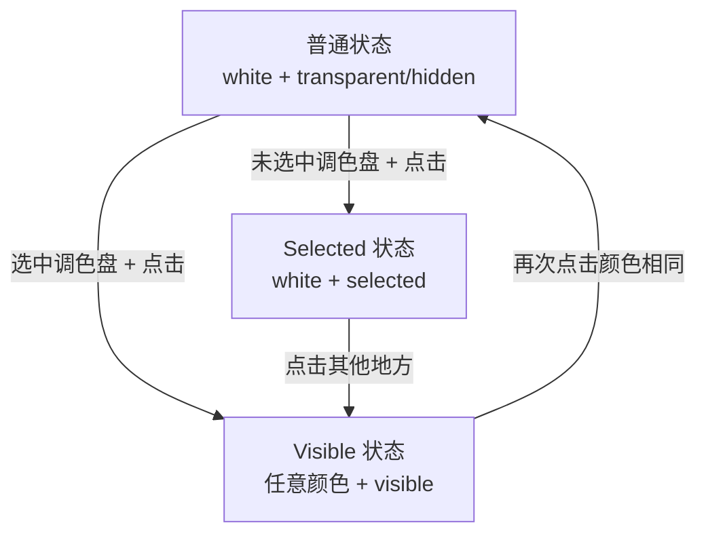
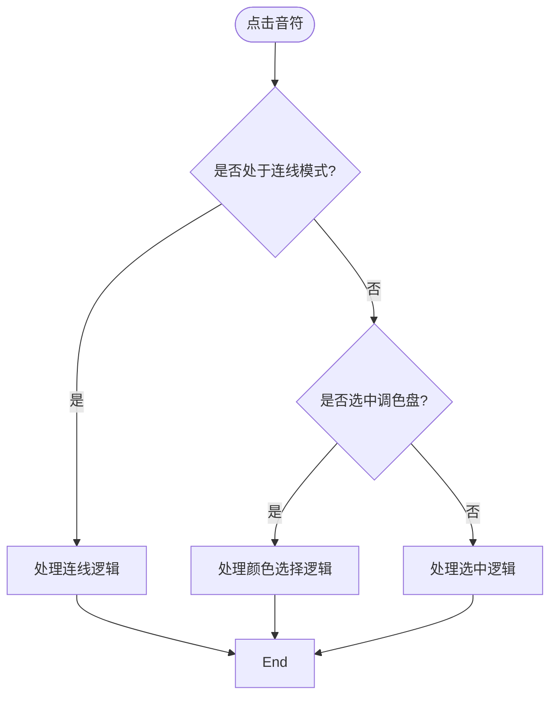
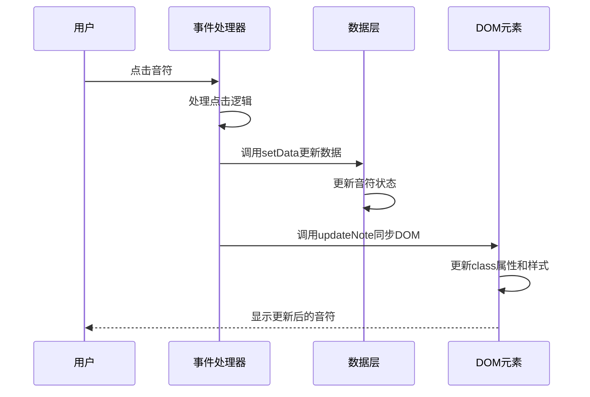

# 音符状态管理

<cite>
**本文档引用的文件**   
- [INTERACTION_GUIDE.md](file://INTERACTION_GUIDE.md)
- [noteHandlers.js](file://src/handlers/noteHandlers.js)
- [useFretboardState.js](file://src/hooks/useFretboardState.js)
- [colorConfig.js](file://src/colorConfig.js)
- [utils.js](file://src/utils.js)
- [FretboardSVG.jsx](file://src/components/FretboardSVG.jsx)
</cite>

## 目录
1. [音符状态说明](#音符状态说明)
2. [状态转换规则](#状态转换规则)
3. [状态转换图](#状态转换图)
4. [事件处理机制](#事件处理机制)
5. [数据更新与DOM同步](#数据更新与dom同步)
6. [常见问题排查](#常见问题排查)

## 音符状态说明

音符系统包含三种主要状态：普通状态、Visible状态和Selected状态。每种状态都有其独特的颜色、可见性和外观特征。

### 普通状态（Normal State）

普通状态是音符的默认状态，具有以下特征：

- **颜色**：白色（`white`）
- **可见性**：根据全局 Toggle 设置
  - `transparent`：半透明显示（默认）
  - `hidden`：完全隐藏
- **外观**：与背景融合，不突出显示

### Visible 状态

Visible 状态表示音符被高亮显示，具有以下特征：

- **颜色**：可以是任意颜色（蓝色、绿色、红色、白色、黑色）
- **可见性**：`visible`（完全不透明，清晰可见）
- **外观**：颜色填充，文字清晰，非常醒目

### Selected 状态

Selected 状态表示音符被选中，具有以下特征：

- **颜色**：保持原有颜色
- **可见性**：`selected`（带虚线边框）
- **外观**：带有虚线边框，表示当前选中项
- **用途**：用于编辑、删除等操作

**Section sources**
- [INTERACTION_GUIDE.md](file://INTERACTION_GUIDE.md#L5-L31)

## 状态转换规则

音符状态之间的转换遵循特定的规则和逻辑，这些规则由用户交互和系统状态共同决定。

### 调色盘交互逻辑

调色盘包含以下颜色选项：
- **蓝色**（Blue）
- **绿色**（Green）
- **红色**（Red）
- **白色**（White）
- **黑色**（Black，透明色，因为背景是黑色）

**默认状态**：黑色（透明）调色盘默认被选中。

### 音符与调色盘的交互规则

#### 规则 1：先选调色盘，再点音符

操作流程：
1. 点击调色盘按钮选择颜色（按钮会高亮）
2. 点击目标音符
3. 音符会被着色并变为 visible 状态

#### 规则 2：未选中调色盘时的点击行为

如果没有选中任何调色盘（`selectedColor === null`）：
- **点击普通状态的音符**：音符变为 selected 状态（带虚线边框）
- **点击 visible 状态的音符**：音符恢复为普通状态（白色 + 全局可见性设置）

#### 规则 3：选中调色盘时的点击行为

如果选中了调色盘（`selectedColor !== null`）：

##### 情况 A：音符颜色与调色盘颜色相同
- **如果音符是 visible 状态**：
  - 第一次点击：音符恢复为普通状态（白色 + 全局可见性）
  - 效果：visible 消失，颜色重置为白色
- **如果音符不是 visible 状态**：
  - 点击：音符变为 visible 状态，保持当前颜色
  - 效果：音符高亮显示

##### 情况 B：音符颜色与调色盘颜色不同
- **无论音符当前是什么状态**：
  - 点击：音符颜色改变为调色盘颜色，并变为 visible 状态
  - 效果：音符被染色并高亮显示
- **再次点击（此时颜色已相同）**：
  - 如果音符是 visible 状态：恢复为普通状态（白色 + 全局可见性）
  - 如果音符不是 visible 状态：变为 visible 状态

#### 规则 4：染色优先级大于删除

当选中调色盘时，染色操作的优先级高于删除操作：
1. **第一次点击**：先改变颜色（如果不同）或切换 visible 状态（如果颜色相同）
2. **第二次点击**：如果颜色相同且是 visible，则恢复为普通状态

**Section sources**
- [INTERACTION_GUIDE.md](file://INTERACTION_GUIDE.md#L59-L105)

## 状态转换图

**Diagram sources **
- [INTERACTION_GUIDE.md](file://INTERACTION_GUIDE.md#L174-L188)

## 事件处理机制

音符状态的变化通过事件处理函数驱动，主要由 `createNoteClickHandler` 实现。

### 点击事件处理流程

当用户点击音符时，系统会执行以下逻辑：

1. **阻止事件冒泡**：使用 `event.stopPropagation()` 防止事件传播
2. **获取音符元素**：通过 `event.currentTarget` 获取被点击的音符元素
3. **获取音符数据**：从全局数据中获取音符的当前状态（颜色、可见性等）
4. **处理连线模式**：如果处于连线模式，优先处理连线逻辑
5. **处理调色盘选择**：根据是否选中调色盘执行不同的状态转换逻辑

### 状态转换逻辑

**Diagram sources **
- [noteHandlers.js](file://src/handlers/noteHandlers.js#L33-L440)

**Section sources**
- [noteHandlers.js](file://src/handlers/noteHandlers.js#L7-L440)

## 数据更新与DOM同步

音符状态的变更需要同时更新数据模型和DOM元素，确保用户界面与数据状态保持一致。

### 数据更新机制

系统通过 `setData` 函数更新全局数据状态，同时使用 `updateNote` 函数同步DOM元素的属性。

**Diagram sources **
- [noteHandlers.js](file://src/handlers/noteHandlers.js#L212-L277)
- [utils.js](file://src/utils.js#L105-L165)

### updateNote函数实现

`updateNote` 函数负责将数据状态同步到DOM元素，主要执行以下操作：

1. **生成类名**：根据音符类型、颜色和可见性生成对应的CSS类名
2. **更新class属性**：将生成的类名设置到DOM元素的class属性
3. **处理文本内容**：如果需要更新音符文本，修改text元素的内容
4. **处理颜色填充**：根据颜色配置更新circle元素的fill属性
5. **处理描边颜色**：根据第二层级颜色配置更新stroke属性

**Section sources**
- [utils.js](file://src/utils.js#L105-L165)

## 常见问题排查

在使用音符状态管理系统时，可能会遇到一些常见问题，以下是排查方法和解决方案。

### 状态不一致问题

**现象**：音符在界面上显示的状态与数据模型中的状态不一致。

**排查步骤**：
1. 检查 `updateNote` 函数是否正确执行
2. 验证 `setData` 是否成功更新了全局状态
3. 确认DOM元素的class属性是否正确更新
4. 检查是否存在异步更新导致的状态延迟

### 意外切换问题

**现象**：音符状态发生意外切换，不符合预期的转换规则。

**排查步骤**：
1. 检查调色盘选择状态（`selectedColorLevel` 和 `selectedColor`）
2. 验证音符的当前颜色和可见性是否正确
3. 确认事件处理函数是否按预期执行
4. 检查是否存在多个事件处理器冲突

### 性能问题

**现象**：大量音符状态更新时，界面响应变慢。

**优化建议**：
1. 批量更新数据，减少 `setData` 调用次数
2. 使用防抖或节流控制频繁的状态更新
3. 优化DOM操作，避免不必要的重绘

**Section sources**
- [noteHandlers.js](file://src/handlers/noteHandlers.js#L33-L440)
- [utils.js](file://src/utils.js#L105-L165)
- [useFretboardState.js](file://src/hooks/useFretboardState.js#L6-L190)