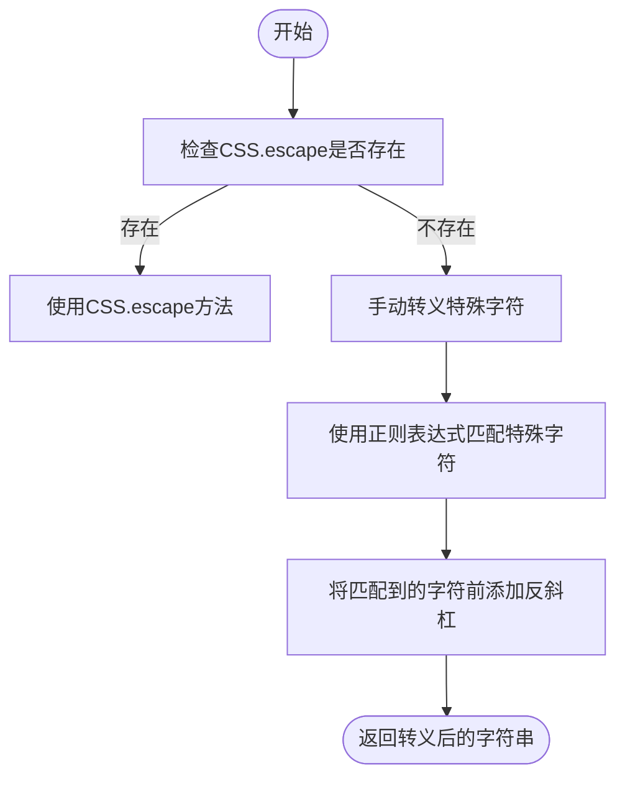
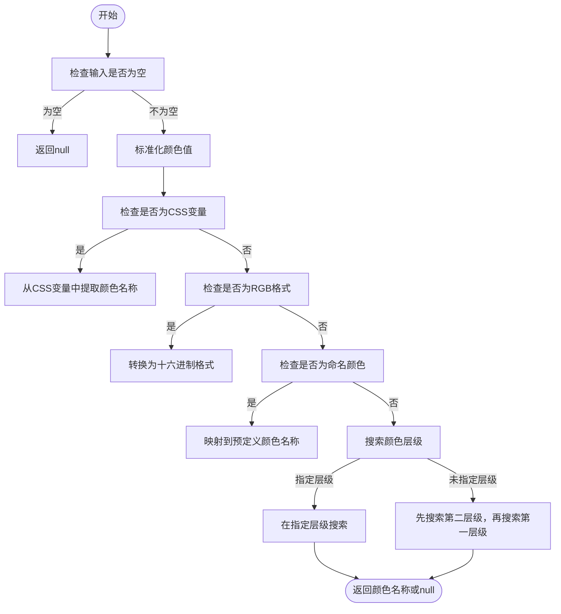
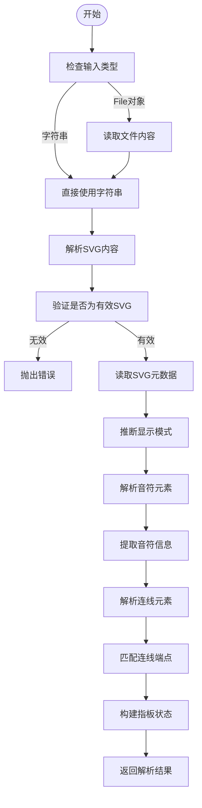
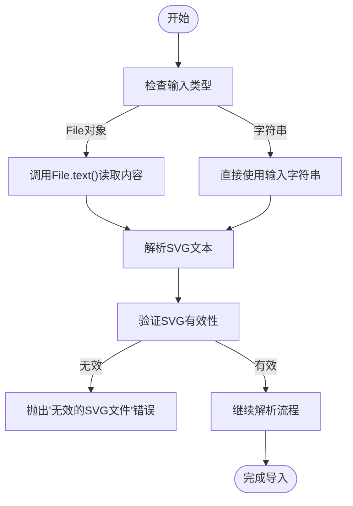
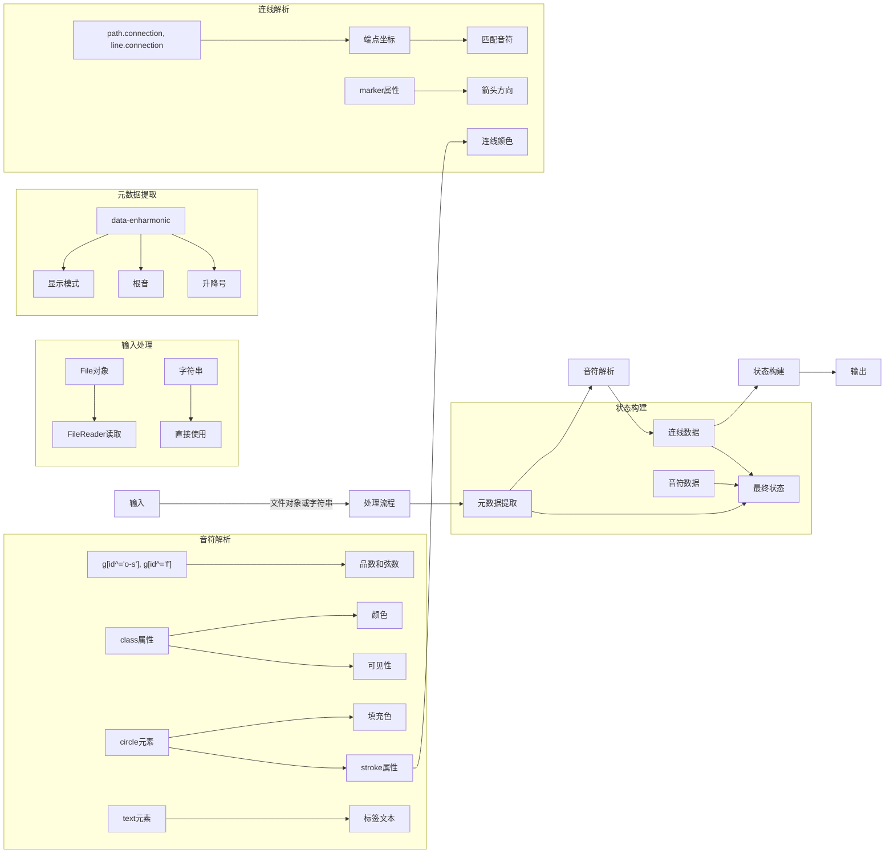
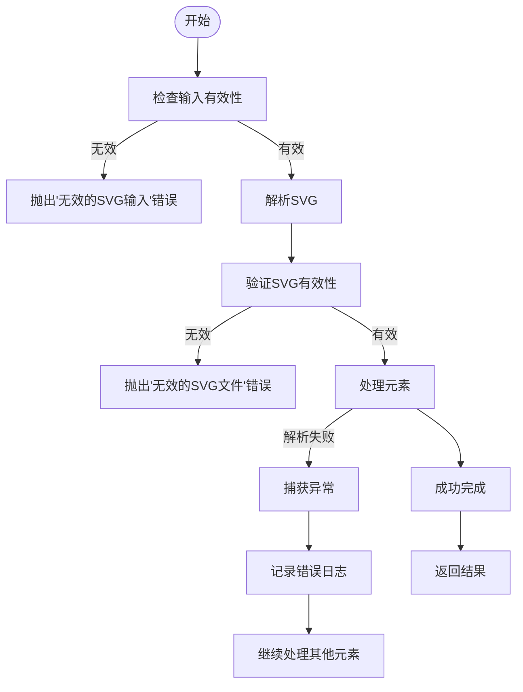
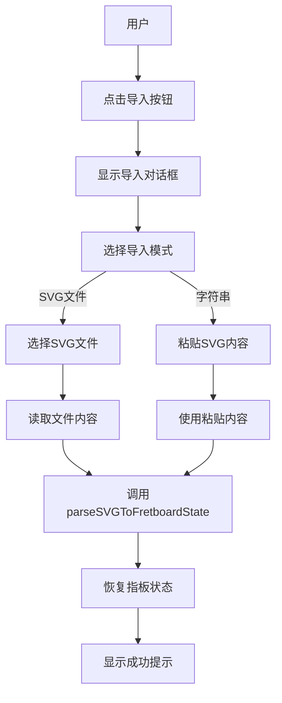

# SVG导入工具

<cite>
**本文档引用的文件**  
- [svgImport.js](file://src/utils/svgImport.js)
- [colorConfig.js](file://src/colorConfig.js)
- [constants.js](file://src/constants.js)
- [fretboardCalculations.js](file://src/utils/fretboardCalculations.js)
- [FretboardGallery.jsx](file://src/components/FretboardGallery.jsx)
</cite>

## 目录
1. [简介](#简介)
2. [核心功能概述](#核心功能概述)
3. [CSS选择器转义机制](#css选择器转义机制)
4. [颜色值反推颜色名称](#颜色值反推颜色名称)
5. [SVG解析与指板状态还原](#svg解析与指板状态还原)
6. [外部SVG文件导入支持](#外部svg文件导入支持)
7. [数据流与处理流程](#数据流与处理流程)
8. [错误处理与调试](#错误处理与调试)
9. [集成与使用场景](#集成与使用场景)
10. [总结](#总结)

## 简介

SVG导入工具是吉他指板图生成器中的核心功能模块，负责将外部SVG文件中的指板配置信息解析并还原为可编辑的指板状态。该工具通过`parseSVGToFretboardState`函数实现完整的解析流程，能够从SVG文件中提取音符、连线、颜色、可见性等信息，并推断显示模式和根音。本工具支持从文件对象或字符串输入两种方式导入SVG内容，为用户提供灵活的导入选项。

**Section sources**
- [svgImport.js](file://src/utils/svgImport.js#L139-L1140)

## 核心功能概述

SVG导入工具的核心功能包括三个主要部分：CSS选择器特殊字符转义、颜色值反推颜色名称以及SVG文件解析与指板状态还原。这些功能协同工作，确保能够准确地从外部SVG文件中提取和还原指板配置。

工具首先通过`escapeCSSSelector`函数处理CSS选择器中的特殊字符，确保后续的DOM查询操作能够正确执行。然后利用`getColorNameFromValue`函数将各种格式的颜色值（如十六进制、RGB、CSS变量等）反推为预定义的颜色名称。最后，`parseSVGToFretboardState`函数负责解析整个SVG文件，提取所有音符和连线信息，并构建完整的指板状态对象。

**Section sources**
- [svgImport.js](file://src/utils/svgImport.js#L10-L132)
- [svgImport.js](file://src/utils/svgImport.js#L139-L1140)

## CSS选择器转义机制

`escapeCSSSelector`函数负责转义CSS选择器中的特殊字符，确保在DOM查询时能够正确匹配元素。该函数首先检查浏览器是否支持原生的`CSS.escape`方法，如果支持则直接使用；否则采用手动转义的方式。

**Diagram sources**
- [svgImport.js](file://src/utils/svgImport.js#L10-L17)

该函数处理的特殊字符包括：`!"#$%&'()*+,.\/:;<=>?@[\\\]^`{|}~`。对于这些字符，函数会在其前面添加反斜杠进行转义。这种双重策略确保了在不同浏览器环境下的兼容性，既利用了现代浏览器的原生支持，又为旧版浏览器提供了可靠的备选方案。

**Section sources**
- [svgImport.js](file://src/utils/svgImport.js#L10-L17)

## 颜色值反推颜色名称

`getColorNameFromValue`函数实现了从颜色值反推颜色名称的复杂逻辑，支持多种颜色格式和层级。该函数能够处理十六进制颜色、RGB/RGBA格式、CSS变量以及命名颜色等多种输入格式。

**Diagram sources**
- [svgImport.js](file://src/utils/svgImport.js#L25-L132)

函数首先对输入的颜色值进行标准化处理，转换为小写并去除空格。然后按照优先级顺序处理不同格式的颜色值：CSS变量、RGB格式、命名颜色，最后在预定义的颜色配置中搜索匹配项。对于CSS变量，函数能够解析`var(--color-level1-blue-fill)`这样的格式，提取出层级和颜色名称。对于RGB格式，函数会将其转换为十六进制格式后再进行匹配。命名颜色映射表包含了如`steelblue`、`indianred`等常见颜色名称到预定义颜色的映射。

**Section sources**
- [svgImport.js](file://src/utils/svgImport.js#L25-L132)
- [colorConfig.js](file://src/colorConfig.js#L6-L41)

## SVG解析与指板状态还原

`parseSVGToFretboardState`函数是SVG导入工具的核心，负责将SVG文件内容解析并还原为可编辑的指板状态。该函数首先检查输入类型，支持文件对象和字符串两种输入方式。

**Diagram sources**
- [svgImport.js](file://src/utils/svgImport.js#L139-L1140)

函数首先从SVG元素的属性中读取显示模式、根音和升降号等元数据。然后通过查询`g[id^="o-s"], g[id^="f"]`选择器找到所有音符元素。在解析音符之前，函数会先收集所有文本内容用于推断显示模式。如果SVG元数据中没有指定显示模式，函数会根据文本内容的特征（如是否符合唱名或音名格式）自动推断。

音符解析过程中，函数从元素的ID中提取品数和弦数信息，从类名中提取颜色和可见性，从`circle`元素的`fill`和`stroke`属性中提取颜色信息。对于用户自定义的文本标签，函数会判断其是否与系统自动生成的文本格式冲突，以决定是否保存为`noteText`。

**Section sources**
- [svgImport.js](file://src/utils/svgImport.js#L139-L406)
- [constants.js](file://src/constants.js#L1-L19)

## 外部SVG文件导入支持

SVG导入工具通过`parseSVGToFretboardState`函数的输入参数设计，天然支持从外部SVG文件导入指板配置。当输入为`File`对象时，函数会调用`File.text()`方法读取文件内容，然后进行后续解析。

**Diagram sources**
- [svgImport.js](file://src/utils/svgImport.js#L142-L149)

这种设计使得工具能够无缝集成到文件上传功能中。在用户界面中，当用户选择一个SVG文件后，该文件对象会被传递给`parseSVGToFretboardState`函数，从而实现从外部文件导入指板配置的功能。工具还支持直接传入SVG字符串，为程序化导入提供了灵活性。

**Section sources**
- [svgImport.js](file://src/utils/svgImport.js#L142-L149)
- [FretboardGallery.jsx](file://src/components/FretboardGallery.jsx#L73-L83)

## 数据流与处理流程

SVG导入工具的数据流遵循清晰的处理流程，从原始输入到最终的指板状态对象。整个流程可以分为四个主要阶段：输入处理、元数据提取、元素解析和状态构建。

**Diagram sources**
- [svgImport.js](file://src/utils/svgImport.js#L139-L1140)

在状态构建阶段，函数将解析得到的所有信息整合为一个结构化的对象，包含版本号、名称和指板状态。指板状态中包含了音符数据、品数范围、升降号设置、显示模式和根音等信息。这种结构化的输出格式便于后续的存储和恢复操作。

**Section sources**
- [svgImport.js](file://src/utils/svgImport.js#L1127-L1138)

## 错误处理与调试

SVG导入工具内置了完善的错误处理和调试机制，确保在各种异常情况下能够提供有用的反馈信息。函数在关键步骤都包含了错误检查和异常处理。

**Diagram sources**
- [svgImport.js](file://src/utils/svgImport.js#L148-L159)
- [svgImport.js](file://src/utils/svgImport.js#L1111-L1114)

工具使用`console.log`和`console.warn`输出详细的调试信息，包括解析的音符颜色、连线信息等。对于单个元素解析失败的情况，函数会记录警告但继续处理其他元素，避免因个别问题导致整个导入过程失败。这种容错设计提高了工具的鲁棒性，使其能够处理不完全符合规范的SVG文件。

**Section sources**
- [svgImport.js](file://src/utils/svgImport.js#L148-L159)
- [svgImport.js](file://src/utils/svgImport.js#L402-L405)
- [svgImport.js](file://src/utils/svgImport.js#L1111-L1114)

## 集成与使用场景

SVG导入工具通过`FretboardGallery`组件集成到用户界面中，为用户提供直观的导入功能。用户可以通过点击"导入"按钮，选择SVG文件或粘贴SVG内容来导入指板配置。

**Diagram sources**
- [FretboardGallery.jsx](file://src/components/FretboardGallery.jsx#L15-L87)
- [svgImport.js](file://src/utils/svgImport.js#L139-L1140)

在代码层面，`FretboardGallery`组件通过`onImport`回调将解析结果传递给主组件，实现状态的恢复和更新。这种松耦合的设计使得导入功能可以独立开发和测试，同时保持与主应用的良好集成。

**Section sources**
- [FretboardGallery.jsx](file://src/components/FretboardGallery.jsx#L15-L87)
- [Fretboard.jsx](file://src/Fretboard.jsx#L700-L797)

## 总结

SVG导入工具是一个功能完整、设计精良的模块，为吉他指板图生成器提供了强大的外部配置导入能力。通过`escapeCSSSelector`、`getColorNameFromValue`和`parseSVGToFretboardState`三个核心函数的协同工作，工具能够准确地解析SVG文件中的各种信息，并还原为可编辑的指板状态。

工具的设计体现了良好的工程实践：清晰的职责划分、完善的错误处理、详细的调试信息和灵活的输入支持。这些特性使得工具不仅能够满足基本的导入需求，还能处理各种边缘情况，为用户提供可靠的服务。

未来可以考虑的改进方向包括：支持更多SVG特性、优化性能以处理大型文件、提供导入预览功能等。但目前的实现已经为应用的核心功能提供了坚实的基础。