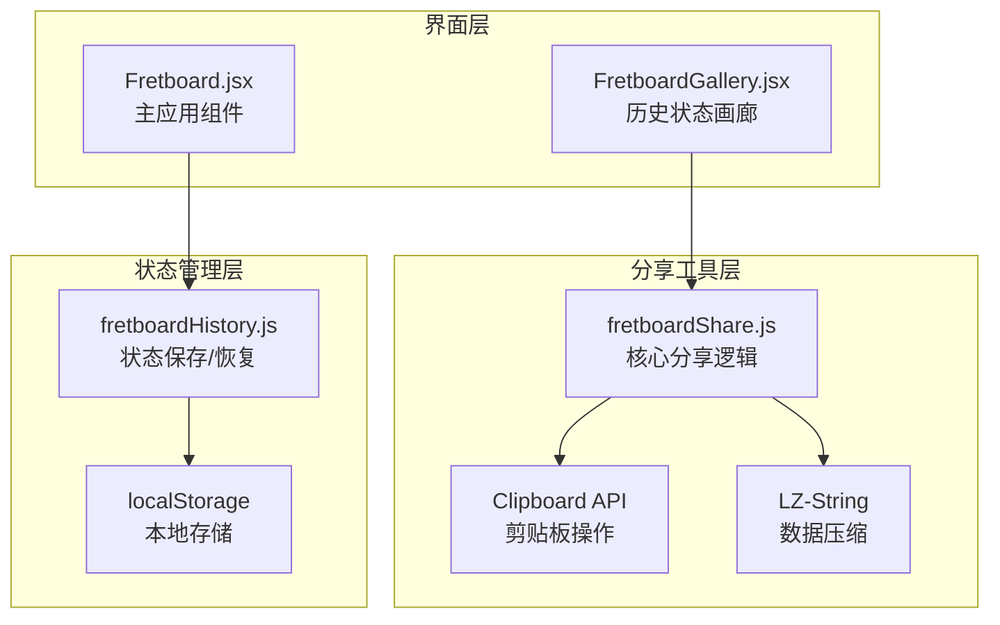
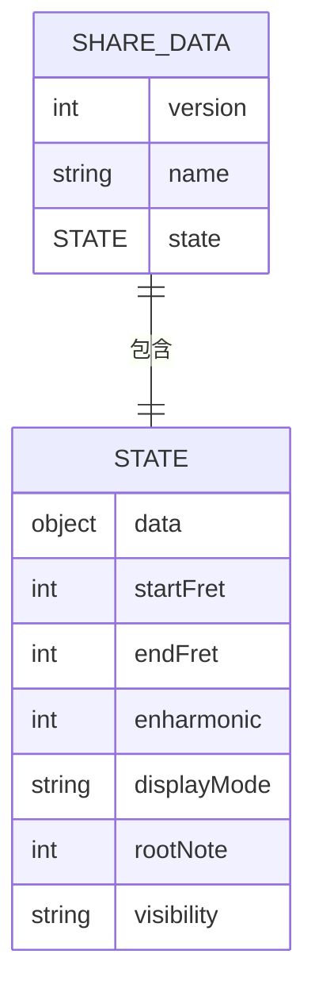
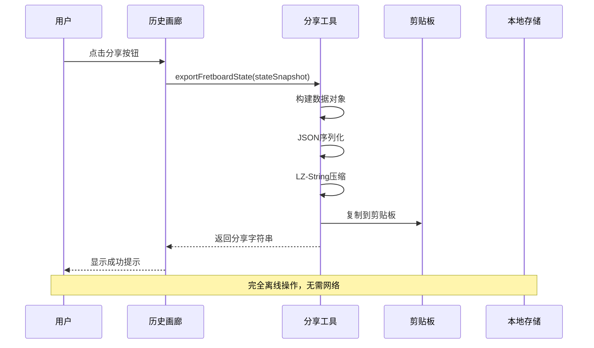
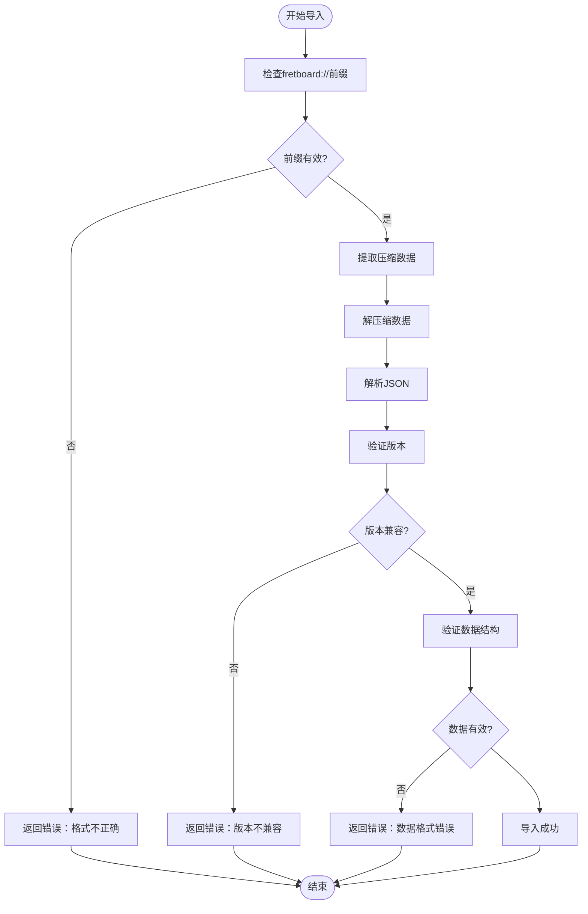
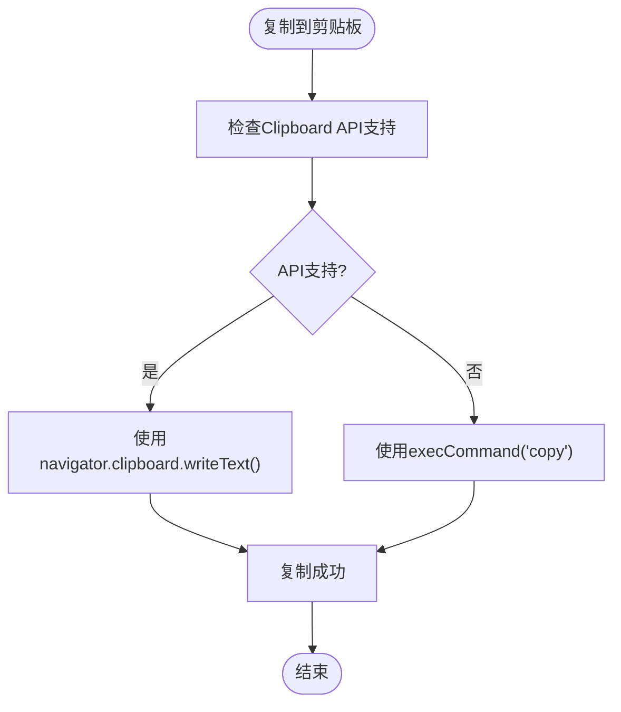
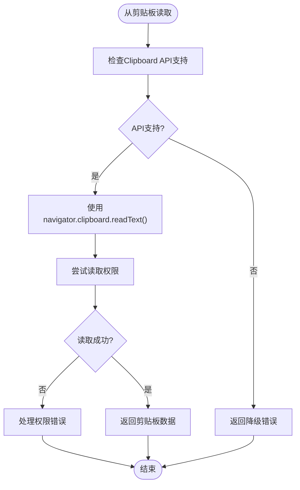
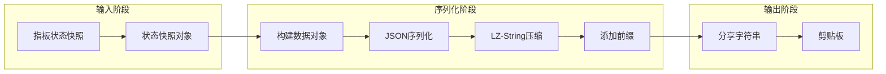
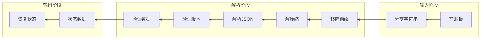

# 分享工具

<cite>
**本文档引用的文件**
- [fretboardShare.js](file://src/utils/fretboardShare.js)
- [FretboardGallery.jsx](file://src/components/FretboardGallery.jsx)
- [Fretboard.jsx](file://src/Fretboard.jsx)
- [fretboardHistory.js](file://src/utils/fretboardHistory.js)
- [README.md](file://README.md)
- [SHARE_IMPORT_GUIDE.md](file://SHARE_IMPORT_GUIDE.md)
- [package.json](file://package.json)
</cite>

## 目录
1. [简介](#简介)
2. [项目结构概览](#项目结构概览)
3. [核心组件分析](#核心组件分析)
4. [架构设计](#架构设计)
5. [详细功能分析](#详细功能分析)
6. [数据流分析](#数据流分析)
7. [性能考虑](#性能考虑)
8. [故障排除指南](#故障排除指南)
9. [总结](#总结)

## 简介

分享工具是吉他指板图生成器的核心功能之一，它实现了指板状态的离线序列化与分享。该工具允许用户将当前的指板配置（包括音符位置、颜色、连线、显示设置等）序列化为紧凑的字符串，通过剪贴板进行分享和导入，实现了完全离线的跨设备状态同步功能。

## 项目结构概览

分享工具在整个项目架构中扮演着关键角色，主要涉及以下组件：

**图表来源**
- [fretboardShare.js](file://src/utils/fretboardShare.js#L1-L171)
- [FretboardGallery.jsx](file://src/components/FretboardGallery.jsx#L1-L385)
- [fretboardHistory.js](file://src/utils/fretboardHistory.js#L1-L333)

**章节来源**
- [fretboardShare.js](file://src/utils/fretboardShare.js#L1-L171)
- [FretboardGallery.jsx](file://src/components/FretboardGallery.jsx#L1-L385)
- [fretboardHistory.js](file://src/utils/fretboardHistory.js#L1-L333)

## 核心组件分析

### fretboardShare.js - 核心分享引擎

该文件包含了完整的分享功能实现，是整个分享系统的核心：

#### 主要功能模块

1. **数据序列化模块** (`exportFretboardState`)
2. **数据反序列化模块** (`importFretboardState`)
3. **剪贴板操作模块** (`copyToClipboard`, `readFromClipboard`)

#### 数据结构设计

分享工具采用标准化的数据结构来确保兼容性和可扩展性：

**图表来源**
- [fretboardShare.js](file://src/utils/fretboardShare.js#L19-L31)

**章节来源**
- [fretboardShare.js](file://src/utils/fretboardShare.js#L1-L171)

## 架构设计

### 离线分享架构

分享工具采用了完全离线的设计理念，确保用户数据的安全性和隐私保护：

**图表来源**
- [FretboardGallery.jsx](file://src/components/FretboardGallery.jsx#L159-L174)
- [fretboardShare.js](file://src/utils/fretboardShare.js#L12-L45)

### 版本兼容性架构

为了确保未来的可扩展性，分享工具实现了版本控制系统：

**图表来源**
- [fretboardShare.js](file://src/utils/fretboardShare.js#L52-L105)

**章节来源**
- [fretboardShare.js](file://src/utils/fretboardShare.js#L52-L105)

## 详细功能分析

### exportFretboardState - 状态序列化

该函数负责将指板状态快照转换为可分享的字符串格式：

#### 实现流程

1. **参数验证**：确保传入的状态数据有效
2. **数据构建**：创建标准化的数据对象结构
3. **JSON序列化**：将对象转换为JSON字符串
4. **压缩处理**：使用LZ-String进行高效压缩
5. **前缀添加**：添加`fretboard://`标识前缀

#### 关键特性

- **完整性保证**：包含所有必要的状态信息
- **默认值处理**：为缺失的配置提供合理的默认值
- **错误处理**：完善的异常捕获和错误报告机制

**章节来源**
- [fretboardShare.js](file://src/utils/fretboardShare.js#L12-L45)

### importFretboardState - 状态解析

该函数负责解析分享字符串并验证其有效性：

#### 解析策略

1. **格式验证**：检查字符串格式是否正确
2. **兼容性检查**：验证版本号是否兼容
3. **数据验证**：确保必需字段存在且格式正确
4. **向后兼容**：支持多种压缩格式

#### 错误处理机制

- **格式错误**：前缀缺失或格式不正确
- **版本不兼容**：新版本数据无法解析
- **数据损坏**：压缩数据损坏或格式错误
- **解析失败**：JSON解析异常

**章节来源**
- [fretboardShare.js](file://src/utils/fretboardShare.js#L52-L105)

### copyToClipboard - 剪贴板复制

实现了现代化的剪贴板复制功能，具备优雅的降级方案：

#### 现代API优先策略

**图表来源**
- [fretboardShare.js](file://src/utils/fretboardShare.js#L112-L142)

#### 降级方案设计

当现代API不可用时，系统会自动切换到传统方案：

- **DOM操作**：创建临时textarea元素
- **焦点管理**：确保文本被正确选中
- **错误处理**：捕获并处理execCommand异常

**章节来源**
- [fretboardShare.js](file://src/utils/fretboardShare.js#L112-L142)

### readFromClipboard - 剪贴板读取

提供了安全的剪贴板读取功能，特别注重用户权限处理：

#### 权限处理机制

**图表来源**
- [fretboardShare.js](file://src/utils/fretboardShare.js#L148-L170)

#### 权限错误处理

系统能够区分不同类型的权限错误并提供针对性的解决方案：

- **NotAllowedError**：用户拒绝了剪贴板访问权限
- **SecurityError**：浏览器安全策略阻止了访问
- **降级方案**：提示用户手动粘贴

**章节来源**
- [fretboardShare.js](file://src/utils/fretboardShare.js#L148-L170)

## 数据流分析

### 分享流程数据流

**图表来源**
- [fretboardShare.js](file://src/utils/fretboardShare.js#L12-L45)

### 导入流程数据流

**图表来源**
- [fretboardShare.js](file://src/utils/fretboardShare.js#L52-L105)

**章节来源**
- [fretboardShare.js](file://src/utils/fretboardShare.js#L12-L171)

## 性能考虑

### 压缩算法选择

项目选择了LZ-String作为压缩算法，主要基于以下考虑：

1. **压缩效率**：相比Base64编码，通常可减少50-70%的字符串长度
2. **实时性能**：压缩和解压缩操作在浏览器中执行速度快
3. **内存友好**：避免了大字符串的内存占用问题
4. **兼容性**：无需额外的配置和依赖

### 内存管理

分享工具在处理大型指板状态时采用了以下优化策略：

- **增量处理**：避免一次性处理过大的数据块
- **错误边界**：在处理过程中设置合理的超时和错误处理
- **资源清理**：及时释放临时创建的DOM元素和变量

### 浏览器兼容性

系统通过以下方式确保跨浏览器兼容性：

- **特性检测**：运行时检测浏览器支持的功能
- **优雅降级**：为不支持的功能提供替代方案
- **错误隔离**：避免单点故障影响整个系统

## 故障排除指南

### 常见问题及解决方案

#### 分享功能问题

| 问题描述 | 可能原因 | 解决方案 |
|---------|---------|---------|
| 分享字符串为空 | 状态数据无效 | 检查状态快照是否包含有效数据 |
| 复制失败 | 浏览器权限限制 | 检查浏览器设置，允许剪贴板访问 |
| 字符串过长 | 指板状态复杂 | 考虑简化配置或使用更高效的压缩 |

#### 导入功能问题

| 问题描述 | 可能原因 | 解决方案 |
|---------|---------|---------|
| 格式错误 | 前缀缺失或格式不正确 | 确保使用正确的分享字符串格式 |
| 版本不兼容 | 数据来自新版本应用 | 更新应用到最新版本 |
| 数据损坏 | 字符串被意外修改 | 重新生成分享字符串 |

#### 剪贴板访问问题

| 问题描述 | 可能原因 | 解决方案 |
|---------|---------|---------|
| 读取失败 | 用户拒绝权限 | 提示用户手动粘贴 |
| 写入失败 | HTTPS环境限制 | 确保在安全的HTTPS环境下使用 |
| 权限弹窗 | 浏览器安全策略 | 引导用户授予权限 |

**章节来源**
- [SHARE_IMPORT_GUIDE.md](file://SHARE_IMPORT_GUIDE.md#L107-L121)

### 调试技巧

1. **开发者工具**：使用浏览器的开发者工具监控剪贴板操作
2. **日志记录**：在关键节点添加console.log语句
3. **单元测试**：为分享功能编写专门的测试用例
4. **错误边界**：在UI层面提供清晰的错误提示

## 总结

分享工具通过精心设计的架构和实现，成功实现了吉他指板图的离线序列化与分享功能。该系统具有以下突出特点：

### 技术优势

1. **完全离线**：所有操作都在本地完成，无需网络连接
2. **数据安全**：用户数据不会离开本地设备
3. **跨平台兼容**：支持主流浏览器和操作系统
4. **可扩展性**：内置版本控制系统，便于未来功能扩展

### 设计亮点

1. **优雅降级**：为不支持现代API的浏览器提供完整功能
2. **错误处理**：完善的错误检测和用户友好的错误提示
3. **性能优化**：高效的压缩算法和内存管理策略
4. **用户体验**：简洁直观的操作流程和及时的反馈机制

### 应用价值

分享工具不仅提升了用户的工作效率，还促进了用户之间的知识共享和技术交流。通过简单易用的分享机制，用户可以轻松地与他人分享自己的指板配置，实现真正的协作式学习和工作。

该系统的成功实施证明了在现代Web应用中，通过合理的技术选型和架构设计，完全可以实现既强大又易用的离线功能，为用户提供卓越的使用体验。