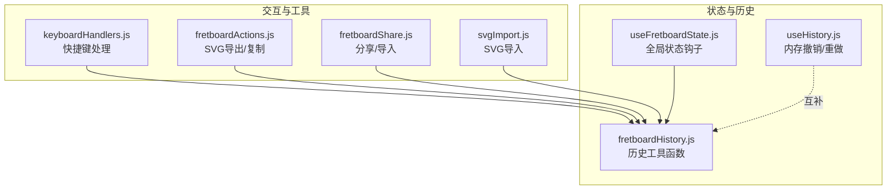
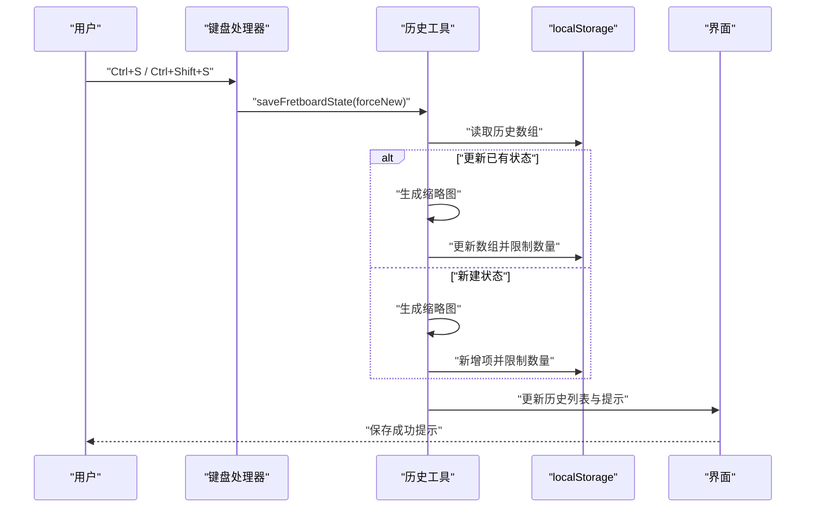
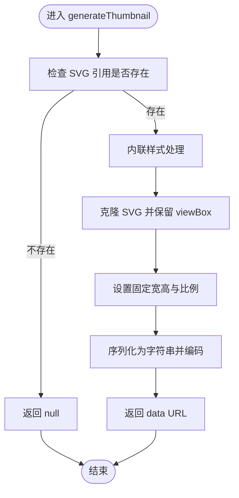
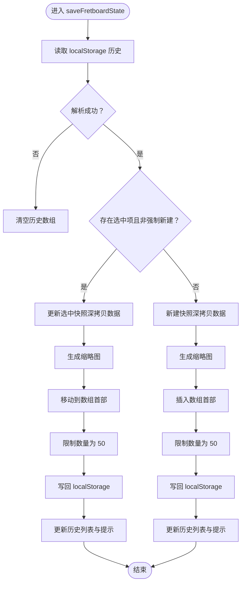
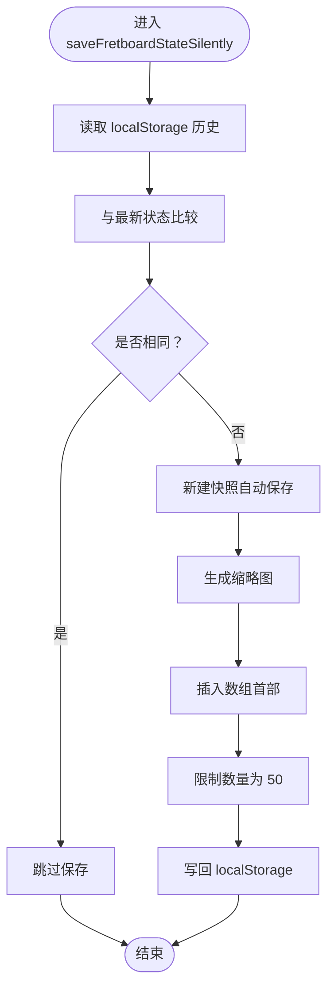
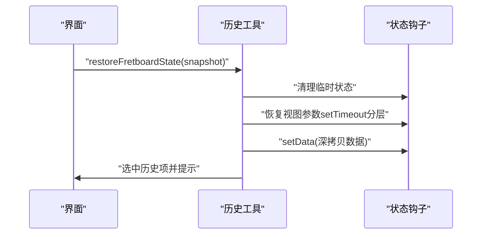
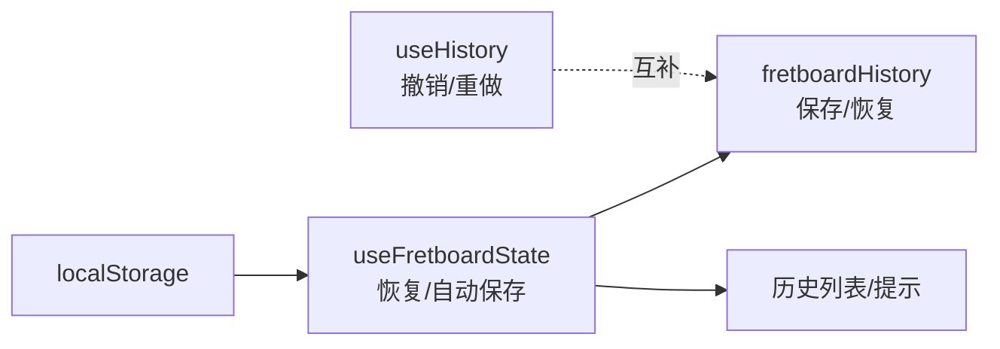
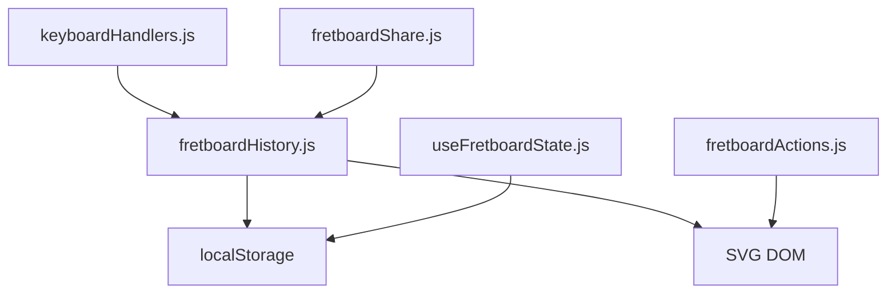

# 历史工具

<cite>
**本文档引用的文件**
- [fretboardHistory.js](file://src/utils/fretboardHistory.js)
- [useHistory.js](file://src/hooks/useHistory.js)
- [useFretboardState.js](file://src/hooks/useFretboardState.js)
- [keyboardHandlers.js](file://src/handlers/keyboardHandlers.js)
- [fretboardActions.js](file://src/utils/fretboardActions.js)
- [fretboardShare.js](file://src/utils/fretboardShare.js)
- [svgImport.js](file://src/utils/svgImport.js)
</cite>

## 目录
1. [简介](#简介)
2. [项目结构](#项目结构)
3. [核心组件](#核心组件)
4. [架构总览](#架构总览)
5. [详细组件分析](#详细组件分析)
6. [依赖关系分析](#依赖关系分析)
7. [性能考量](#性能考量)
8. [故障排查指南](#故障排查指南)
9. [结论](#结论)

## 简介
本文件聚焦于指板状态的历史管理与持久化能力，围绕以下四个关键函数展开：
- generateThumbnail：基于当前 SVG 指板生成缩略图数据 URL，用于历史记录预览
- saveFretboardState：将当前指板状态（音符数据、视图设置、缩略图）保存到 localStorage，并更新历史列表
- saveFretboardStateSilently：在页面关闭前的静默保存，避免频繁提示
- restoreFretboardState：从历史记录中恢复完整状态，包括数据、视图参数与临时状态

这些函数共同实现了“状态快照—本地持久化—历史回溯”的闭环，既保证用户体验（无需登录即可保存），又提供强大的可追溯性。

## 项目结构
与历史管理直接相关的模块分布如下：
- utils/fretboardHistory.js：历史工具函数（缩略图生成、状态保存、静默保存、状态恢复）
- hooks/useHistory.js：基于内存的撤销/重做历史（与 localStorage 的历史记录互补）
- hooks/useFretboardState.js：全局状态钩子，负责从 localStorage 恢复当前状态、自动保存当前状态、加载历史列表
- handlers/keyboardHandlers.js：快捷键绑定，触发保存与静默保存
- utils/fretboardActions.js：导出 SVG、复制图片等工具，与缩略图生成共享 SVG 处理流程
- utils/fretboardShare.js：状态分享与导入，便于跨设备/跨场景迁移
- utils/svgImport.js：从 SVG 导入状态，与历史记录的结构兼容

图表来源
- [fretboardHistory.js](file://src/utils/fretboardHistory.js#L1-L333)
- [useHistory.js](file://src/hooks/useHistory.js#L1-L109)
- [useFretboardState.js](file://src/hooks/useFretboardState.js#L1-L190)
- [keyboardHandlers.js](file://src/handlers/keyboardHandlers.js#L1-L227)
- [fretboardActions.js](file://src/utils/fretboardActions.js#L1-L800)
- [fretboardShare.js](file://src/utils/fretboardShare.js#L1-L171)
- [svgImport.js](file://src/utils/svgImport.js#L1-L800)

章节来源
- [fretboardHistory.js](file://src/utils/fretboardHistory.js#L1-L333)
- [useFretboardState.js](file://src/hooks/useFretboardState.js#L1-L190)

## 核心组件
- generateThumbnail：将当前 SVG 指板克隆、内联样式、裁剪尺寸并序列化为 data URL，供历史记录展示
- saveFretboardState：合并/更新历史数组，生成缩略图，限制历史数量，更新 UI 与提示
- saveFretboardStateSilently：页面卸载前的静默保存，避免重复保存，自动添加“自动保存”标识
- restoreFretboardState：清理临时状态，按序恢复视图参数与数据，选中历史项并提示

章节来源
- [fretboardHistory.js](file://src/utils/fretboardHistory.js#L3-L333)

## 架构总览
历史管理的运行时交互如下：
- 用户操作触发保存（快捷键 Ctrl+S/Ctrl+Shift+S）
- 保存函数读取当前状态与 SVG 引用，生成缩略图并写入 localStorage
- 页面加载时从 localStorage 恢复当前状态与历史列表
- 用户可在历史画廊中选择并恢复任一快照

图表来源
- [keyboardHandlers.js](file://src/handlers/keyboardHandlers.js#L43-L59)
- [fretboardHistory.js](file://src/utils/fretboardHistory.js#L38-L173)

## 详细组件分析

### generateThumbnail：SVG 缩略图生成
- 输入：SVG 元素引用
- 处理流程：
  - 使用内联样式工具处理 SVG（确保样式在 data URL 中可用）
  - 克隆 SVG 并保留原始 viewBox
  - 设置固定宽高与比例，便于缩略图显示
  - 序列化为字符串并编码为 data URL
- 输出：缩略图 data URL，或在失败时返回空值
- 复杂度：O(n)，n 为 SVG 结构规模；空间复杂度 O(n)

图表来源
- [fretboardHistory.js](file://src/utils/fretboardHistory.js#L4-L36)

章节来源
- [fretboardHistory.js](file://src/utils/fretboardHistory.js#L4-L36)

### saveFretboardState：保存指板状态
- 功能要点：
  - 从 localStorage 读取历史数组，解析失败则清空
  - 若存在选中历史项且未强制新建：更新该快照的时间戳、名称与状态数据（深拷贝）
  - 生成缩略图并更新数组，将更新项移动至最前
  - 否则新建快照（带唯一 id 与时间戳），生成缩略图并插入数组首部
  - 限制历史数量为 50，写回 localStorage
  - 更新历史列表状态并显示成功提示
- 错误处理：捕获异常并显示错误提示

图表来源
- [fretboardHistory.js](file://src/utils/fretboardHistory.js#L38-L173)

章节来源
- [fretboardHistory.js](file://src/utils/fretboardHistory.js#L38-L173)

### saveFretboardStateSilently：静默保存
- 功能要点：
  - 从 localStorage 读取历史数组，解析失败则清空
  - 与最新状态比较，若相同则跳过保存，避免重复
  - 新建快照（带“自动保存”后缀名称），生成缩略图并插入数组首部
  - 限制历史数量为 50，写回 localStorage
- 适用场景：页面卸载前的自动保存，不打断用户操作

图表来源
- [fretboardHistory.js](file://src/utils/fretboardHistory.js#L175-L260)

章节来源
- [fretboardHistory.js](file://src/utils/fretboardHistory.js#L175-L260)

### restoreFretboardState：从历史恢复完整状态
- 功能要点：
  - 清理临时状态（选中、连线模式、预览等）
  - 恢复视图参数：起止品、升降号、显示模式、根音、可见性
  - 使用深拷贝恢复数据，确保对象隔离
  - 使用分层 setTimeout 保证状态更新顺序正确
  - 选中该历史项并显示成功提示
- 错误处理：捕获异常并显示错误提示

图表来源
- [fretboardHistory.js](file://src/utils/fretboardHistory.js#L262-L333)

章节来源
- [fretboardHistory.js](file://src/utils/fretboardHistory.js#L262-L333)

### 与全局状态钩子的协作
- useFretboardState：
  - 页面加载时从 localStorage 恢复当前状态（data、起止品、升降号、显示模式、根音、可见性）
  - 自动保存当前状态到 localStorage（状态变化时）
  - 加载历史列表并尝试匹配当前状态到历史项，自动选中最近一致的历史
- useHistory：
  - 提供内存层面的撤销/重做历史，与 localStorage 的历史记录互补

图表来源
- [useFretboardState.js](file://src/hooks/useFretboardState.js#L35-L122)
- [useHistory.js](file://src/hooks/useHistory.js#L1-L109)

章节来源
- [useFretboardState.js](file://src/hooks/useFretboardState.js#L35-L122)
- [useHistory.js](file://src/hooks/useHistory.js#L1-L109)

### 与快捷键的集成
- Ctrl+S：保存当前状态（若选中历史项则更新，否则新建）
- Ctrl+Shift+S：强制新建状态（忽略选中项）
- 由键盘处理器统一转发到历史工具函数

章节来源
- [keyboardHandlers.js](file://src/handlers/keyboardHandlers.js#L43-L59)

### 与 SVG 导出/复制的关系
- generateThumbnail 与 fretboardActions 的 SVG 导出共享内联样式处理流程，确保缩略图与导出的一致性
- saveFretboardState 与 saveFretboardStateSilently 依赖 SVG 引用生成缩略图

章节来源
- [fretboardActions.js](file://src/utils/fretboardActions.js#L317-L434)
- [fretboardHistory.js](file://src/utils/fretboardHistory.js#L4-L36)

## 依赖关系分析
- 直接依赖：
  - generateThumbnail 依赖内联样式工具与 DOM 序列化
  - saveFretboardState/saveFretboardStateSilently 依赖 localStorage 与 JSON 序列化
  - restoreFretboardState 依赖状态钩子提供的 setter
- 间接依赖：
  - 键盘处理器将快捷键事件映射到保存函数
  - 分享/导入工具与历史记录结构兼容，便于跨场景迁移

图表来源
- [fretboardHistory.js](file://src/utils/fretboardHistory.js#L1-L333)
- [keyboardHandlers.js](file://src/handlers/keyboardHandlers.js#L1-L227)
- [useFretboardState.js](file://src/hooks/useFretboardState.js#L1-L190)
- [fretboardShare.js](file://src/utils/fretboardShare.js#L1-L171)
- [fretboardActions.js](file://src/utils/fretboardActions.js#L1-L800)

章节来源
- [fretboardHistory.js](file://src/utils/fretboardHistory.js#L1-L333)
- [keyboardHandlers.js](file://src/handlers/keyboardHandlers.js#L1-L227)
- [useFretboardState.js](file://src/hooks/useFretboardState.js#L1-L190)
- [fretboardShare.js](file://src/utils/fretboardShare.js#L1-L171)
- [fretboardActions.js](file://src/utils/fretboardActions.js#L1-L800)

## 性能考量
- 缩略图生成：
  - 克隆与序列化开销与 SVG 结构规模相关，建议在状态稳定后再触发保存
  - 固定宽高与比例减少渲染压力
- 历史数组维护：
  - 限制数量为 50，避免无限增长
  - 更新时移动到首部，提升常用历史的访问效率
- 静默保存：
  - 与最新状态比较避免重复保存，降低 I/O 压力
- 深拷贝：
  - 保存与恢复均采用深拷贝，确保数据隔离，但注意大体量数据的内存占用

## 故障排查指南
- 保存失败：
  - 检查 localStorage 是否可用（容量上限、隐私模式）
  - 查看控制台错误信息，确认缩略图生成是否成功
- 恢复失败：
  - 确认历史快照结构完整（state 字段存在）
  - 检查数据深拷贝过程是否抛错
- 缩略图为空：
  - 确认传入的 SVG 引用有效
  - 检查内联样式处理是否成功
- 历史列表不同步：
  - 确认 useFretboardState 是否正确加载历史并更新状态

章节来源
- [fretboardHistory.js](file://src/utils/fretboardHistory.js#L38-L173)
- [fretboardHistory.js](file://src/utils/fretboardHistory.js#L175-L260)
- [fretboardHistory.js](file://src/utils/fretboardHistory.js#L262-L333)

## 结论
fretboardHistory.js 提供了完整的指板状态历史管理能力：通过 generateThumbnail 生成缩略图、通过 saveFretboardState 与 saveFretboardStateSilently 实现持久化与静默保存、通过 restoreFretboardState 实现快速恢复。配合 useFretboardState 的自动恢复与加载、keyboardHandlers 的快捷键集成，以及 fretboardShare 的跨场景迁移，形成了稳定可靠的状态持久化与历史回溯体系。