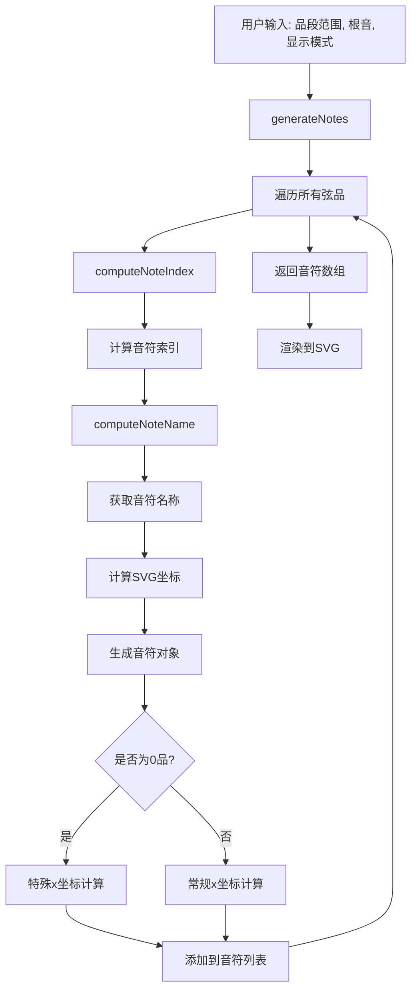
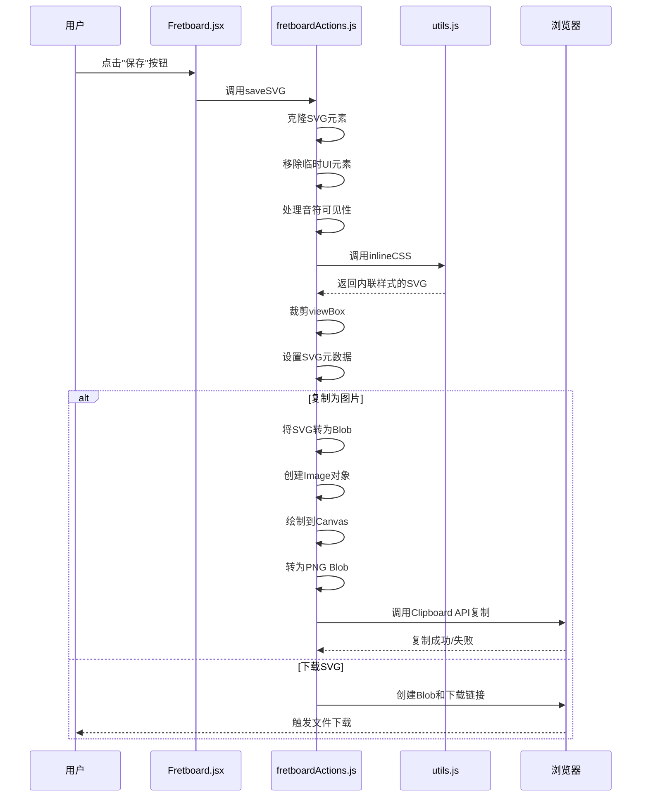
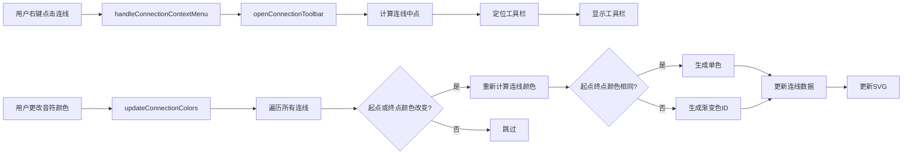
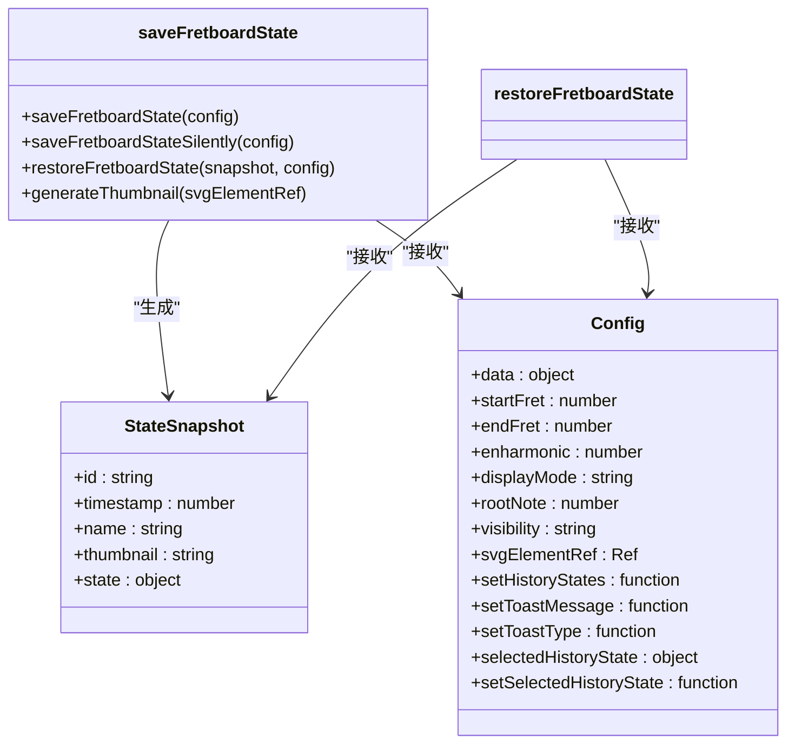
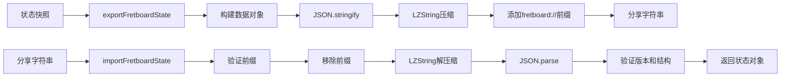

# 工具函数

<cite>
**本文档中引用的文件**   
- [fretboardCalculations.js](file://src/utils/fretboardCalculations.js)
- [fretboardActions.js](file://src/utils/fretboardActions.js)
- [connectionUtils.js](file://src/utils/connectionUtils.js)
- [fretboardHistory.js](file://src/utils/fretboardHistory.js)
- [fretboardShare.js](file://src/utils/fretboardShare.js)
- [svgImport.js](file://src/utils/svgImport.js)
- [constants.js](file://src/constants.js)
- [Fretboard.jsx](file://src/Fretboard.jsx)
</cite>

## 目录
1. [引言](#引言)
2. [音符位置与指板布局计算](#音符位置与指板布局计算)
3. [指板操作工具函数](#指板操作工具函数)
4. [音符连接工具函数](#音符连接工具函数)
5. [状态历史管理](#状态历史管理)
6. [数据序列化与反序列化](#数据序列化与反序列化)
7. [SVG导入功能](#svg导入功能)
8. [总结](#总结)

## 引言

本项目中的工具函数模块（`utils`）是整个指板图应用的核心支撑系统，负责处理从音符计算、用户操作、状态管理到数据共享等关键功能。这些工具函数通过清晰的职责划分和模块化设计，实现了功能的高内聚与低耦合，确保了应用的可维护性和扩展性。

每个工具文件都专注于特定领域，通过纯函数和可复用的逻辑，为上层组件提供稳定的服务。这种设计模式不仅提高了代码的可测试性，也使得功能的添加和修改更加安全和高效。

**Section sources**
- [fretboardCalculations.js](file://src/utils/fretboardCalculations.js)
- [fretboardActions.js](file://src/utils/fretboardActions.js)
- [connectionUtils.js](file://src/utils/connectionUtils.js)

## 音符位置与指板布局计算

`fretboardCalculations.js` 文件是整个应用的“计算引擎”，负责将抽象的吉他弦品信息转化为可视化的SVG坐标和音符名称。

该模块的核心是 `computeNoteIndex` 和 `computeNoteName` 函数。`computeNoteIndex` 函数根据标准吉他调弦（`CONSTS.stringIntervals`）和指定的品数（fret）来计算该位置音符在十二平均律中的索引（0-11）。其计算公式为 `(stringIntervals[string] + fret + 1) % 12`，其中 `+1` 是为了与标准音名索引对齐。

`computeNoteName` 函数则利用 `computeNoteIndex` 的结果，结合 `CONSTS.notes` 数组（包含升号和降号两种音名表示）和 `enharmonic` 标志位，返回最终的音符名称（如 "C#" 或 "Db"）。

`generateNotes` 函数是布局生成的核心。它遍历指定品段范围内的所有弦品组合，为每个音符计算其在SVG中的精确坐标（`x` 和 `y`）。对于0品（开放弦），其x坐标被特殊处理，使其与第一品的间距与其他品间距保持一致。该函数还智能地处理了音符的显示逻辑：优先显示用户手动编辑的文本，其次根据 `displayMode`（音名或唱名）和 `rootNote`（根音）自动生成显示名称。

此外，`generateMarkers` 生成品数标记（如3、5、7品），`generateFretPath` 和 `generateStringPath` 生成指板的品丝和琴弦的SVG路径，共同构建了完整的指板视觉框架。

**Diagram sources **
- [fretboardCalculations.js](file://src/utils/fretboardCalculations.js#L3-L134)
- [constants.js](file://src/constants.js#L1-L19)

**Section sources**
- [fretboardCalculations.js](file://src/utils/fretboardCalculations.js#L3-L134)
- [constants.js](file://src/constants.js#L1-L19)

## 指板操作工具函数

`fretboardActions.js` 文件封装了用户与指板交互时触发的核心操作，如颜色选择、可见性切换、重置和SVG保存。

`selectColor` 函数用于更新当前选中的颜色层级（第一层或第二层）和具体颜色。`cycleLevel1Color` 和 `cycleLevel2Color` 函数实现了通过快捷键循环切换颜色的功能，支持在主色和异色（tint）之间切换。

`toggleVisibility` 函数用于切换音符的可见性状态（`hidden` 与 `transparent` 之间切换），并同步更新DOM和数据状态。`reset` 函数则是一个重置操作，它会清除所有音符的颜色、可见性设置和自定义文本，将指板恢复到初始状态，同时保留当前的显示模式和根音设置。

最复杂的函数是 `saveSVG`。该函数负责将当前的指板状态导出为SVG文件或复制为图片。其流程包括：
1.  克隆当前的SVG元素，避免影响原始视图。
2.  移除工具栏和编辑框等临时UI元素。
3.  根据 `showNotes` 参数决定如何处理隐藏的音符：若为 `true`，则临时显示所有音符；若为 `false`，则执行可见性切换。
4.  调用 `inlineCSS` 函数，将所有CSS样式内联到SVG元素的 `style` 属性中，确保导出的SVG在任何环境中都能正确显示。
5.  根据是否有颜色的音符，智能地裁剪SVG的 `viewBox`，使导出的图片只包含有效内容。
6.  最后，根据 `copyOnly` 参数决定是下载SVG文件还是将SVG转换为PNG图片并复制到剪贴板。在复制图片时，会处理HTTPS安全上下文限制，并提供降级方案。

**Diagram sources **
- [fretboardActions.js](file://src/utils/fretboardActions.js#L317-L829)
- [Fretboard.jsx](file://src/Fretboard.jsx#L12-L21)

**Section sources**
- [fretboardActions.js](file://src/utils/fretboardActions.js#L78-L877)
- [Fretboard.jsx](file://src/Fretboard.jsx#L12-L21)

## 音符连接工具函数

`connectionUtils.js` 文件提供了处理音符之间连线（connection）的工具函数，包括上下文菜单、工具栏定位和颜色同步。

`detectDropdownDirection` 函数用于智能判断下拉菜单的展开方向。它通过比较按钮在SVG容器内的位置和可用空间，决定菜单是向上还是向下展开，以确保菜单完全可见。

`openConnectionToolbar` 函数负责在用户右键点击一条连线时，打开一个上下文工具栏。它首先计算该连线的中点坐标，然后将工具栏定位在该点下方，避免遮挡连线本身。

`updateConnectionColors` 函数是保持连线颜色与音符颜色同步的关键。当用户更改了某个音符的颜色时，该函数会遍历所有连线，检查其起点和终点音符的颜色是否发生变化。如果发生变化，它会重新计算连线的颜色：如果起点和终点颜色相同，则使用 `reduceColorSaturation` 函数生成一个饱和度较低的单色；如果颜色不同，则创建一个渐变色ID。这个函数确保了视觉上的一致性。

**Diagram sources **
- [connectionUtils.js](file://src/utils/connectionUtils.js#L3-L196)
- [fretboardActions.js](file://src/utils/fretboardActions.js#L146-L165)

**Section sources**
- [connectionUtils.js](file://src/utils/connectionUtils.js#L3-L196)

## 状态历史管理

`fretboardHistory.js` 文件实现了指板状态的保存、恢复和历史记录管理，为用户提供撤销和重做之外的持久化状态管理。

`saveFretboardState` 函数将当前指板的所有状态（包括音符数据、品段范围、显示模式、根音、可见性等）和一个SVG缩略图快照，序列化为一个对象，并保存到 `localStorage` 中。它支持两种模式：如果用户选中了一个已有的历史状态，则更新该状态；否则，创建一个新状态并置于列表顶部。该函数还负责生成缩略图，通过 `inlineCSS` 处理SVG并转换为Data URL。

`saveFretboardStateSilently` 是一个静默保存函数，通常在页面关闭前调用。它会检查当前状态是否与最新历史状态相同，只有在不同时才进行保存，避免产生冗余的历史记录。

`restoreFretboardState` 函数用于恢复一个保存的状态。它会将保存的状态数据反序列化，并通过一系列 `setState` 调用来更新应用的各个状态变量。为了确保状态更新的顺序正确，它使用了 `setTimeout` 来分阶段更新，先更新UI相关的状态，再更新核心数据。

**Diagram sources **
- [fretboardHistory.js](file://src/utils/fretboardHistory.js#L38-L333)
- [Fretboard.jsx](file://src/Fretboard.jsx#L21-L22)

**Section sources**
- [fretboardHistory.js](file://src/utils/fretboardHistory.js#L38-L333)

## 数据序列化与反序列化

`fretboardShare.js` 文件负责实现指板状态的分享功能，其核心是使用LZ-String库进行数据压缩。

`exportFretboardState` 函数将一个状态快照对象序列化为一个可分享的字符串。它首先构建一个包含版本号、名称和状态数据的对象，然后将其转换为JSON字符串。接着，使用 `LZString.compressToEncodedURIComponent` 方法将JSON字符串压缩为一个极短的URI编码字符串。最后，添加一个自定义的协议前缀 `fretboard://`，形成最终的分享链接。

`importFretboardState` 函数是反向过程。它首先验证分享字符串的前缀，然后移除前缀并尝试使用 `LZString.decompressFromEncodedURIComponent` 解压缩。为了向后兼容，它还支持旧的Base64格式。解压缩后，它会解析JSON并验证版本号和数据结构的完整性，确保导入的安全性。

`copyToClipboard` 和 `readFromClipboard` 函数提供了与系统剪贴板交互的跨浏览器兼容方案。它们优先使用现代的 `navigator.clipboard` API，如果不可用，则降级到使用 `document.execCommand` 的传统方法，并妥善处理权限错误。

**Diagram sources **
- [fretboardShare.js](file://src/utils/fretboardShare.js#L12-L171)
- [Fretboard.jsx](file://src/Fretboard.jsx#L21-L22)

**Section sources**
- [fretboardShare.js](file://src/utils/fretboardShare.js#L12-L171)

## SVG导入功能

`svgImport.js` 文件提供了从外部SVG文件导入指板状态的功能，是 `fretboardShare.js` 功能的补充，允许用户导入由本应用或其他工具生成的SVG文件。

`parseSVGToFretboardState` 函数是核心。它接收一个SVG文件或字符串，使用 `DOMParser` 解析为DOM结构。然后，它从SVG的元数据（`data-display-mode`, `data-root-note` 等）中读取显示设置。

该函数会遍历所有音符元素（`g` 标签，ID以 `o-s` 或 `f` 开头），通过分析其 `class` 名称、`fill`/`stroke` 属性和文本内容，推断出每个音符的颜色、可见性和自定义标签。它使用 `getColorNameFromValue` 函数将CSS颜色值（如 `#ffd700` 或 `var(--color-level1-yellow-fill)`）反向映射到预定义的颜色名称（如 "yellow"）。

对于连线，该函数会查找所有 `path` 或 `line` 元素，并通过分析其 `marker-start`/`marker-end` 属性或父元素中的 `marker` 来确定箭头方向。它会尝试从路径的 `d` 属性或 `x1,y1,x2,y2` 属性中提取起点和终点坐标，并通过 `findNearestNote` 函数将这些坐标匹配到最近的音符上，从而重建连线关系。

该模块的健壮性体现在其对各种SVG格式的兼容性处理上，例如支持从 `fill` 属性、`style` 属性或CSS变量中提取颜色，并能处理没有箭头的普通线条。

**Section sources**
- [svgImport.js](file://src/utils/svgImport.js#L139-L800)

## 总结

`utils` 目录下的工具函数构成了应用的坚实基础。通过将计算、操作、状态管理和数据交换等职责分离到独立的模块中，代码实现了高度的解耦。每个函数都专注于单一任务，通过清晰的输入输出接口与其他部分交互。

这些工具函数不仅支撑了核心功能，还通过提供可复用的逻辑，极大地简化了上层组件（如 `Fretboard.jsx`）的复杂度。例如，`fretboardCalculations.js` 将复杂的坐标计算封装起来，`fretboardActions.js` 将用户操作的副作用集中管理，而 `fretboardHistory.js` 和 `fretboardShare.js` 则提供了强大的状态持久化和共享能力。

这种模块化的设计使得应用易于维护和扩展。添加新功能（如新的显示模式或导出格式）时，通常只需在相应的工具文件中添加函数，而无需修改核心组件，从而降低了引入bug的风险。