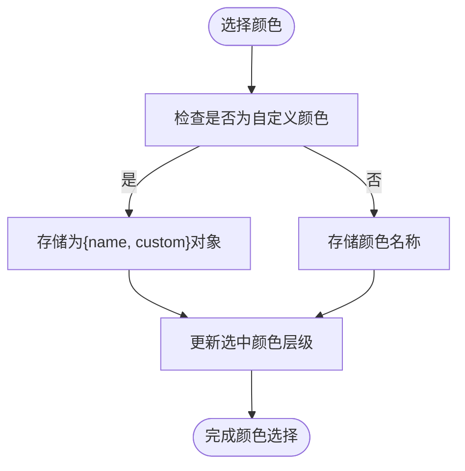
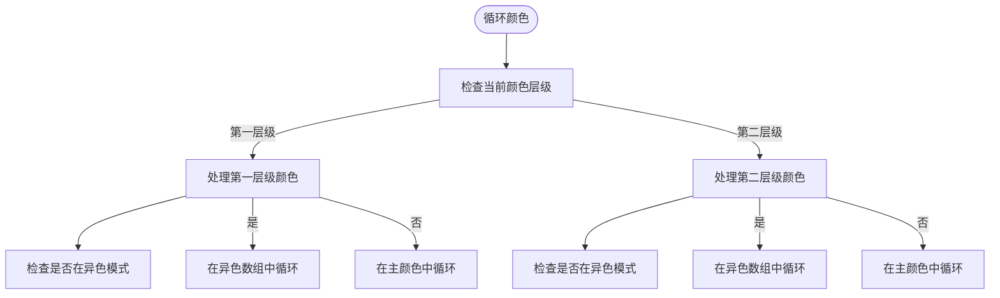
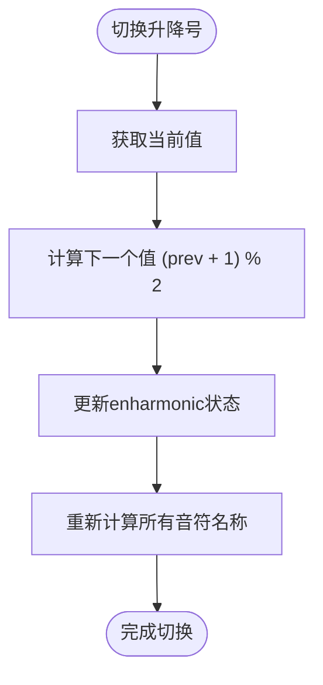
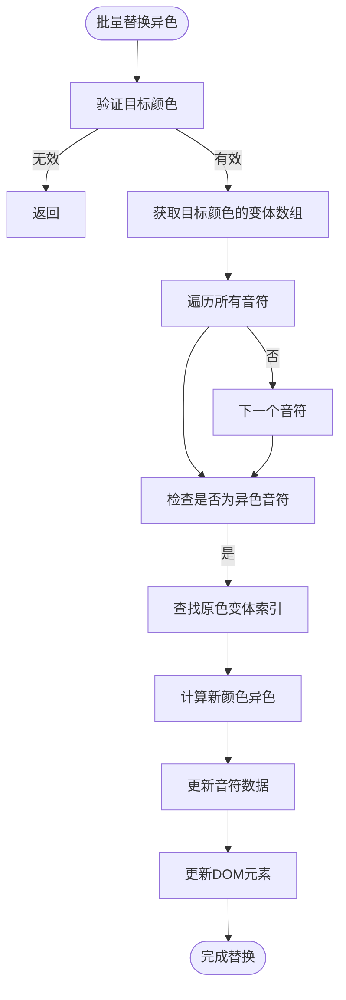
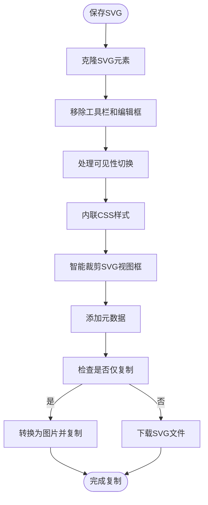

# 操作工具

<cite>
**本文档中引用的文件**   
- [fretboardActions.js](file://src/utils/fretboardActions.js)
- [colorConfig.js](file://src/colorConfig.js)
- [Fretboard.jsx](file://src/Fretboard.jsx)
- [ColorPalette.jsx](file://src/components/ColorPalette.jsx)
- [keyboardHandlers.js](file://src/handlers/keyboardHandlers.js)
- [constants.js](file://src/constants.js)
</cite>

## 目录
1. [简介](#简介)
2. [核心操作函数](#核心操作函数)
3. [颜色选择与循环](#颜色选择与循环)
4. [可见性与升降号切换](#可见性与升降号切换)
5. [异色音符批量替换](#异色音符批量替换)
6. [指板状态重置](#指板状态重置)
7. [SVG导出与图片复制](#svg导出与图片复制)
8. [用户交互响应机制](#用户交互响应机制)
9. [总结](#总结)

## 简介
本文档详细说明了`fretboardActions.js`文件中封装的用户操作函数。这些函数构成了指板图生成器的核心交互功能，允许用户通过点击、双击、键盘快捷键等方式与指板进行交互。主要功能包括颜色选择、可见性切换、升降号显示控制、状态重置和SVG导出等。所有函数都设计为纯函数或具有明确副作用的函数，通过接收必要的状态和更新函数来修改应用状态。

## 核心操作函数
`fretboardActions.js`文件导出了多个用于处理用户交互的核心函数。这些函数被`Fretboard.jsx`组件通过`useCallback`钩子封装成记忆化版本，以确保在组件重新渲染时不会产生新的函数引用，从而避免不必要的子组件重新渲染。每个函数都遵循函数式编程原则，接收所需的状态和更新函数作为参数，而不是直接依赖闭包中的状态。

**Section sources**
- [fretboardActions.js](file://src/utils/fretboardActions.js#L78-L877)
- [Fretboard.jsx](file://src/Fretboard.jsx#L337-L403)

## 颜色选择与循环
### selectColor函数
`selectColor`函数用于处理用户选择颜色的操作。当用户点击调色盘中的某个颜色时，该函数会被调用，更新当前选中的颜色层级和颜色值。如果提供了自定义颜色（用于异色模式），则将颜色存储为包含`name`和`custom`属性的对象。

**Diagram sources**
- [fretboardActions.js](file://src/utils/fretboardActions.js#L78-L82)
- [ColorPalette.jsx](file://src/components/ColorPalette.jsx#L36-L43)

### cycleLevel1Color和cycleLevel2Color函数
这两个函数分别用于循环切换第一层级和第二层级的颜色。它们实现了两种模式：正常颜色循环和异色模式循环。在异色模式下，函数会在当前选中颜色的5个浓度变体中循环；在正常模式下，则在预定义的颜色列表中循环。函数支持正向（direction=1）和反向（direction=-1）循环。

**Diagram sources**
- [fretboardActions.js](file://src/utils/fretboardActions.js#L84-L143)
- [keyboardHandlers.js](file://src/handlers/keyboardHandlers.js#L158-L224)

## 可见性与升降号切换
### toggleVisibility函数
`toggleVisibility`函数用于切换音符的可见性状态。它在`hidden`（完全隐藏）和`transparent`（半透明）之间切换。函数会遍历所有音符元素，更新非`visible`和`selected`状态的音符的可见性，并通过`updateNote`函数更新DOM和数据状态。

**Section sources**
- [fretboardActions.js](file://src/utils/fretboardActions.js#L146-L165)
- [Fretboard.jsx](file://src/Fretboard.jsx#L374-L387)

### toggleEnharmonic函数
`toggleEnharmonic`函数用于切换升降号的显示方式。它通过`setEnharmonic`函数将当前值在0（升号）和1（降号）之间循环。这个切换会影响所有音符的显示名称，根据`noteToSolfege`函数的逻辑重新计算唱名。

**Diagram sources**
- [fretboardActions.js](file://src/utils/fretboardActions.js#L167-L169)
- [Fretboard.jsx](file://src/Fretboard.jsx#L388-L391)

## 异色音符批量替换
### replaceAllTintNotes函数
`replaceAllTintNotes`函数用于将所有异色音符替换为指定颜色对应浓度的异色。当用户在调色盘上右键点击某个颜色时，会弹出确认对话框，确认后调用此函数。函数会遍历所有音符数据，找到使用异色的对象，根据原色在变体数组中的索引，找到目标颜色对应浓度的异色，并进行替换。

**Diagram sources**
- [fretboardActions.js](file://src/utils/fretboardActions.js#L172-L265)
- [ColorPalette.jsx](file://src/components/ColorPalette.jsx#L16-L30)

## 指板状态重置
### reset函数
`reset`函数用于将指板状态重置为默认值。它会清除所有音符的颜色、描边和自定义设置，将可见性恢复到当前状态，同时重置品丝范围到默认值（0-15品），并将升降号模式重置为降号。函数通过`setData`更新所有音符数据，并通过`updateNote`同步更新DOM中的音符样式。

**Section sources**
- [fretboardActions.js](file://src/utils/fretboardActions.js#L268-L314)
- [Fretboard.jsx](file://src/Fretboard.jsx#L396-L399)

## SVG导出与图片复制
### saveSVG函数
`saveSVG`函数处理SVG导出和图片复制的完整流程。它首先克隆SVG元素，移除工具栏和编辑框等不需要的元素，然后根据导出选项处理可见性、品数标记和音符显示。函数会智能裁剪SVG视图框以包含所有有颜色的音符和连线，最后根据`copyOnly`参数决定是下载SVG文件还是将图片复制到剪贴板。

**Diagram sources**
- [fretboardActions.js](file://src/utils/fretboardActions.js#L317-L829)
- [Fretboard.jsx](file://src/Fretboard.jsx#L400-L403)

## 用户交互响应机制
用户交互通过多种方式触发这些操作函数：点击调色盘颜色触发`selectColor`，双击颜色进入异色模式，键盘快捷键（如W键）触发颜色循环，Z键切换可见性，Ctrl+D重置状态等。这些交互由`keyboardHandlers.js`中的`createKeyboardHandler`函数统一处理，该函数根据键盘事件代码调用相应的操作函数。

**Section sources**
- [keyboardHandlers.js](file://src/handlers/keyboardHandlers.js#L33-L227)
- [Fretboard.jsx](file://src/Fretboard.jsx#L466-L490)

## 总结
`fretboardActions.js`文件中的函数构成了指板图生成器的核心交互逻辑。这些函数设计精巧，通过接收状态和更新函数作为参数，实现了良好的解耦和可测试性。颜色管理、可见性控制、状态重置和导出功能都通过这些函数实现，为用户提供了丰富而直观的交互体验。函数之间的协作通过React的状态管理和回调函数机制实现，确保了应用状态的一致性和UI的及时更新。