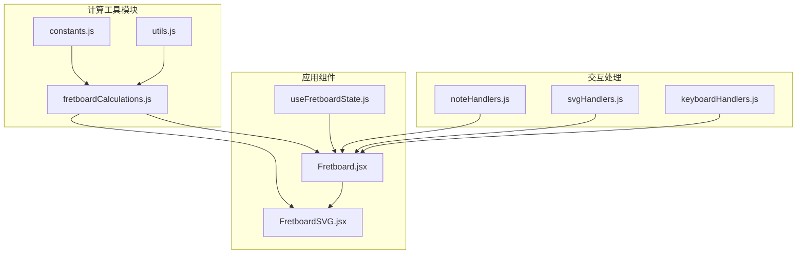
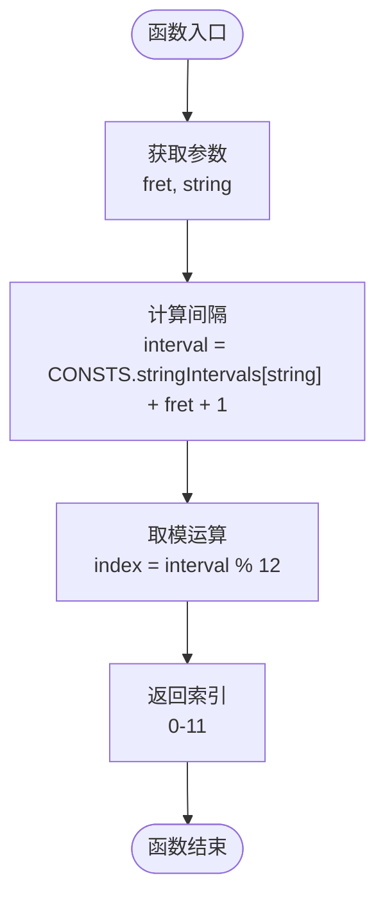
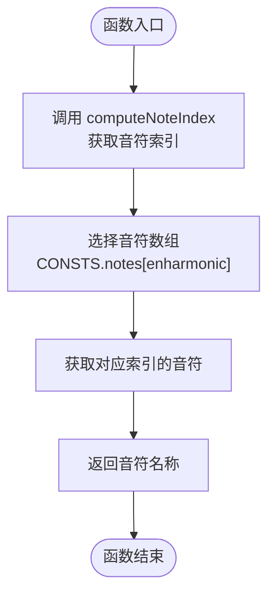
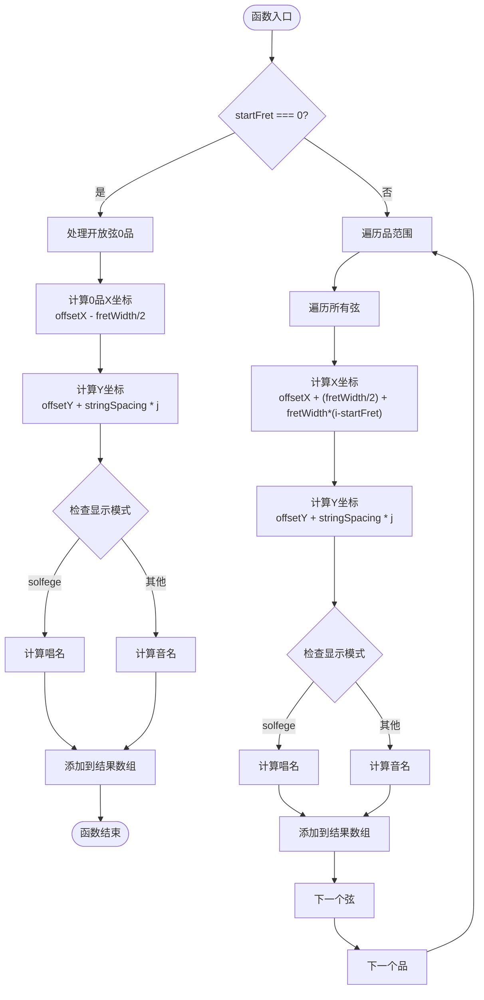
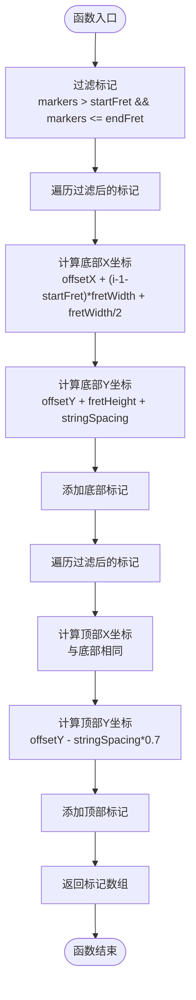
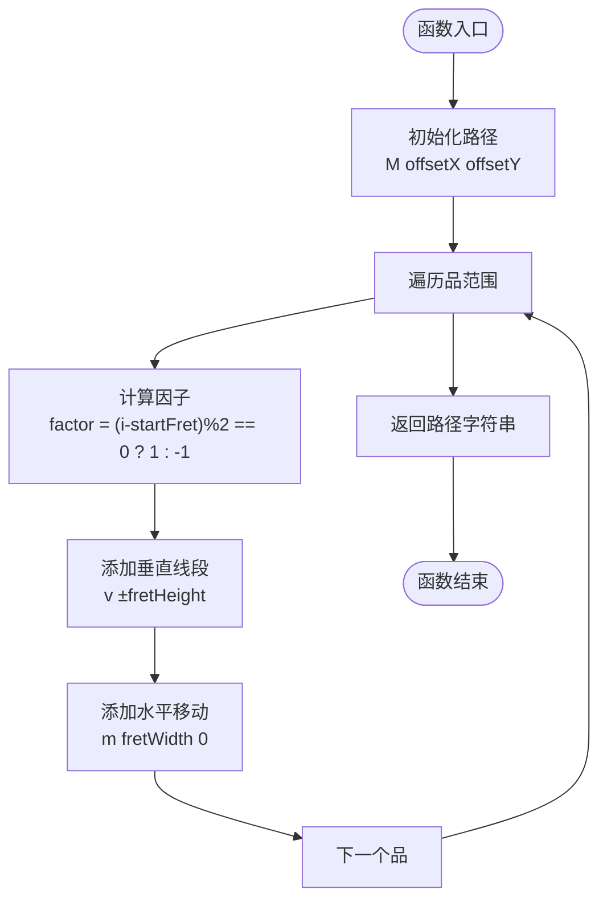
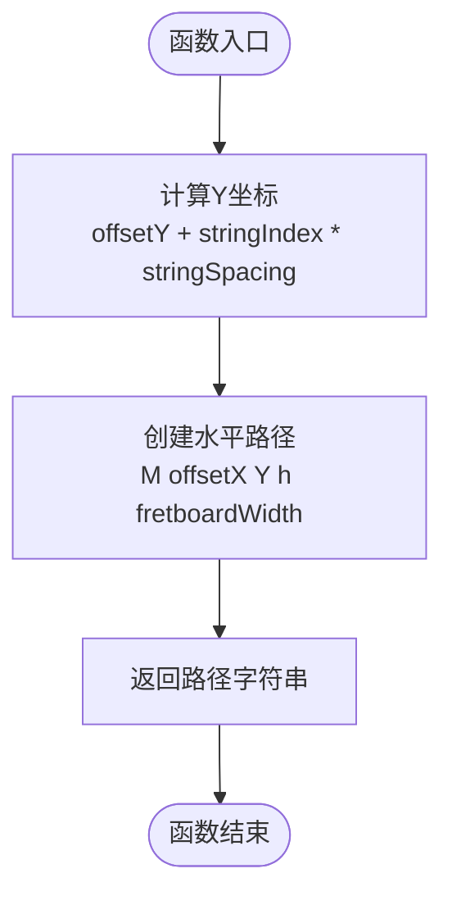
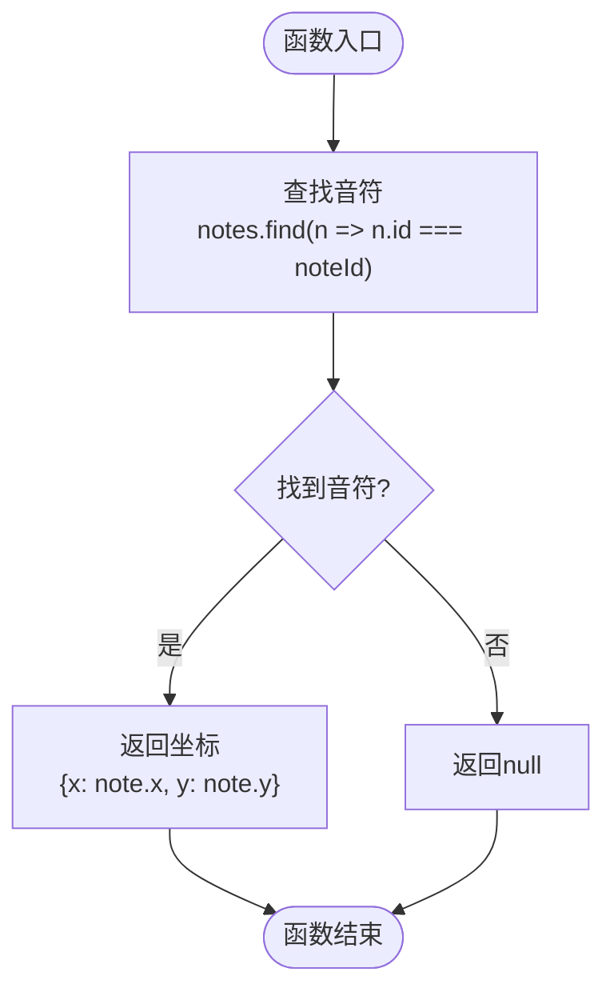
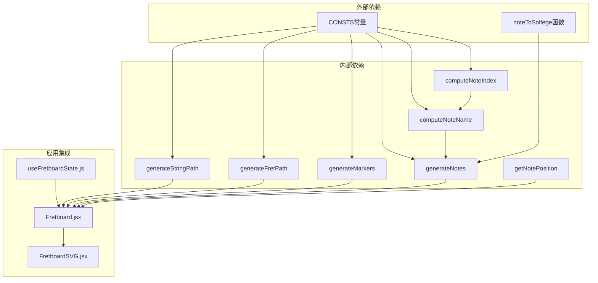

# 计算工具

<cite>
**本文档引用的文件**
- [fretboardCalculations.js](file://src/utils/fretboardCalculations.js)
- [constants.js](file://src/constants.js)
- [utils.js](file://src/utils.js)
- [Fretboard.jsx](file://src/Fretboard.jsx)
- [FretboardSVG.jsx](file://src/components/FretboardSVG.jsx)
- [useFretboardState.js](file://src/hooks/useFretboardState.js)
</cite>

## 目录
1. [简介](#简介)
2. [项目结构](#项目结构)
3. [核心组件](#核心组件)
4. [架构概览](#架构概览)
5. [详细组件分析](#详细组件分析)
6. [依赖关系分析](#依赖关系分析)
7. [性能考量](#性能考量)
8. [故障排除指南](#故障排除指南)
9. [结论](#结论)

## 简介

本文档详细文档化了指板计算工具模块，重点分析 `fretboardCalculations.js` 中的所有计算函数。这些函数负责将指板上的物理位置（品丝和弦位）转换为音乐理论中的音符索引和名称，生成指板上所有音符的位置信息，以及计算指板布局的各种几何参数。

该模块是整个指板可视化系统的核心计算引擎，为指板渲染提供了精确的数学基础。通过理解这些计算函数的工作原理，开发者可以更好地维护和扩展指板功能。

## 项目结构

指板计算工具位于 `src/utils/` 目录下，与主应用组件分离，体现了良好的模块化设计：



**图表来源**
- [fretboardCalculations.js](file://src/utils/fretboardCalculations.js#L1-L135)
- [constants.js](file://src/constants.js#L1-L19)
- [Fretboard.jsx](file://src/Fretboard.jsx#L1-L200)

**章节来源**
- [fretboardCalculations.js](file://src/utils/fretboardCalculations.js#L1-L135)
- [constants.js](file://src/constants.js#L1-L19)

## 核心组件

指板计算工具包含以下核心函数：

### 数学计算函数
- `computeNoteIndex`: 根据品丝和弦位计算音符索引
- `computeNoteName`: 根据品丝和弦位计算音符名称

### 数据生成函数
- `generateNotes`: 生成指板上所有音符的位置和显示信息
- `generateMarkers`: 生成品数标记
- `generateFretPath`: 生成品丝的SVG路径
- `generateStringPath`: 生成弦的SVG路径

### 查询函数
- `getNotePosition`: 根据音符ID查找其坐标

这些函数协同工作，为指板渲染提供完整的技术支持。

**章节来源**
- [fretboardCalculations.js](file://src/utils/fretboardCalculations.js#L3-L135)

## 架构概览

指板计算工具采用分层架构设计，每个函数都有明确的职责分工：

```mermaid
graph TB
subgraph "输入层"
IF[输入参数<br/>fret, string, startFret, endFret]
IC[配置常量<br/>CONSTS]
end
subgraph "计算层"
CN[computeNoteIndex<br/>音符索引计算]
CW[computeNoteName<br/>音符名称计算]
GN[generateNotes<br/>音符数据生成]
GM[generateMarkers<br/>标记生成]
GFP[generateFretPath<br/>品丝路径生成]
GSP[generateStringPath<br/>弦路径生成]
end
subgraph "输出层"
ON[音符数组<br/>{id, x, y, noteName}]
OM[标记数组<br/>{x, y, number}]
OFP[品丝路径字符串]
OSP[弦路径字符串]
end
IF --> CN
IF --> CW
IF --> GN
IF --> GM
IF --> GFP
IF --> GSP
IC --> CN
IC --> CW
IC --> GN
IC --> GM
IC --> GFP
IC --> GSP
CN --> ON
CW --> ON
GN --> ON
GM --> OM
GFP --> OFP
GSP --> OSP
```

**图表来源**
- [fretboardCalculations.js](file://src/utils/fretboardCalculations.js#L3-L135)
- [constants.js](file://src/constants.js#L1-L19)

## 详细组件分析

### computeNoteIndex 函数

该函数是音符计算的核心，负责将品丝和弦位转换为音符索引。



**图表来源**
- [fretboardCalculations.js](file://src/utils/fretboardCalculations.js#L3-L6)

**算法复杂度**: 时间复杂度 O(1)，空间复杂度 O(1)

**实现要点**:
- 使用 `stringIntervals` 数组确定每根弦的基准音高
- 通过 `fret + 1` 计算相对于基准音的半音数
- 使用模运算确保结果在 0-11 范围内

**章节来源**
- [fretboardCalculations.js](file://src/utils/fretboardCalculations.js#L3-L6)
- [constants.js](file://src/constants.js#L4-L13)

### computeNoteName 函数

该函数基于音符索引生成对应的音符名称，支持升降号显示。



**图表来源**
- [fretboardCalculations.js](file://src/utils/fretboardCalculations.js#L8-L11)

**实现要点**:
- 支持两种音符表示法：升号（enharmonic=0）和降号（enharmonic=1）
- 使用 `notes` 数组提供标准音符名称
- 与 `computeNoteIndex` 协作完成完整的音符计算

**章节来源**
- [fretboardCalculations.js](file://src/utils/fretboardCalculations.js#L8-L11)
- [constants.js](file://src/constants.js#L10-L13)

### generateNotes 函数

这是最复杂的函数，负责生成指板上所有音符的完整信息。



**图表来源**
- [fretboardCalculations.js](file://src/utils/fretboardCalculations.js#L13-L84)

**算法复杂度**: 时间复杂度 O((endFret-startFret) × numStrings)，空间复杂度 O((endFret-startFret) × numStrings)

**实现要点**:
- 支持三种显示模式：音名、唱名、用户自定义文本
- 特殊处理 0品（开放弦）的位置计算
- 集成用户数据覆盖机制
- 与 solfege 转换函数协作

**章节来源**
- [fretboardCalculations.js](file://src/utils/fretboardCalculations.js#L13-L84)
- [utils.js](file://src/utils.js#L279-L340)

### generateMarkers 函数

生成指板上的品数标记，支持顶部和底部双位置显示。



**图表来源**
- [fretboardCalculations.js](file://src/utils/fretboardCalculations.js#L86-L111)

**实现要点**:
- 使用预定义的标记位置数组 `[1, 3, 5, 7, 9, 12, 15, 17, 19, 21]`
- 顶部和底部标记使用相同的 X 坐标，不同的 Y 坐标
- 顶部标记使用弦间距的 70% 作为垂直偏移

**章节来源**
- [fretboardCalculations.js](file://src/utils/fretboardCalculations.js#L86-L111)
- [constants.js](file://src/constants.js#L5-L18)

### generateFretPath 函数

生成品丝的 SVG 路径，支持波浪形品丝效果。



**图表来源**
- [fretboardCalculations.js](file://src/utils/fretboardCalculations.js#L113-L121)

**实现要点**:
- 使用 SVG 路径语法创建连续的折线
- 交替的垂直方向创造波浪效果
- 起始点设置在 `(offsetX, offsetY)`

**章节来源**
- [fretboardCalculations.js](file://src/utils/fretboardCalculations.js#L113-L121)

### generateStringPath 函数

生成弦的 SVG 路径，用于绘制弦线。



**图表来源**
- [fretboardCalculations.js](file://src/utils/fretboardCalculations.js#L123-L126)

**实现要点**:
- 为每根弦生成独立的水平路径
- 路径长度等于指板宽度
- Y 坐标随弦索引递增

**章节来源**
- [fretboardCalculations.js](file://src/utils/fretboardCalculations.js#L123-L126)

### getNotePosition 函数

提供音符坐标查询功能，支持基于 ID 的快速定位。



**图表来源**
- [fretboardCalculations.js](file://src/utils/fretboardCalculations.js#L128-L134)

**实现要点**:
- 线性搜索音符数组
- 返回标准化的坐标对象
- 处理未找到的情况

**章节来源**
- [fretboardCalculations.js](file://src/utils/fretboardCalculations.js#L128-L134)

## 依赖关系分析

指板计算工具与其他模块的依赖关系如下：



**图表来源**
- [fretboardCalculations.js](file://src/utils/fretboardCalculations.js#L1-L135)
- [constants.js](file://src/constants.js#L1-L19)
- [utils.js](file://src/utils.js#L279-L340)

**章节来源**
- [fretboardCalculations.js](file://src/utils/fretboardCalculations.js#L1-L135)
- [constants.js](file://src/constants.js#L1-L19)
- [utils.js](file://src/utils.js#L279-L340)

## 性能考量

### 时间复杂度分析
- `computeNoteIndex` 和 `computeNoteName`: O(1)
- `generateNotes`: O((endFret-startFret) × numStrings)
- `generateMarkers`: O(m)，其中 m 为标记数量（通常很小）
- `generateFretPath` 和 `generateStringPath`: O(n)，n 为品数或弦数
- `getNotePosition`: O(k)，k 为音符总数

### 空间复杂度分析
- 所有函数均为 O(1) 额外空间（除了 generateNotes 返回数组）
- `generateNotes` 返回数组大小为 O((endFret-startFret) × numStrings)

### 优化建议
1. **记忆化缓存**: 在 Fretboard.jsx 中使用 `useCallback` 缓存计算函数
2. **批量更新**: 使用 `useMemo` 避免不必要的重新计算
3. **增量更新**: 仅在参数变化时重新计算相关数据

## 故障排除指南

### 常见问题及解决方案

#### 1. 音符显示错误
**症状**: 音符名称与预期不符
**原因**: 
- 错误的 `enharmonic` 参数（0=升号，1=降号）
- `stringIntervals` 配置错误
**解决**: 检查 `enharmonic` 设置和 `stringIntervals` 数组

#### 2. 坐标计算偏差
**症状**: 音符位置与视觉效果不符
**原因**: 
- `offsetX` 或 `offsetY` 配置不当
- `fretWidth` 或 `stringSpacing` 设置错误
**解决**: 调整常量配置或检查 CSS 样式

#### 3. 性能问题
**症状**: 指板渲染缓慢
**原因**: 频繁的重新计算和 DOM 操作
**解决**: 
- 使用 `useMemo` 和 `useCallback` 缓存
- 实施虚拟滚动（对于大量音符）

#### 4. solfege 显示异常
**症状**: 唱名显示不正确
**原因**: `rootNote` 未正确设置或 `noteToSolfege` 参数错误
**解决**: 确保根音设置正确并传递正确的 `enharmonic` 参数

**章节来源**
- [fretboardCalculations.js](file://src/utils/fretboardCalculations.js#L13-L84)
- [utils.js](file://src/utils.js#L279-L340)

## 结论

指板计算工具模块展现了优秀的工程实践，通过清晰的函数分离、精确的数学计算和良好的性能优化，为指板可视化提供了坚实的基础。各个函数职责明确，相互协作，形成了完整的计算链路。

关键优势包括：
1. **模块化设计**: 每个函数都有单一职责，便于测试和维护
2. **性能优化**: 使用记忆化和批量更新策略
3. **灵活性**: 支持多种显示模式和配置选项
4. **可扩展性**: 清晰的接口设计便于功能扩展

这些计算函数为指板应用提供了可靠的数学基础，确保了音符位置的准确性、显示的一致性和用户体验的流畅性。