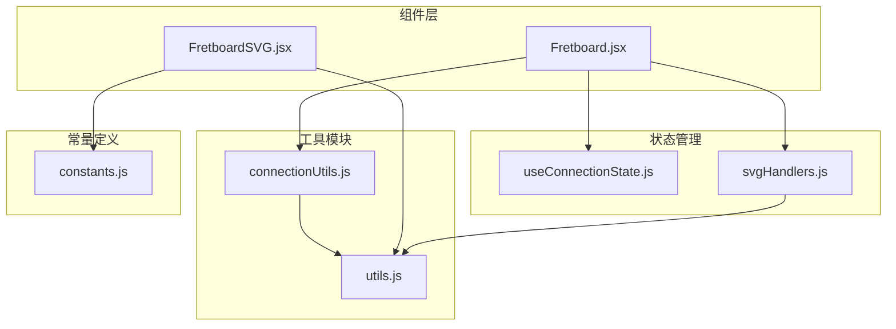
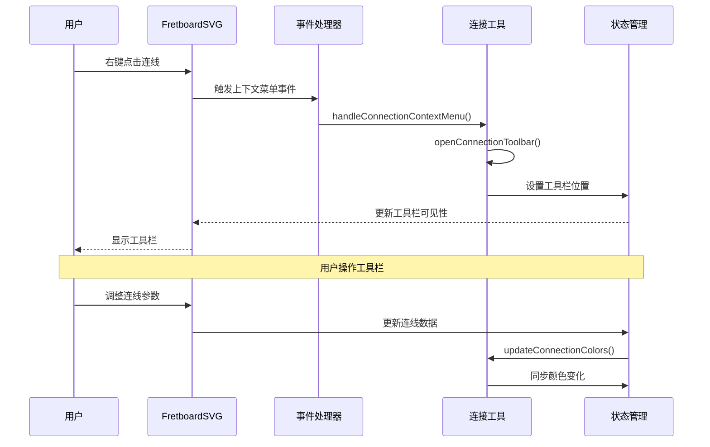
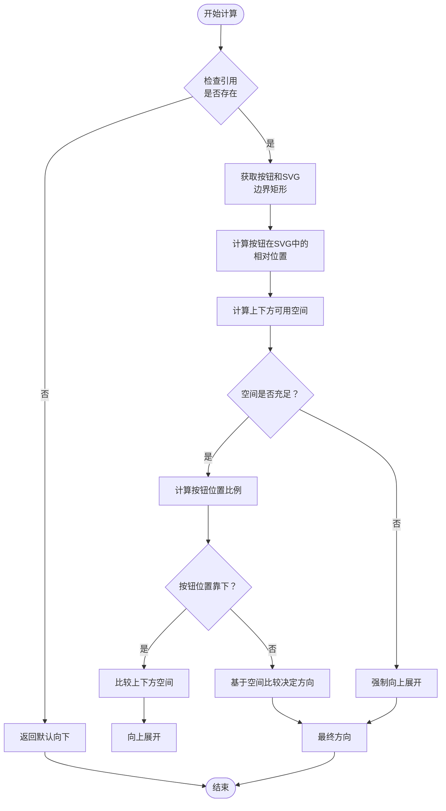
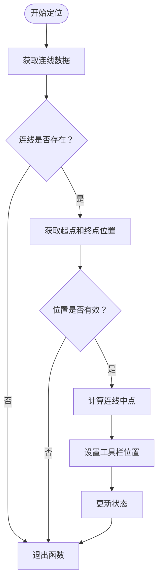
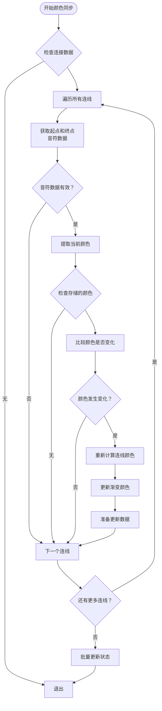
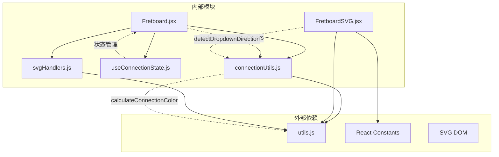

# 连接工具

<cite>
**本文档引用 Pin 所引用的文件**
- [connectionUtils.js](file://src/utils/connectionUtils.js)
- [utils.js](file://src/utils.js)
- [Fretboard.jsx](file://src/Fretboard.jsx)
- [FretboardSVG.jsx](file://src/components/FretboardSVG.jsx)
- [useConnectionState.js](file://src/hooks/useConnectionState.js)
- [svgHandlers.js](file://src/handlers/svgHandlers.js)
- [constants.js](file://src/constants.js)
</cite>

## 目录
1. [简介](#简介)
2. [项目结构](#项目结构)
3. [核心组件](#核心组件)
4. [架构概览](#架构概览)
5. [详细组件分析](#详细组件分析)
6. [依赖关系分析](#依赖关系分析)
7. [性能考虑](#性能考虑)
8. [故障排除指南](#故障排除指南)
9. [结论](#结论)

## 简介

本文档详细分析了 `connectionUtils.js` 文件中的连线处理工具函数，这些函数为指板上的连线交互功能提供了完整的技术支持。该工具集包括四个核心函数：`detectDropdownDirection`、`openConnectionToolbar`、`handleConnectionContextMenu`、`handleConnectionClick` 和 `updateConnectionColors`，它们协同工作以实现智能的连线管理和颜色同步功能。

这些工具函数不仅处理用户界面交互，还负责动态计算连线位置、管理工具栏布局，以及维护连线颜色与音符颜色的一致性。通过这些功能，用户可以在指板上轻松创建、编辑和管理各种类型的连线，包括直线和弧线，并支持箭头方向、线条粗细、曲率等参数的实时调整。

## 项目结构

连接工具系统位于项目的 `src/utils/` 目录下，采用模块化设计，与其他组件通过清晰的接口进行集成：

**图表来源**
- [connectionUtils.js](file://src/utils/connectionUtils.js#L1-L196)
- [Fretboard.jsx](file://src/Fretboard.jsx#L1-L811)
- [FretboardSVG.jsx](file://src/components/FretboardSVG.jsx#L1-L1184)

**章节来源**
- [connectionUtils.js](file://src/utils/connectionUtils.js#L1-L196)
- [Fretboard.jsx](file://src/Fretboard.jsx#L1-L811)

## 核心组件

连接工具系统由五个关键函数组成，每个函数都有特定的职责和复杂的处理逻辑：

### 1. detectDropdownDirection - 下拉菜单方向检测器

这个函数负责智能判断下拉菜单应该向上还是向下展开，基于SVG空间的可用区域和按钮位置进行精确计算。

### 2. openConnectionToolbar - 连线工具栏定位器

该函数计算连线的几何中心位置，确保工具栏能够准确显示在连线的合适位置，避免遮挡连线本身。

### 3. handleConnectionContextMenu - 连接右键事件处理器

处理右键点击事件，提供上下文菜单功能，支持快速访问连线工具栏。

### 4. handleConnectionClick - 连接点击事件处理器

处理左键点击事件，用于激活连线工具栏，支持用户对特定连线进行编辑。

### 5. updateConnectionColors - 连接颜色同步器

监控音符颜色变化，自动更新相关连线的颜色，保持视觉一致性。

**章节来源**
- [connectionUtils.js](file://src/utils/connectionUtils.js#L3-L196)

## 架构概览

连接工具系统采用分层架构设计，各组件之间通过明确定义的接口进行通信：

**图表来源**
- [FretboardSVG.jsx](file://src/components/FretboardSVG.jsx#L486-L489)
- [Fretboard.jsx](file://src/Fretboard.jsx#L329-L335)
- [connectionUtils.js](file://src/utils/connectionUtils.js#L76-L85)

## 详细组件分析

### detectDropdownDirection 函数分析

#### 功能概述
`detectDropdownDirection` 函数是一个智能的空间检测算法，用于确定下拉菜单的最佳展开方向。它通过计算按钮相对于SVG容器的位置，评估上下方的可用空间，并根据多种条件做出决策。

#### 核心算法流程

**图表来源**
- [connectionUtils.js](file://src/utils/connectionUtils.js#L3-L54)

#### 关键特性
- **空间感知**：精确计算按钮在SVG容器内的相对位置
- **阈值优化**：使用多个阈值条件确保最佳用户体验
- **动态决策**：根据按钮位置和可用空间动态选择展开方向
- **容错处理**：缺失引用时提供安全的默认行为

**章节来源**
- [connectionUtils.js](file://src/utils/connectionUtils.js#L3-L54)

### openConnectionToolbar 函数分析

#### 功能概述
`openConnectionToolbar` 函数负责计算并设置连线工具栏的精确位置。它通过获取连线起点和终点的坐标，计算连线的几何中心，然后将工具栏定位在该中心点下方适当的位置。

#### 定位算法

**图表来源**
- [connectionUtils.js](file://src/utils/connectionUtils.js#L56-L74)

#### 关键特性
- **几何计算**：精确计算连线的中点坐标
- **偏移调整**：避免工具栏遮挡连线的垂直偏移
- **状态管理**：集成React状态更新机制
- **位置优化**：确保工具栏在视觉上最佳的显示位置

**章节来源**
- [connectionUtils.js](file://src/utils/connectionUtils.js#L56-L74)

### 事件处理函数分析

#### handleConnectionContextMenu 函数
该函数专门处理右键点击事件，提供上下文菜单功能：
- 阻止默认右键菜单显示
- 停止事件冒泡防止意外触发
- 调用工具栏打开函数

#### handleConnectionClick 函数
该函数处理左键点击事件：
- 停止事件冒泡
- 调用工具栏打开函数
- 支持快捷编辑操作

这两个函数都依赖于统一的工具栏打开机制，确保用户可以通过不同方式快速访问连线编辑功能。

**章节来源**
- [connectionUtils.js](file://src/utils/connectionUtils.js#L76-L85)

### updateConnectionColors 函数分析

#### 功能概述
`updateConnectionColors` 函数是颜色同步系统的核心，负责监控音符颜色变化并自动更新相关连线的颜色。这是一个复杂的批处理函数，需要遍历所有连线并进行精确的颜色匹配。

#### 颜色同步算法

**图表来源**
- [connectionUtils.js](file://src/utils/connectionUtils.js#L87-L195)

#### 关键特性
- **颜色比较**：支持基础颜色和自定义颜色对象的精确比较
- **渐变颜色**：维护起点和终点的颜色信息用于渐变渲染
- **批量更新**：优化性能，减少不必要的状态更新
- **向后兼容**：处理旧数据格式，确保兼容性

**章节来源**
- [connectionUtils.js](file://src/utils/connectionUtils.js#L87-L195)

## 依赖关系分析

连接工具系统与项目其他组件存在紧密的依赖关系：

**图表来源**
- [connectionUtils.js](file://src/utils/connectionUtils.js#L1-L2)
- [Fretboard.jsx](file://src/Fretboard.jsx#L11-L15)
- [FretboardSVG.jsx](file://src/components/FretboardSVG.jsx#L3-L4)

### 主要依赖关系

1. **utils.js 依赖**：`calculateConnectionColor` 函数用于颜色计算
2. **React 状态管理**：通过 `useConnectionState` 管理工具栏状态
3. **SVG DOM 操作**：直接操作SVG元素进行定位和渲染
4. **事件处理链**：与 `svgHandlers.js` 形成完整的事件处理管道

**章节来源**
- [connectionUtils.js](file://src/utils/connectionUtils.js#L1-L196)
- [Fretboard.jsx](file://src/Fretboard.jsx#L11-L15)

## 性能考虑

连接工具系统在设计时充分考虑了性能优化：

### 1. 惰性计算
- 使用 `useCallback` 包装事件处理器，避免不必要的重新创建
- 通过 `useMemo` 缓存计算结果，减少重复计算

### 2. 批量更新
- `updateConnectionColors` 函数使用批量更新策略，减少状态更新次数
- 合并多个状态变更到单次更新中

### 3. 条件渲染
- 工具栏仅在需要时显示，避免不必要的DOM操作
- 下拉菜单方向检测使用防抖机制

### 4. 内存管理
- 合理使用 `useRef` 存储引用，避免状态污染
- 及时清理事件监听器和定时器

## 故障排除指南

### 常见问题及解决方案

#### 1. 工具栏位置异常
**症状**：工具栏显示在错误位置
**原因**：SVG引用丢失或坐标计算错误
**解决**：检查 `svgElementRef` 是否正确初始化

#### 2. 下拉菜单方向错误
**症状**：下拉菜单超出屏幕边界
**原因**：空间检测算法计算错误
**解决**：验证 `detectDropdownDirection` 的输入参数

#### 3. 颜色同步失效
**症状**：连线颜色不随音符颜色变化
**原因**：颜色比较逻辑错误或数据格式不兼容
**解决**：检查 `updateConnectionColors` 的颜色比较函数

#### 4. 事件处理冲突
**症状**：点击事件无法正常触发
**原因**：事件冒泡阻止不当
**解决**：检查事件处理器中的 `stopPropagation` 调用

**章节来源**
- [connectionUtils.js](file://src/utils/connectionUtils.js#L3-L54)
- [connectionUtils.js](file://src/utils/connectionUtils.js#L87-L195)

## 结论

`connectionUtils.js` 文件中的连线处理工具函数构成了指板应用中连线交互功能的核心基础设施。通过精心设计的算法和模块化的架构，这些工具实现了以下关键能力：

1. **智能空间检测**：`detectDropdownDirection` 函数提供了精确的下拉菜单方向控制
2. **精准定位**：`openConnectionToolbar` 函数确保工具栏在视觉上最佳的位置
3. **灵活事件处理**：两种事件处理器支持不同的用户交互模式
4. **实时颜色同步**：`updateConnectionColors` 函数维护了视觉一致性

这些工具函数不仅满足了当前的功能需求，还为未来的扩展提供了良好的基础。通过清晰的接口设计和完善的错误处理机制，整个系统具有良好的可维护性和可扩展性。