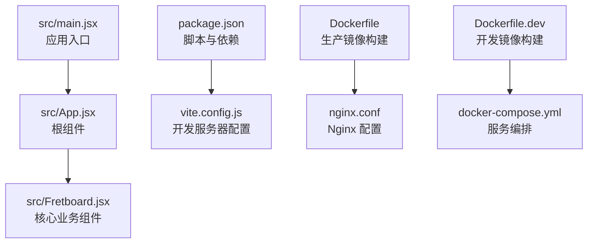
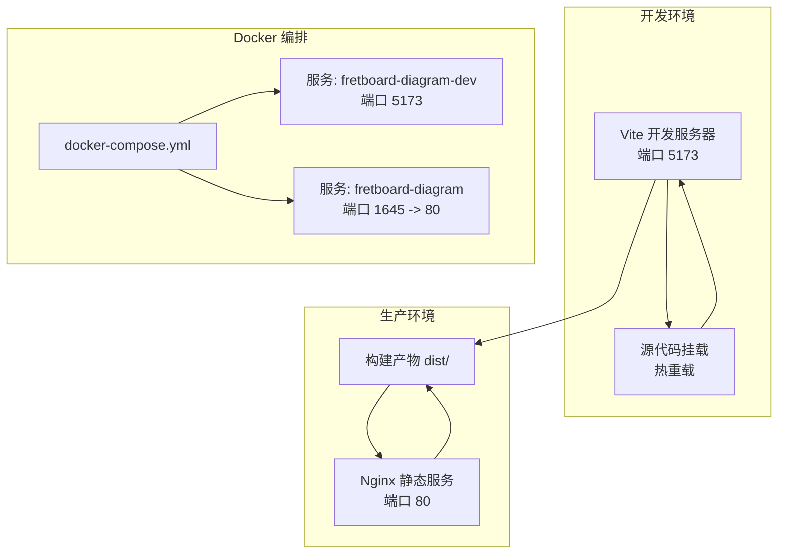
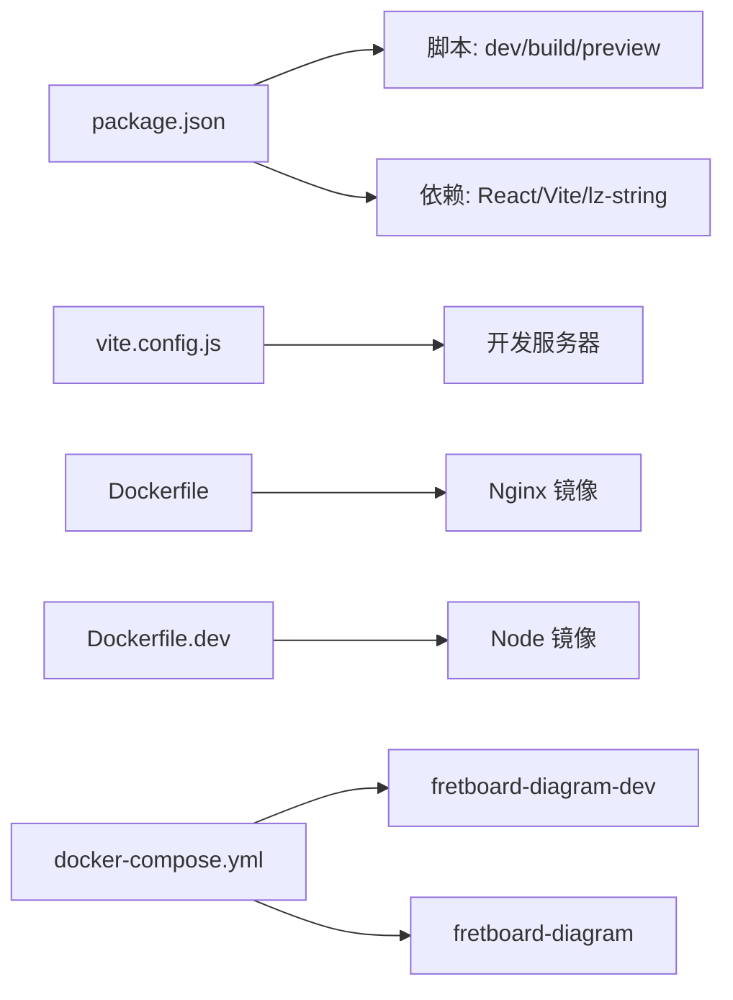

# 快速开始

<cite>
**本文引用的文件**
- [README.md](file://README.md)
- [package.json](file://package.json)
- [vite.config.js](file://vite.config.js)
- [Dockerfile](file://Dockerfile)
- [Dockerfile.dev](file://Dockerfile.dev)
- [docker-compose.yml](file://docker-compose.yml)
- [nginx.conf](file://nginx.conf)
- [README.Docker.md](file://README.Docker.md)
- [src/main.jsx](file://src/main.jsx)
- [src/App.jsx](file://src/App.jsx)
- [src/Fretboard.jsx](file://src/Fretboard.jsx)
</cite>

## 目录
1. [简介](#简介)
2. [项目结构](#项目结构)
3. [核心组件](#核心组件)
4. [架构总览](#架构总览)
5. [详细组件分析](#详细组件分析)
6. [依赖关系分析](#依赖关系分析)
7. [性能注意事项](#性能注意事项)
8. [故障排除指南](#故障排除指南)
9. [结论](#结论)
10. [附录](#附录)

## 简介
本指南面向首次接触“指板图生成器”的开发者与使用者，提供从环境准备、安装依赖、启动开发服务器、构建生产包到预览与部署的完整流程。项目采用 React 18 + Vite + SVG 技术栈，支持分享与导入功能，完全离线运行。同时提供 Docker 多阶段构建与 docker-compose 编排，便于本地开发与生产部署。

## 项目结构
项目采用“源码在 src、配置在根目录”的组织方式，核心入口为 src/main.jsx，应用根组件为 src/App.jsx，核心业务组件为 src/Fretboard.jsx。构建与运行通过 Vite 配置，Docker 提供多阶段构建与开发/生产两种镜像。

**图表来源**
- [src/main.jsx](file://src/main.jsx#L1-L12)
- [src/App.jsx](file://src/App.jsx#L1-L13)
- [src/Fretboard.jsx](file://src/Fretboard.jsx#L1-L200)
- [package.json](file://package.json#L1-L19)
- [vite.config.js](file://vite.config.js#L1-L11)
- [Dockerfile](file://Dockerfile#L1-L36)
- [Dockerfile.dev](file://Dockerfile.dev#L1-L24)
- [docker-compose.yml](file://docker-compose.yml#L1-L33)
- [nginx.conf](file://nginx.conf#L1-L29)

**章节来源**
- [README.md](file://README.md#L139-L154)
- [src/main.jsx](file://src/main.jsx#L1-L12)
- [src/App.jsx](file://src/App.jsx#L1-L13)
- [src/Fretboard.jsx](file://src/Fretboard.jsx#L1-L200)
- [package.json](file://package.json#L1-L19)
- [vite.config.js](file://vite.config.js#L1-L11)
- [Dockerfile](file://Dockerfile#L1-L36)
- [Dockerfile.dev](file://Dockerfile.dev#L1-L24)
- [docker-compose.yml](file://docker-compose.yml#L1-L33)
- [nginx.conf](file://nginx.conf#L1-L29)

## 核心组件
- 应用入口与根组件：负责渲染根组件并挂载到 DOM。
- 核心业务组件：指板图生成与交互的核心逻辑，包含状态管理、计算与渲染。
- 构建与脚本：通过 Vite 提供开发服务器与构建能力；Docker 提供多阶段构建与运行时服务。

**章节来源**
- [src/main.jsx](file://src/main.jsx#L1-L12)
- [src/App.jsx](file://src/App.jsx#L1-L13)
- [src/Fretboard.jsx](file://src/Fretboard.jsx#L1-L200)
- [package.json](file://package.json#L5-L8)

## 架构总览
下图展示从开发到生产的典型路径，以及 Docker 编排的服务角色与端口映射。

**图表来源**
- [docker-compose.yml](file://docker-compose.yml#L1-L33)
- [Dockerfile.dev](file://Dockerfile.dev#L1-L24)
- [Dockerfile](file://Dockerfile#L1-L36)
- [nginx.conf](file://nginx.conf#L1-L29)

## 详细组件分析

### 环境要求与安装
- Node.js 版本要求：18.0 或更高版本。
- 包管理器：推荐 pnpm，也可使用 npm/yarn。
- pnpm 安装方式可参考官方文档，或使用全局安装命令。

**章节来源**
- [README.md](file://README.md#L22-L35)

### 依赖安装
- 在项目根目录执行依赖安装命令，安装 React、React DOM、Vite、@vitejs/plugin-react、lz-string 等依赖。

**章节来源**
- [README.md](file://README.md#L49-L64)
- [package.json](file://package.json#L10-L18)

### 开发服务器启动
- 启动开发服务器，支持热模块替换与源码映射，便于调试。
- 默认访问地址通常为 http://localhost:5173；若端口被占用，Vite 会自动选择下一个可用端口。

**章节来源**
- [README.md](file://README.md#L67-L81)
- [package.json](file://package.json#L6)
- [vite.config.js](file://vite.config.js#L6-L9)

### 生产构建与预览
- 构建生产版本，产物输出至 dist 目录。
- 预览生产构建结果，验证打包与静态资源加载。

**章节来源**
- [README.md](file://README.md#L82-L98)
- [package.json](file://package.json#L7-L8)

### Docker 部署选项
- 生产镜像：使用多阶段构建，先在 Node 基础镜像中安装 pnpm 并构建，再将 dist 复制到 Nginx 镜像提供静态服务。
- 开发镜像：在 Node 基础镜像中安装 pnpm 并安装依赖，暴露 Vite 开发服务器端口，支持热重载。
- docker-compose 编排：提供两个服务，分别对应开发与生产环境，包含端口映射、卷挂载与环境变量。

**章节来源**
- [README.Docker.md](file://README.Docker.md#L1-L73)
- [Dockerfile](file://Dockerfile#L1-L36)
- [Dockerfile.dev](file://Dockerfile.dev#L1-L24)
- [docker-compose.yml](file://docker-compose.yml#L1-L33)

### Nginx 配置要点
- 监听 80 端口，根目录指向 dist。
- 启用 Gzip 压缩与静态资源缓存策略。
- 支持单页应用路由回退到 index.html。
- 添加基础安全响应头。

**章节来源**
- [nginx.conf](file://nginx.conf#L1-L29)

## 依赖关系分析
- package.json 定义了开发与生产脚本，以及 React、Vite、@vitejs/plugin-react、lz-string 等依赖。
- vite.config.js 配置了开发服务器的 host 与 allowedHosts，便于在特定主机或网络环境下访问。
- Dockerfile 与 Dockerfile.dev 分别定义了生产与开发镜像的构建步骤。
- docker-compose.yml 将开发与生产服务编排起来，提供端口映射与卷挂载。

**图表来源**
- [package.json](file://package.json#L1-L19)
- [vite.config.js](file://vite.config.js#L1-L11)
- [Dockerfile](file://Dockerfile#L1-L36)
- [Dockerfile.dev](file://Dockerfile.dev#L1-L24)
- [docker-compose.yml](file://docker-compose.yml#L1-L33)

**章节来源**
- [package.json](file://package.json#L1-L19)
- [vite.config.js](file://vite.config.js#L1-L11)
- [Dockerfile](file://Dockerfile#L1-L36)
- [Dockerfile.dev](file://Dockerfile.dev#L1-L24)
- [docker-compose.yml](file://docker-compose.yml#L1-L33)

## 性能注意事项
- 生产构建后通过 Nginx 提供静态服务，启用 Gzip 与缓存策略，提升首屏与资源加载性能。
- 开发环境使用 Vite 的热重载与源码映射，减少调试成本。
- Docker 多阶段构建仅保留最小运行时依赖，减小镜像体积。

[本节为通用指导，不涉及具体文件分析]

## 故障排除指南
- 端口冲突
  - 开发服务器默认端口 5173 若被占用，Vite 会自动尝试下一个可用端口；也可在配置中手动指定端口。
- 依赖安装失败
  - 清理 pnpm store、删除 node_modules 与 pnpm-lock.yaml 后重新安装。
- 构建错误
  - 检查 Node.js 版本是否满足要求，确认依赖安装完整且无语法错误。
- Docker 相关
  - 确保已安装 Docker 与 Docker Compose；首次运行会自动构建镜像；开发环境会挂载源代码目录以实现热重载；生产环境建议配合反向代理统一域名与端口。

**章节来源**
- [README.md](file://README.md#L176-L197)
- [README.Docker.md](file://README.Docker.md#L67-L73)

## 结论
本指南覆盖了从环境准备、依赖安装、开发与生产流程到 Docker 部署的完整路径。对于新手，建议先在本地完成开发与预览；对于高级用户，可直接使用 docker-compose 编排生产与开发服务，结合 Nginx 与多阶段构建获得更稳定的运行体验。

[本节为总结性内容，不涉及具体文件分析]

## 附录

### 快速命令清单
- 检查 Node.js 版本
- 安装依赖：在项目根目录执行依赖安装命令
- 启动开发服务器：执行开发脚本
- 构建生产版本：执行构建脚本
- 预览生产构建：执行预览脚本
- Docker 生产部署：使用 docker-compose 启动生产服务
- Docker 开发部署：使用 docker-compose 启动开发服务

**章节来源**
- [README.md](file://README.md#L39-L98)
- [README.Docker.md](file://README.Docker.md#L3-L23)
- [package.json](file://package.json#L5-L8)
- [docker-compose.yml](file://docker-compose.yml#L1-L33)