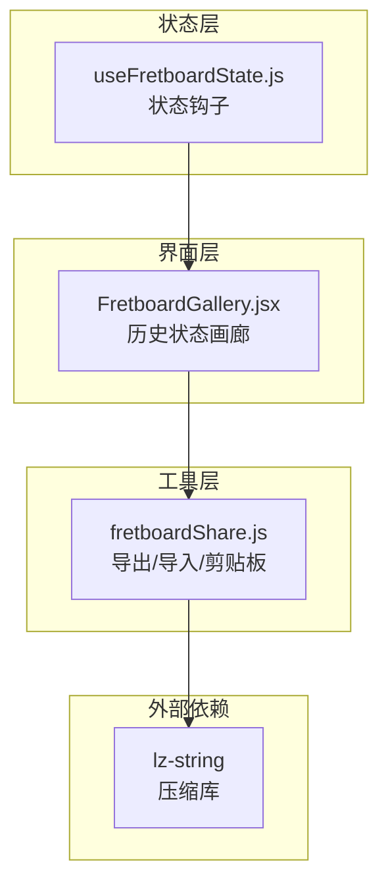
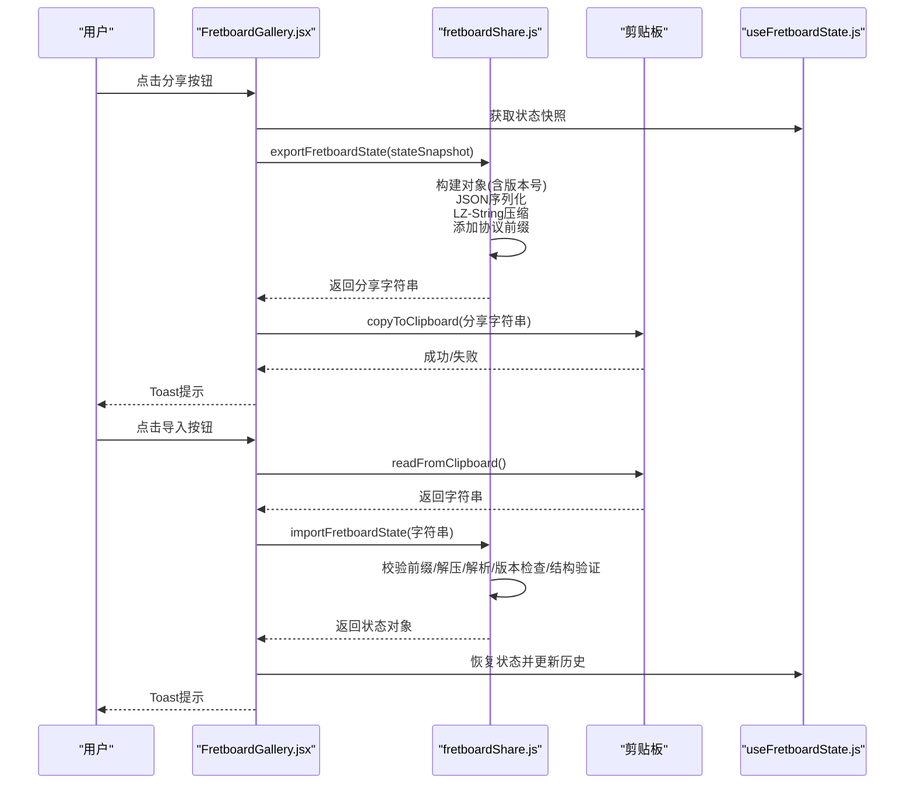
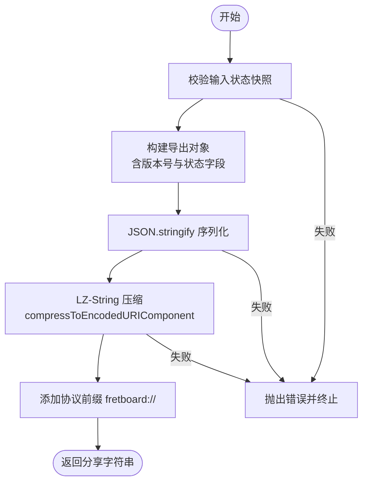
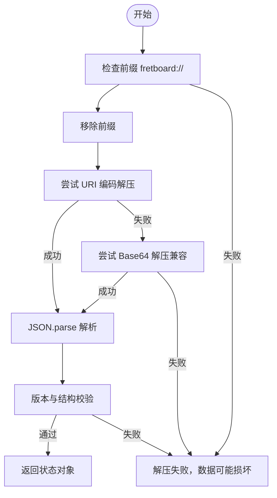
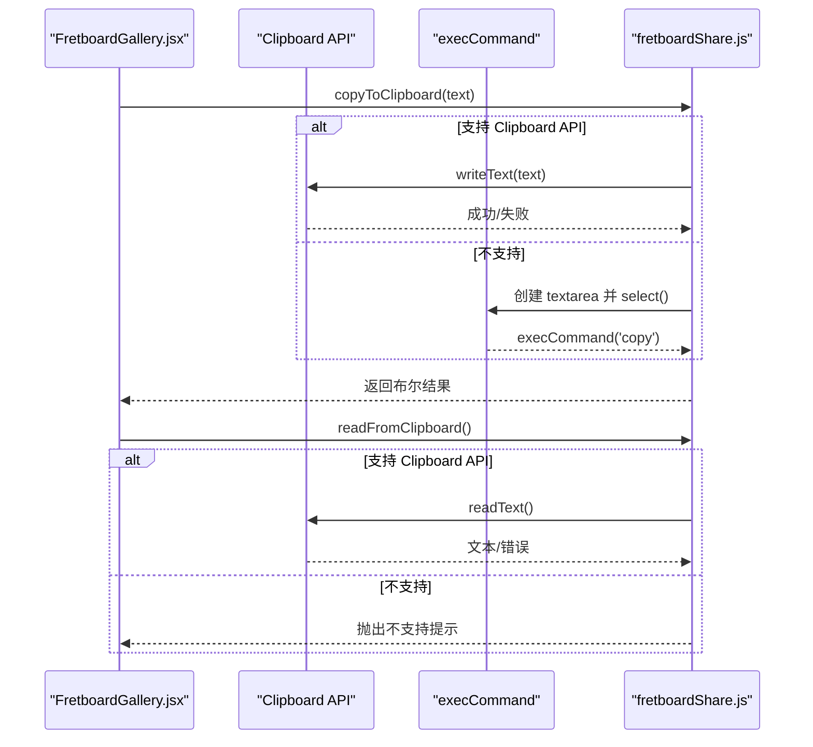
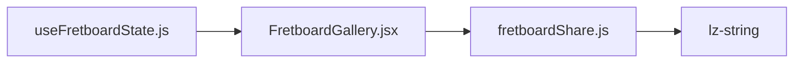

# 分享机制

<cite>
**本文引用的文件列表**
- [src/utils/fretboardShare.js](file://src/utils/fretboardShare.js)
- [src/components/FretboardGallery.jsx](file://src/components/FretboardGallery.jsx)
- [src/hooks/useFretboardState.js](file://src/hooks/useFretboardState.js)
- [SHARE_IMPORT_GUIDE.md](file://SHARE_IMPORT_GUIDE.md)
- [package.json](file://package.json)
</cite>

## 目录
1. [简介](#简介)
2. [项目结构与角色定位](#项目结构与角色定位)
3. [核心组件与职责](#核心组件与职责)
4. [架构总览](#架构总览)
5. [详细组件分析](#详细组件分析)
6. [依赖关系分析](#依赖关系分析)
7. [性能与压缩策略](#性能与压缩策略)
8. [故障排查与兼容性](#故障排查与兼容性)
9. [结论](#结论)
10. [附录：使用示例与最佳实践](#附录使用示例与最佳实践)

## 简介
本节介绍指板状态分享机制的目标与价值：将当前指板状态（音符数据、品范围、显示模式等）打包为可分享的字符串，支持跨设备、跨平台的快速导入与恢复，同时保证数据完整性与可扩展性。机制围绕 exportFretboardState 函数展开，采用 LZ-String 压缩与 URI 编码，最终以 fretboard:// 前缀标识协议类型，形成紧凑、易传播的分享字符串。

## 项目结构与角色定位
- 分享与导入逻辑集中在工具模块中，负责序列化、压缩、剪贴板交互与反序列化校验。
- Gallery 组件负责展示历史状态、触发分享与导入流程，并与工具模块协作完成复制/粘贴。
- 状态钩子提供完整的指板状态数据结构，供分享时采集与导入时恢复。

图表来源
- [src/components/FretboardGallery.jsx](file://src/components/FretboardGallery.jsx#L1-L385)
- [src/utils/fretboardShare.js](file://src/utils/fretboardShare.js#L1-L171)
- [src/hooks/useFretboardState.js](file://src/hooks/useFretboardState.js#L1-L190)
- [package.json](file://package.json#L10-L11)

章节来源
- [src/components/FretboardGallery.jsx](file://src/components/FretboardGallery.jsx#L1-L385)
- [src/utils/fretboardShare.js](file://src/utils/fretboardShare.js#L1-L171)
- [src/hooks/useFretboardState.js](file://src/hooks/useFretboardState.js#L1-L190)
- [package.json](file://package.json#L10-L11)

## 核心组件与职责
- exportFretboardState：将指板状态快照封装为带版本号的结构化对象，JSON 序列化后经 LZ-String 压缩并添加协议前缀，生成可分享字符串。
- importFretboardState：校验前缀、解压、JSON 解析、版本与数据结构验证，返回可用的状态对象。
- copyToClipboard/readFromClipboard：提供现代 Clipboard API 与传统 execCommand 的双路径兼容方案，保障复制/读取体验。
- FretboardGallery：UI 触发分享与导入，调用工具模块执行具体流程，并通过回调反馈结果。
- useFretboardState：提供完整的状态字段（音符数据、品范围、显示模式、根音、可见性等），作为分享/导入的数据源。

章节来源
- [src/utils/fretboardShare.js](file://src/utils/fretboardShare.js#L12-L105)
- [src/components/FretboardGallery.jsx](file://src/components/FretboardGallery.jsx#L159-L174)
- [src/hooks/useFretboardState.js](file://src/hooks/useFretboardState.js#L1-L190)

## 架构总览
下图展示了从“点击分享”到“复制到剪贴板”的端到端流程，以及从“导入”到“恢复状态”的逆向流程。

图表来源
- [src/components/FretboardGallery.jsx](file://src/components/FretboardGallery.jsx#L159-L174)
- [src/utils/fretboardShare.js](file://src/utils/fretboardShare.js#L12-L105)
- [src/hooks/useFretboardState.js](file://src/hooks/useFretboardState.js#L1-L190)

## 详细组件分析

### exportFretboardState：导出流程与数据模型
- 输入：状态快照对象，包含名称与状态字段。
- 输出：形如 fretboard://<压缩字符串> 的可分享字符串。
- 关键步骤：
  1) 构建导出对象：包含版本号、名称、状态子对象（数据、起止品、升降号设置、显示模式、根音、可见性）。
  2) JSON 序列化：将对象转为字符串。
  3) LZ-String 压缩：使用 compressToEncodedURIComponent 生成更短的 URI 编码字符串。
  4) 添加协议前缀：统一标识分享字符串类型。
  5) 异常处理：对空值、结构缺失、序列化失败等情况抛出明确错误。

图表来源
- [src/utils/fretboardShare.js](file://src/utils/fretboardShare.js#L12-L45)

章节来源
- [src/utils/fretboardShare.js](file://src/utils/fretboardShare.js#L12-L45)

### importFretboardState：导入流程与安全校验
- 输入：分享字符串（需以 fretboard:// 开头）。
- 输出：通过版本与结构校验的状态对象；否则抛错。
- 关键步骤：
  1) 校验字符串类型与前缀。
  2) 移除前缀，尝试 LZ-String URI 编码解压；若失败回退至 Base64。
  3) JSON 解析，校验版本号与必需字段。
  4) 返回可用对象或抛出错误。

图表来源
- [src/utils/fretboardShare.js](file://src/utils/fretboardShare.js#L52-L105)

章节来源
- [src/utils/fretboardShare.js](file://src/utils/fretboardShare.js#L52-L105)

### 剪贴板交互：copyToClipboard 与 readFromClipboard
- 写入：优先使用 Clipboard API；失败时回退到 execCommand 方案。
- 读取：优先使用 Clipboard API；若权限受限或不支持，则提示用户手动粘贴。
- 错误处理：区分权限类错误与环境不支持，给出明确提示。

图表来源
- [src/utils/fretboardShare.js](file://src/utils/fretboardShare.js#L112-L170)
- [src/components/FretboardGallery.jsx](file://src/components/FretboardGallery.jsx#L15-L40)

章节来源
- [src/utils/fretboardShare.js](file://src/utils/fretboardShare.js#L112-L170)
- [src/components/FretboardGallery.jsx](file://src/components/FretboardGallery.jsx#L15-L40)

### 状态数据模型与字段说明
- 版本号：用于未来扩展与兼容性处理。
- 名称：可选，便于识别分享状态。
- 状态对象包含：
  - data：音符与连线数据对象。
  - startFret/endFret：起止品范围（数值）。
  - enharmonic：升降号设置（1 表示降号，-1 表示升号）。
  - displayMode：显示模式（'note' 或 'solfege'）。
  - rootNote：根音（数字或 null）。
  - visibility：可见性设置。

章节来源
- [src/utils/fretboardShare.js](file://src/utils/fretboardShare.js#L19-L31)
- [src/hooks/useFretboardState.js](file://src/hooks/useFretboardState.js#L1-L190)

## 依赖关系分析
- 外部依赖：lz-string 提供 LZ-String 压缩/解压能力。
- 内部依赖：FretboardGallery 依赖 fretboardShare 工具模块；状态由 useFretboardState 提供。

图表来源
- [src/utils/fretboardShare.js](file://src/utils/fretboardShare.js#L1)
- [src/components/FretboardGallery.jsx](file://src/components/FretboardGallery.jsx#L4)
- [src/hooks/useFretboardState.js](file://src/hooks/useFretboardState.js#L1)
- [package.json](file://package.json#L10-L11)

章节来源
- [src/utils/fretboardShare.js](file://src/utils/fretboardShare.js#L1)
- [src/components/FretboardGallery.jsx](file://src/components/FretboardGallery.jsx#L4)
- [src/hooks/useFretboardState.js](file://src/hooks/useFretboardState.js#L1)
- [package.json](file://package.json#L10-L11)

## 性能与压缩策略
- 选择 LZ-String 的原因：
  - 压缩率高：相比纯 Base64，通常可减少 50-70% 长度，提升分享效率。
  - 易于分享：生成的字符串更短，适合在聊天、邮件等场景传播。
  - 兼容性强：支持 URI 编码与 Base64 双向解压，向后兼容旧数据。
- 实现细节：
  - 使用 compressToEncodedURIComponent 生成紧凑的 URI 编码字符串。
  - 通过版本号预留未来扩展空间，避免破坏现有分享字符串的可用性。

章节来源
- [src/utils/fretboardShare.js](file://src/utils/fretboardShare.js#L36-L37)
- [SHARE_IMPORT_GUIDE.md](file://SHARE_IMPORT_GUIDE.md#L29-L51)

## 故障排查与兼容性
- 常见错误与处理：
  - 无效的状态数据或分享字符串：抛出明确错误，提示用户检查输入。
  - 前缀不匹配或空字符串：提示格式错误。
  - 解压失败：可能是数据损坏或格式不兼容，建议重新生成分享字符串。
  - 版本不兼容：提示当前版本与目标版本差异，建议升级应用或手动迁移。
  - 剪贴板权限/不支持：区分权限拒绝与浏览器不支持，分别给出提示。
- 兼容性要点：
  - 现代浏览器普遍支持 Clipboard API；旧版浏览器使用降级方案。
  - HTTPS 环境下权限更易获得；非安全上下文可能限制读取权限。
  - 导入流程提供手动输入框，避免剪贴板 API 不稳定带来的影响。

章节来源
- [src/utils/fretboardShare.js](file://src/utils/fretboardShare.js#L41-L44)
- [src/utils/fretboardShare.js](file://src/utils/fretboardShare.js#L54-L104)
- [src/utils/fretboardShare.js](file://src/utils/fretboardShare.js#L112-L170)
- [SHARE_IMPORT_GUIDE.md](file://SHARE_IMPORT_GUIDE.md#L107-L121)

## 结论
该分享机制以简洁、稳健为核心设计原则：通过版本化结构、严格校验与双路径剪贴板兼容，确保分享与导入的可靠性；借助 LZ-String 的高效压缩与 URI 编码，显著降低字符串长度，提升用户体验。配合历史状态画廊与状态钩子，实现了从创作到分享再到恢复的完整闭环。

## 附录：使用示例与最佳实践
- 分享流程（基于界面交互）：
  1) 在历史状态画廊中找到目标状态缩略图。
  2) 点击缩略图右上角的分享按钮。
  3) 系统自动将分享字符串复制到剪贴板，并提示“分享字符串已复制到剪贴板！”。
  4) 将字符串分享给他人（聊天、邮件等）。
- 导入流程（基于界面交互）：
  1) 在画廊标题栏点击“导入”按钮。
  2) 系统尝试读取剪贴板内容；若失败，可切换到“分享字符串”输入框手动粘贴。
  3) 点击“确认导入”，系统解析并恢复状态，提示“导入成功！”。
- 最佳实践：
  - 仅与信任的人分享完整状态数据。
  - 通过可靠渠道传输，避免手工输入导致的损坏。
  - 若遇到剪贴板权限问题，可在 HTTPS 环境下重试或使用手动输入方式。
  - 定期备份重要状态，以防意外丢失。

章节来源
- [SHARE_IMPORT_GUIDE.md](file://SHARE_IMPORT_GUIDE.md#L7-L27)
- [SHARE_IMPORT_GUIDE.md](file://SHARE_IMPORT_GUIDE.md#L122-L139)
- [src/components/FretboardGallery.jsx](file://src/components/FretboardGallery.jsx#L15-L40)
- [src/components/FretboardGallery.jsx](file://src/components/FretboardGallery.jsx#L159-L174)