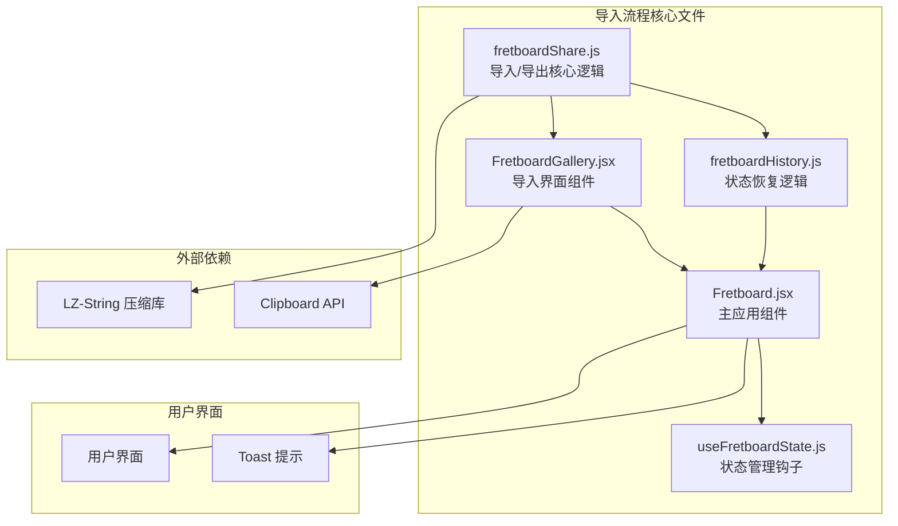
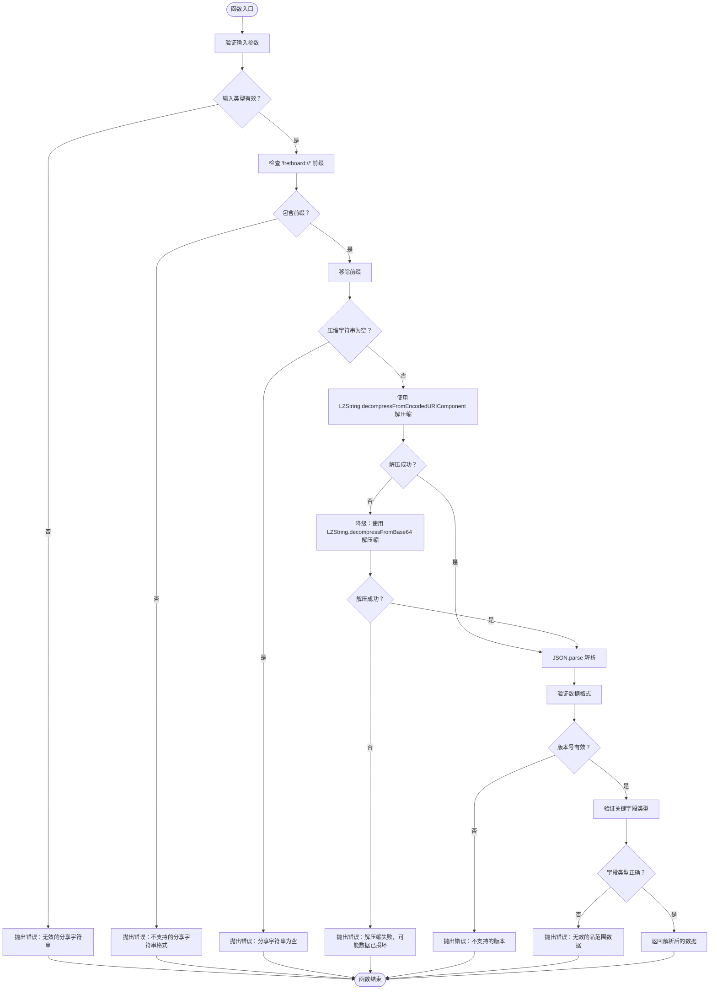
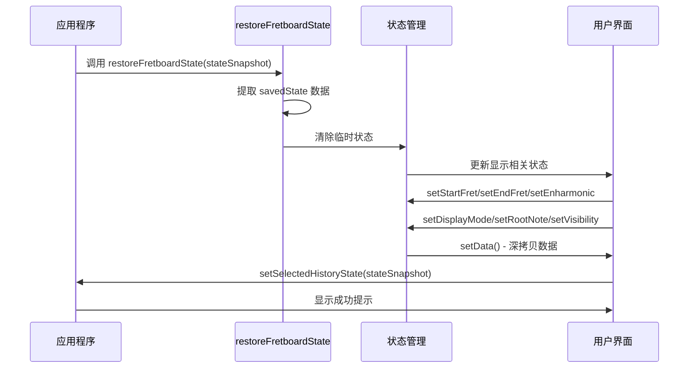
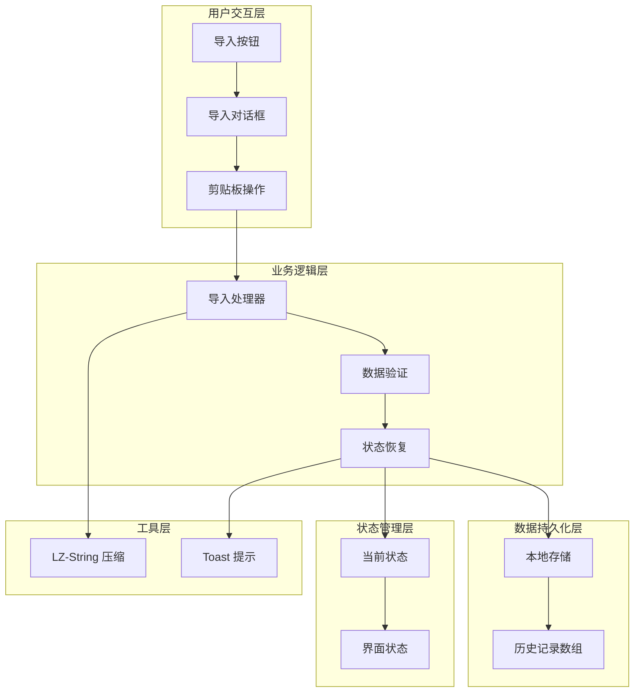
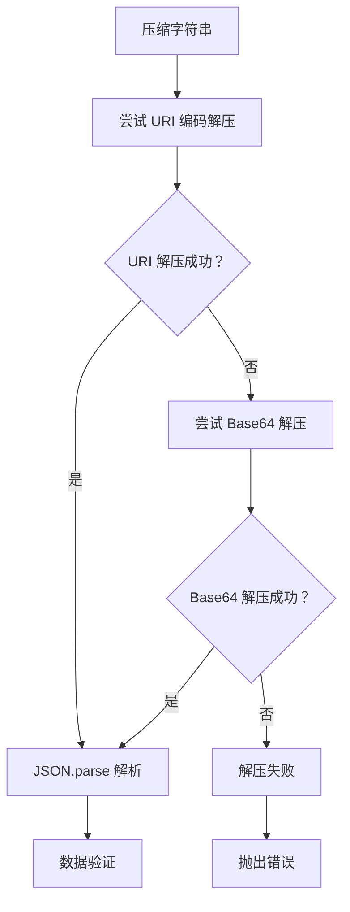
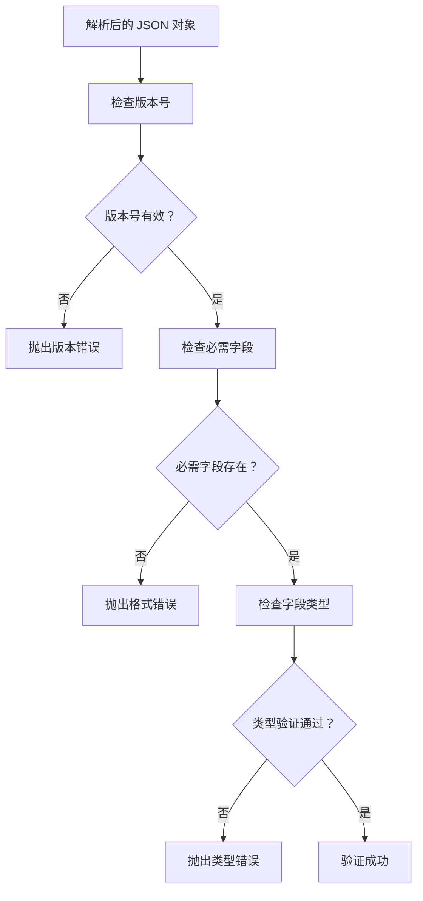
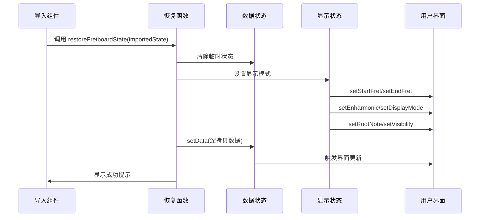
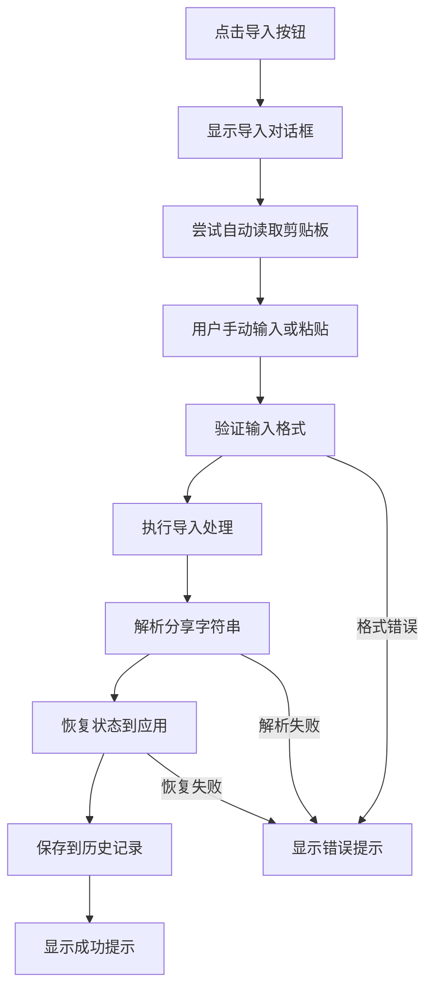
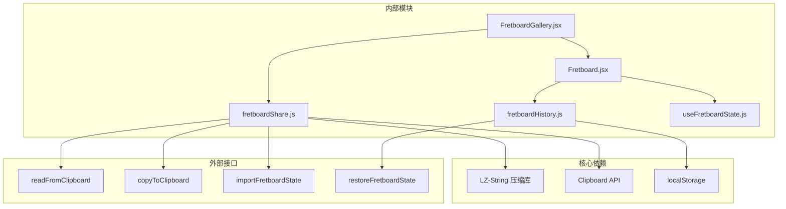

# 导入机制

<cite>
**本文档引用的文件**
- [fretboardShare.js](file://src/utils/fretboardShare.js)
- [fretboardHistory.js](file://src/utils/fretboardHistory.js)
- [FretboardGallery.jsx](file://src/components/FretboardGallery.jsx)
- [Fretboard.jsx](file://src/Fretboard.jsx)
- [useFretboardState.js](file://src/hooks/useFretboardState.js)
- [SHARE_IMPORT_GUIDE.md](file://SHARE_IMPORT_GUIDE.md)
</cite>

## 目录
1. [简介](#简介)
2. [项目结构](#项目结构)
3. [核心组件](#核心组件)
4. [架构概览](#架构概览)
5. [详细组件分析](#详细组件分析)
6. [依赖关系分析](#依赖关系分析)
7. [性能考虑](#性能考虑)
8. [故障排除指南](#故障排除指南)
9. [结论](#结论)

## 简介

本文档深入解析指板状态的导入流程，基于 `fretboardShare.js` 中的 `importFretboardState` 函数，详细说明如何验证输入字符串是否以 `fretboard://` 前缀开头，并提取后续压缩数据。文档重点解释解压缩过程中的双重兼容策略：优先使用 `decompressFromEncodedURIComponent`，失败后降级到 `decompressFromBase64` 以支持旧版本数据。同时，文档解释 `JSON.parse` 后的数据结构验证逻辑，包括版本号检查（当前仅支持 v1）和关键字段（如 `startFret`、`endFret`）的类型验证。结合 `fretboardHistory.js` 中的 `restoreFretboardState` 函数，说明导入后如何将解析出的状态数据恢复到应用中，包括 `setData`、`setDisplayMode` 等状态更新操作。最后，文档引用 `SHARE_IMPORT_GUIDE.md` 中的用户操作流程，说明从点击导入按钮到 Toast 提示的完整交互链。

## 项目结构

指板导入机制涉及多个核心文件的协作：

**图表来源**
- [fretboardShare.js](file://src/utils/fretboardShare.js#L1-L171)
- [fretboardHistory.js](file://src/utils/fretboardHistory.js#L1-L333)
- [FretboardGallery.jsx](file://src/components/FretboardGallery.jsx#L1-L385)
- [Fretboard.jsx](file://src/Fretboard.jsx#L1-L811)

**章节来源**
- [fretboardShare.js](file://src/utils/fretboardShare.js#L1-L171)
- [fretboardHistory.js](file://src/utils/fretboardHistory.js#L1-L333)
- [FretboardGallery.jsx](file://src/components/FretboardGallery.jsx#L1-L385)
- [Fretboard.jsx](file://src/Fretboard.jsx#L1-L811)

## 核心组件

### importFretboardState 函数

`importFretboardState` 函数是导入流程的核心，负责验证和解析分享字符串：

**图表来源**
- [fretboardShare.js](file://src/utils/fretboardShare.js#L52-L105)

### restoreFretboardState 函数

`restoreFretboardState` 函数负责将解析出的状态数据恢复到应用中：

**图表来源**
- [fretboardHistory.js](file://src/utils/fretboardHistory.js#L262-L333)

**章节来源**
- [fretboardShare.js](file://src/utils/fretboardShare.js#L52-L105)
- [fretboardHistory.js](file://src/utils/fretboardHistory.js#L262-L333)

## 架构概览

导入机制采用分层架构设计，确保数据流的清晰性和可维护性：

**图表来源**
- [FretboardGallery.jsx](file://src/components/FretboardGallery.jsx#L15-L87)
- [Fretboard.jsx](file://src/Fretboard.jsx#L700-L797)
- [fretboardHistory.js](file://src/utils/fretboardHistory.js#L262-L333)

## 详细组件分析

### 输入验证与前缀检查

导入流程的第一步是对输入字符串进行严格验证：

1. **类型验证**：确保输入参数存在且为字符串类型
2. **前缀验证**：检查字符串是否以 `fretboard://` 开头
3. **空值检查**：验证去除前缀后的压缩字符串不为空

这些验证步骤确保了后续解压缩操作的安全性和可靠性。

**章节来源**
- [fretboardShare.js](file://src/utils/fretboardShare.js#L52-L68)

### 双重解压缩兼容策略

解压缩过程采用双重兼容策略，确保对新旧版本数据的支持：

**图表来源**
- [fretboardShare.js](file://src/utils/fretboardShare.js#L70-L79)

这种设计确保了：
- **向前兼容**：新版本使用 URI 编码格式
- **向后兼容**：旧版本数据仍可正常导入
- **错误处理**：提供清晰的错误信息

**章节来源**
- [fretboardShare.js](file://src/utils/fretboardShare.js#L70-L79)

### 数据结构验证逻辑

解析后的数据需要进行严格的结构验证：

1. **版本号检查**：当前仅支持版本 1
2. **必需字段验证**：确保 `version` 和 `state` 字段存在
3. **类型验证**：验证 `startFret` 和 `endFret` 为数字类型

**图表来源**
- [fretboardShare.js](file://src/utils/fretboardShare.js#L84-L98)

**章节来源**
- [fretboardShare.js](file://src/utils/fretboardShare.js#L84-L98)

### 状态恢复与应用更新

导入后的状态恢复过程涉及多个状态的协调更新：

**图表来源**
- [fretboardHistory.js](file://src/utils/fretboardHistory.js#L283-L332)

**章节来源**
- [fretboardHistory.js](file://src/utils/fretboardHistory.js#L283-L332)

### 用户交互流程

完整的用户交互流程遵循 SHARE_IMPORT_GUIDE.md 的规范：

**图表来源**
- [FretboardGallery.jsx](file://src/components/FretboardGallery.jsx#L15-L87)
- [SHARE_IMPORT_GUIDE.md](file://SHARE_IMPORT_GUIDE.md#L18-L27)

**章节来源**
- [FretboardGallery.jsx](file://src/components/FretboardGallery.jsx#L15-L87)
- [SHARE_IMPORT_GUIDE.md](file://SHARE_IMPORT_GUIDE.md#L18-L27)

## 依赖关系分析

导入机制涉及多个模块间的复杂依赖关系：

**图表来源**
- [fretboardShare.js](file://src/utils/fretboardShare.js#L1-L171)
- [fretboardHistory.js](file://src/utils/fretboardHistory.js#L1-L333)
- [FretboardGallery.jsx](file://src/components/FretboardGallery.jsx#L1-L385)
- [Fretboard.jsx](file://src/Fretboard.jsx#L1-L811)

**章节来源**
- [fretboardShare.js](file://src/utils/fretboardShare.js#L1-L171)
- [fretboardHistory.js](file://src/utils/fretboardHistory.js#L1-L333)
- [FretboardGallery.jsx](file://src/components/FretboardGallery.jsx#L1-L385)
- [Fretboard.jsx](file://src/Fretboard.jsx#L1-L811)

## 性能考虑

导入机制在设计时充分考虑了性能优化：

1. **延迟解压**：仅在确认格式正确后再进行解压缩操作
2. **双重解压策略**：避免不必要的解压尝试，提高成功率
3. **深拷贝优化**：使用 JSON.parse(JSON.stringify()) 进行深拷贝，确保数据隔离
4. **状态更新优化**：使用 setTimeout 确保状态更新的正确顺序
5. **历史记录限制**：最多保存 50 个历史状态，避免内存占用过大

## 故障排除指南

### 常见错误及解决方案

| 错误类型 | 错误信息 | 可能原因 | 解决方案 |
|---------|---------|---------|---------|
| 格式错误 | "不支持的分享字符串格式" | 缺少 `fretboard://` 前缀 | 确保分享字符串以正确前缀开头 |
| 空值错误 | "分享字符串为空" | 剪贴板内容为空或格式不正确 | 检查剪贴板内容并重新复制 |
| 解压错误 | "解压缩失败，可能数据已损坏" | 数据被篡改或损坏 | 重新生成分享字符串或检查网络传输 |
| 版本错误 | "不支持的版本" | 使用了不兼容的版本号 | 更新应用程序到最新版本 |
| 类型错误 | "无效的品范围数据" | `startFret` 或 `endFret` 类型不正确 | 确保数值类型且在有效范围内 |

### 调试建议

1. **检查浏览器兼容性**：确保使用支持 Clipboard API 的现代浏览器
2. **验证数据完整性**：检查分享字符串是否完整且未被修改
3. **查看控制台日志**：关注详细的错误信息和堆栈跟踪
4. **测试网络环境**：确保网络连接稳定，避免数据传输中断

**章节来源**
- [fretboardShare.js](file://src/utils/fretboardShare.js#L101-L104)
- [SHARE_IMPORT_GUIDE.md](file://SHARE_IMPORT_GUIDE.md#L107-L120)

## 结论

指板导入机制通过精心设计的验证流程、双重解压缩策略和严格的数据结构验证，确保了导入功能的可靠性和兼容性。该机制不仅支持新版本的 URI 编码格式，还能优雅地处理旧版本的 Base64 数据，为用户提供无缝的导入体验。

整个系统的设计体现了以下特点：
- **安全性**：严格的输入验证和错误处理
- **兼容性**：向前和向后兼容的双重解压策略
- **用户体验**：清晰的错误提示和成功的反馈
- **可维护性**：模块化的架构设计和清晰的职责分离

通过遵循 SHARE_IMPORT_GUIDE.md 的用户操作流程，用户可以顺利完成指板状态的导入和恢复，享受流畅的应用体验。