# 数据持久化与分享

<cite>
**本文档引用的文件**   
- [SHARE_IMPORT_GUIDE.md](file://SHARE_IMPORT_GUIDE.md)
- [fretboardShare.js](file://src/utils/fretboardShare.js)
- [fretboardHistory.js](file://src/utils/fretboardHistory.js)
- [Fretboard.jsx](file://src/Fretboard.jsx)
- [FretboardGallery.jsx](file://src/components/FretboardGallery.jsx)
- [svgImport.js](file://src/utils/svgImport.js)
</cite>

## 目录
1. [简介](#简介)
2. [分享字符串格式](#分享字符串格式)
3. [序列化与反序列化流程](#序列化与反序列化流程)
4. [剪贴板操作实现](#剪贴板操作实现)
5. [版本兼容性处理](#版本兼容性处理)
6. [错误处理策略](#错误处理策略)
7. [历史状态持久化](#历史状态持久化)
8. [导入功能实现](#导入功能实现)
9. [总结](#总结)

## 简介

本系统实现了完整的数据持久化和分享功能，支持用户在离线状态下工作并分享指板状态。核心功能包括将指板状态序列化为紧凑的分享字符串、通过剪贴板进行数据交换、处理版本兼容性以及在浏览器的localStorage中持久化历史状态。

系统使用LZ-String压缩算法将JSON格式的指板状态数据压缩为短字符串，添加`fretboard://`前缀以标识格式。用户可以通过"历史状态"画廊中的分享按钮将状态复制到剪贴板，或通过导入功能从剪贴板恢复状态。整个流程支持现代浏览器的Clipboard API，并为旧版浏览器提供降级方案。

**Section sources**
- [SHARE_IMPORT_GUIDE.md](file://SHARE_IMPORT_GUIDE.md#L1-L175)

## 分享字符串格式

分享字符串采用特定格式，以确保数据的可识别性和高效编码。字符串以`fretboard://`作为前缀，后跟经过LZ-String压缩和URI编码的JSON数据。

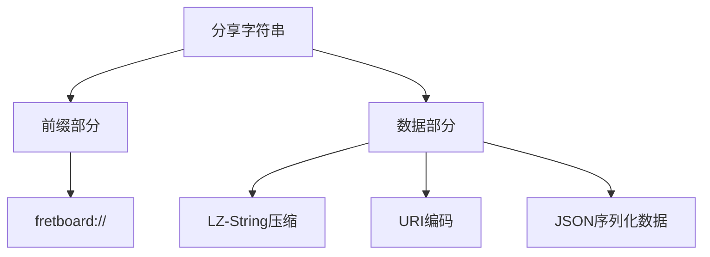

**Diagram sources **
- [fretboardShare.js](file://src/utils/fretboardShare.js#L4-L5)

### 数据结构

序列化的数据包含版本号和指板状态信息，确保未来扩展的兼容性。状态数据包括音符数据、品范围、升降号设置、显示模式、根音和可见性设置等。

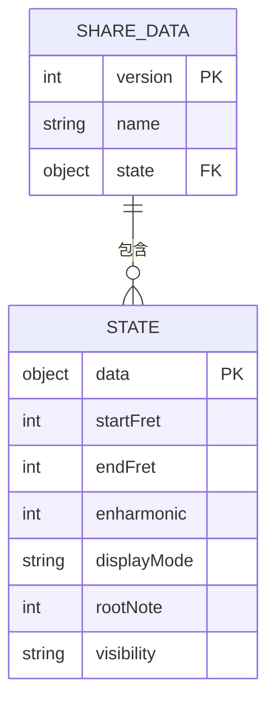

**Diagram sources **
- [fretboardShare.js](file://src/utils/fretboardShare.js#L19-L31)

## 序列化与反序列化流程

系统实现了完整的序列化和反序列化流程，确保数据在传输过程中的完整性和效率。

### 序列化流程

序列化流程将指板状态转换为可分享的字符串，包含四个主要步骤：构建数据对象、JSON序列化、LZ-String压缩和添加前缀。

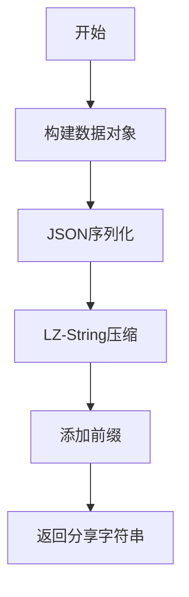

**Diagram sources **
- [fretboardShare.js](file://src/utils/fretboardShare.js#L33-L40)

### 反序列化流程

反序列化流程将分享字符串解析为指板状态，包含六个步骤：验证前缀、提取数据、解压缩、JSON解析、版本检查和数据验证。

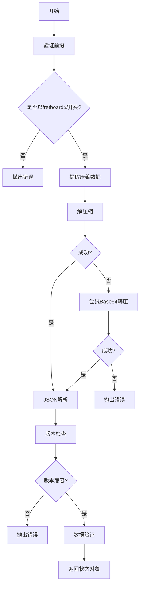

**Diagram sources **
- [fretboardShare.js](file://src/utils/fretboardShare.js#L58-L93)

## 剪贴板操作实现

系统实现了健壮的剪贴板操作功能，支持现代API和降级方案，确保在各种浏览器环境下的兼容性。

### 复制到剪贴板

复制功能优先使用现代的`navigator.clipboard.writeText()` API，如果不可用则降级到传统的`document.execCommand('copy')`方法。

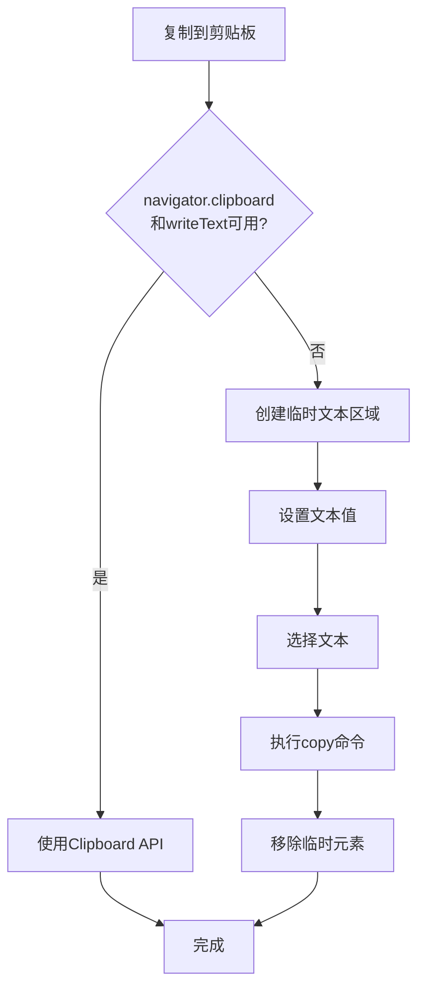

**Diagram sources **
- [fretboardShare.js](file://src/utils/fretboardShare.js#L115-L137)

### 从剪贴板读取

读取功能优先使用`navigator.clipboard.readText()` API，如果不可用则提示用户手动粘贴。

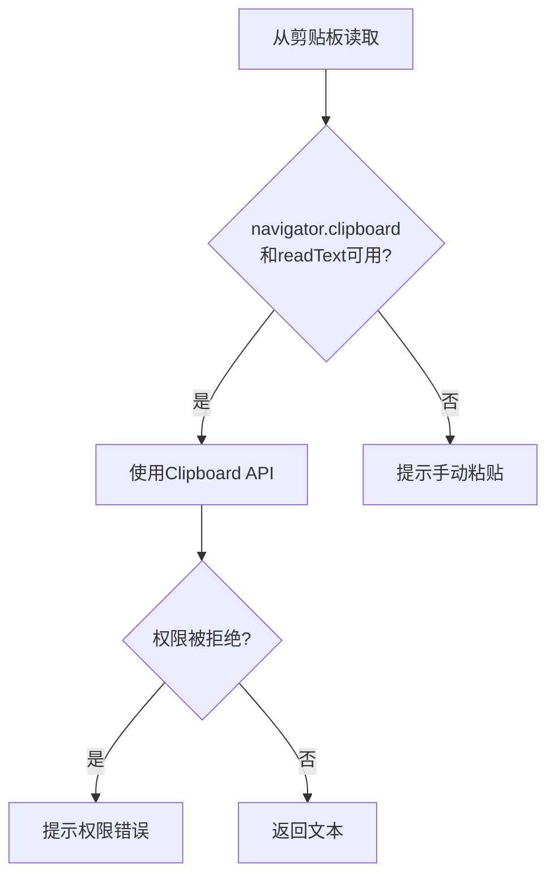

**Diagram sources **
- [fretboardShare.js](file://src/utils/fretboardShare.js#L151-L165)

## 版本兼容性处理

系统通过版本号机制处理数据格式的兼容性，确保当前版本与未来版本之间的平滑过渡。

### 版本检查

在反序列化过程中，系统会检查数据的版本号，只支持当前版本（版本1），不兼容的版本会抛出错误。

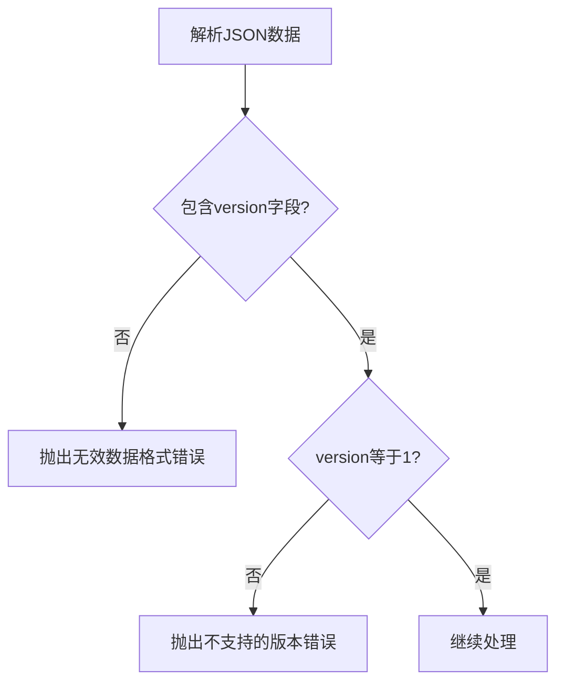

**Diagram sources **
- [fretboardShare.js](file://src/utils/fretboardShare.js#L85-L92)

## 错误处理策略

系统实现了全面的错误处理机制，确保用户能够获得清晰的反馈信息。

### 分享错误处理

分享功能在复制到剪贴板失败时会捕获错误并抛出带有描述信息的异常。

**Diagram sources **
- [fretboardShare.js](file://src/utils/fretboardShare.js#L139-L141)

### 导入错误处理

导入功能处理多种错误情况，包括空内容、格式错误、解压缩失败、版本不兼容和数据验证失败等。

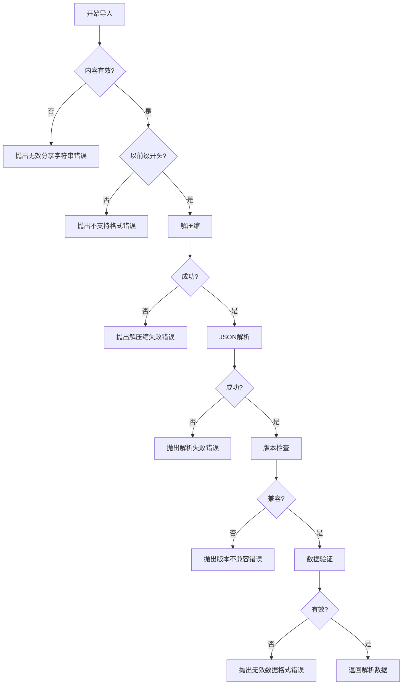

**Diagram sources **
- [fretboardShare.js](file://src/utils/fretboardShare.js#L54-L104)

## 历史状态持久化

系统使用localStorage在客户端持久化历史状态，确保用户数据在页面刷新后仍然可用。

### 状态保存

保存功能将当前指板状态保存到localStorage中的`fretboard-history`键下，最多保存50个状态。

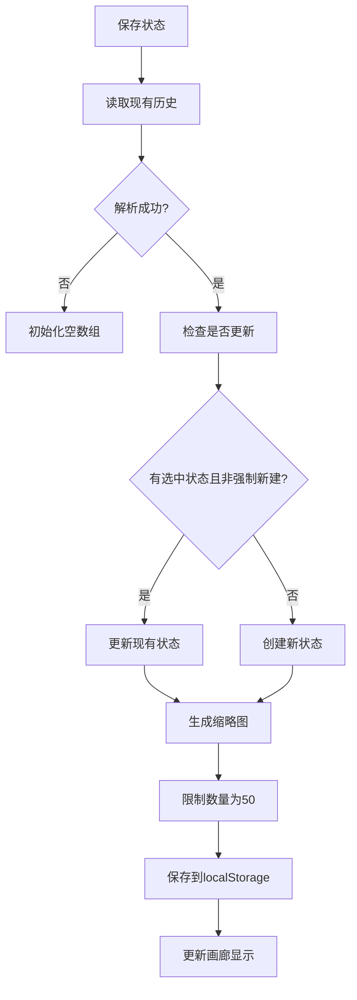

**Diagram sources **
- [fretboardHistory.js](file://src/utils/fretboardHistory.js#L57-L163)

### 状态恢复

恢复功能从保存的状态快照中恢复指板的所有设置和数据。

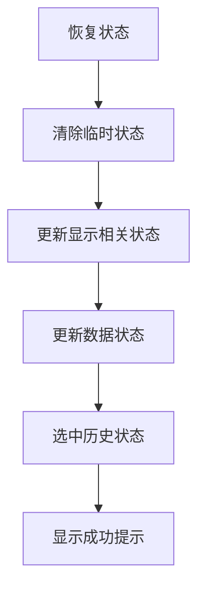

**Diagram sources **
- [fretboardHistory.js](file://src/utils/fretboardHistory.js#L284-L325)

## 导入功能实现

导入功能通过FretboardGallery组件实现，支持从剪贴板自动读取或手动输入分享字符串。

### 导入流程

导入流程包括读取剪贴板内容、处理导入结果和更新UI状态。

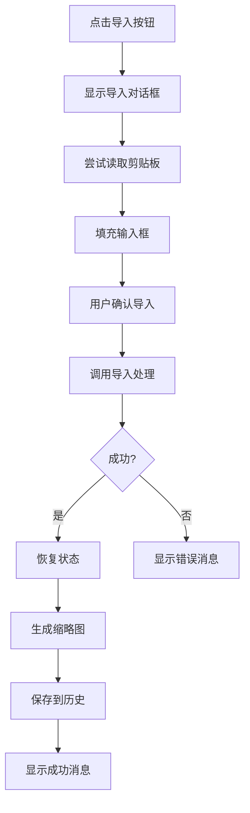

**Diagram sources **
- [FretboardGallery.jsx](file://src/components/FretboardGallery.jsx#L15-L72)

## 总结

本系统实现了完整的数据持久化和分享功能，支持离线工作场景。通过LZ-String压缩算法，系统能够将复杂的指板状态数据压缩为短字符串，便于通过剪贴板分享。系统采用`fretboard://`前缀标识分享字符串，确保格式的可识别性。

序列化流程包括JSON序列化、LZ-String压缩和URI编码，而反序列化流程则包含前缀验证、解压缩、JSON解析、版本检查和数据验证。剪贴板操作支持现代Clipboard API和传统`document.execCommand`方法，确保浏览器兼容性。

版本兼容性通过版本号机制处理，当前系统只支持版本1的数据格式。错误处理策略覆盖了分享失败、导入失败等各种情况，并通过Toast消息向用户反馈。历史状态在localStorage中持久化，最多保存50个状态，支持用户在不同会话间恢复工作进度。