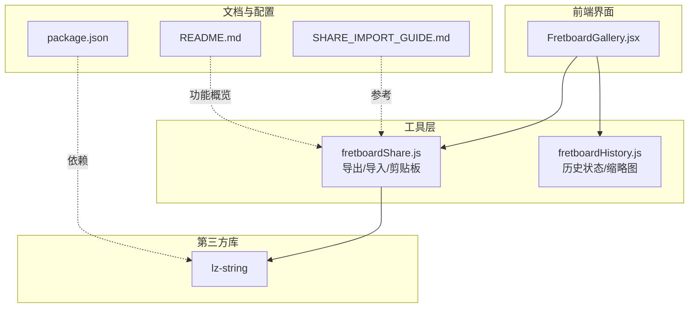
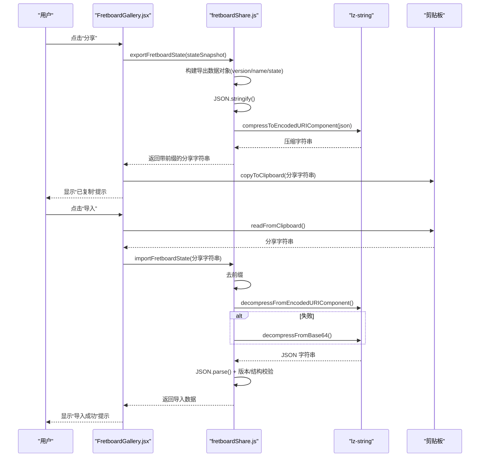
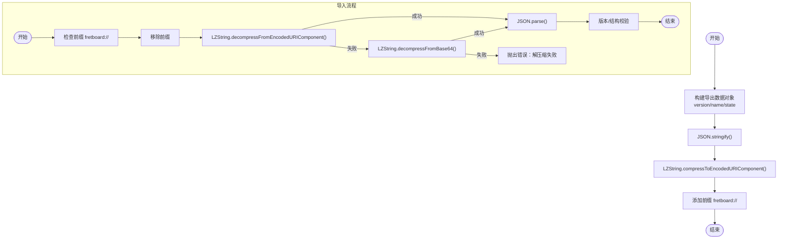
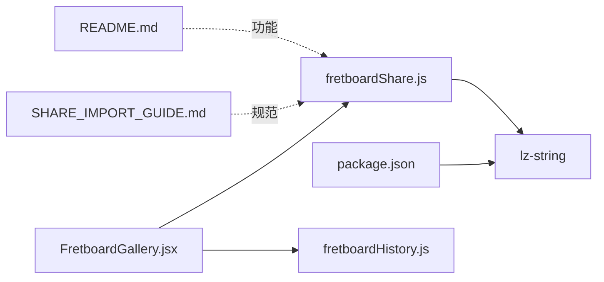

# 数据编码算法

<cite>
**本文引用的文件列表**
- [src/utils/fretboardShare.js](file://src/utils/fretboardShare.js)
- [SHARE_IMPORT_GUIDE.md](file://SHARE_IMPORT_GUIDE.md)
- [src/components/FretboardGallery.jsx](file://src/components/FretboardGallery.jsx)
- [src/utils/fretboardHistory.js](file://src/utils/fretboardHistory.js)
- [package.json](file://package.json)
- [README.md](file://README.md)
</cite>

## 目录
1. [简介](#简介)
2. [项目结构](#项目结构)
3. [核心组件](#核心组件)
4. [架构总览](#架构总览)
5. [详细组件分析](#详细组件分析)
6. [依赖关系分析](#依赖关系分析)
7. [性能考量](#性能考量)
8. [故障排查指南](#故障排查指南)
9. [结论](#结论)
10. [附录](#附录)

## 简介
本文件系统性文档化本项目中 LZ-String 压缩算法的应用，围绕“分享与导入”功能展开，解释为何选择 LZ-String 而非 Base64 或 gzip，以及其在 JavaScript 环境下的高效与轻量优势。文档详细拆解序列化三阶段流程：1) 构建包含 version、name 和 state 字段的导出数据对象；2) 使用 JSON.stringify 进行序列化；3) 应用 LZString.compressToEncodedURIComponent 进行压缩。同时对比 compressToEncodedURIComponent 与 compressToBase64 的输出差异，强调前者更适合 URL 传输的字符集特性。在反向解码流程中，文档阐述对损坏数据的容错处理机制，并结合 SHARE_IMPORT_GUIDE.md 的数据格式定义，给出实际 JSON 结构示例，最后分析典型指板状态经压缩后的大小变化。

## 项目结构
本项目采用 React + Vite 的前端架构，数据编码与分享导入的核心逻辑集中在 utils/fretboardShare.js 中，UI 层通过 FretboardGallery.jsx 触发导出与导入流程，历史状态持久化与缩略图生成在 fretboardHistory.js 中完成。LZ-String 作为依赖通过 package.json 引入。

**图表来源**
- [src/components/FretboardGallery.jsx](file://src/components/FretboardGallery.jsx#L1-L385)
- [src/utils/fretboardShare.js](file://src/utils/fretboardShare.js#L1-L171)
- [src/utils/fretboardHistory.js](file://src/utils/fretboardHistory.js#L1-L333)
- [package.json](file://package.json#L1-L19)
- [SHARE_IMPORT_GUIDE.md](file://SHARE_IMPORT_GUIDE.md#L1-L175)
- [README.md](file://README.md#L1-L203)

**章节来源**
- [src/components/FretboardGallery.jsx](file://src/components/FretboardGallery.jsx#L1-L385)
- [src/utils/fretboardShare.js](file://src/utils/fretboardShare.js#L1-L171)
- [src/utils/fretboardHistory.js](file://src/utils/fretboardHistory.js#L1-L333)
- [package.json](file://package.json#L1-L19)
- [SHARE_IMPORT_GUIDE.md](file://SHARE_IMPORT_GUIDE.md#L1-L175)
- [README.md](file://README.md#L1-L203)

## 核心组件
- 数据编码与分享导入工具：负责将指板状态序列化为可分享字符串，以及从分享字符串反序列化回状态对象。核心包括导出、导入、剪贴板读写等能力。
- 历史状态管理：负责生成缩略图、保存/恢复历史状态、限制历史数量等。
- UI 触发器：FretboardGallery.jsx 提供分享按钮、导入对话框等交互入口，统一调用分享导入工具。

**章节来源**
- [src/utils/fretboardShare.js](file://src/utils/fretboardShare.js#L1-L171)
- [src/utils/fretboardHistory.js](file://src/utils/fretboardHistory.js#L1-L333)
- [src/components/FretboardGallery.jsx](file://src/components/FretboardGallery.jsx#L1-L385)

## 架构总览
分享与导入的完整流程如下：用户在历史画廊中点击“分享”，前端调用导出函数，构建导出数据对象，序列化为 JSON 字符串，再使用 LZ-String 压缩为更短的 URI 编码字符串，并添加前缀。导入时，前端读取剪贴板或用户输入的字符串，移除前缀后优先使用 URI 编码解压，失败则回退到 Base64 解压，随后解析 JSON 并进行版本与数据结构校验。

**图表来源**
- [src/components/FretboardGallery.jsx](file://src/components/FretboardGallery.jsx#L159-L174)
- [src/utils/fretboardShare.js](file://src/utils/fretboardShare.js#L12-L105)
- [src/utils/fretboardShare.js](file://src/utils/fretboardShare.js#L112-L171)

## 详细组件分析

### 数据编码与分享导入工具（fretboardShare.js）
- 导出流程
  - 构建导出数据对象：包含 version、name（可选）、state（包含 data、startFret、endFret、enharmonic、displayMode、rootNote、visibility 等字段）。
  - JSON 序列化：使用标准 JSON.stringify。
  - LZ-String 压缩：使用 compressToEncodedURIComponent，生成更短、更适合 URL 传输的字符串。
  - 添加前缀：统一加上 fretboard:// 前缀，便于识别。
- 导入流程
  - 前缀校验：必须以 fretboard:// 开头。
  - 去前缀与解压：优先使用 decompressFromEncodedURIComponent，失败则回退到 decompressFromBase64（向后兼容）。
  - JSON 解析与校验：校验 version 与 state 结构，检查数值类型与必要字段。
  - 错误处理：捕获异常并抛出明确错误信息，便于 UI 层提示。
- 剪贴板能力
  - 复制：优先使用 navigator.clipboard.writeText，降级到 execCommand('copy')。
  - 读取：优先使用 navigator.clipboard.readText，降级到提示用户手动粘贴，并对权限错误给出明确提示。

**图表来源**
- [src/utils/fretboardShare.js](file://src/utils/fretboardShare.js#L12-L105)

**章节来源**
- [src/utils/fretboardShare.js](file://src/utils/fretboardShare.js#L1-L171)

### 历史状态管理（fretboardHistory.js）
- 生成缩略图：克隆 SVG、内联样式、设置较小尺寸，序列化为 data URL，便于画廊展示。
- 保存状态：将当前状态快照写入 localStorage，限制最大数量为 50，支持更新与新建。
- 恢复状态：从保存的历史快照中恢复数据与显示参数，使用深拷贝避免引用问题。

**章节来源**
- [src/utils/fretboardHistory.js](file://src/utils/fretboardHistory.js#L1-L333)

### UI 触发器（FretboardGallery.jsx）
- 分享：调用 exportFretboardState 生成分享字符串，再通过 copyToClipboard 写入剪贴板。
- 导入：提供对话框，支持从剪贴板自动填充或手动输入，调用 importFretboardState 解析并回调结果。
- 事件处理：点击缩略图恢复状态，删除、清空、重命名等操作。

**章节来源**
- [src/components/FretboardGallery.jsx](file://src/components/FretboardGallery.jsx#L1-L385)

### 数据格式与序列化规范（SHARE_IMPORT_GUIDE.md）
- 分享字符串格式：fretboard://<压缩后的URI编码字符串>。
- 导出数据结构：version（版本号）、name（可选）、state（包含 data、startFret、endFret、enharmonic、displayMode、rootNote、visibility）。
- 序列化流程：构建对象 → JSON.stringify → LZ-String 压缩 → 添加前缀。
- 反序列化流程：前缀校验 → 去前缀 → 解压（URI 编码优先，失败回退 Base64）→ JSON.parse → 版本/结构校验。

**章节来源**
- [SHARE_IMPORT_GUIDE.md](file://SHARE_IMPORT_GUIDE.md#L29-L86)

## 依赖关系分析
- 外部依赖：lz-string 通过 package.json 引入，用于数据压缩与解压。
- 内部依赖：FretboardGallery.jsx 依赖 fretboardShare.js 进行导出/导入，依赖 fretboardHistory.js 进行历史状态管理。
- 文档与配置：SHARE_IMPORT_GUIDE.md 与 README.md 提供使用说明与技术细节。

**图表来源**
- [package.json](file://package.json#L1-L19)
- [src/components/FretboardGallery.jsx](file://src/components/FretboardGallery.jsx#L1-L385)
- [src/utils/fretboardShare.js](file://src/utils/fretboardShare.js#L1-L171)
- [src/utils/fretboardHistory.js](file://src/utils/fretboardHistory.js#L1-L333)
- [SHARE_IMPORT_GUIDE.md](file://SHARE_IMPORT_GUIDE.md#L1-L175)
- [README.md](file://README.md#L1-L203)

**章节来源**
- [package.json](file://package.json#L1-L19)
- [src/components/FretboardGallery.jsx](file://src/components/FretboardGallery.jsx#L1-L385)
- [src/utils/fretboardShare.js](file://src/utils/fretboardShare.js#L1-L171)
- [src/utils/fretboardHistory.js](file://src/utils/fretboardHistory.js#L1-L333)
- [SHARE_IMPORT_GUIDE.md](file://SHARE_IMPORT_GUIDE.md#L1-L175)
- [README.md](file://README.md#L1-L203)

## 性能考量
- 压缩率与传输效率
  - LZ-String 相比纯 Base64 可显著降低字符串长度（通常减少 50-70%），更适合在聊天、邮件等场景分享。
  - compressToEncodedURIComponent 输出字符集更窄、更短，适合 URL 传输；compressToBase64 输出更长，但兼容性更好。
- 压缩与解压开销
  - 压缩与解压均为 O(n) 级别，n 为 JSON 字符串长度。对于典型指板状态（包含音符与连线数据），单次操作耗时极低，用户体验流畅。
- 历史状态存储
  - localStorage 中保存历史状态数组，限制最大数量为 50，避免无限增长导致性能下降。
- 剪贴板 API 兼容性
  - 优先使用现代 Clipboard API，失败时降级到传统方法，保证在多种环境下可用。

[本节为通用性能讨论，不直接分析具体文件，故不列出章节来源]

## 故障排查指南
- 分享失败
  - 现象：点击“分享”后未复制到剪贴板。
  - 排查：确认浏览器支持 Clipboard API；若不支持，需手动复制分享字符串；检查 HTTPS 环境与权限。
- 导入失败
  - 现象：导入字符串无效或解压失败。
  - 排查：检查字符串是否以 fretboard:// 开头；确认字符串未被篡改或截断；若为旧版本字符串，尝试使用 Base64 解压；查看版本号是否与当前版本一致。
- 数据损坏
  - 现象：导入时报错“数据已损坏”或“无效的数据格式”。
  - 排查：确认分享字符串完整；避免手动编辑；建议通过可靠渠道分享（直接复制粘贴）。
- 浏览器权限
  - 现象：读取剪贴板被拒绝。
  - 排查：确保使用 HTTPS；检查浏览器权限设置；必要时允许剪贴板访问。

**章节来源**
- [src/utils/fretboardShare.js](file://src/utils/fretboardShare.js#L41-L44)
- [src/utils/fretboardShare.js](file://src/utils/fretboardShare.js#L52-L105)
- [src/utils/fretboardShare.js](file://src/utils/fretboardShare.js#L112-L171)
- [src/components/FretboardGallery.jsx](file://src/components/FretboardGallery.jsx#L15-L40)

## 结论
本项目在“分享与导入”功能中采用 LZ-String 压缩算法，结合 JSON 序列化与 URI 编码，实现了高效、轻量、易分享的数据传输方案。通过严格的版本与结构校验、前缀识别与回退机制，系统具备良好的容错能力。配合历史状态管理与剪贴板 API 的兼容性设计，用户可在不同浏览器与网络环境下顺畅使用分享与导入功能。

[本节为总结性内容，不直接分析具体文件，故不列出章节来源]

## 附录

### 实际 JSON 结构示例（来自 SHARE_IMPORT_GUIDE.md）
- 导出数据对象包含 version、name（可选）、state（包含 data、startFret、endFret、enharmonic、displayMode、rootNote、visibility）。
- 导入时需校验 version 与 state 结构，确保数值类型与必要字段存在。

**章节来源**
- [SHARE_IMPORT_GUIDE.md](file://SHARE_IMPORT_GUIDE.md#L52-L69)

### 压缩输出差异对比
- compressToEncodedURIComponent：输出更短、字符集更窄，适合 URL 传输。
- compressToBase64：输出更长，但兼容性更好，作为回退方案使用。

**章节来源**
- [src/utils/fretboardShare.js](file://src/utils/fretboardShare.js#L36-L37)
- [src/utils/fretboardShare.js](file://src/utils/fretboardShare.js#L70-L75)
- [SHARE_IMPORT_GUIDE.md](file://SHARE_IMPORT_GUIDE.md#L31-L39)

### 典型指板状态压缩大小变化
- 复杂指板状态（包含大量音符与连线）生成的 JSON 字符串较长，但经 LZ-String 压缩后通常仍可控制在合理范围内，满足分享场景需求。

**章节来源**
- [SHARE_IMPORT_GUIDE.md](file://SHARE_IMPORT_GUIDE.md#L154-L157)