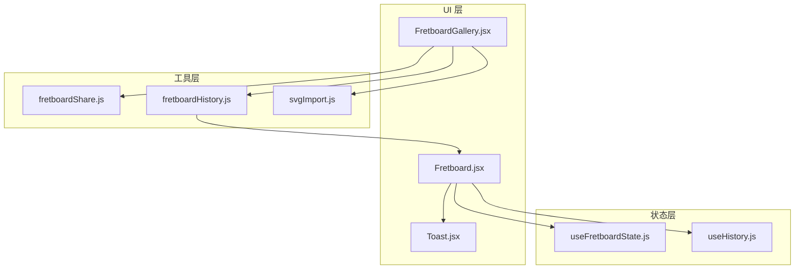
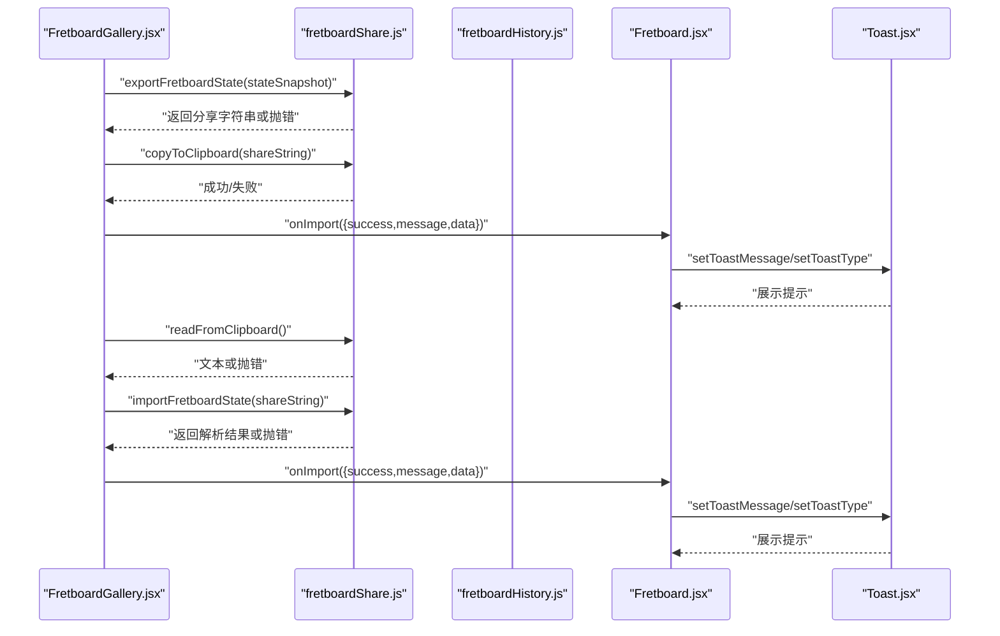
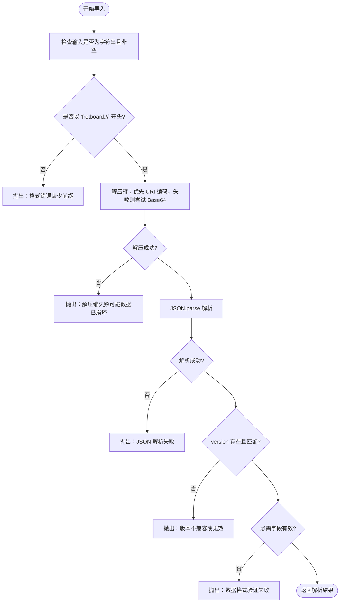
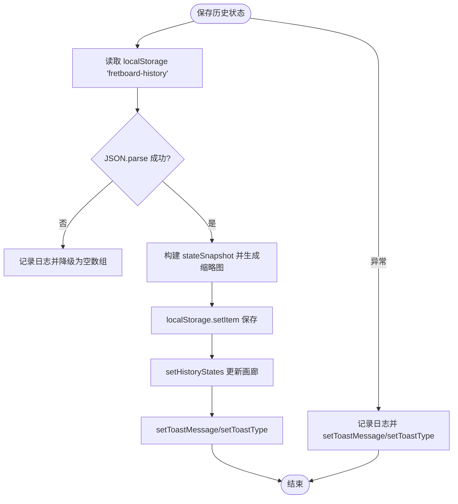
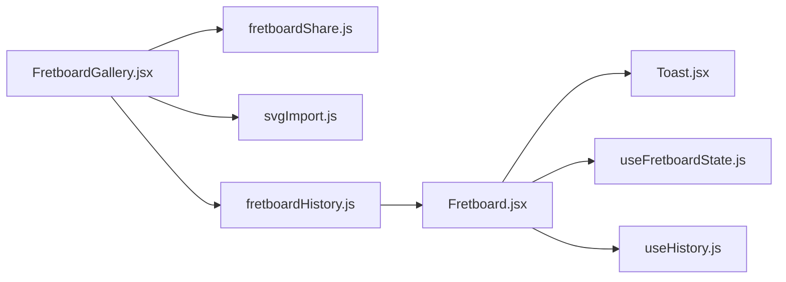

# 错误处理

<cite>
**本文引用的文件**
- [fretboardShare.js](file://src/utils/fretboardShare.js)
- [fretboardHistory.js](file://src/utils/fretboardHistory.js)
- [SHARE_IMPORT_GUIDE.md](file://SHARE_IMPORT_GUIDE.md)
- [Fretboard.jsx](file://src/Fretboard.jsx)
- [FretboardGallery.jsx](file://src/components/FretboardGallery.jsx)
- [Toast.jsx](file://src/components/Toast.jsx)
- [useFretboardState.js](file://src/hooks/useFretboardState.js)
- [useHistory.js](file://src/hooks/useHistory.js)
- [svgImport.js](file://src/utils/svgImport.js)
</cite>

## 目录
1. [简介](#简介)
2. [项目结构](#项目结构)
3. [核心组件](#核心组件)
4. [架构总览](#架构总览)
5. [详细组件分析](#详细组件分析)
6. [依赖关系分析](#依赖关系分析)
7. [性能考量](#性能考量)
8. [故障排查指南](#故障排查指南)
9. [结论](#结论)

## 简介
本文件系统化梳理数据持久化与分享功能中的错误处理策略，重点覆盖以下方面：
- 导出失败的可能原因（如无效状态数据）
- 导入失败的多种情形（无效字符串、缺少前缀、解压缩失败、版本不兼容、数据格式校验失败等）
- readFromClipboard 对 NotAllowedError 和 SecurityError 等特定异常的精细化处理及 HTTPS 权限指导
- fretboardHistory.js 中 saveFretboardState 对 localStorage 解析失败的异常捕获与降级处理
- 统一通过 setToastMessage 与 setToastType 反馈用户提示，并结合 SHARE_IMPORT_GUIDE.md 的错误分类
- 错误日志记录（console.error）对调试的支持作用

## 项目结构
围绕“分享/导入”与“历史状态持久化”的关键模块如下：
- utils/fretboardShare.js：导出/导入、剪贴板读写、前缀与版本校验
- utils/fretboardHistory.js：历史状态保存/恢复、缩略图生成、localStorage 解析与降级
- components/FretboardGallery.jsx：导入/导出入口、错误回传与统一提示
- Fretboard.jsx：全局状态与 Toast 展示
- hooks/useFretboardState.js：全局状态钩子，负责 toastMessage/toastType
- hooks/useHistory.js：应用内撤销/重做历史，内部也有 JSON 解析错误处理
- utils/svgImport.js：从 SVG 导入状态，包含输入校验与解析错误
- SHARE_IMPORT_GUIDE.md：错误分类与用户指引

图表来源
- [FretboardGallery.jsx](file://src/components/FretboardGallery.jsx#L1-L385)
- [fretboardShare.js](file://src/utils/fretboardShare.js#L1-L171)
- [fretboardHistory.js](file://src/utils/fretboardHistory.js#L1-L333)
- [Fretboard.jsx](file://src/Fretboard.jsx#L1-L811)
- [Toast.jsx](file://src/components/Toast.jsx#L1-L61)
- [useFretboardState.js](file://src/hooks/useFretboardState.js#L1-L190)
- [useHistory.js](file://src/hooks/useHistory.js#L1-L109)
- [svgImport.js](file://src/utils/svgImport.js#L1-L800)

章节来源
- [FretboardGallery.jsx](file://src/components/FretboardGallery.jsx#L1-L385)
- [fretboardShare.js](file://src/utils/fretboardShare.js#L1-L171)
- [fretboardHistory.js](file://src/utils/fretboardHistory.js#L1-L333)
- [Fretboard.jsx](file://src/Fretboard.jsx#L1-L811)
- [Toast.jsx](file://src/components/Toast.jsx#L1-L61)
- [useFretboardState.js](file://src/hooks/useFretboardState.js#L1-L190)
- [useHistory.js](file://src/hooks/useHistory.js#L1-L109)
- [svgImport.js](file://src/utils/svgImport.js#L1-L800)

## 核心组件
- 分享/导入工具（fretboardShare.js）
  - exportFretboardState：构建导出数据对象、序列化、压缩、加前缀；异常统一包装并记录日志
  - importFretboardState：校验字符串、前缀、解压（URI编码/Base64）、JSON解析、版本与结构校验
  - copyToClipboard/readFromClipboard：现代 Clipboard API 优先，失败时降级或提示
- 历史状态工具（fretboardHistory.js）
  - saveFretboardState：从 localStorage 读取历史并解析，异常时降级为空数组；保存成功后统一 setToastMessage/setToastType
  - restoreFretboardState：深拷贝恢复，异常时统一 setToastMessage/setToastType
  - generateThumbnail：SVG 缩略图生成，异常时记录日志并返回 null
- UI 与交互（FretboardGallery.jsx、Fretboard.jsx）
  - 导入/导出入口，统一通过 onImport 回调传递结果，错误时 setToastMessage/setToastType
  - Toast.jsx 展示提示，区分成功与错误类型
- 状态管理（useFretboardState.js、useHistory.js）
  - useFretboardState：维护 toastMessage/toastType，页面刷新/恢复时 JSON 解析异常降级
  - useHistory：撤销/重做时 JSON 解析异常记录日志

章节来源
- [fretboardShare.js](file://src/utils/fretboardShare.js#L11-L171)
- [fretboardHistory.js](file://src/utils/fretboardHistory.js#L38-L173)
- [FretboardGallery.jsx](file://src/components/FretboardGallery.jsx#L15-L174)
- [Fretboard.jsx](file://src/Fretboard.jsx#L800-L805)
- [Toast.jsx](file://src/components/Toast.jsx#L4-L61)
- [useFretboardState.js](file://src/hooks/useFretboardState.js#L35-L148)
- [useHistory.js](file://src/hooks/useHistory.js#L35-L83)

## 架构总览
下图展示了“分享/导入”与“历史状态持久化”的关键调用链与错误处理节点。

图表来源
- [FretboardGallery.jsx](file://src/components/FretboardGallery.jsx#L15-L174)
- [fretboardShare.js](file://src/utils/fretboardShare.js#L112-L171)
- [Fretboard.jsx](file://src/Fretboard.jsx#L700-L797)
- [Toast.jsx](file://src/components/Toast.jsx#L4-L61)

## 详细组件分析

### 分享/导入工具（fretboardShare.js）
- 导出失败的可能原因
  - 状态快照缺失或结构不合法（stateSnapshot 或 state 不存在）
  - JSON 序列化失败（极少见，由 stringify 触发）
  - LZ-String 压缩异常（极少见）
  - 统一包装为错误并记录日志，便于定位
- 导入失败的常见情形
  - 输入非字符串或为空
  - 缺少前缀 fretboard://
  - 解压缩失败（URI编码/Base64均失败）
  - JSON 解析失败
  - 数据结构缺失 version/state
  - 版本不兼容（CURRENT_VERSION 不匹配）
  - 品范围字段类型非法
  - 统一抛出原始错误，调用方负责提示
- 剪贴板读取的精细化处理
  - readFromClipboard 对 NotAllowedError/SecurityError 进行特判，给出 HTTPS 与权限提示
  - 若浏览器不支持 Clipboard API，提示用户手动粘贴
  - copyToClipboard 支持现代 API 与 execCommand 降级，异常统一包装并记录日志

图表来源
- [fretboardShare.js](file://src/utils/fretboardShare.js#L52-L105)

章节来源
- [fretboardShare.js](file://src/utils/fretboardShare.js#L11-L171)
- [SHARE_IMPORT_GUIDE.md](file://SHARE_IMPORT_GUIDE.md#L107-L121)

### 历史状态工具（fretboardHistory.js）
- saveFretboardState 的异常捕获与降级
  - 从 localStorage 读取历史并 JSON.parse，失败时记录日志并降级为空数组
  - 保存成功后统一 setToastMessage/setToastType，失败时记录日志并 setToastMessage/setToastType
  - 生成缩略图失败时记录日志并忽略缩略图
- restoreFretboardState 的异常捕获
  - 深拷贝恢复，异常时记录日志并 setToastMessage/setToastType
- generateThumbnail 的异常捕获
  - 生成缩略图失败时记录日志并返回 null

图表来源
- [fretboardHistory.js](file://src/utils/fretboardHistory.js#L38-L173)

章节来源
- [fretboardHistory.js](file://src/utils/fretboardHistory.js#L38-L173)

### UI 与交互（FretboardGallery.jsx、Fretboard.jsx、Toast.jsx）
- FretboardGallery.jsx
  - 导出：调用 exportFretboardState 与 copyToClipboard，异常时通过 onImport 回调统一 setToastMessage/setToastType
  - 导入：优先 readFromClipboard 自动填充，processImport 统一处理 importFretboardState 与 svgImport 的结果，异常时通过 onImport 回调统一提示
- Fretboard.jsx
  - 通过 useFretboardState 注入 toastMessage/toastType，Toast.jsx 根据类型展示
  - 导入流程中，onImport 回调统一处理消息与状态恢复
- Toast.jsx
  - 根据类型（info/success/error）展示不同提示，支持定时关闭

图表来源
- [FretboardGallery.jsx](file://src/components/FretboardGallery.jsx#L15-L174)
- [Fretboard.jsx](file://src/Fretboard.jsx#L700-L797)
- [Toast.jsx](file://src/components/Toast.jsx#L4-L61)

章节来源
- [FretboardGallery.jsx](file://src/components/FretboardGallery.jsx#L15-L174)
- [Fretboard.jsx](file://src/Fretboard.jsx#L700-L797)
- [Toast.jsx](file://src/components/Toast.jsx#L4-L61)

### 状态管理与应用内历史（useFretboardState.js、useHistory.js）
- useFretboardState
  - 页面初始化与恢复当前状态时，JSON.parse 失败记录日志并降级
  - 加载历史状态时，JSON.parse 失败记录日志
- useHistory
  - 撤销/重做时 JSON.parse 失败记录日志

章节来源
- [useFretboardState.js](file://src/hooks/useFretboardState.js#L35-L148)
- [useHistory.js](file://src/hooks/useHistory.js#L35-L83)

### 从 SVG 导入（svgImport.js）
- 输入校验与错误处理
  - 无效输入类型或空内容
  - 非 SVG 文档
  - 无法解析连线端点或路径坐标
  - 统一抛出错误，供调用方处理

章节来源
- [svgImport.js](file://src/utils/svgImport.js#L139-L800)

## 依赖关系分析
- FretboardGallery.jsx 依赖 fretboardShare.js 与 svgImport.js 实现分享/导入
- Fretboard.jsx 依赖 FretboardGallery.jsx 的 onImport 回调与 useFretboardState 的 toast 状态
- fretboardHistory.js 与 Fretboard.jsx 之间通过 setHistoryStates 与 setToastMessage/setToastType 进行状态同步
- useFretboardState.js 与 useHistory.js 为全局状态提供基础能力

图表来源
- [FretboardGallery.jsx](file://src/components/FretboardGallery.jsx#L1-L385)
- [fretboardShare.js](file://src/utils/fretboardShare.js#L1-L171)
- [fretboardHistory.js](file://src/utils/fretboardHistory.js#L1-L333)
- [Fretboard.jsx](file://src/Fretboard.jsx#L1-L811)
- [Toast.jsx](file://src/components/Toast.jsx#L1-L61)
- [useFretboardState.js](file://src/hooks/useFretboardState.js#L1-L190)
- [useHistory.js](file://src/hooks/useHistory.js#L1-L109)

章节来源
- [FretboardGallery.jsx](file://src/components/FretboardGallery.jsx#L1-L385)
- [fretboardShare.js](file://src/utils/fretboardShare.js#L1-L171)
- [fretboardHistory.js](file://src/utils/fretboardHistory.js#L1-L333)
- [Fretboard.jsx](file://src/Fretboard.jsx#L1-L811)
- [Toast.jsx](file://src/components/Toast.jsx#L1-L61)
- [useFretboardState.js](file://src/hooks/useFretboardState.js#L1-L190)
- [useHistory.js](file://src/hooks/useHistory.js#L1-L109)

## 性能考量
- 导出/导入采用 LZ-String 压缩，显著降低字符串长度，提升分享体验
- 保存历史状态时限制数组长度为 50，避免 localStorage 膨胀
- 生成缩略图时克隆 SVG 并设置固定尺寸，避免影响主画布渲染
- 导入流程中对剪贴板读取采用异步与降级策略，避免阻塞 UI

[本节为通用性能讨论，不直接分析具体文件]

## 故障排查指南
- 导出失败
  - 现象：导出时报错或无法复制到剪贴板
  - 排查要点：确认传入的状态快照结构合法；查看浏览器控制台日志
  - 参考来源：[fretboardShare.js](file://src/utils/fretboardShare.js#L12-L45)
- 导入失败（字符串）
  - 现象：导入字符串报错
  - 可能原因：缺少前缀、解压缩失败、JSON 解析失败、版本不兼容、数据格式校验失败
  - 参考来源：[fretboardShare.js](file://src/utils/fretboardShare.js#L52-L105)，[SHARE_IMPORT_GUIDE.md](file://SHARE_IMPORT_GUIDE.md#L107-L121)
- 导入失败（SVG）
  - 现象：SVG 导入报错
  - 可能原因：文件非 SVG、无法解析连线端点、路径坐标缺失
  - 参考来源：[svgImport.js](file://src/utils/svgImport.js#L139-L800)
- 剪贴板读取权限问题
  - 现象：readFromClipboard 抛出 NotAllowedError/SecurityError
  - 处理：提示用户使用 HTTPS 并授予剪贴板权限；若浏览器不支持，引导手动粘贴
  - 参考来源：[fretboardShare.js](file://src/utils/fretboardShare.js#L148-L170)
- 历史状态保存失败
  - 现象：保存历史状态失败或无提示
  - 处理：检查 localStorage 是否可用；查看日志；确认状态结构合法
  - 参考来源：[fretboardHistory.js](file://src/utils/fretboardHistory.js#L38-L173)
- 应用内历史恢复失败
  - 现象：撤销/重做时报错
  - 处理：查看日志；确认历史记录 JSON 结构有效
  - 参考来源：[useHistory.js](file://src/hooks/useHistory.js#L35-L83)

章节来源
- [fretboardShare.js](file://src/utils/fretboardShare.js#L12-L171)
- [SHARE_IMPORT_GUIDE.md](file://SHARE_IMPORT_GUIDE.md#L107-L121)
- [svgImport.js](file://src/utils/svgImport.js#L139-L800)
- [fretboardHistory.js](file://src/utils/fretboardHistory.js#L38-L173)
- [useHistory.js](file://src/hooks/useHistory.js#L35-L83)

## 结论
本项目在“分享/导入”与“历史状态持久化”两条主线中，建立了完善的错误处理与用户反馈体系：
- 明确的错误分类与异常抛出，便于前端统一处理
- 对剪贴板权限与浏览器兼容性进行精细化处理，并提供清晰的用户指导
- 对 localStorage 解析失败进行降级处理，保证功能可用性
- 通过 setToastMessage 与 setToastType 统一反馈，结合 SHARE_IMPORT_GUIDE.md 的错误分类，帮助用户快速定位问题并采取相应措施
- console.error 的广泛使用为调试提供了可靠依据