# FretboardGallery组件

<cite>
**本文档引用的文件**
- [FretboardGallery.jsx](file://src/components/FretboardGallery.jsx)
- [FretboardGallery.css](file://src/components/FretboardGallery.css)
- [fretboardHistory.js](file://src/utils/fretboardHistory.js)
- [fretboardShare.js](file://src/utils/fretboardShare.js)
- [svgImport.js](file://src/utils/svgImport.js)
- [useHistory.js](file://src/hooks/useHistory.js)
- [useFretboardState.js](file://src/hooks/useFretboardState.js)
- [Fretboard.jsx](file://src/Fretboard.jsx)
- [Toast.jsx](file://src/components/Toast.jsx)
- [utils.js](file://src/utils.js)
</cite>

## 目录
1. [简介](#简介)
2. [项目结构](#项目结构)
3. [核心组件](#核心组件)
4. [架构概览](#架构概览)
5. [详细组件分析](#详细组件分析)
6. [依赖关系分析](#依赖关系分析)
7. [性能考量](#性能考量)
8. [故障排除指南](#故障排除指南)
9. [结论](#结论)

## 简介
FretboardGallery是一个专门设计的历史状态管理和分享中心组件，为指板编辑器提供完整的历史记录管理功能。该组件不仅管理用户的历史状态，还提供了强大的导入导出能力，支持多种数据格式的互操作性。

## 项目结构
FretboardGallery组件位于src/components目录下，与相关的工具函数和样式文件共同构成了完整的状态管理生态系统。

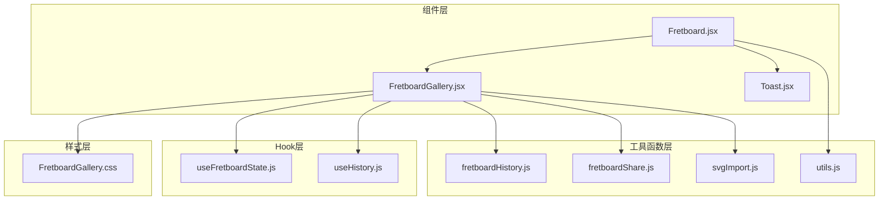

**图表来源**
- [FretboardGallery.jsx](file://src/components/FretboardGallery.jsx#L1-L385)
- [Fretboard.jsx](file://src/Fretboard.jsx#L635-L798)
- [fretboardHistory.js](file://src/utils/fretboardHistory.js#L1-L333)

## 核心组件
FretboardGallery组件提供了以下核心功能：

### 历史状态管理
- **状态列表展示**：实时显示用户保存的历史状态
- **选中状态高亮**：通过视觉反馈标识当前选中的历史状态
- **空状态提示**：当没有历史记录时提供友好的引导界面

### 缩略图网格渲染
- **响应式布局**：自适应不同屏幕尺寸的网格布局
- **交互式缩略图**：支持点击恢复、悬停效果和删除操作
- **动态内容更新**：实时反映指板状态的变化

### 导入功能
- **分享字符串导入**：支持从分享字符串恢复状态
- **SVG文件导入**：支持从SVG文件中解析和恢复状态
- **智能格式检测**：自动识别和处理不同格式的数据

### 重命名功能
- **双击编辑模式**：通过双击激活编辑状态
- **键盘快捷键**：支持Enter确认和Esc取消
- **即时验证**：确保重命名的有效性和唯一性

**章节来源**
- [FretboardGallery.jsx](file://src/components/FretboardGallery.jsx#L7-L385)
- [FretboardGallery.css](file://src/components/FretboardGallery.css#L1-L387)

## 架构概览
FretboardGallery采用模块化设计，与主应用Fretboard紧密集成，形成完整的状态管理生态系统。

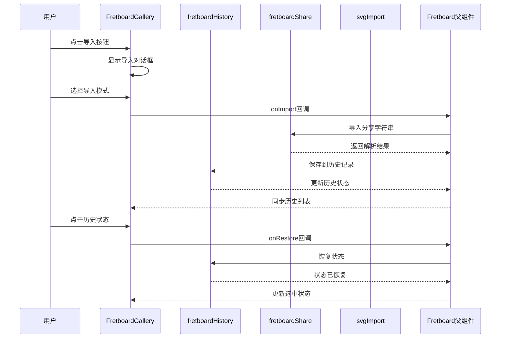

**图表来源**
- [FretboardGallery.jsx](file://src/components/FretboardGallery.jsx#L15-L87)
- [Fretboard.jsx](file://src/Fretboard.jsx#L700-L797)
- [fretboardHistory.js](file://src/utils/fretboardHistory.js#L38-L173)

## 详细组件分析

### 组件结构与状态管理

FretboardGallery组件采用React函数式组件设计，通过useState和useRef管理内部状态：

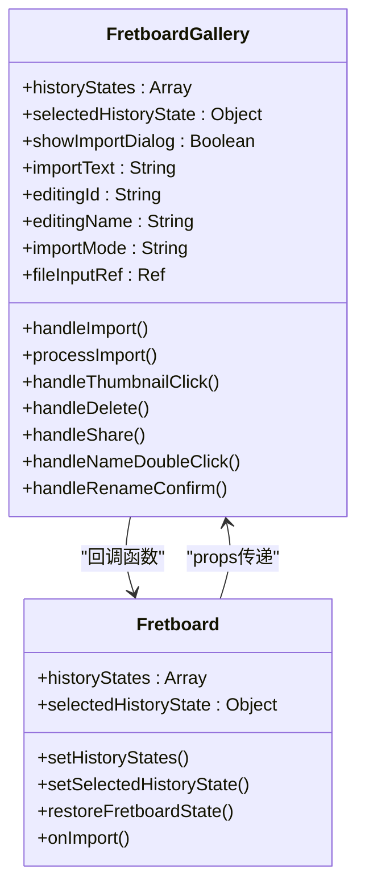

**图表来源**
- [FretboardGallery.jsx](file://src/components/FretboardGallery.jsx#L7-L13)
- [Fretboard.jsx](file://src/Fretboard.jsx#L635-L798)

### 历史状态列表展示机制

组件通过条件渲染实现智能的空状态处理：

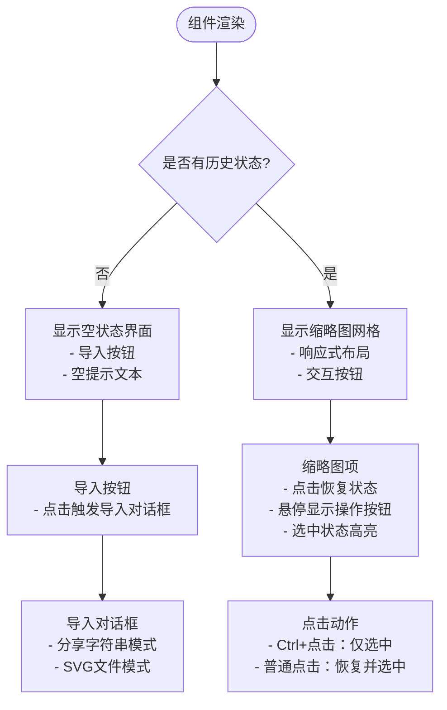

**图表来源**
- [FretboardGallery.jsx](file://src/components/FretboardGallery.jsx#L118-L138)
- [FretboardGallery.jsx](file://src/components/FretboardGallery.jsx#L241-L304)

### 缩略图网格渲染逻辑

缩略图网格采用CSS Grid布局，支持响应式设计：

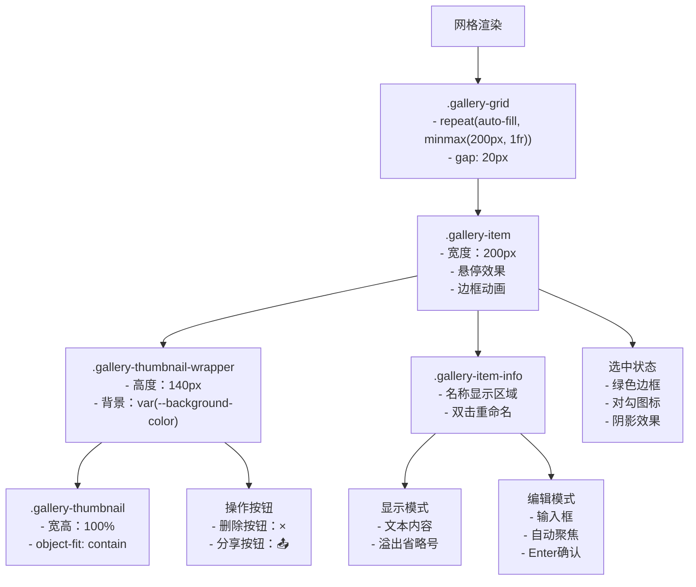

**图表来源**
- [FretboardGallery.css](file://src/components/FretboardGallery.css#L95-L144)
- [FretboardGallery.jsx](file://src/components/FretboardGallery.jsx#L244-L301)

### 导入功能实现

FretboardGallery支持两种导入模式，提供灵活的数据恢复方式：

#### 分享字符串导入模式

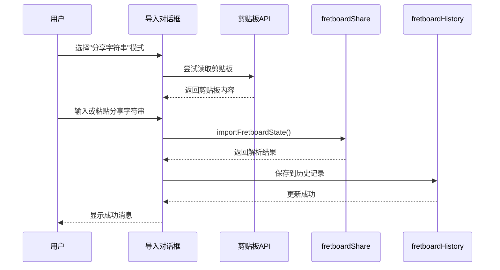

**图表来源**
- [FretboardGallery.jsx](file://src/components/FretboardGallery.jsx#L15-L40)
- [fretboardShare.js](file://src/utils/fretboardShare.js#L52-L105)

#### SVG文件导入模式

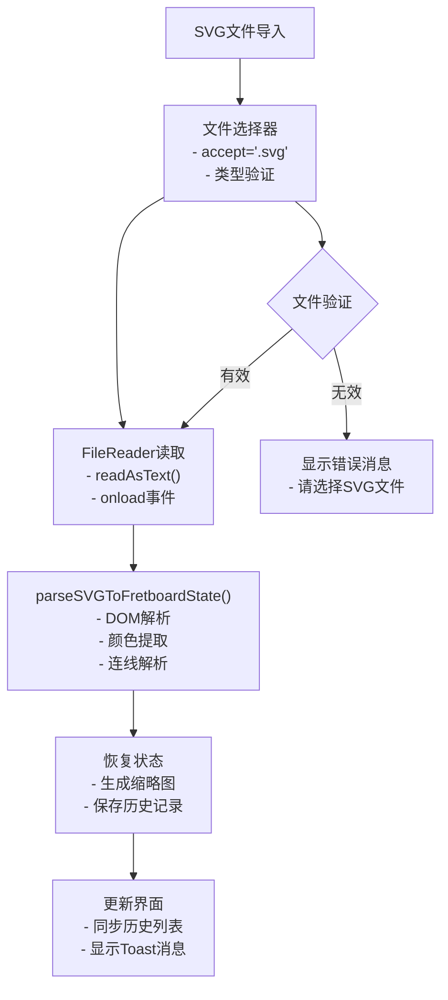

**图表来源**
- [FretboardGallery.jsx](file://src/components/FretboardGallery.jsx#L98-L116)
- [svgImport.js](file://src/utils/svgImport.js#L139-L149)

### 重命名功能实现

重命名功能采用双击触发的编辑模式，提供流畅的用户体验：

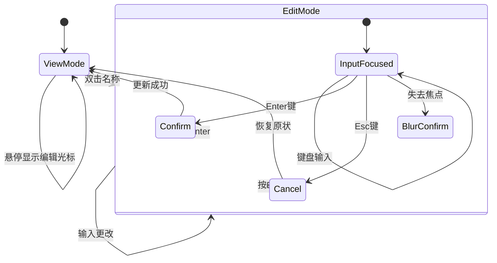

**图表来源**
- [FretboardGallery.jsx](file://src/components/FretboardGallery.jsx#L176-L208)

### Portal渲染技术应用

导入对话框采用ReactDOM.createPortal技术，在DOM顶层渲染，确保对话框不会受到父容器的样式影响：

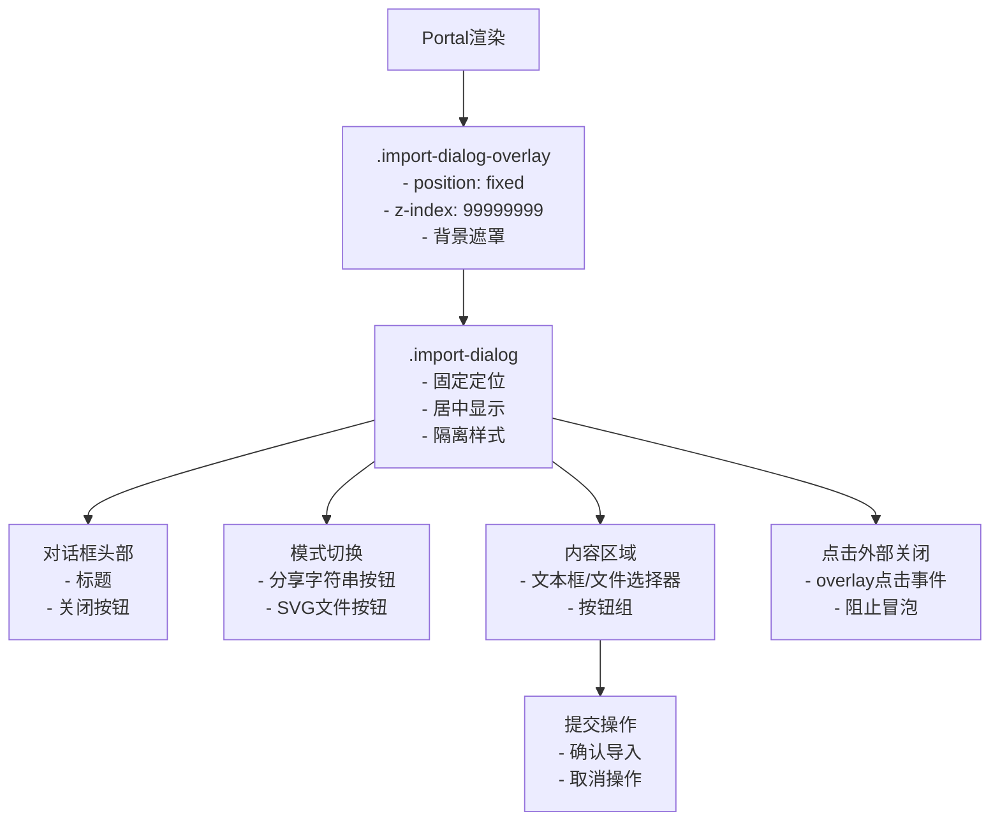

**图表来源**
- [FretboardGallery.jsx](file://src/components/FretboardGallery.jsx#L305-L381)
- [FretboardGallery.css](file://src/components/FretboardGallery.css#L270-L295)

### 回调函数与父组件集成

FretboardGallery通过回调函数与父组件Fretboard建立双向数据流：

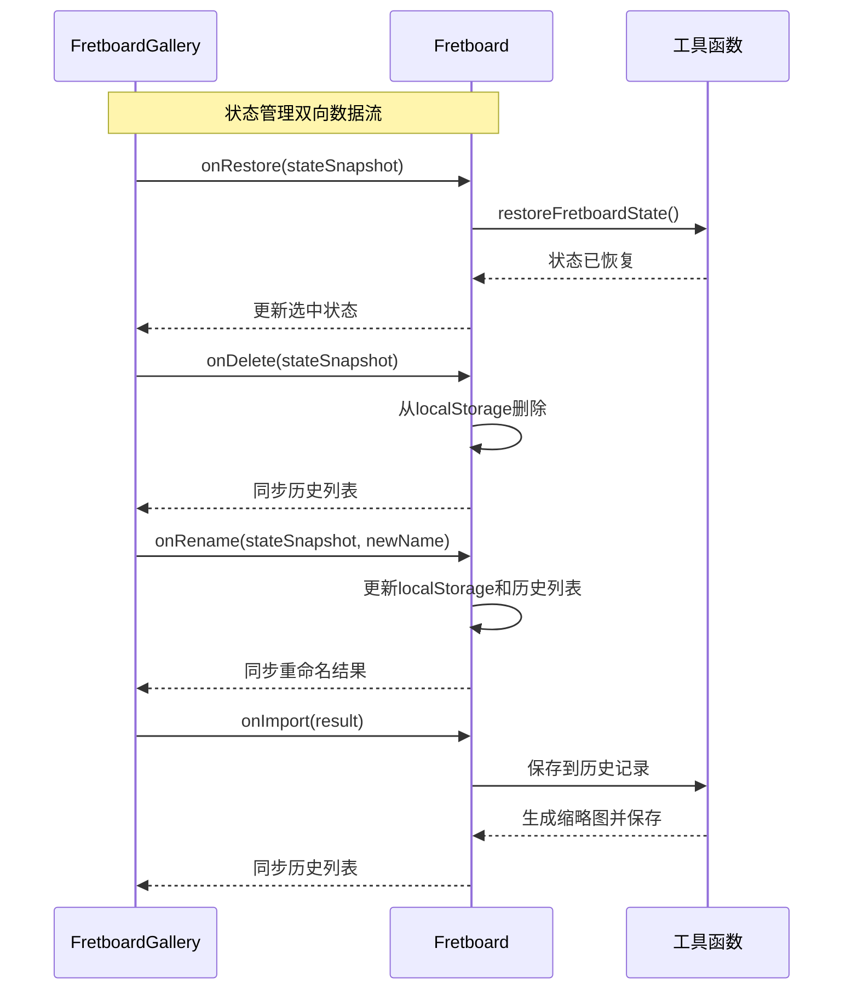

**图表来源**
- [FretboardGallery.jsx](file://src/components/FretboardGallery.jsx#L120-L174)
- [Fretboard.jsx](file://src/Fretboard.jsx#L639-L797)

**章节来源**
- [FretboardGallery.jsx](file://src/components/FretboardGallery.jsx#L1-L385)
- [Fretboard.jsx](file://src/Fretboard.jsx#L635-L798)

## 依赖关系分析

FretboardGallery组件与多个核心模块存在紧密的依赖关系：

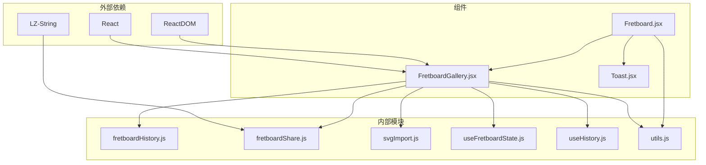

**图表来源**
- [FretboardGallery.jsx](file://src/components/FretboardGallery.jsx#L1-L6)
- [fretboardShare.js](file://src/utils/fretboardShare.js#L1)

### 核心依赖关系

1. **状态管理依赖**：FretboardGallery依赖useFretboardState提供的全局状态
2. **工具函数依赖**：通过fretboardHistory和fretboardShare实现具体功能
3. **导入解析依赖**：svgImport提供SVG文件解析能力
4. **UI反馈依赖**：Toast组件提供用户反馈机制

**章节来源**
- [FretboardGallery.jsx](file://src/components/FretboardGallery.jsx#L1-L6)
- [useFretboardState.js](file://src/hooks/useFretboardState.js#L1-L190)

## 性能考量

### 渲染优化策略

1. **虚拟化渲染**：对于大量历史状态，考虑实现虚拟化列表
2. **懒加载缩略图**：仅在可见区域内生成缩略图
3. **防抖处理**：导入操作使用防抖减少重复请求
4. **内存管理**：及时清理不再使用的缩略图URL

### 数据持久化优化

1. **批量操作**：合并多次状态更新操作
2. **增量同步**：仅同步发生变化的历史记录
3. **缓存策略**：缓存常用的颜色和样式信息
4. **压缩存储**：使用LZ-String压缩存储历史数据

## 故障排除指南

### 常见问题及解决方案

#### 导入功能问题
- **问题**：分享字符串导入失败
- **原因**：格式不正确或版本不兼容
- **解决**：检查分享字符串格式，确保版本兼容性

#### 缩略图生成问题
- **问题**：缩略图显示为空白
- **原因**：SVG元素不存在或样式未正确应用
- **解决**：确保SVG元素正确渲染，检查CSS变量应用

#### 剪贴板访问问题
- **问题**：自动读取剪贴板失败
- **原因**：浏览器安全策略限制
- **解决**：降级到手动粘贴模式

**章节来源**
- [fretboardShare.js](file://src/utils/fretboardShare.js#L148-L170)
- [fretboardHistory.js](file://src/utils/fretboardHistory.js#L3-L36)

## 结论

FretboardGallery组件成功实现了指板状态管理的核心功能，通过精心设计的UI交互和强大的数据处理能力，为用户提供了完整的状态历史管理体验。组件采用模块化设计，与主应用形成良好的协作关系，既保持了功能的完整性，又确保了系统的可维护性。

该组件的关键优势在于：
- **直观的用户界面**：清晰的状态展示和交互反馈
- **灵活的数据导入**：支持多种格式的导入方式
- **可靠的性能表现**：优化的渲染和数据处理机制
- **完善的错误处理**：全面的异常处理和用户反馈

通过合理的架构设计和代码组织，FretboardGallery为指板编辑器提供了稳定可靠的历史状态管理基础，为后续功能扩展奠定了坚实的技术基础。