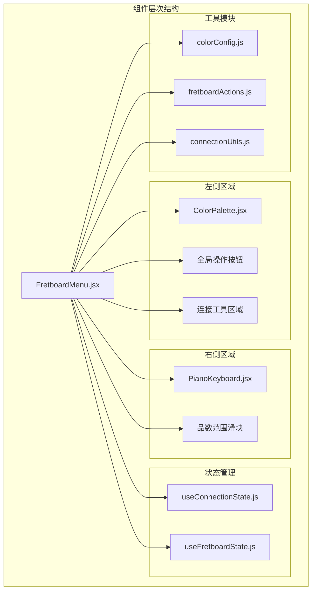
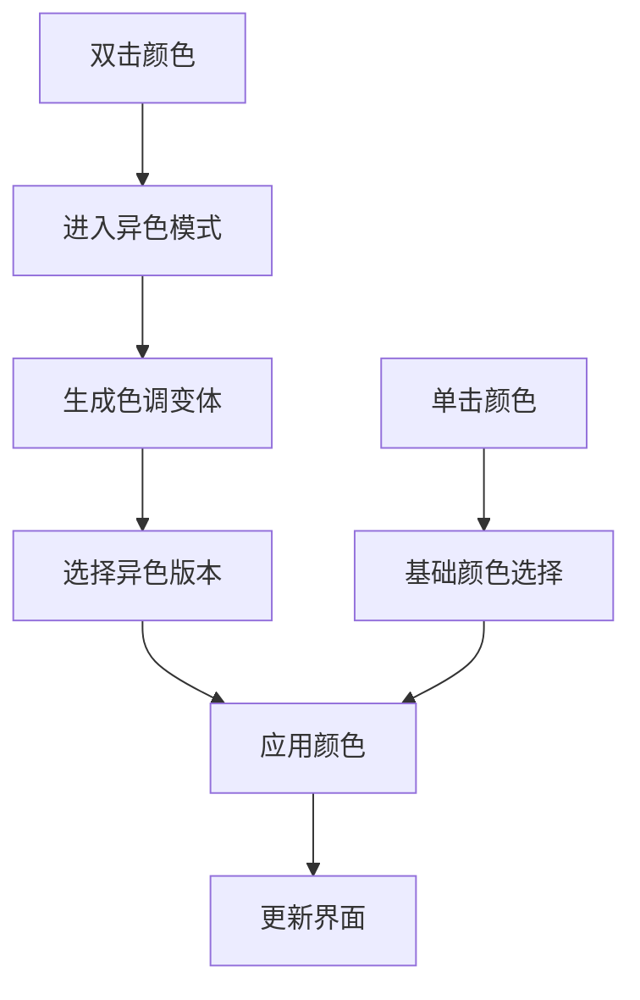
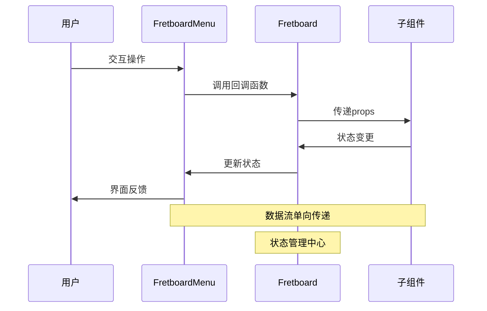
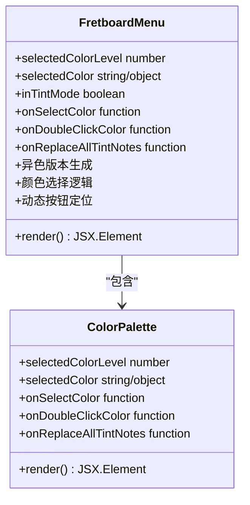
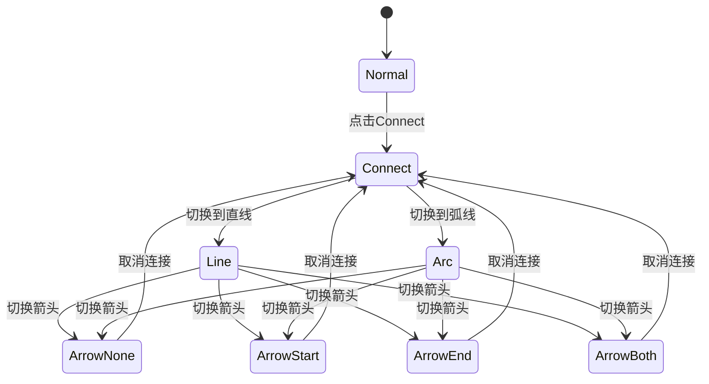
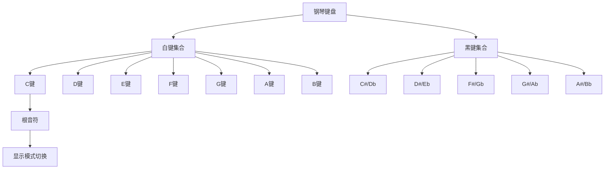
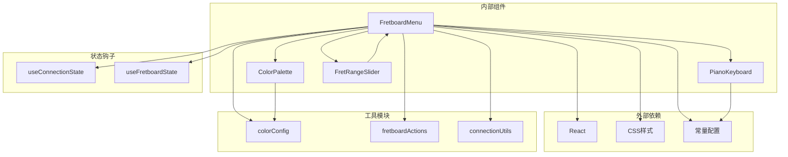
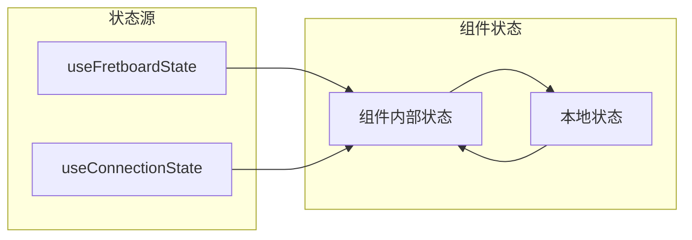

# FretboardMenu组件

<cite>
**本文档引用的文件**
- [FretboardMenu.jsx](file://src/components/FretboardMenu.jsx)
- [PianoKeyboard.jsx](file://src/PianoKeyboard.jsx)
- [FretRangeSlider.jsx](file://src/components/FretRangeSlider.jsx)
- [ColorPalette.jsx](file://src/components/ColorPalette.jsx)
- [useConnectionState.js](file://src/hooks/useConnectionState.js)
- [useFretboardState.js](file://src/hooks/useFretboardState.js)
- [colorConfig.js](file://src/colorConfig.js)
- [constants.js](file://src/constants.js)
- [fretboardActions.js](file://src/utils/fretboardActions.js)
- [connectionUtils.js](file://src/utils/connectionUtils.js)
- [fretboard.css](file://src/fretboard.css)
- [Fretboard.jsx](file://src/Fretboard.jsx)
</cite>

## 目录
1. [简介](#简介)
2. [项目结构](#项目结构)
3. [核心组件](#核心组件)
4. [架构概览](#架构概览)
5. [详细组件分析](#详细组件分析)
6. [依赖关系分析](#依赖关系分析)
7. [性能考虑](#性能考虑)
8. [故障排除指南](#故障排除指南)
9. [结论](#结论)

## 简介

FretboardMenu组件是Fretboard Diagram Generator应用程序的核心用户控制面板，负责提供完整的指板编辑界面。该组件采用左右分区布局设计，左侧包含颜色调色板和工具栏，右侧集成钢琴键盘和品数范围滑块，为用户提供直观的音乐理论可视化编辑体验。

该组件实现了丰富的交互功能，包括颜色选择系统（支持单击选择和双击异色模式）、全局操作控制、连接工具管理、下载配置选项等。通过与子组件的紧密协作，形成了完整的用户控制生态系统。

## 项目结构

FretboardMenu组件位于src/components目录下，与相关的子组件和工具模块共同构成了完整的UI架构：

**图表来源**
- [FretboardMenu.jsx](file://src/components/FretboardMenu.jsx#L1-L243)
- [ColorPalette.jsx](file://src/components/ColorPalette.jsx#L1-L61)
- [PianoKeyboard.jsx](file://src/PianoKeyboard.jsx#L1-L101)
- [FretRangeSlider.jsx](file://src/components/FretRangeSlider.jsx#L1-L76)

**章节来源**
- [FretboardMenu.jsx](file://src/components/FretboardMenu.jsx#L1-L243)
- [Fretboard.jsx](file://src/Fretboard.jsx#L592-L633)

## 核心组件

### 布局架构

FretboardMenu采用Flexbox布局实现响应式设计，整体呈现水平分栏结构：

- **左侧区域**：固定宽度的控制面板，包含颜色调色板、全局操作按钮和连接工具
- **右侧区域**：可扩展的交互面板，包含钢琴键盘和品数范围滑块

### 颜色选择系统

组件实现了多层次的颜色选择机制：

1. **基础颜色选择**：单击调色板按钮选择主颜色
2. **异色模式**：双击进入异色版本，提供5级色调变体
3. **动态生成**：根据基础颜色实时生成淡色版本

**图表来源**
- [FretboardMenu.jsx](file://src/components/FretboardMenu.jsx#L41-L48)
- [FretboardMenu.jsx](file://src/components/FretboardMenu.jsx#L67-L96)

**章节来源**
- [FretboardMenu.jsx](file://src/components/FretboardMenu.jsx#L41-L98)
- [ColorPalette.jsx](file://src/components/ColorPalette.jsx#L16-L59)

## 架构概览

FretboardMenu组件通过props驱动的方式与父组件Fretboard进行数据交换，实现了松耦合的设计模式：

**图表来源**
- [FretboardMenu.jsx](file://src/components/FretboardMenu.jsx#L8-L40)
- [Fretboard.jsx](file://src/Fretboard.jsx#L592-L633)

## 详细组件分析

### 左侧控制面板

#### 颜色调色板集成

左侧区域采用flex布局，将颜色调色板与异色版本按钮进行智能组合：

**图表来源**
- [FretboardMenu.jsx](file://src/components/FretboardMenu.jsx#L100-L106)
- [ColorPalette.jsx](file://src/components/ColorPalette.jsx#L16-L59)

#### 全局操作按钮

全局操作区域包含四个核心功能按钮：

| 按钮 | 功能 | 快捷键 | 状态 |
|------|------|--------|------|
| 切换升降号 | 切换升号/降号显示模式 | Z | enharmonic状态 |
| Toggle | 切换音符可见性 | - | visibility状态 |
| Save | 保存当前状态 | Ctrl+S | 历史记录 |
| Reset | 重置所有设置 | Ctrl+D | 清空数据 |

#### 连接工具区域

连接工具提供专业的连线编辑功能：

**图表来源**
- [FretboardMenu.jsx](file://src/components/FretboardMenu.jsx#L142-L178)
- [useConnectionState.js](file://src/hooks/useConnectionState.js#L21-L64)

**章节来源**
- [FretboardMenu.jsx](file://src/components/FretboardMenu.jsx#L108-L178)
- [useConnectionState.js](file://src/hooks/useConnectionState.js#L21-L64)

### 右侧交互面板

#### 钢琴键盘集成

右侧区域集成了完整的钢琴键盘组件，支持：

- **音符选择**：单击选择根音符，再次单击取消选择
- **升降号切换**：根据enharmonic状态显示#/#符号
- **视觉反馈**：选中状态的高亮显示

**图表来源**
- [PianoKeyboard.jsx](file://src/PianoKeyboard.jsx#L5-L37)
- [PianoKeyboard.jsx](file://src/PianoKeyboard.jsx#L56-L94)

#### 品数范围滑块

品数范围滑块提供精确的指板范围控制：

- **双范围选择**：同时控制起始和结束品数
- **实时预览**：滑块位置对应的品数标记
- **边界约束**：防止无效的范围设置

**章节来源**
- [PianoKeyboard.jsx](file://src/PianoKeyboard.jsx#L1-L101)
- [FretRangeSlider.jsx](file://src/components/FretRangeSlider.jsx#L1-L76)

### 颜色选择功能详解

#### 单击选择颜色

单击调色板按钮实现基础颜色选择：

1. **参数传递**：level（层级）、colorName（颜色名称）
2. **状态更新**：更新selectedColorLevel和selectedColor
3. **异色模式退出**：清除异色模式标记

#### 双击进入异色模式

双击操作激活高级颜色选择功能：

1. **异色生成**：基于基础颜色生成5级色调变体
2. **默认选择**：根据层级选择合适的默认变体
3. **模式激活**：设置inTintMode为true

#### 异色版本按钮动态生成

异色版本按钮采用绝对定位策略：

- **位置计算**：距离左侧-48px，垂直居中对齐
- **层级区分**：第一层使用实心按钮，第二层使用环状边框
- **选中状态**：通过CSS类实现视觉反馈

**章节来源**
- [FretboardMenu.jsx](file://src/components/FretboardMenu.jsx#L41-L98)
- [colorConfig.js](file://src/colorConfig.js#L58-L97)

### 全局操作按钮实现

#### 切换升降号功能

enharmonic切换按钮实现升号/降号的动态切换：

- **状态管理**：通过enharmonic状态控制显示模式
- **符号显示**：根据状态显示相应的符号(#/♭)
- **实时更新**：切换后立即影响所有音符显示

#### 可见性切换机制

Toggle按钮提供三种可见性状态的循环切换：

1. **hidden**：完全隐藏音符
2. **transparent**：半透明显示
3. **visible**：完全可见

#### 保存和重置功能

- **Save按钮**：保存当前指板状态到历史记录
- **Reset按钮**：重置所有设置到初始状态
- **防抖机制**：避免频繁保存造成性能问题

**章节来源**
- [FretboardMenu.jsx](file://src/components/FretboardMenu.jsx#L108-L140)
- [fretboardActions.js](file://src/utils/fretboardActions.js#L268-L315)

### 连接工具区域状态管理

#### 连接模式切换

连接工具通过connectionMode状态控制：

- **激活条件**：点击Connect按钮
- **状态清理**：激活时清除所有连接相关状态
- **交互禁用**：禁用其他编辑功能

#### 连接类型控制

支持两种连接类型的动态切换：

- **直线连接**：连接两点间的最短路径
- **弧线连接**：创建曲线连接，增强视觉效果

#### 箭头方向控制

箭头方向采用循环切换机制：

1. **无箭头**：默认状态
2. **起点箭头**：指示开始方向
3. **终点箭头**：指示结束方向
4. **双向箭头**：同时显示两端箭头

**章节来源**
- [FretboardMenu.jsx](file://src/components/FretboardMenu.jsx#L142-L178)
- [useConnectionState.js](file://src/hooks/useConnectionState.js#L33-L62)

### 下载区域功能

下载区域提供灵活的导出配置选项：

#### 品数标记包含选项

- **includeMarkers**：控制是否包含品数标记
- **视觉影响**：影响最终SVG的边界计算
- **默认启用**：保持良好的用户体验

#### 音符显示控制

- **showNotes**：控制音符文本的显示
- **动态切换**：支持临时显示和永久切换
- **透明度处理**：异色音符的特殊处理逻辑

#### 仅复制模式

- **copyOnly**：切换复制模式
- **图片生成**：将SVG转换为高分辨率图片
- **剪贴板集成**：直接复制到系统剪贴板

**章节来源**
- [FretboardMenu.jsx](file://src/components/FretboardMenu.jsx#L179-L216)

## 依赖关系分析

### 组件间依赖关系

**图表来源**
- [FretboardMenu.jsx](file://src/components/FretboardMenu.jsx#L1-L7)
- [ColorPalette.jsx](file://src/components/ColorPalette.jsx#L1-L2)
- [PianoKeyboard.jsx](file://src/PianoKeyboard.jsx#L1-L3)

### 状态管理依赖

组件的状态管理遵循单一数据源原则：

**图表来源**
- [useFretboardState.js](file://src/hooks/useFretboardState.js#L5-L26)
- [useConnectionState.js](file://src/hooks/useConnectionState.js#L21-L35)

**章节来源**
- [FretboardMenu.jsx](file://src/components/FretboardMenu.jsx#L8-L40)
- [useFretboardState.js](file://src/hooks/useFretboardState.js#L1-L190)

## 性能考虑

### 渲染优化策略

1. **条件渲染**：异色版本按钮仅在需要时渲染
2. **状态缓存**：使用useMemo和useCallback优化计算
3. **事件委托**：减少事件监听器的数量
4. **虚拟滚动**：对于大量数据的场景考虑实现

### 内存管理

- **引用管理**：使用useRef避免不必要的重渲染
- **清理机制**：及时清理定时器和事件监听器
- **状态同步**：通过dataRef避免闭包陷阱

### 交互响应性

- **防抖处理**：保存操作的防抖机制
- **节流控制**：高频事件的节流处理
- **异步更新**：大数据量更新的异步处理

## 故障排除指南

### 常见问题诊断

#### 颜色选择异常

**症状**：颜色选择后界面不更新
**排查步骤**：
1. 检查onSelectColor回调函数是否正确传递
2. 验证selectedColorLevel和selectedColor状态更新
3. 确认CSS类名生成逻辑

#### 异色模式失效

**症状**：双击无法进入异色模式
**排查步骤**：
1. 验证inTintMode状态切换逻辑
2. 检查generateTintVariants函数执行
3. 确认异色版本按钮的条件渲染

#### 连接工具不可用

**症状**：连接工具按钮无法点击
**排查步骤**：
1. 检查connectionMode状态
2. 验证按钮的disabled属性
3. 确认父组件状态传递

### 调试建议

1. **开发者工具**：使用React DevTools检查组件树
2. **状态检查**：验证useFretboardState和useConnectionState状态
3. **事件追踪**：通过浏览器控制台追踪事件流
4. **性能监控**：使用性能面板分析渲染性能

**章节来源**
- [FretboardMenu.jsx](file://src/components/FretboardMenu.jsx#L338-L357)
- [fretboardActions.js](file://src/utils/fretboardActions.js#L317-L800)

## 结论

FretboardMenu组件通过精心设计的架构和丰富的功能实现了音乐理论可视化的完整解决方案。其核心优势包括：

1. **直观的布局设计**：左右分区布局符合用户的操作习惯
2. **完整的功能覆盖**：从基础颜色选择到专业连线编辑
3. **优秀的用户体验**：流畅的交互反馈和状态管理
4. **可扩展的架构**：模块化设计便于功能扩展

该组件为Fretboard Diagram Generator提供了强大的用户控制能力，是整个应用程序的核心界面组件。通过合理的状态管理和组件解耦，确保了系统的稳定性和可维护性。