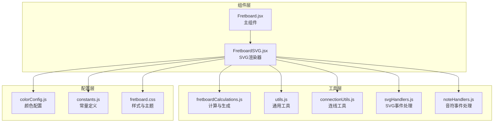
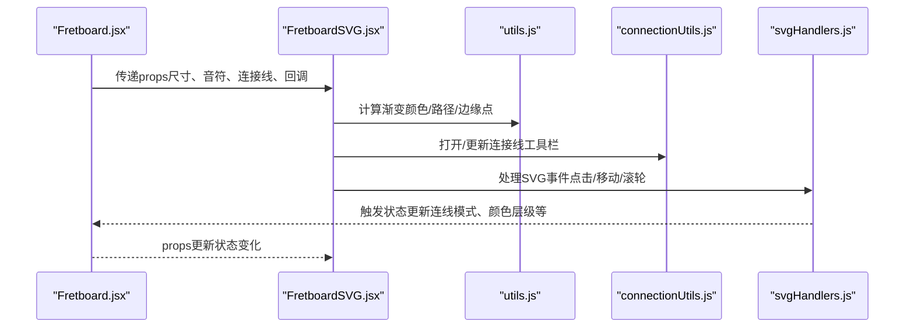
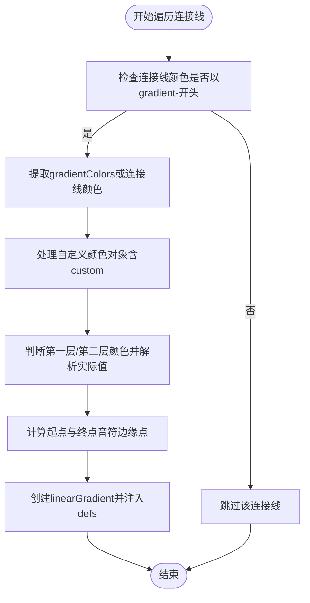
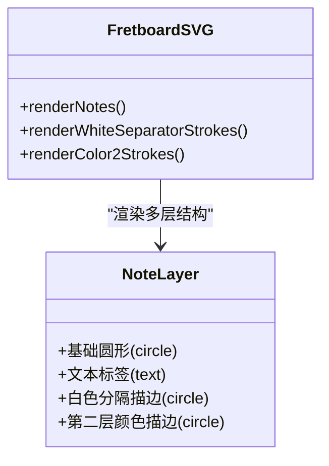
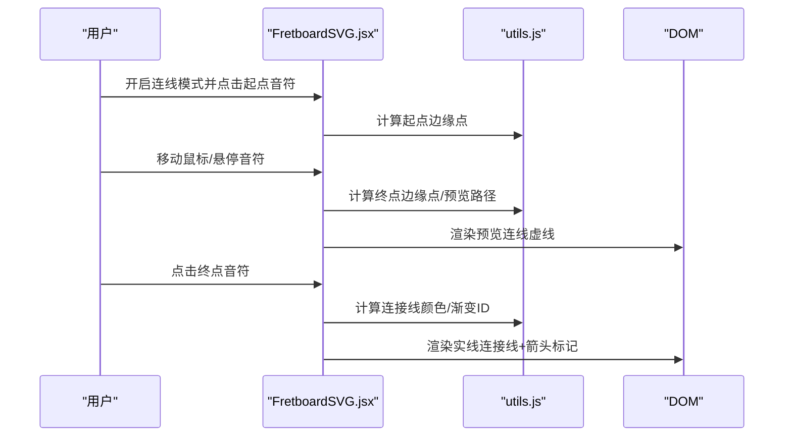
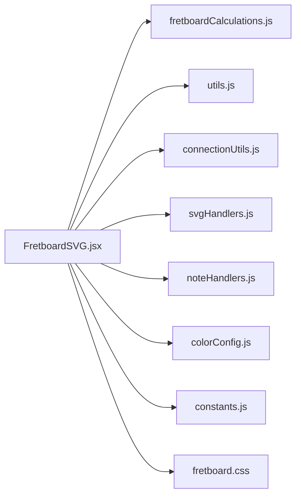

# FretboardSVG组件

<cite>
**本文档引用的文件**
- [FretboardSVG.jsx](file://src/components/FretboardSVG.jsx)
- [Fretboard.jsx](file://src/Fretboard.jsx)
- [connectionUtils.js](file://src/utils/connectionUtils.js)
- [fretboardCalculations.js](file://src/utils/fretboardCalculations.js)
- [svgHandlers.js](file://src/handlers/svgHandlers.js)
- [utils.js](file://src/utils.js)
- [colorConfig.js](file://src/colorConfig.js)
- [constants.js](file://src/constants.js)
- [noteHandlers.js](file://src/handlers/noteHandlers.js)
- [fretboard.css](file://src/fretboard.css)
</cite>

## 目录
1. [简介](#简介)
2. [项目结构](#项目结构)
3. [核心组件](#核心组件)
4. [架构概览](#架构概览)
5. [详细组件分析](#详细组件分析)
6. [依赖关系分析](#依赖关系分析)
7. [性能考量](#性能考量)
8. [故障排查指南](#故障排查指南)
9. [结论](#结论)

## 简介
FretboardSVG组件是吉他指板交互式SVG渲染器的核心模块，负责将吉他指板的可视化元素（品线、弦线、音符标记、连接线）以SVG形式高效渲染。该组件实现了复杂的渐变定义系统、音符的多层渲染结构（基础圆形、文本标签、白色分隔描边、第二层颜色描边）、连接线的路径计算与箭头标记定位，以及预览连线的交互效果。组件通过props与Fretboard主组件紧密协作，提供完整的指板编辑与可视化体验。

## 项目结构
FretboardSVG位于组件目录中，与Fretboard主组件、工具函数、颜色配置、常量定义等模块协同工作。整体采用“组件-工具函数-配置”的分层架构，确保渲染逻辑与业务逻辑分离，便于维护和扩展。

图表来源
- [Fretboard.jsx](file://src/Fretboard.jsx#L528-L590)
- [FretboardSVG.jsx](file://src/components/FretboardSVG.jsx#L1-L1184)
- [fretboardCalculations.js](file://src/utils/fretboardCalculations.js#L1-L135)
- [utils.js](file://src/utils.js#L1-L553)
- [connectionUtils.js](file://src/utils/connectionUtils.js#L1-L196)
- [svgHandlers.js](file://src/handlers/svgHandlers.js#L1-L200)
- [noteHandlers.js](file://src/handlers/noteHandlers.js#L1-L550)
- [colorConfig.js](file://src/colorConfig.js#L1-L162)
- [constants.js](file://src/constants.js#L1-L19)
- [fretboard.css](file://src/fretboard.css#L1-L200)

章节来源
- [Fretboard.jsx](file://src/Fretboard.jsx#L528-L590)
- [FretboardSVG.jsx](file://src/components/FretboardSVG.jsx#L1-L1184)

## 核心组件
FretboardSVG组件通过props接收来自Fretboard主组件的状态与回调函数，渲染以下核心元素：
- 渐变定义（defs）：动态生成基于连接线颜色配置的线性渐变
- 品线路径：根据起止品位生成折线路径
- 弦线路径：按弦序生成水平路径，带权重缩放
- 音符标记：圆形基础层、文本标签、白色分隔描边、第二层颜色描边
- 连接线：直线与弧线路径、箭头标记、预览连线
- 工具栏：连接线属性编辑界面

章节来源
- [FretboardSVG.jsx](file://src/components/FretboardSVG.jsx#L86-L172)
- [FretboardSVG.jsx](file://src/components/FretboardSVG.jsx#L174-L193)
- [FretboardSVG.jsx](file://src/components/FretboardSVG.jsx#L195-L293)
- [FretboardSVG.jsx](file://src/components/FretboardSVG.jsx#L295-L579)
- [FretboardSVG.jsx](file://src/components/FretboardSVG.jsx#L642-L759)
- [FretboardSVG.jsx](file://src/components/FretboardSVG.jsx#L793-L1184)

## 架构概览
FretboardSVG与Fretboard主组件通过props传递实现双向交互：
- Fretboard计算并传递SVG尺寸、视口、音符列表、标记、连接线集合等
- Fretboard提供事件回调（点击、移动、滚轮、右键、上下文菜单）供组件内部使用
- Fretboard维护全局状态（连线模式、起点、预览悬停、颜色层级等）

图表来源
- [Fretboard.jsx](file://src/Fretboard.jsx#L528-L590)
- [FretboardSVG.jsx](file://src/components/FretboardSVG.jsx#L1-L1184)
- [utils.js](file://src/utils.js#L442-L467)
- [connectionUtils.js](file://src/utils/connectionUtils.js#L56-L85)
- [svgHandlers.js](file://src/handlers/svgHandlers.js#L4-L55)

章节来源
- [Fretboard.jsx](file://src/Fretboard.jsx#L267-L336)
- [FretboardSVG.jsx](file://src/components/FretboardSVG.jsx#L9-L71)

## 详细组件分析

### 渐变定义与动态生成
FretboardSVG在defs中为每条连接线动态生成线性渐变，逻辑如下：
- 遍历连接线集合，筛选出使用渐变（color以gradient-开头）的连线
- 从gradientColors或连接线数据中提取起点与终点颜色
- 处理自定义颜色对象（含custom字段）与层级颜色（第一层/第二层）
- 计算起点与终点音符的边缘点作为渐变方向
- 生成linearGradient元素并注入到defs中

图表来源
- [FretboardSVG.jsx](file://src/components/FretboardSVG.jsx#L98-L171)
- [utils.js](file://src/utils.js#L442-L467)
- [utils.js](file://src/utils.js#L482-L502)

章节来源
- [FretboardSVG.jsx](file://src/components/FretboardSVG.jsx#L98-L171)
- [utils.js](file://src/utils.js#L442-L467)

### 音符渲染的多层结构
音符渲染采用四层叠加机制，确保视觉层次清晰：
- 基础圆形：填充音符颜色，处理开放弦（无描边）与普通音符（描边）
- 文本标签：显示音名或用户编辑文本，支持颜色覆盖
- 白色分隔描边：当同时存在第一层与第二层颜色时，在两层之间添加白色分隔描边
- 第二层颜色描边：单独的第二层描边，覆盖在连线之上

图表来源
- [FretboardSVG.jsx](file://src/components/FretboardSVG.jsx#L195-L293)
- [FretboardSVG.jsx](file://src/components/FretboardSVG.jsx#L581-L640)

章节来源
- [FretboardSVG.jsx](file://src/components/FretboardSVG.jsx#L195-L293)
- [FretboardSVG.jsx](file://src/components/FretboardSVG.jsx#L581-L640)

### 连接线渲染逻辑
连接线支持直线与弧线两种类型，具备箭头标记与预览连线功能：
- 起点/终点边缘点计算：使用音符中心与目标音符中心计算边缘点，避免与音符重叠
- 直线路径：从起点边缘点到终点边缘点绘制直线
- 弧线路径：根据曲率参数计算控制点，生成二次贝塞尔曲线
- 箭头标记：根据箭头方向在起点/终点处生成marker，颜色基于接触音符的颜色降低饱和度
- 预览连线：连线模式下，根据鼠标位置或悬停音符实时计算预览路径，虚线显示

图表来源
- [FretboardSVG.jsx](file://src/components/FretboardSVG.jsx#L295-L579)
- [utils.js](file://src/utils.js#L482-L502)
- [utils.js](file://src/utils.js#L504-L532)
- [utils.js](file://src/utils.js#L534-L552)

章节来源
- [FretboardSVG.jsx](file://src/components/FretboardSVG.jsx#L295-L579)
- [utils.js](file://src/utils.js#L482-L552)

### 组件与Fretboard主组件的props传递示例
Fretboard主组件通过props向FretboardSVG传递渲染所需的所有状态与回调：
- SVG尺寸与视口：svgWidth、svgHeight、svgViewBoxX、svgViewBoxY、svgViewBoxWidth、svgViewBoxHeight
- 事件回调：handleSvgClick、handleSvgMouseMove、handleSvgMouseDown、handleSvgContextMenu、handleSvgWheel
- 渲染数据：fretPath、markers、generateStringPathMemo、notes、connections
- 状态控制：connectionMode、connectionStartNote、previewHoverNote、useColor2Level、mousePosition
- 编辑与工具栏：editableDivVisible、editableDivX、editableDivY、connectionToolbarVisible、selectedConnection

章节来源
- [Fretboard.jsx](file://src/Fretboard.jsx#L528-L590)
- [FretboardSVG.jsx](file://src/components/FretboardSVG.jsx#L9-L71)

### 事件回调集成方式
FretboardSVG内部通过props接收的回调函数实现交互：
- handleNoteClick：音符点击事件，支持连线模式、颜色切换、编辑模式
- handleConnectionClickMemo/handleConnectionContextMenuMemo：连接线点击与右键菜单事件
- handleSvgClick/handleSvgContextMenu/handleSvgMouseMove/handleSvgMouseDown/handleSvgWheel：SVG画布事件处理

章节来源
- [FretboardSVG.jsx](file://src/components/FretboardSVG.jsx#L241-L293)
- [FretboardSVG.jsx](file://src/components/FretboardSVG.jsx#L486-L574)
- [Fretboard.jsx](file://src/Fretboard.jsx#L267-L336)

## 依赖关系分析
FretboardSVG依赖多个工具模块与配置文件，形成清晰的职责边界：
- 计算与生成：fretboardCalculations.js（音符位置、标记、路径生成）
- 通用工具：utils.js（颜色解析、渐变计算、路径点计算、弧线路径）
- 连线工具：connectionUtils.js（工具栏位置、颜色更新）
- 事件处理：svgHandlers.js、noteHandlers.js（SVG与音符事件）
- 配置与样式：colorConfig.js（颜色配置）、constants.js（常量）、fretboard.css（样式）

图表来源
- [FretboardSVG.jsx](file://src/components/FretboardSVG.jsx#L1-L1184)
- [fretboardCalculations.js](file://src/utils/fretboardCalculations.js#L1-L135)
- [utils.js](file://src/utils.js#L1-L553)
- [connectionUtils.js](file://src/utils/connectionUtils.js#L1-L196)
- [svgHandlers.js](file://src/handlers/svgHandlers.js#L1-L200)
- [noteHandlers.js](file://src/handlers/noteHandlers.js#L1-L550)
- [colorConfig.js](file://src/colorConfig.js#L1-L162)
- [constants.js](file://src/constants.js#L1-L19)
- [fretboard.css](file://src/fretboard.css#L1-L200)

章节来源
- [FretboardSVG.jsx](file://src/components/FretboardSVG.jsx#L1-L1184)

## 性能考量
- 渲染优化：使用memo化函数（generateStringPathMemo、computeNoteNameMemo等）减少重复计算
- DOM访问：仅在必要时访问DOM（如获取音符位置、提取颜色类名），避免频繁查询
- 渐变生成：按需生成linearGradient，避免不必要的DOM节点
- 事件处理：使用防抖策略保存状态，减少频繁更新
- 预览连线：仅在连线模式下渲染，避免影响静态渲染性能

## 故障排查指南
- 渐变颜色异常：检查gradientColors与音符颜色解析逻辑，确认第一层/第二层颜色映射
- 连接线不显示：确认起点/终点音符可见性与位置，检查边缘点计算与路径端点修正
- 预览连线不跟随：检查鼠标事件处理与getPointOnPathAtDistance的路径长度计算
- 颜色层级切换无效：确认中键事件与useColor2Level状态同步

章节来源
- [FretboardSVG.jsx](file://src/components/FretboardSVG.jsx#L381-L421)
- [svgHandlers.js](file://src/handlers/svgHandlers.js#L122-L157)
- [utils.js](file://src/utils.js#L534-L552)

## 结论
FretboardSVG组件通过精心设计的多层渲染结构与动态渐变系统，实现了高可定制的吉他指板可视化。其与Fretboard主组件的紧密协作，结合完善的事件处理与工具函数，提供了流畅的交互体验与强大的编辑能力。组件架构清晰、职责明确，便于后续扩展与维护。