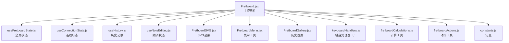
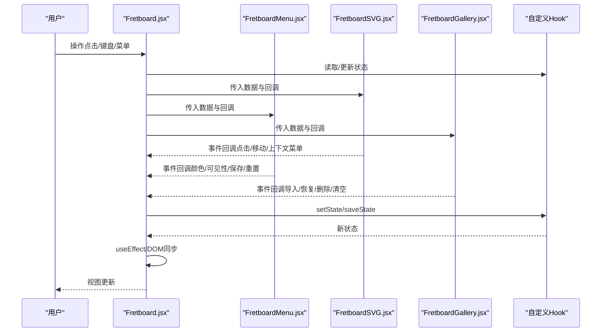
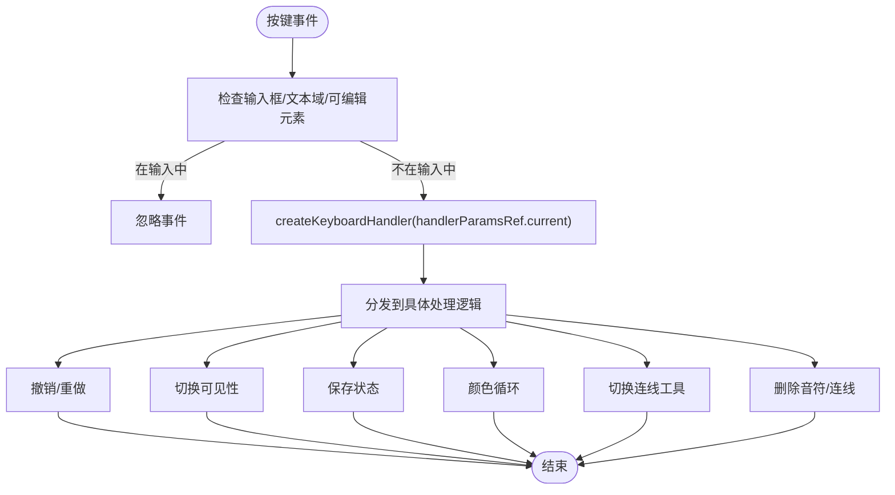
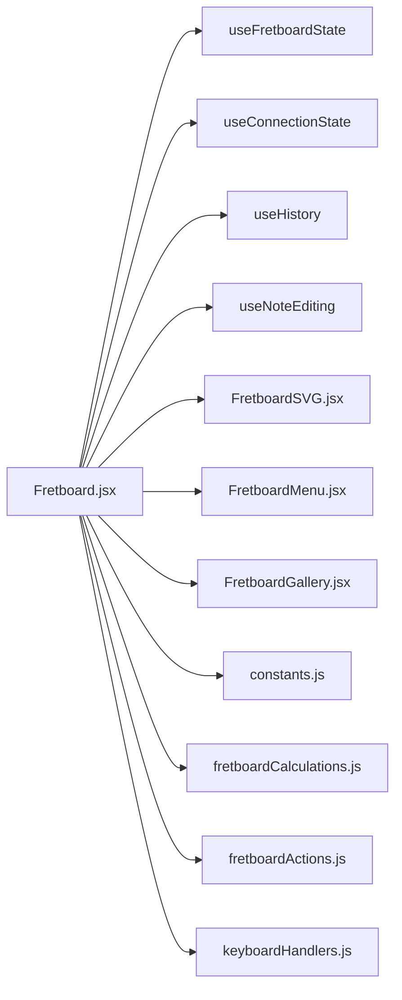

# Fretboard组件

<cite>
**本文引用的文件**
- [Fretboard.jsx](file://src/Fretboard.jsx)
- [useFretboardState.js](file://src/hooks/useFretboardState.js)
- [useConnectionState.js](file://src/hooks/useConnectionState.js)
- [useHistory.js](file://src/hooks/useHistory.js)
- [useNoteEditing.js](file://src/hooks/useNoteEditing.js)
- [keyboardHandlers.js](file://src/handlers/keyboardHandlers.js)
- [FretboardSVG.jsx](file://src/components/FretboardSVG.jsx)
- [FretboardMenu.jsx](file://src/components/FretboardMenu.jsx)
- [FretboardGallery.jsx](file://src/components/FretboardGallery.jsx)
- [fretboardCalculations.js](file://src/utils/fretboardCalculations.js)
- [fretboardActions.js](file://src/utils/fretboardActions.js)
- [constants.js](file://src/constants.js)
</cite>

## 目录
1. [简介](#简介)
2. [项目结构](#项目结构)
3. [核心组件](#核心组件)
4. [架构总览](#架构总览)
5. [详细组件分析](#详细组件分析)
6. [依赖关系分析](#依赖关系分析)
7. [性能考量](#性能考量)
8. [故障排查指南](#故障排查指南)
9. [结论](#结论)
10. [附录](#附录)

## 简介
Fretboard.jsx 是本应用的主控组件，承担“全局协调器”的角色。它通过组合多个自定义 Hook（useFretboardState、useConnectionState、useHistory、useNoteEditing）统一管理应用状态，负责：
- 状态初始化与持久化
- 自动解除选中状态与DOM样式同步
- 键盘事件处理（通过 ref 保持最新参数，避免重复注册）
- 与子组件（FretboardSVG、FretboardMenu、FretboardGallery）通过 props 传递数据与回调
- 历史状态管理与保存/恢复

## 项目结构
- 主组件位于 src/Fretboard.jsx，集中协调状态与交互
- 自定义 Hook 位于 src/hooks/，分别封装不同维度的状态
- 子组件位于 src/components/，负责 UI 呈现与交互
- 工具函数位于 src/utils/，提供计算、动作与共享能力
- 常量定义位于 src/constants.js

图表来源
- [Fretboard.jsx](file://src/Fretboard.jsx#L1-L811)
- [useFretboardState.js](file://src/hooks/useFretboardState.js#L1-L190)
- [useConnectionState.js](file://src/hooks/useConnectionState.js#L1-L65)
- [useHistory.js](file://src/hooks/useHistory.js#L1-L109)
- [useNoteEditing.js](file://src/hooks/useNoteEditing.js#L1-L52)
- [FretboardSVG.jsx](file://src/components/FretboardSVG.jsx#L1-L1184)
- [FretboardMenu.jsx](file://src/components/FretboardMenu.jsx#L1-L243)
- [FretboardGallery.jsx](file://src/components/FretboardGallery.jsx#L1-L385)
- [keyboardHandlers.js](file://src/handlers/keyboardHandlers.js#L1-L227)
- [fretboardCalculations.js](file://src/utils/fretboardCalculations.js#L1-L135)
- [fretboardActions.js](file://src/utils/fretboardActions.js#L1-L878)
- [constants.js](file://src/constants.js#L1-L19)

章节来源
- [Fretboard.jsx](file://src/Fretboard.jsx#L1-L811)
- [constants.js](file://src/constants.js#L1-L19)

## 核心组件
- Fretboard.jsx：协调器，聚合状态与事件，驱动子组件渲染与交互
- useFretboardState：全局状态（选中、颜色、可见性、窗口、数据、历史、时间等）
- useConnectionState：连线模式状态（起止、预览、颜色层级、工具栏等）
- useHistory：基于栈的历史记录管理（撤销/重做）
- useNoteEditing：编辑框状态（文本、位置、可见性）

章节来源
- [Fretboard.jsx](file://src/Fretboard.jsx#L23-L78)
- [useFretboardState.js](file://src/hooks/useFretboardState.js#L5-L189)
- [useConnectionState.js](file://src/hooks/useConnectionState.js#L21-L64)
- [useHistory.js](file://src/hooks/useHistory.js#L3-L108)
- [useNoteEditing.js](file://src/hooks/useNoteEditing.js#L4-L51)

## 架构总览
Fretboard.jsx 通过以下方式实现“主控”职责：
- 使用自定义 Hook 解构状态与 setter，形成统一的状态源
- 通过 useMemo/useCallback 生成稳定的计算结果与事件处理器
- 通过 useEffect 管理副作用（初始化、DOM 同步、全局事件、自动解除选中）
- 通过 ref（如 handlerParamsRef、svgElementRef）避免闭包陷阱与重复注册
- 将 props 传递给子组件，实现“单向数据流”和“回调驱动”

图表来源
- [Fretboard.jsx](file://src/Fretboard.jsx#L23-L811)
- [FretboardSVG.jsx](file://src/components/FretboardSVG.jsx#L9-L1184)
- [FretboardMenu.jsx](file://src/components/FretboardMenu.jsx#L8-L243)
- [FretboardGallery.jsx](file://src/components/FretboardGallery.jsx#L7-L385)

## 详细组件分析

### Fretboard.jsx：主控协调器
- 状态聚合与解构
  - 从 useFretboardState、useConnectionState、useHistory、useNoteEditing 获取状态与 setter
  - 通过 dataRef 与 selectedTimeoutRef 保持最新引用，避免闭包陷阱
- 计算属性与派生数据
  - 通过 useMemo 生成 notes/markers/fretPath/connections
  - 通过 useCallback 生成计算函数（如 computeNoteNameMemo、getNotePositionMemo）
- 副作用管理
  - 初始化：initColorCSSVariables
  - 自动解除选中：useEffect 监听 selected，定时器自动清除选中态并同步 DOM
  - 连线颜色更新：useEffect 监听 data，动态更新连线颜色
  - notes 数据初始化：useEffect 确保 data 中存在每个 note 的初始条目
  - DOM 样式同步：useEffect 监听 notes/data/visibility，批量更新 DOM
  - 下拉菜单方向检测：useEffect 动态检测工具栏方向
  - 全局点击/右键事件：useEffect 注册/清理，避免重复监听
- 事件处理器创建
  - 通过 createNoteClickHandler/createSvgHandlers 等工厂函数创建稳定回调
  - 通过 useCallback 包裹，确保依赖数组稳定
- 键盘事件处理
  - 使用 handlerParamsRef 保存最新参数，避免每次渲染重新注册监听器
  - 通过 createKeyboardHandler 工厂函数创建处理器，统一处理快捷键
- 子组件交互
  - FretboardSVG：接收 SVG 尺寸、路径、数据、事件回调、连线工具栏状态等
  - FretboardMenu：接收颜色、可见性、连线模式、保存/重置等回调
  - FretboardGallery：接收历史状态列表、导入/恢复/删除/清空/重命名回调

章节来源
- [Fretboard.jsx](file://src/Fretboard.jsx#L23-L811)

### 自定义Hook集成与职责
- useFretboardState
  - 负责全局状态：选中、颜色、可见性、窗口、数据、历史、时间等
  - 通过 dataRef 保持 data 最新引用
  - 页面刷新时从 localStorage 恢复当前状态与历史
  - 自动保存当前状态到 localStorage
- useConnectionState
  - 负责连线模式状态：起止、预览、颜色层级、工具栏可见与位置、连线类型/箭头方向等
- useHistory
  - 基于栈的历史记录：保存、撤销、重做
  - 防止撤销/重做过程中保存历史
- useNoteEditing
  - 负责编辑框状态：文本、位置、可见性、自动聚焦与全选

章节来源
- [useFretboardState.js](file://src/hooks/useFretboardState.js#L5-L189)
- [useConnectionState.js](file://src/hooks/useConnectionState.js#L21-L64)
- [useHistory.js](file://src/hooks/useHistory.js#L3-L108)
- [useNoteEditing.js](file://src/hooks/useNoteEditing.js#L4-L51)

### 键盘事件处理机制
- 通过 ref 保持最新参数
  - handlerParamsRef 保存当前 selected、deleteNote、selectColor、undo/redo、hoveredNoteId/hoveredConnectionId、data/setData、visibility、connectionMode 等
  - 在 useEffect 中仅注册一次 window.addEventListener('keydown')
- 事件处理器工厂
  - createKeyboardHandler 接收 handlerParamsRef.current，返回统一的键盘处理函数
  - 支持快捷键：Ctrl+S/Ctrl+Shift+S/Ctrl+Z/Ctrl+Shift+Z/Z/Ctrl+D/S/W/A/D 等
- 避免重复注册
  - 依赖数组为空，仅注册一次；清理时移除监听器

图表来源
- [Fretboard.jsx](file://src/Fretboard.jsx#L465-L490)
- [keyboardHandlers.js](file://src/handlers/keyboardHandlers.js#L3-L227)

章节来源
- [Fretboard.jsx](file://src/Fretboard.jsx#L465-L490)
- [keyboardHandlers.js](file://src/handlers/keyboardHandlers.js#L3-L227)

### 与子组件的Props交互
- FretboardSVG
  - 接收：尺寸、路径、数据、事件回调、连线工具栏状态、编辑框状态、显示模式等
  - 通过 props 将 Fretboard.jsx 的状态与回调传递给 SVG 渲染层
- FretboardMenu
  - 接收：颜色、可见性、连线模式、保存/重置、根音、显示模式、窗口范围等
  - 通过 props 将用户操作映射到 Fretboard.jsx 的状态更新
- FretboardGallery
  - 接收：历史状态列表、导入/恢复/删除/清空/重命名回调
  - 通过回调与 Fretboard.jsx 协作，实现状态导入与历史管理

章节来源
- [Fretboard.jsx](file://src/Fretboard.jsx#L528-L590)
- [Fretboard.jsx](file://src/Fretboard.jsx#L592-L633)
- [Fretboard.jsx](file://src/Fretboard.jsx#L635-L798)

### 状态解构、计算属性与事件处理器示例（代码片段路径）
- 状态解构与ref
  - [状态解构与ref定义](file://src/Fretboard.jsx#L25-L93)
- 计算属性生成
  - [计算属性与memoized函数](file://src/Fretboard.jsx#L94-L124)
- 事件处理器创建
  - [事件处理器工厂与useCallback包裹](file://src/Fretboard.jsx#L267-L322)
- 键盘事件处理
  - [handlerParamsRef与键盘监听注册](file://src/Fretboard.jsx#L465-L490)
  - [createKeyboardHandler工厂](file://src/handlers/keyboardHandlers.js#L3-L32)

章节来源
- [Fretboard.jsx](file://src/Fretboard.jsx#L25-L124)
- [Fretboard.jsx](file://src/Fretboard.jsx#L267-L322)
- [Fretboard.jsx](file://src/Fretboard.jsx#L465-L490)
- [keyboardHandlers.js](file://src/handlers/keyboardHandlers.js#L3-L32)

## 依赖关系分析
- 组件耦合
  - Fretboard.jsx 与子组件通过 props 单向通信，耦合度低
  - 子组件内部通过回调回传到 Fretboard.jsx，形成“回调驱动”
- Hook 耦合
  - useFretboardState 与 useConnectionState 独立，但通过 Fretboard.jsx 统一调度
  - useHistory 依赖 data，通过 setData 触发状态变更
  - useNoteEditing 与 Fretboard.jsx 的编辑框状态联动
- 外部依赖
  - constants.js 提供布局与音名常量
  - utils/fretboardCalculations.js 提供计算函数
  - utils/fretboardActions.js 提供动作函数（颜色循环、可见性切换、重置、保存SVG等）

图表来源
- [Fretboard.jsx](file://src/Fretboard.jsx#L1-L811)
- [useFretboardState.js](file://src/hooks/useFretboardState.js#L1-L190)
- [useConnectionState.js](file://src/hooks/useConnectionState.js#L1-L65)
- [useHistory.js](file://src/hooks/useHistory.js#L1-L109)
- [useNoteEditing.js](file://src/hooks/useNoteEditing.js#L1-L52)
- [FretboardSVG.jsx](file://src/components/FretboardSVG.jsx#L1-L1184)
- [FretboardMenu.jsx](file://src/components/FretboardMenu.jsx#L1-L243)
- [FretboardGallery.jsx](file://src/components/FretboardGallery.jsx#L1-L385)
- [constants.js](file://src/constants.js#L1-L19)
- [fretboardCalculations.js](file://src/utils/fretboardCalculations.js#L1-L135)
- [fretboardActions.js](file://src/utils/fretboardActions.js#L1-L878)
- [keyboardHandlers.js](file://src/handlers/keyboardHandlers.js#L1-L227)

章节来源
- [Fretboard.jsx](file://src/Fretboard.jsx#L1-L811)

## 性能考量
- useMemo/useCallback
  - 对 notes/markers/fretPath/connections 等进行 memo 化，减少不必要的重渲染
  - 对计算函数与事件处理器进行 memo 化，避免闭包陷阱
- useEffect 副作用
  - 通过依赖数组精确控制副作用触发时机，避免重复注册与无效更新
  - DOM 同步批量处理，减少重排重绘
- 保存防抖
  - 保存指板状态采用 300ms 防抖，避免频繁保存
- SVG 导出优化
  - 通过 inlineCSS 与裁剪策略减少导出体积
  - 仅复制模式下添加背景矩形，保证图片背景一致性

[本节为通用指导，无需特定文件来源]

## 故障排查指南
- 自动解除选中未生效
  - 检查 selectedTimeoutRef 是否被正确设置与清理
  - 确认 useEffect 的依赖数组包含 selected/data/setData/setSelected
- 键盘事件重复触发或未响应
  - 确认 handlerParamsRef 是否正确更新
  - 确认 window.addEventListener 仅注册一次（空依赖数组）
- 连线颜色未更新
  - 检查 updateConnectionColors 的调用时机与依赖
  - 确认 data/setData 正确传递到 Fretboard.jsx
- 历史记录异常
  - 检查 useHistory 的撤销/重做标志位，避免保存历史
  - 确认 data 变化时是否触发保存历史
- 导出SVG异常
  - 检查 includeMarkers/showNotes 参数对导出的影响
  - 确认裁剪逻辑是否正确提取有颜色的 note 与连线

章节来源
- [Fretboard.jsx](file://src/Fretboard.jsx#L125-L266)
- [Fretboard.jsx](file://src/Fretboard.jsx#L465-L490)
- [useHistory.js](file://src/hooks/useHistory.js#L10-L108)
- [fretboardActions.js](file://src/utils/fretboardActions.js#L317-L878)

## 结论
Fretboard.jsx 通过自定义 Hook 与子组件的清晰分工，实现了“主控协调器”的职责。它以稳定的计算属性、严格的副作用管理与高效的事件处理机制，确保了应用的可维护性与性能。通过 props 与回调的单向数据流设计，组件间耦合度低、职责明确，便于扩展与演进。

[本节为总结，无需特定文件来源]

## 附录
- 实际代码片段路径（用于定位与参考）
  - [状态解构与ref定义](file://src/Fretboard.jsx#L25-L93)
  - [计算属性与memoized函数](file://src/Fretboard.jsx#L94-L124)
  - [事件处理器工厂与useCallback包裹](file://src/Fretboard.jsx#L267-L322)
  - [handlerParamsRef与键盘监听注册](file://src/Fretboard.jsx#L465-L490)
  - [createKeyboardHandler工厂](file://src/handlers/keyboardHandlers.js#L3-L32)
  - [FretboardSVG Props传递](file://src/Fretboard.jsx#L528-L590)
  - [FretboardMenu Props传递](file://src/Fretboard.jsx#L592-L633)
  - [FretboardGallery Props传递](file://src/Fretboard.jsx#L635-L798)