# 核心组件

<cite>
**本文档引用的文件**   
- [Fretboard.jsx](file://src/Fretboard.jsx)
- [App.jsx](file://src/App.jsx)
- [FretboardSVG.jsx](file://src/components/FretboardSVG.jsx)
- [FretboardMenu.jsx](file://src/components/FretboardMenu.jsx)
- [FretboardGallery.jsx](file://src/components/FretboardGallery.jsx)
- [useFretboardState.js](file://src/hooks/useFretboardState.js)
- [useHistory.js](file://src/hooks/useHistory.js)
- [fretboardHistory.js](file://src/utils/fretboardHistory.js)
- [fretboardShare.js](file://src/utils/fretboardShare.js)
- [svgImport.js](file://src/utils/svgImport.js)
- [colorConfig.js](file://src/colorConfig.js)
- [constants.js](file://src/constants.js)
</cite>

## 目录
1. [介绍](#介绍)
2. [项目结构](#项目结构)
3. [核心组件](#核心组件)
4. [架构概览](#架构概览)
5. [详细组件分析](#详细组件分析)
6. [依赖关系分析](#依赖关系分析)
7. [性能考虑](#性能考虑)
8. [故障排除指南](#故障排除指南)
9. [结论](#结论)

## 介绍
该文档详细介绍了fretboard_diagram应用的核心UI组件，重点分析了Fretboard.jsx作为主控组件的角色，以及它如何协调FretboardSVG.jsx、FretboardMenu.jsx、FretboardGallery.jsx等子组件。文档还解释了App.jsx如何作为应用的顶层入口，以及各组件之间通过props和事件回调进行通信的机制。

## 项目结构
该项目采用典型的React组件化架构，将UI功能划分为多个独立的组件。核心功能集中在`src/components`目录下，包括指板渲染、菜单控制和历史状态管理。状态管理通过自定义hooks（位于`src/hooks`）实现，而业务逻辑和工具函数则封装在`src/utils`中。这种分层结构使得代码职责清晰，易于维护和扩展。

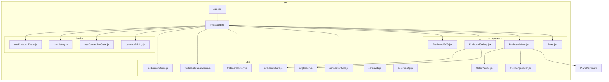

**Diagram sources**
- [Fretboard.jsx](file://src/Fretboard.jsx)
- [App.jsx](file://src/App.jsx)
- [FretboardSVG.jsx](file://src/components/FretboardSVG.jsx)
- [FretboardMenu.jsx](file://src/components/FretboardMenu.jsx)
- [FretboardGallery.jsx](file://src/components/FretboardGallery.jsx)

**Section sources**
- [Fretboard.jsx](file://src/Fretboard.jsx)
- [App.jsx](file://src/App.jsx)

## 核心组件
本节深入分析fretboard_diagram应用的核心组件及其相互关系。Fretboard.jsx作为主控组件，负责协调全局状态和子组件的集成。FretboardSVG.jsx负责渲染交互式SVG指板，FretboardMenu.jsx提供用户控制选项，而FretboardGallery.jsx则实现了历史状态的管理和分享功能。

**Section sources**
- [Fretboard.jsx](file://src/Fretboard.jsx)
- [FretboardSVG.jsx](file://src/components/FretboardSVG.jsx)
- [FretboardMenu.jsx](file://src/components/FretboardMenu.jsx)
- [FretboardGallery.jsx](file://src/components/FretboardGallery.jsx)

## 架构概览
fretboard_diagram应用采用以Fretboard.jsx为核心的组件化架构。App.jsx作为应用的根组件，仅负责渲染Fretboard主组件。Fretboard.jsx通过使用多个自定义hooks（如useFretboardState、useHistory）来管理复杂的状态，并将这些状态通过props传递给各个功能组件。这种设计模式实现了关注点分离，使得状态逻辑与UI渲染逻辑解耦。

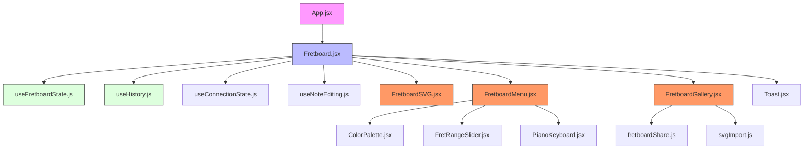

**Diagram sources**
- [App.jsx](file://src/App.jsx#L4-L8)
- [Fretboard.jsx](file://src/Fretboard.jsx#L23-L810)

## 详细组件分析
本节将对每个核心组件进行深入分析，包括其功能、属性、事件处理机制以及与其他组件的交互方式。

### Fretboard.jsx 主控组件分析
Fretboard.jsx是整个应用的核心控制器，它负责协调所有子组件并管理全局状态。该组件通过组合多个自定义hooks来实现复杂的状态管理，并将这些状态和事件处理器通过props传递给各个子组件。

#### 组件职责
Fretboard组件的主要职责包括：
- **状态管理**：通过`useFretboardState`、`useHistory`等自定义hooks管理应用的全局状态。
- **组件集成**：作为父组件，将状态和事件处理器传递给FretboardSVG、FretboardMenu和FretboardGallery等子组件。
- **事件处理**：创建并传递各种事件处理器，如颜色选择、音符编辑、状态保存等。
- **键盘事件**：注册全局键盘事件处理器，实现快捷键功能。

#### 状态管理
Fretboard组件通过解构多个自定义hooks来获取应用状态：

```mermaid
classDiagram
class Fretboard {
+fretboardState : object
+connectionState : object
+{undo, redo} : object
+noteEditing : object
+selected : object
+selectedColorLevel : number
+selectedColor : string
+hoveredNoteId : string
+hoveredConnectionId : string
+visibility : string
+startFret : number
+endFret : number
+enharmonic : number
+displayMode : string
+rootNote : number
+data : object
+errorMessage : string
+toastMessage : string
+toastType : string
+historyStates : array
+selectedHistoryState : object
+currentDateTime : string
+dataRef : Ref
+selectedTimeoutRef : Ref
}
Fretboard --> useFretboardState : "使用"
Fretboard --> useHistory : "使用"
Fretboard --> useConnectionState : "使用"
Fretboard --> useNoteEditing : "使用"
```

**Diagram sources**
- [Fretboard.jsx](file://src/Fretboard.jsx#L25-L28)
- [useFretboardState.js](file://src/hooks/useFretboardState.js#L5-L188)
- [useHistory.js](file://src/hooks/useHistory.js#L3-L108)
- [useConnectionState.js](file://src/hooks/useConnectionState.js)
- [useNoteEditing.js](file://src/hooks/useNoteEditing.js)

#### 事件处理器
Fretboard组件创建了大量事件处理器，并通过props传递给子组件。这些处理器包括：

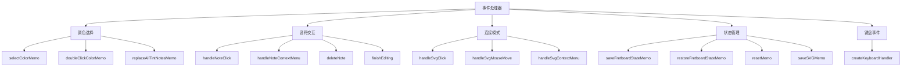

**Diagram sources**
- [Fretboard.jsx](file://src/Fretboard.jsx#L268-L474)

**Section sources**
- [Fretboard.jsx](file://src/Fretboard.jsx#L268-L474)

### FretboardSVG.jsx 交互式SVG渲染分析
FretboardSVG.jsx组件负责渲染交互式的吉他指板SVG图形。它接收来自Fretboard主组件的各种状态和事件处理器，实现了音符、品线、弦线和连接线的可视化渲染。

#### 渲染结构
该组件的渲染结构遵循SVG的标准分层原则，从底层到顶层依次渲染：

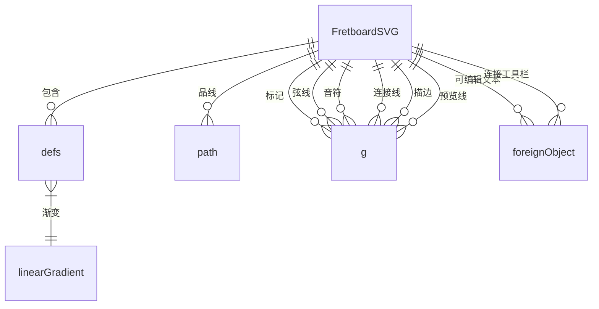

**Diagram sources**
- [FretboardSVG.jsx](file://src/components/FretboardSVG.jsx#L72-L1184)

#### 交互机制
FretboardSVG组件通过一系列事件处理器实现用户交互：

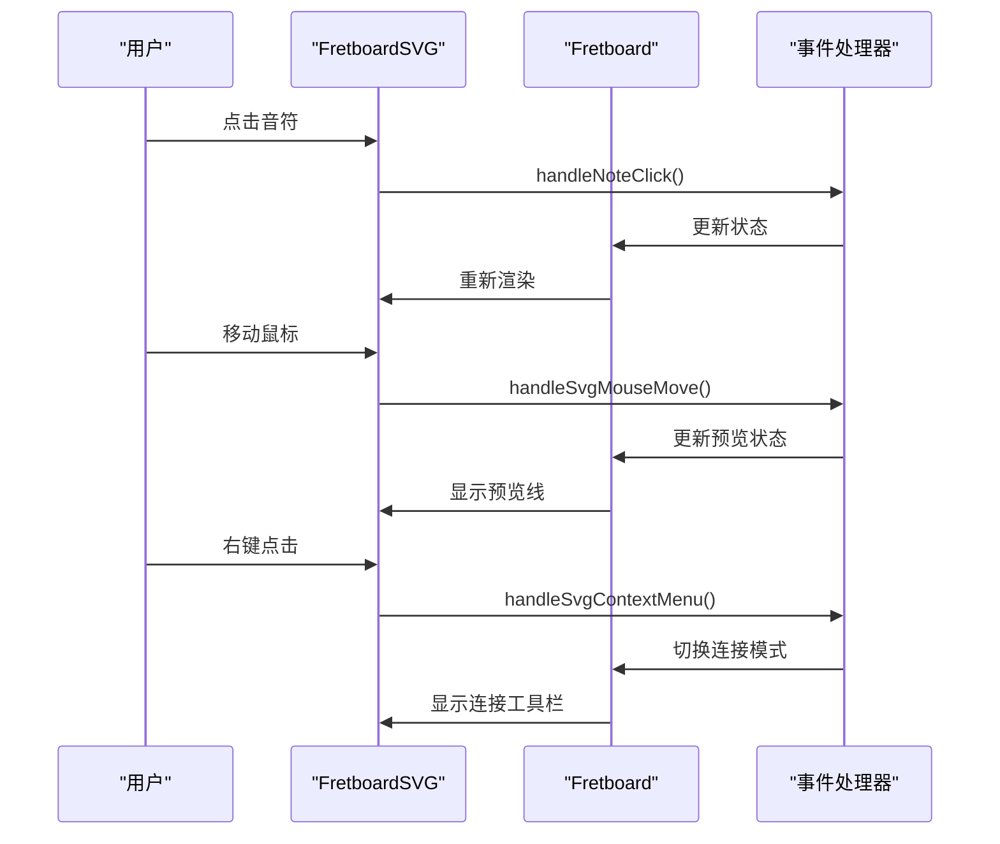

**Diagram sources**
- [FretboardSVG.jsx](file://src/components/FretboardSVG.jsx#L73-L85)
- [Fretboard.jsx](file://src/Fretboard.jsx#L292-L318)

**Section sources**
- [FretboardSVG.jsx](file://src/components/FretboardSVG.jsx#L73-L85)

### FretboardMenu.jsx 控制选项分析
FretboardMenu.jsx组件为用户提供了一系列控制选项，包括颜色选择、显示模式切换、连接工具和保存功能。

#### 功能模块
该组件由多个功能模块组成：

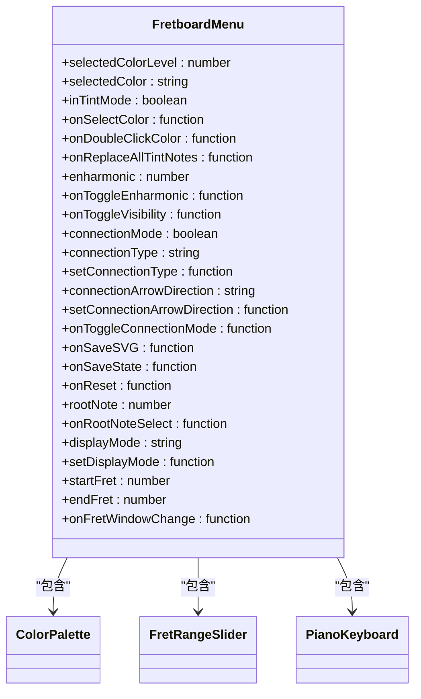

**Diagram sources**
- [FretboardMenu.jsx](file://src/components/FretboardMenu.jsx#L8-L40)

#### 组件集成
FretboardMenu组件集成了多个子组件，形成一个完整的控制面板：

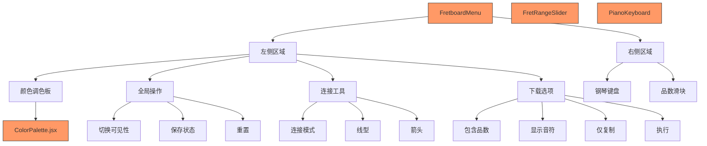

**Diagram sources**
- [FretboardMenu.jsx](file://src/components/FretboardMenu.jsx#L51-L241)

**Section sources**
- [FretboardMenu.jsx](file://src/components/FretboardMenu.jsx#L51-L241)

### FretboardGallery.jsx 历史状态管理分析
FretboardGallery.jsx组件实现了历史状态的管理和分享功能，允许用户保存、恢复、重命名和删除指板状态。

#### 状态管理功能
该组件提供了完整的历史状态管理功能：

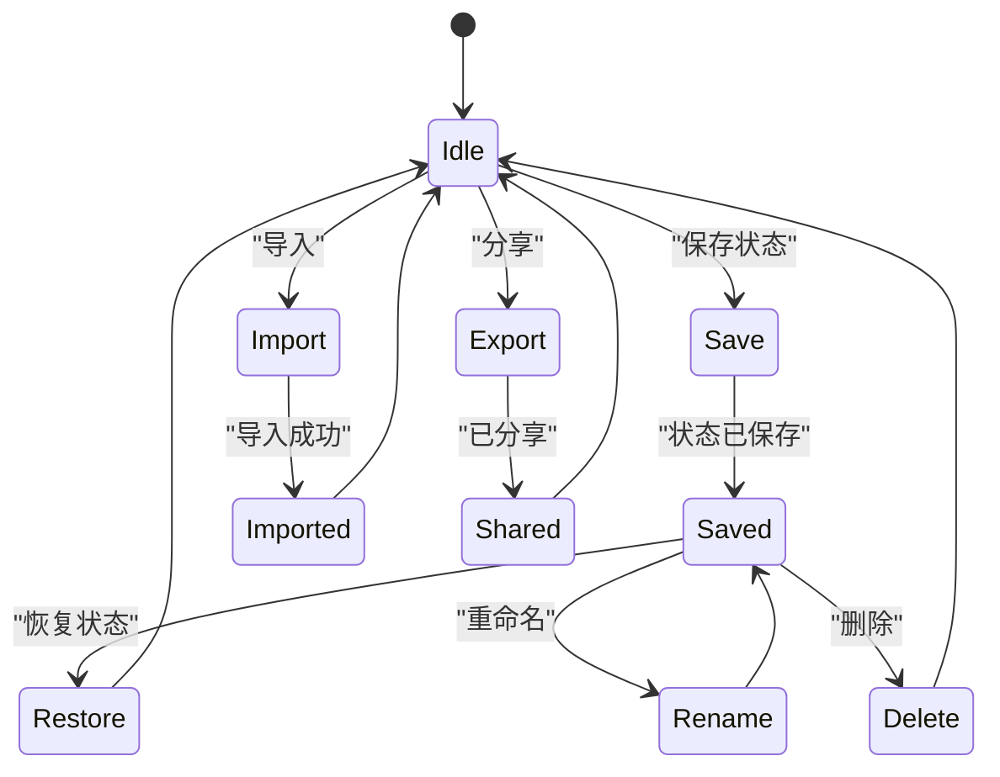

**Diagram sources**
- [FretboardGallery.jsx](file://src/components/FretboardGallery.jsx#L7-L385)

#### 数据流
FretboardGallery组件与主组件之间的数据流如下：

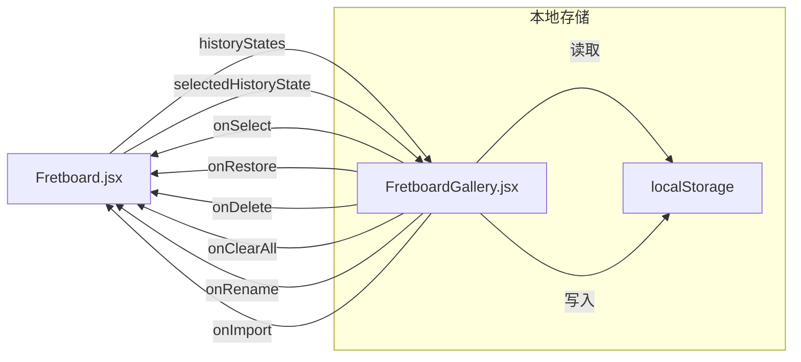

**Diagram sources**
- [Fretboard.jsx](file://src/Fretboard.jsx#L635-L798)
- [FretboardGallery.jsx](file://src/components/FretboardGallery.jsx#L7-L385)

**Section sources**
- [FretboardGallery.jsx](file://src/components/FretboardGallery.jsx#L7-L385)

### App.jsx 全局协调分析
App.jsx作为应用的顶层入口组件，负责协调全局状态和路由。虽然其代码非常简洁，但扮演着至关重要的角色。

#### 组件结构
App组件的结构极其简单，体现了单一职责原则：

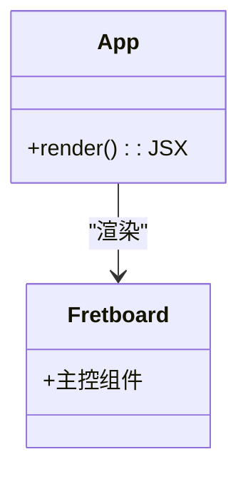

**Diagram sources**
- [App.jsx](file://src/App.jsx#L4-L9)

#### 职责分析
App组件的主要职责是作为应用的根容器，其功能包括：

```mermaid
flowchart TD
A[App.jsx] --> B[应用入口]
A --> C[根容器]
A --> D[路由协调]
A --> E[全局样式]
B --> B1[ReactDOM.render()]
C --> C1[<main>容器]
D --> D1[未来扩展]
E --> E1[CSS变量]
style A fill:#f9f,stroke:#333
```

**Diagram sources**
- [App.jsx](file://src/App.jsx#L4-L9)

**Section sources**
- [App.jsx](file://src/App.jsx#L4-L9)

## 依赖关系分析
本节分析各组件之间的依赖关系，揭示应用的架构设计。

#### 组件依赖图
```mermaid
graph TD
App --> Fretboard
Fretboard --> FretboardSVG
Fretboard --> FretboardMenu
Fretboard --> FretboardGallery
Fretboard --> Toast
FretboardMenu --> ColorPalette
FretboardMenu --> FretRangeSlider
FretboardMenu --> PianoKeyboard
FretboardGallery --> fretboardShare
FretboardGallery --> svgImport
Fretboard --> useFretboardState
Fretboard --> useHistory
Fretboard --> useConnectionState
Fretboard --> useNoteEditing
Fretboard --> fretboardActions
Fretboard --> fretboardCalculations
Fretboard --> fretboardHistory
Fretboard --> connectionUtils
style App fill:#f9f,stroke:#333
style Fretboard fill:#bbf,stroke:#333
style FretboardSVG fill:#f96,stroke:#333
style FretboardMenu fill:#f96,stroke:#333
style FretboardGallery fill:#f96,stroke:#333
style Toast fill:#f96,stroke:#333
style ColorPalette fill:#f96,stroke:#333
style FretRangeSlider fill:#f96,stroke:#333
style PianoKeyboard fill:#f96,stroke:#333
style useFretboardState fill:#dfd,stroke:#333
style useHistory fill:#dfd,stroke:#333
style useConnectionState fill:#dfd,stroke:#333
style useNoteEditing fill:#dfd,stroke:#333
style fretboardActions fill:#dfd,stroke:#333
style fretboardCalculations fill:#dfd,stroke:#333
style fretboardHistory fill:#dfd,stroke:#333
style connectionUtils fill:#dfd,stroke:#333
style fretboardShare fill:#dfd,stroke:#333
style svgImport fill:#dfd,stroke:#333
```

**Diagram sources**
- [App.jsx](file://src/App.jsx)
- [Fretboard.jsx](file://src/Fretboard.jsx)
- [FretboardSVG.jsx](file://src/components/FretboardSVG.jsx)
- [FretboardMenu.jsx](file://src/components/FretboardMenu.jsx)
- [FretboardGallery.jsx](file://src/components/FretboardGallery.jsx)

#### 状态流分析
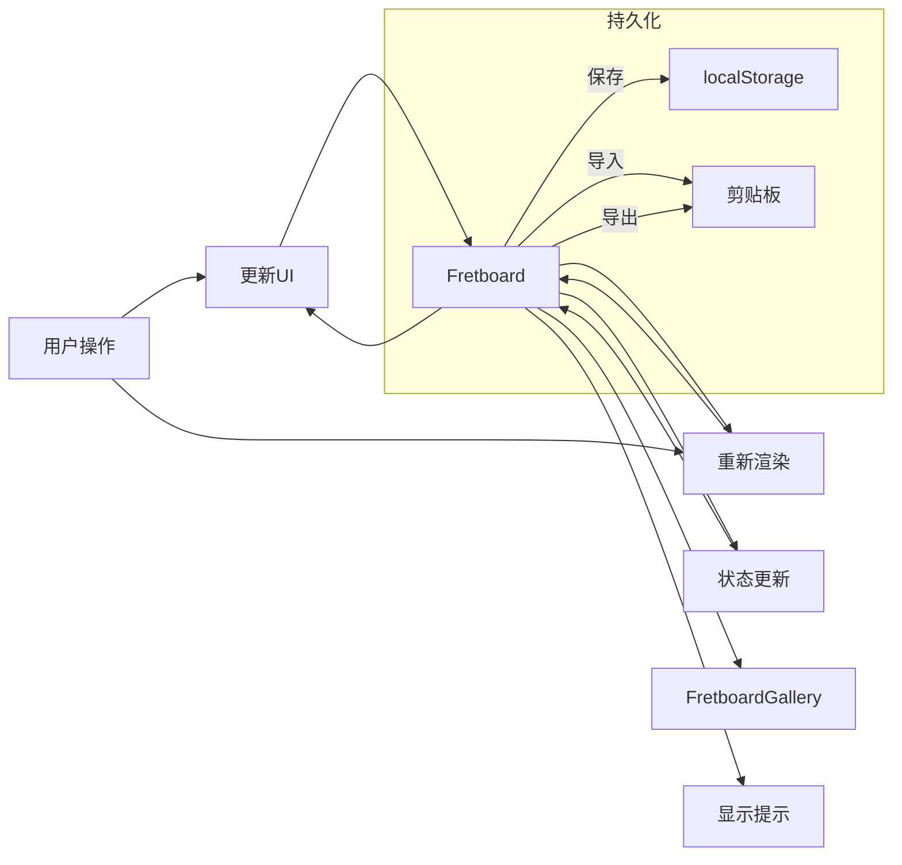

**Diagram sources**
- [Fretboard.jsx](file://src/Fretboard.jsx)
- [FretboardMenu.jsx](file://src/components/FretboardMenu.jsx)
- [FretboardSVG.jsx](file://src/components/FretboardSVG.jsx)
- [FretboardGallery.jsx](file://src/components/FretboardGallery.jsx)

**Section sources**
- [Fretboard.jsx](file://src/Fretboard.jsx)
- [FretboardMenu.jsx](file://src/components/FretboardMenu.jsx)
- [FretboardSVG.jsx](file://src/components/FretboardSVG.jsx)
- [FretboardGallery.jsx](file://src/components/FretboardGallery.jsx)

## 性能考虑
该应用在性能方面做了多项优化：

1. **useCallback优化**：大量使用`useCallback`来缓存事件处理器，避免不必要的重新渲染。
2. **useMemo优化**：使用`useMemo`缓存计算结果，如音符列表和标记位置。
3. **防抖机制**：在保存状态时使用防抖，避免短时间内频繁保存。
4. **局部更新**：通过精确的状态管理，确保只有受影响的组件才会重新渲染。
5. **DOM操作优化**：直接操作DOM元素来更新样式，而不是通过React状态，提高了性能。

这些优化措施确保了应用在处理复杂指板状态时仍能保持流畅的用户体验。

## 故障排除指南
当遇到问题时，可以参考以下指南进行排查：

1. **状态不更新**：检查事件处理器是否正确传递，确保`useCallback`的依赖数组正确。
2. **SVG渲染异常**：检查`viewBox`和`width`/`height`的计算是否正确。
3. **连接线不显示**：确认起点和终点音符是否存在，检查`connections`对象的结构。
4. **保存失败**：检查`localStorage`是否可用，确认状态对象可以被正确序列化。
5. **键盘事件不响应**：确保没有其他元素捕获了键盘事件，检查`createKeyboardHandler`的实现。

## 结论
fretboard_diagram应用通过精心设计的组件化架构，实现了功能丰富且易于维护的吉他指板图生成器。Fretboard.jsx作为主控组件，成功地协调了各个子组件，实现了复杂的状态管理和用户交互。该架构具有良好的可扩展性，便于未来添加新功能。