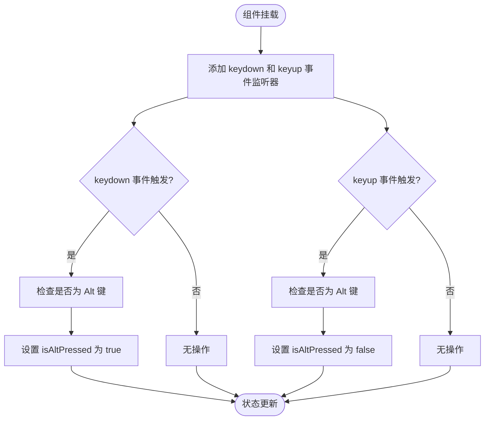
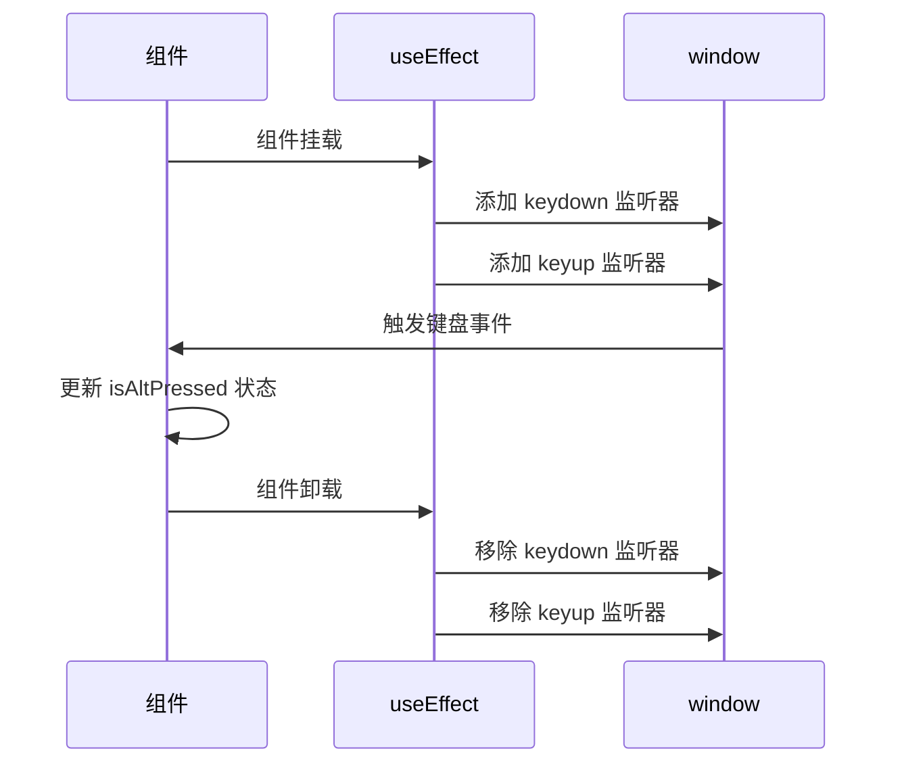

# useAltKey 全局按键状态监控

<cite>
**本文档引用的文件**
- [useAltKey.js](file://src/hooks/useAltKey.js#L1-L30)
- [noteHandlers.js](file://src/handlers/noteHandlers.js#L478-L512)
- [Fretboard.jsx](file://src/Fretboard.jsx#L477-L490)
</cite>

## 目录
1. [简介](#简介)
2. [核心功能分析](#核心功能分析)
3. [状态管理机制](#状态管理机制)
4. [事件监听逻辑](#事件监听逻辑)
5. [资源管理与清理](#资源管理与清理)
6. [使用示例](#使用示例)

## 简介
`useAltKey` 是一个自定义 React Hook，用于监控全局 Alt 键的按下状态。该 Hook 通过监听 window 级别的键盘事件，实时跟踪 Alt 键的状态变化，并将该状态暴露给其他组件使用。这种设计模式使得多个组件可以共享同一份按键状态，而无需重复实现事件监听逻辑。

**Section sources**
- [useAltKey.js](file://src/hooks/useAltKey.js#L1-L30)

## 核心功能分析
`useAltKey` Hook 的主要功能是提供一个响应式的 Alt 键状态，供其他组件判断是否执行特殊操作。在本项目中，该状态被用于控制音符删除等操作的行为。当 Alt 键被按下时，系统可以进入特殊操作模式，允许用户执行如批量删除等高级功能。

该 Hook 的设计体现了 React Hooks 的优势：将可复用的状态逻辑封装成独立的函数，提高代码的可维护性和可测试性。通过返回 `isAltPressed` 布尔值，其他组件可以简单地通过条件判断来决定是否执行特定操作。

**Section sources**
- [useAltKey.js](file://src/hooks/useAltKey.js#L1-L30)
- [noteHandlers.js](file://src/handlers/noteHandlers.js#L478-L512)

## 状态管理机制
`useAltKey` 使用 React 的 `useState` Hook 来管理 Alt 键的按下状态：

```javascript
const [isAltPressed, setIsAltPressed] = useState(false);
```

初始状态设置为 `false`，表示 Alt 键未被按下。当用户按下 Alt 键时，状态会被更新为 `true`；当用户释放 Alt 键时，状态会恢复为 `false`。这种状态管理方式确保了组件能够实时响应用户的键盘操作。

状态的更新是通过事件处理函数触发的，这些处理函数在组件挂载时被添加到 window 对象上。`isAltPressed` 状态作为 Hook 的返回值，可以被任何使用该 Hook 的组件访问和监听。

**Section sources**
- [useAltKey.js](file://src/hooks/useAltKey.js#L3-L4)

## 事件监听逻辑
`useAltKey` 使用 `useEffect` Hook 在组件挂载时设置事件监听器：



**Diagram sources**
- [useAltKey.js](file://src/hooks/useAltKey.js#L6-L26)

事件处理逻辑如下：

1. **keydown 事件处理**：当检测到 `event.key === 'Alt'` 或 `event.altKey` 为 true 时，调用 `setIsAltPressed(true)` 将状态设置为按下状态。
2. **keyup 事件处理**：当检测到 `event.key === 'Alt'` 或 `event.altKey` 为 false 时，调用 `setIsAltPressed(false)` 将状态设置为释放状态。

这种双重检查机制（检查 key 属性和 altKey 属性）确保了在不同浏览器和操作系统下都能正确识别 Alt 键的状态变化。

**Section sources**
- [useAltKey.js](file://src/hooks/useAltKey.js#L6-L26)

## 资源管理与清理
`useAltKey` 实现了完整的资源管理机制，避免了内存泄漏问题：



**Diagram sources**
- [useAltKey.js](file://src/hooks/useAltKey.js#L6-L26)

在 `useEffect` 的返回函数中，Hook 会清理创建的事件监听器：

```javascript
return () => {
    window.removeEventListener('keydown', handleKeyDown);
    window.removeEventListener('keyup', handleKeyUp);
};
```

这种清理机制是 React Hooks 的最佳实践，确保当使用该 Hook 的组件被卸载时，不会留下无效的事件监听器，从而避免内存泄漏和潜在的错误。

**Section sources**
- [useAltKey.js](file://src/hooks/useAltKey.js#L22-L25)

## 使用示例
以下是如何在组件中使用 `useAltKey` Hook 的示例：

```javascript
import { useAltKey } from './hooks/useAltKey';

function NoteComponent() {
    const isAltPressed = useAltKey();
    
    const handleDelete = () => {
        if (isAltPressed) {
            // Alt 键被按下，执行特殊删除逻辑
            console.log('执行批量删除操作');
        } else {
            // Alt 键未被按下，执行普通删除逻辑
            console.log('执行单个删除操作');
        }
    };
    
    return (
        <div>
            <button onClick={handleDelete}>
                删除音符
            </button>
            {isAltPressed && <span>Alt 键已激活</span>}
        </div>
    );
}
```

在本项目中，`useAltKey` 的状态可以被 `noteHandlers` 中的删除处理器使用，当 Alt 键被按下时，可以改变删除操作的行为，例如从删除单个音符变为删除多个选中的音符。

**Section sources**
- [useAltKey.js](file://src/hooks/useAltKey.js#L28-L29)
- [Fretboard.jsx](file://src/Fretboard.jsx#L477-L490)