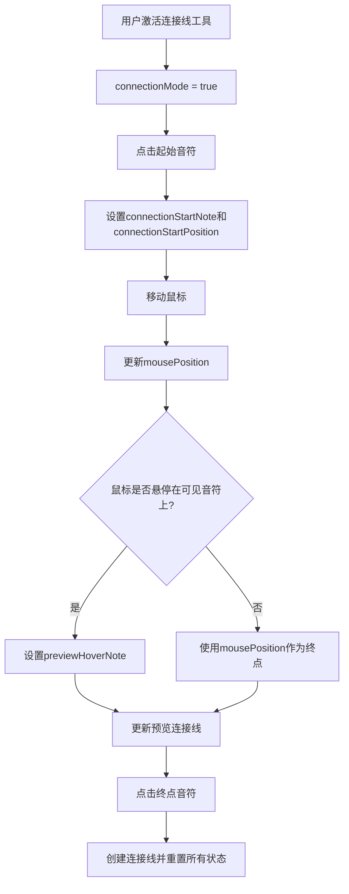
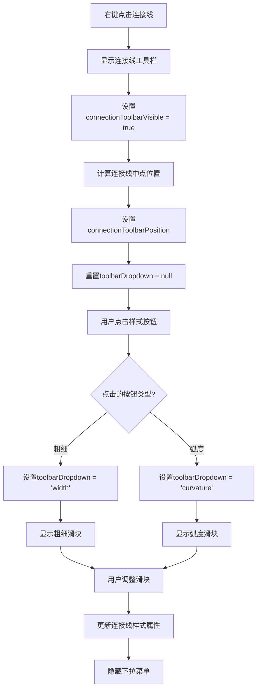
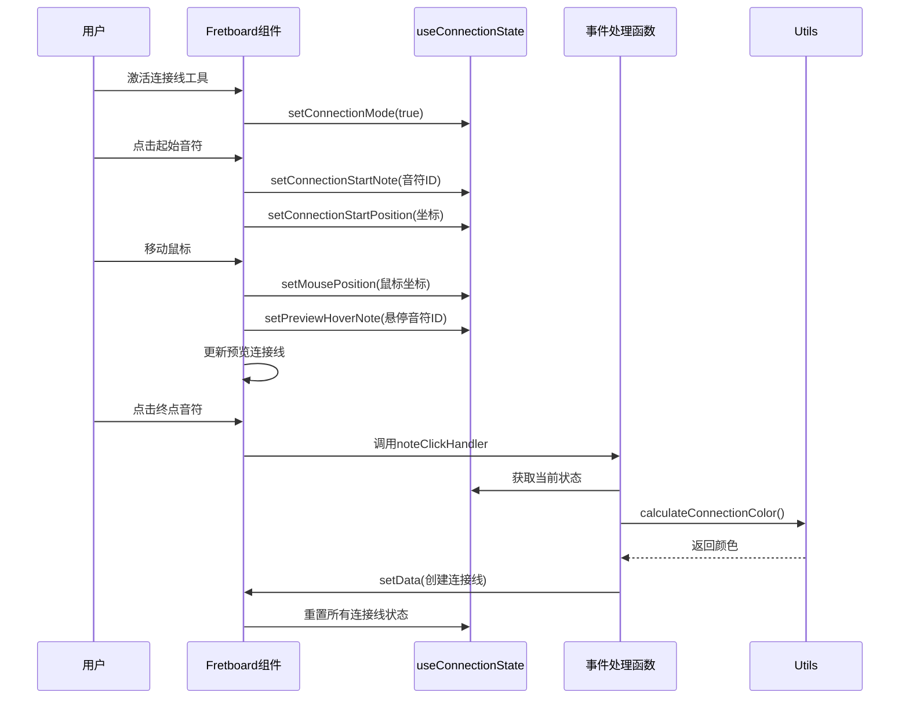

# useConnectionState 连接线状态管理

<cite>
**本文档引用的文件**   
- [useConnectionState.js](file://src/hooks/useConnectionState.js)
- [svgHandlers.js](file://src/handlers/svgHandlers.js)
- [FretboardSVG.jsx](file://src/components/FretboardSVG.jsx)
- [noteHandlers.js](file://src/handlers/noteHandlers.js)
- [connectionUtils.js](file://src/utils/connectionUtils.js)
- [utils.js](file://src/utils.js)
- [colorConfig.js](file://src/colorConfig.js)
- [Fretboard.jsx](file://src/Fretboard.jsx)
</cite>

## 目录
1. [简介](#简介)
2. [连接线交互状态管理](#连接线交互状态管理)
3. [连接线工具栏状态管理](#连接线工具栏状态管理)
4. [连接线样式属性状态](#连接线样式属性状态)
5. [连接线创建与绘制流程](#连接线创建与绘制流程)
6. [与SVG事件处理的集成](#与svg事件处理的集成)
7. [连接线颜色计算机制](#连接线颜色计算机制)
8. [结论](#结论)

## 简介
`useConnectionState` 自定义 Hook 是吉他指板图应用中连接线功能的核心状态管理器。该 Hook 负责管理用户创建和编辑连接线时的所有交互状态，包括连接模式、起始音符、鼠标位置、预览悬停等交互状态，以及连接线工具栏的相关状态和样式属性状态。通过精心设计的状态管理机制，该 Hook 实现了流畅的连接线创建和编辑体验，支持用户通过点击音符创建连接线、配置样式并完成绘制的完整流程。

**Section sources**
- [useConnectionState.js](file://src/hooks/useConnectionState.js#L1-L65)

## 连接线交互状态管理
`useConnectionState` Hook 通过多个 useState 钩子管理连接线的交互状态，这些状态共同协作实现连接线的创建和预览功能。

### 连接模式状态
`connectionMode` 状态是一个布尔值，用于标识当前是否处于连接线创建模式。当用户激活连接线工具时，该状态被设置为 `true`，进入连接线创建模式；当连接线创建完成或被取消时，该状态被重置为 `false`。

### 起始音符状态
`connectionStartNote` 状态存储当前连接线的起始音符ID。当用户在连接线模式下点击一个可见的音符时，该音符的ID被记录为起始音符，同时 `connectionStartPosition` 状态记录该音符的坐标位置。

### 鼠标位置状态
`mousePosition` 状态实时跟踪鼠标在SVG画布上的位置坐标。在连接线创建过程中，该状态用于动态更新预览连接线的终点位置，提供实时的视觉反馈。

### 预览悬停状态
`previewHoverNote` 状态用于标识鼠标当前悬停的音符ID。当鼠标移动到一个可见音符上时，该状态被更新为该音符的ID，触发预览连接线的终点更新。这种机制确保了连接线只能在可见音符之间创建，提高了用户体验的直观性。



**Diagram sources**
- [useConnectionState.js](file://src/hooks/useConnectionState.js#L22-L26)
- [svgHandlers.js](file://src/handlers/svgHandlers.js#L95-L117)
- [FretboardSVG.jsx](file://src/components/FretboardSVG.jsx#L643-L757)

**Section sources**
- [useConnectionState.js](file://src/hooks/useConnectionState.js#L22-L26)
- [svgHandlers.js](file://src/handlers/svgHandlers.js#L95-L117)
- [FretboardSVG.jsx](file://src/components/FretboardSVG.jsx#L643-L757)

## 连接线工具栏状态管理
连接线工具栏提供了一系列用于配置连接线样式的控件，`useConnectionState` Hook 通过多个状态变量管理工具栏的显示和交互逻辑。

### 工具栏可见性状态
`connectionToolbarVisible` 状态控制连接线工具栏的显示与隐藏。当用户右键点击已存在的连接线时，该状态被设置为 `true`，显示工具栏；当用户点击画布其他区域或完成样式配置时，该状态被重置为 `false`。

### 工具栏位置状态
`connectionToolbarPosition` 状态是一个包含 `x` 和 `y` 坐标的对象，用于确定工具栏在画布上的显示位置。工具栏通常显示在连接线的中点下方，避免遮挡连接线本身。

### 下拉菜单状态
`toolbarDropdown` 状态用于管理工具栏中下拉菜单的显示，其值可以是 `'type'`、`'arrow'`、`'width'`、`'curvature'` 或 `null`，分别对应不同类型的样式配置菜单。`toolbarDropdownDirection` 状态则用于确定下拉菜单的展开方向（向上或向下），确保菜单在画布可视区域内完全显示。



**Diagram sources**
- [useConnectionState.js](file://src/hooks/useConnectionState.js#L29-L32)
- [FretboardSVG.jsx](file://src/components/FretboardSVG.jsx#L794-L1184)
- [connectionUtils.js](file://src/utils/connectionUtils.js#L56-L74)

**Section sources**
- [useConnectionState.js](file://src/hooks/useConnectionState.js#L29-L32)
- [FretboardSVG.jsx](file://src/components/FretboardSVG.jsx#L794-L1184)

## 连接线样式属性状态
`useConnectionState` Hook 管理着连接线的核心样式属性，这些属性决定了连接线的外观和视觉效果。

### 颜色层级状态
`useColor2Level` 状态是一个布尔值，用于全局切换连接线的颜色层级。当音符具有双层颜色（color1 和 color2）时，该状态允许用户在两层颜色之间切换，从而影响连接线的颜色计算。这种机制确保了连接线颜色与音符颜色的一致性。

### 连接线类型状态
`connectionType` 状态定义了连接线的几何类型，其值可以是 `'line'`（直线）或 `'arc'`（弧线）。用户可以通过工具栏的类型按钮切换连接线类型，满足不同的可视化需求。

### 箭头方向状态
`connectionArrowDirection` 状态控制连接线箭头的显示方向，其值可以是 `'none'`（无箭头）、`'start'`（起点箭头）、`'end'`（终点箭头）或 `'both'`（双向箭头）。该状态通过循环切换机制实现，用户每次点击箭头按钮时，箭头方向按预定义顺序变化。

```mermaid
classDiagram
class ConnectionState {
+connectionMode : boolean
+connectionStartNote : string | null
+connectionStartPosition : {x : number, y : number} | null
+mousePosition : {x : number, y : number} | null
+previewHoverNote : string | null
+useColor2Level : boolean
+selectedConnection : string | null
+connectionToolbarVisible : boolean
+connectionToolbarPosition : {x : number, y : number}
+toolbarDropdown : 'type' | 'arrow' | 'width' | 'curvature' | null
+toolbarDropdownDirection : 'up' | 'down'
+connectionType : 'line' | 'arc'
+connectionArrowDirection : 'none' | 'start' | 'end' | 'both'
}
```

**Diagram sources**
- [useConnectionState.js](file://src/hooks/useConnectionState.js#L22-L35)

**Section sources**
- [useConnectionState.js](file://src/hooks/useConnectionState.js#L27-L35)

## 连接线创建与绘制流程
`useConnectionState` Hook 与事件处理函数协同工作，实现了完整的连接线创建与绘制流程。

### 创建流程
连接线的创建始于用户激活连接线工具并点击第一个音符。此时，`connectionMode` 被激活，`connectionStartNote` 被设置为点击的音符ID。当用户移动鼠标时，`mousePosition` 状态实时更新，同时系统检测鼠标是否悬停在其他可见音符上，相应地更新 `previewHoverNote` 状态。

### 绘制流程
当用户点击第二个音符时，系统创建连接线。首先，系统检查起点和终点音符的可见性，确保连接线只能在可见音符之间创建。然后，根据当前的 `connectionType`、`connectionArrowDirection` 等状态，以及起点和终点音符的颜色信息，计算连接线的最终样式。

### 样式配置
用户可以通过连接线工具栏对已创建的连接线进行样式配置。工具栏提供了类型切换、箭头方向切换、粗细调整、弧度调整等功能。这些配置通过更新 `data` 状态中的连接线属性来实现，触发界面的重新渲染。



**Diagram sources**
- [useConnectionState.js](file://src/hooks/useConnectionState.js)
- [noteHandlers.js](file://src/handlers/noteHandlers.js#L33-L184)
- [Fretboard.jsx](file://src/Fretboard.jsx#L70-L68)

**Section sources**
- [useConnectionState.js](file://src/hooks/useConnectionState.js)
- [noteHandlers.js](file://src/handlers/noteHandlers.js#L33-L184)

## 与SVG事件处理的集成
`useConnectionState` Hook 通过与SVG事件处理函数的紧密集成，实现了连接线功能的完整交互体验。

### 事件处理集成
在 `Fretboard` 组件中，`useConnectionState` 返回的状态被传递给多个SVG事件处理函数，包括 `createSvgClickHandler`、`createSvgMouseMoveHandler`、`createSvgMouseDownHandler` 等。这些处理函数根据当前的连接线状态执行相应的逻辑。

### 状态同步机制
当用户与界面交互时，事件处理函数会调用 `useConnectionState` 提供的 `set` 函数来更新状态。例如，`createSvgMouseMoveHandler` 在鼠标移动时更新 `mousePosition` 状态，`createNoteClickHandler` 在点击音符时更新 `connectionStartNote` 状态。这种单向数据流确保了状态的一致性和可预测性。

### 工具栏交互
连接线工具栏的交互也依赖于 `useConnectionState` 的状态管理。工具栏按钮的点击事件会调用相应的 `set` 函数来更新连接线样式属性，并通过 `setData` 函数将更改持久化到应用状态中。

**Section sources**
- [Fretboard.jsx](file://src/Fretboard.jsx#L54-L68)
- [svgHandlers.js](file://src/handlers/svgHandlers.js)
- [FretboardSVG.jsx](file://src/components/FretboardSVG.jsx)

## 连接线颜色计算机制
连接线的颜色计算是一个复杂的过程，涉及多个因素的综合判断。

### 颜色计算逻辑
`calculateConnectionColor` 函数根据起点和终点音符的颜色信息决定连接线的颜色。如果两个音符颜色相同，连接线使用该颜色的降低饱和度版本；如果颜色不同，连接线使用渐变效果；如果两个音符都是白色或透明色，连接线使用灰色。

### 颜色层级处理
当音符具有双层颜色时，`useColor2Level` 状态决定了使用哪一层颜色进行计算。系统会根据当前状态和音符的 `color2` 属性，动态选择用于颜色计算的实际颜色值。

### 渐变处理
对于不同颜色的音符之间的连接线，系统创建线性渐变定义，渐变方向从起点音符指向终点音符。渐变的起始和结束颜色基于音符的实际显示颜色，确保视觉效果的连贯性。

**Section sources**
- [utils.js](file://src/utils.js#L441-L467)
- [connectionUtils.js](file://src/utils/connectionUtils.js#L86-L195)
- [FretboardSVG.jsx](file://src/components/FretboardSVG.jsx#L98-L169)

## 结论
`useConnectionState` 自定义 Hook 通过精心设计的状态管理机制，实现了连接线功能的完整交互体验。该 Hook 不仅管理了连接线创建过程中的各种交互状态，还提供了丰富的样式配置选项，通过与SVG事件处理函数的紧密集成，确保了用户操作的流畅性和直观性。其模块化的设计使得连接线功能易于维护和扩展，为吉他指板图应用提供了强大的可视化支持。