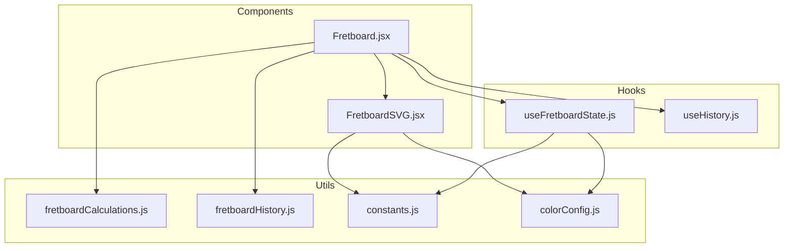
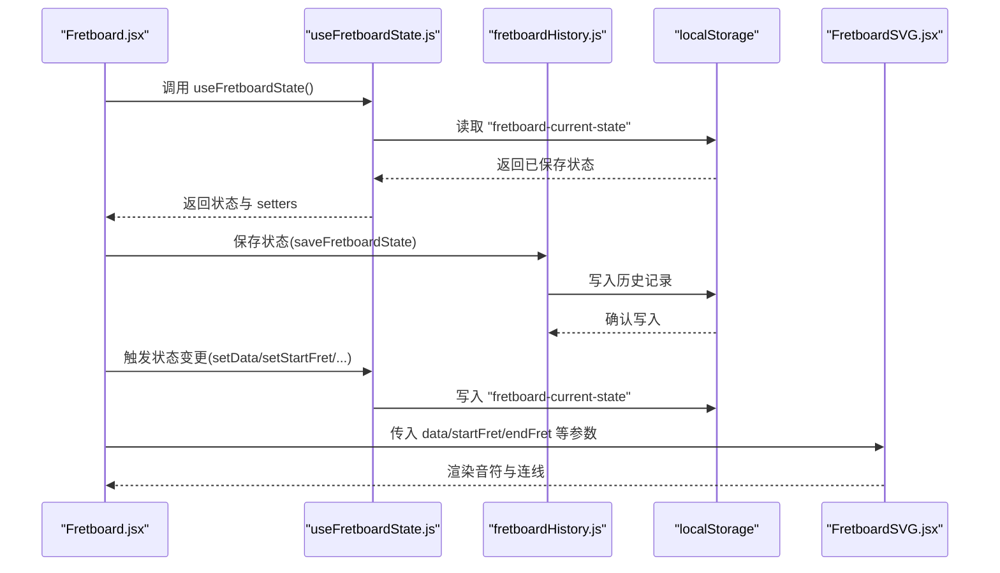
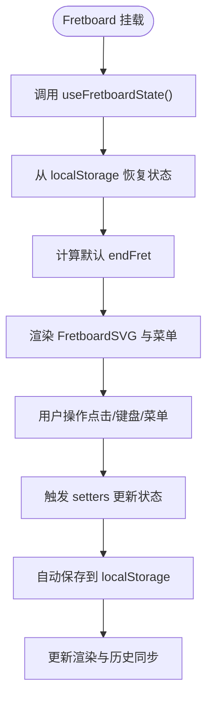
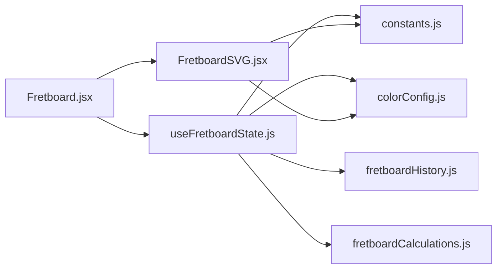

# useFretboardState 状态管理

<cite>
**本文档引用的文件**
- [useFretboardState.js](file://src/hooks/useFretboardState.js)
- [Fretboard.jsx](file://src/Fretboard.jsx)
- [fretboardHistory.js](file://src/utils/fretboardHistory.js)
- [fretboardCalculations.js](file://src/utils/fretboardCalculations.js)
- [constants.js](file://src/constants.js)
- [colorConfig.js](file://src/colorConfig.js)
- [useHistory.js](file://src/hooks/useHistory.js)
- [FretboardSVG.jsx](file://src/components/FretboardSVG.jsx)
</cite>

## 目录
1. [简介](#简介)
2. [项目结构](#项目结构)
3. [核心组件](#核心组件)
4. [架构总览](#架构总览)
5. [详细组件分析](#详细组件分析)
6. [依赖关系分析](#依赖关系分析)
7. [性能考量](#性能考量)
8. [故障排查指南](#故障排查指南)
9. [结论](#结论)

## 简介
本文件深入文档化 useFretboardState 自定义 Hook 的实现机制，解释其如何通过 useState 管理指板核心状态，包括音符数据（data）、品格范围（startFret/endFret）、升降号设置（enharmonic）、显示模式（displayMode）、根音（rootNote）、可见性（visibility）以及颜色选择状态。文档还阐述其如何利用 useRef 避免闭包问题，并通过 useEffect 在组件挂载时从 localStorage 恢复状态，在状态变化时自动持久化。描述其对历史状态的同步机制以及当前时间的动态更新逻辑。最后提供该 Hook 的返回值列表及其用途，并结合 Fretboard 组件说明其调用方式和数据流，包含错误处理策略和性能优化建议。

## 项目结构
该仓库采用按功能模块组织的结构，核心状态管理位于 hooks 目录，业务逻辑分布在 utils 目录，UI 组件位于 components 目录，入口文件位于 src 目录。useFretboardState 作为核心状态钩子，被 Fretboard 主组件消费，并与历史记录、颜色配置、计算工具等模块协同工作。

图表来源
- [useFretboardState.js](file://src/hooks/useFretboardState.js#L1-L190)
- [Fretboard.jsx](file://src/Fretboard.jsx#L1-L811)
- [fretboardHistory.js](file://src/utils/fretboardHistory.js#L1-L333)
- [fretboardCalculations.js](file://src/utils/fretboardCalculations.js#L1-L135)
- [constants.js](file://src/constants.js#L1-L19)
- [colorConfig.js](file://src/colorConfig.js#L1-L162)

章节来源
- [useFretboardState.js](file://src/hooks/useFretboardState.js#L1-L190)
- [Fretboard.jsx](file://src/Fretboard.jsx#L1-L811)

## 核心组件
useFretboardState 是一个集中管理指板状态的自定义 Hook，负责：
- 管理指板外观与行为的核心状态：音符数据、品格范围、升降号、显示模式、根音、可见性、颜色选择等
- 通过 localStorage 实现跨会话持久化与恢复
- 通过 useRef 避免闭包陷阱，保证回调与事件处理器能读取最新状态
- 通过 useEffect 实现初始化恢复、自动保存、历史状态同步与当前时间动态更新

章节来源
- [useFretboardState.js](file://src/hooks/useFretboardState.js#L5-L189)

## 架构总览
useFretboardState 与 Fretboard 主组件的交互如下：Fretboard 调用 useFretboardState 获取状态与 setter，并将状态传递给 FretboardSVG 渲染器与菜单组件。同时，useFretboardState 通过 localStorage 与 fretboardHistory 工具协作，实现历史状态的保存与恢复。

图表来源
- [useFretboardState.js](file://src/hooks/useFretboardState.js#L35-L148)
- [fretboardHistory.js](file://src/utils/fretboardHistory.js#L38-L173)
- [Fretboard.jsx](file://src/Fretboard.jsx#L23-L811)
- [FretboardSVG.jsx](file://src/components/FretboardSVG.jsx#L9-L71)

## 详细组件分析

### useFretboardState 状态字段与职责
- 基础状态
  - selected: 当前选中的音符或连线
  - selectedColorLevel/selectedColor: 当前选中的颜色层级与颜色
  - hoveredNoteId/hoveredConnectionId: 当前 hover 的音符或连线 ID
  - visibility: 音符可见性（transparent/hidden/visible）
  - startFret/endFret: 指板起止品格
  - enharmonic: 升降号模式（1 为降号）
  - displayMode: 显示模式（note/solfege）
  - rootNote: 根音（用于 solfege 模式）
  - data: 音符与连线的完整数据结构
  - errorMessage/toastMessage/toastType: 错误与提示信息
  - historyStates/selectedHistoryState: 历史状态列表与当前选中历史状态
  - currentDateTime: 当前时间字符串（每秒更新）

- 引用与同步
  - dataRef: 保存 data 的最新引用，避免闭包陷阱
  - selectedTimeoutRef: 选中音符的定时器引用

- 生命周期与持久化
  - 组件挂载时从 localStorage 恢复状态，若无则按屏幕宽度计算默认 endFret
  - 状态变化时自动保存到 localStorage
  - 历史状态从 localStorage 加载并尝试与当前状态匹配，自动选中一致的历史项
  - 每秒更新 currentDateTime

章节来源
- [useFretboardState.js](file://src/hooks/useFretboardState.js#L5-L189)

### 状态恢复与自动保存机制
- 恢复流程
  - 读取 localStorage 中的 "fretboard-current-state"
  - 若存在，逐项恢复 data、startFret、endFret、enharmonic、displayMode、rootNote、visibility
  - 若不存在，按窗口宽度计算初始 endFret
  - 异常时记录错误并回退到默认 endFret

- 自动保存流程
  - 使用 useRef 标记首次挂载，跳过初始化时的保存
  - 监听 data、startFret、endFret、enharmonic、displayMode、rootNote、visibility 的变化
  - 将当前状态序列化并写入 localStorage

- 历史状态同步
  - 读取 localStorage 中的 "fretboard-history"
  - 将历史数组注入 historyStates
  - 尝试匹配当前状态与最新历史项，若一致则自动选中该历史项

- 当前时间更新
  - 每秒更新 currentDateTime，格式为 YY-MM-DD HH:mm:ss

章节来源
- [useFretboardState.js](file://src/hooks/useFretboardState.js#L35-L122)
- [useFretboardState.js](file://src/hooks/useFretboardState.js#L124-L148)
- [useFretboardState.js](file://src/hooks/useFretboardState.js#L67-L84)

### 闭包问题与 useRef 避免策略
- dataRef.current 保持 data 的最新值，供回调与事件处理器读取
- selectedTimeoutRef 用于管理选中音符的自动解除逻辑，避免多次定时器叠加

章节来源
- [useFretboardState.js](file://src/hooks/useFretboardState.js#L27-L33)
- [useFretboardState.js](file://src/hooks/useFretboardState.js#L28-L28)

### 与 Fretboard 组件的数据流
- Fretboard 调用 useFretboardState 获取状态与 setters
- 将状态解构后传递给 FretboardSVG、菜单组件与画廊组件
- 通过 useMemo 与 useCallback 优化渲染与事件处理器
- 通过工具函数（如 saveFretboardState、restoreFretboardState）与历史记录交互

图表来源
- [Fretboard.jsx](file://src/Fretboard.jsx#L23-L811)
- [useFretboardState.js](file://src/hooks/useFretboardState.js#L35-L148)

章节来源
- [Fretboard.jsx](file://src/Fretboard.jsx#L23-L811)

### 与历史记录的协作
- 保存状态：saveFretboardState 将当前状态深拷贝并生成缩略图，写入 localStorage，更新历史数组并置顶
- 恢复状态：restoreFretboardState 深拷贝历史状态，清理临时状态，按顺序更新显示相关状态与 data
- 静默保存：saveFretboardStateSilently 在页面关闭前自动保存，避免重复保存

章节来源
- [fretboardHistory.js](file://src/utils/fretboardHistory.js#L38-L173)
- [fretboardHistory.js](file://src/utils/fretboardHistory.js#L175-L260)
- [fretboardHistory.js](file://src/utils/fretboardHistory.js#L262-L332)

### 颜色配置与计算
- 颜色配置：LEVEL1_COLORS 与 LEVEL2_COLORS 定义颜色映射，initColorCSSVariables 初始化 CSS 变量
- 异色变体：generateTintVariants 基于 HSL 转换生成不同浓度的变体
- 计算工具：fretboardCalculations 提供音符索引、名称与标记生成等计算函数

章节来源
- [colorConfig.js](file://src/colorConfig.js#L1-L162)
- [fretboardCalculations.js](file://src/utils/fretboardCalculations.js#L1-L135)
- [constants.js](file://src/constants.js#L1-L19)

### 返回值列表与用途
useFretboardState 返回以下状态与引用：
- 选择与颜色
  - selected/setSelected：当前选中音符或连线
  - selectedColorLevel/setSelectedColorLevel：颜色层级（1/2/null）
  - selectedColor/setSelectedColor：当前颜色（含自定义变体）
- 悬停状态
  - hoveredNoteId/setHoveredNoteId：当前 hover 的音符 ID
  - hoveredConnectionId/setHoveredConnectionId：当前 hover 的连线 ID
- 显示与范围
  - visibility/setVisibility：音符可见性
  - startFret/setStartFret：起始品格
  - endFret/setEndFret：结束品格
  - enharmonic/setEnharmonic：升降号模式
  - displayMode/setDisplayMode：显示模式
  - rootNote/setRootNote：根音
- 数据与历史
  - data/setData：音符与连线数据
  - historyStates/setHistoryStates：历史状态数组
  - selectedHistoryState/setSelectedHistoryState：当前选中的历史状态
- 信息与时间
  - errorMessage/setErrorMessage：错误信息
  - toastMessage/setToastMessage：提示消息
  - toastType/setToastType：提示类型
  - currentDateTime：当前时间字符串
- 引用
  - dataRef：data 的最新引用
  - selectedTimeoutRef：选中音符定时器引用

章节来源
- [useFretboardState.js](file://src/hooks/useFretboardState.js#L150-L188)

## 依赖关系分析
useFretboardState 与以下模块存在直接依赖关系：
- constants.js：提供常量（如音符名称、间距、标记位置等）
- colorConfig.js：提供颜色配置与变体生成
- fretboardHistory.js：提供历史状态保存与恢复
- fretboardCalculations.js：提供音符索引与名称计算
- Fretboard.jsx：消费 useFretboardState 的状态并传递给子组件
- FretboardSVG.jsx：接收 data、startFret、endFret 等参数进行渲染

图表来源
- [useFretboardState.js](file://src/hooks/useFretboardState.js#L1-L5)
- [Fretboard.jsx](file://src/Fretboard.jsx#L1-L22)
- [FretboardSVG.jsx](file://src/components/FretboardSVG.jsx#L1-L7)

章节来源
- [useFretboardState.js](file://src/hooks/useFretboardState.js#L1-L5)
- [Fretboard.jsx](file://src/Fretboard.jsx#L1-L22)
- [FretboardSVG.jsx](file://src/components/FretboardSVG.jsx#L1-L7)

## 性能考量
- 状态粒度控制：将 data 与显示相关状态分离，减少不必要的重渲染
- useMemo 与 useCallback：在 Fretboard 中对计算结果与事件处理器进行缓存，降低渲染成本
- localStorage 写入节流：历史保存采用防抖（300ms）与深拷贝，避免频繁 IO 与内存占用
- 自动保存时机：使用 useRef 标记首次挂载，跳过初始化时的保存，减少冗余写入
- 历史记录上限：限制历史数组长度（最多 50），避免无限增长
- DOM 更新优化：通过 dataRef 与 setSelectedTimeoutRef 避免闭包陷阱，减少无效 DOM 操作

章节来源
- [Fretboard.jsx](file://src/Fretboard.jsx#L110-L120)
- [Fretboard.jsx](file://src/Fretboard.jsx#L410-L435)
- [useFretboardState.js](file://src/hooks/useFretboardState.js#L124-L148)
- [fretboardHistory.js](file://src/utils/fretboardHistory.js#L153-L156)

## 故障排查指南
- 恢复失败
  - 现象：从 localStorage 恢复状态时报错或 endFret 未按预期设置
  - 排查：检查 localStorage 中 "fretboard-current-state" 的格式与完整性；确认异常捕获逻辑是否执行默认 endFret 计算
  - 参考
    - [useFretboardState.js](file://src/hooks/useFretboardState.js#L35-L65)

- 自动保存失败
  - 现象：状态变化后未写入 localStorage
  - 排查：确认 isInitialMount 标记是否正确跳过初始化保存；检查依赖数组是否包含所有相关状态
  - 参考
    - [useFretboardState.js](file://src/hooks/useFretboardState.js#L124-L148)

- 历史状态不匹配
  - 现象：当前状态与历史项不一致，未自动选中历史项
  - 排查：确认比较逻辑是否基于 data、startFret、endFret、enharmonic、displayMode、rootNote、visibility 等关键字段
  - 参考
    - [useFretboardState.js](file://src/hooks/useFretboardState.js#L94-L122)

- 时间更新异常
  - 现象：currentDateTime 不更新或更新频率异常
  - 排查：确认定时器是否正确创建与清理；检查依赖数组是否为空
  - 参考
    - [useFretboardState.js](file://src/hooks/useFretboardState.js#L67-L84)

- 颜色与变体问题
  - 现象：异色变体显示异常或颜色切换不生效
  - 排查：确认 generateTintVariants 与 getLevel1FillColor/getLevel2Color 的调用；检查 selectedColor 的对象结构
  - 参考
    - [colorConfig.js](file://src/colorConfig.js#L58-L97)
    - [useFretboardState.js](file://src/hooks/useFretboardState.js#L150-L188)

## 结论
useFretboardState 通过精细的状态划分、localStorage 持久化与 useRef 闭包规避，实现了稳定可靠的指板状态管理。配合 useMemo、useCallback 与历史记录工具，系统在性能与用户体验之间取得良好平衡。建议在扩展新功能时遵循现有模式，确保状态一致性与可维护性。