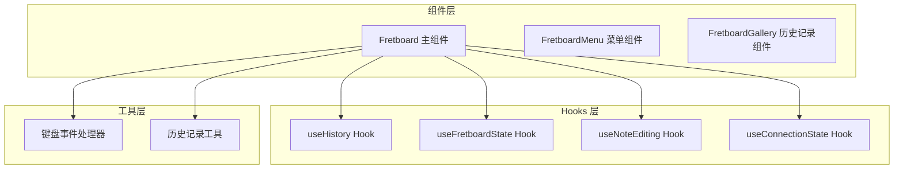
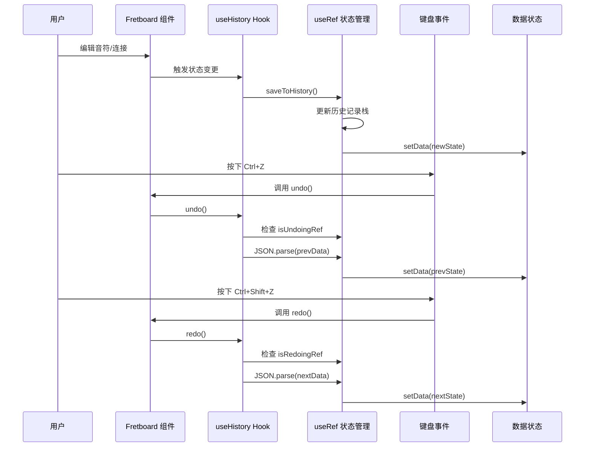
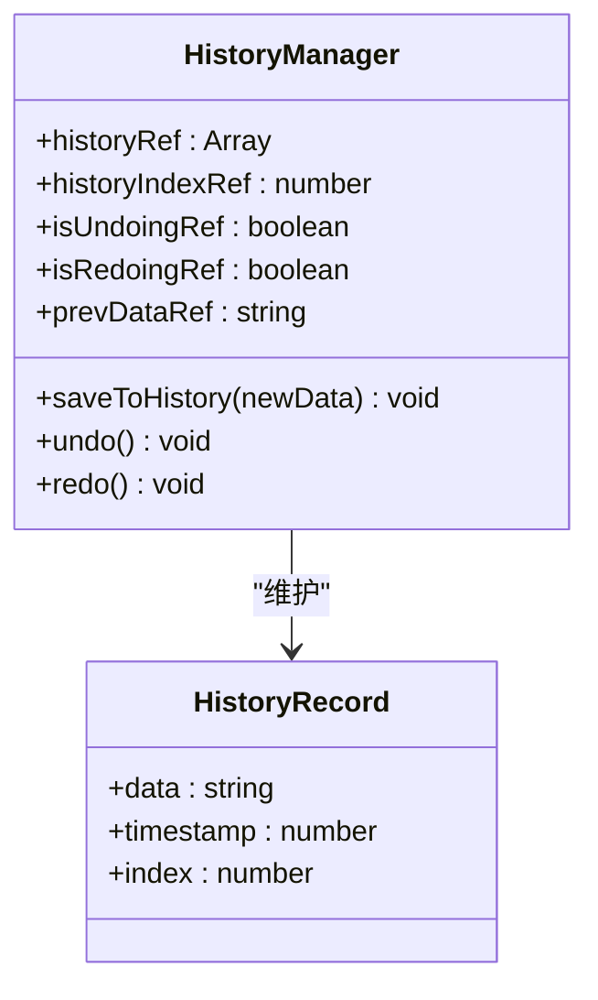
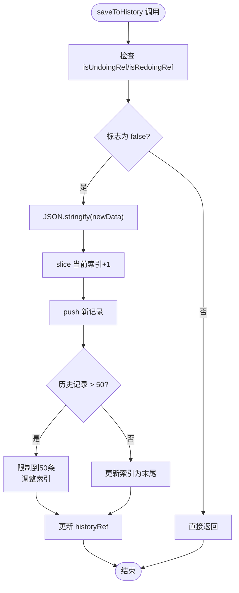
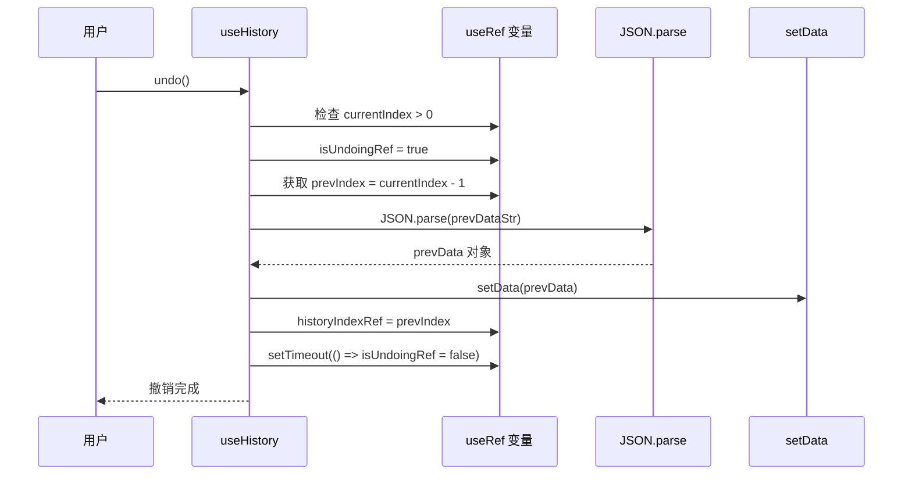
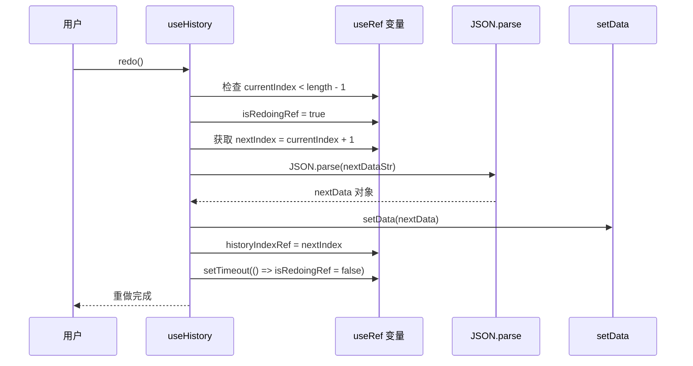
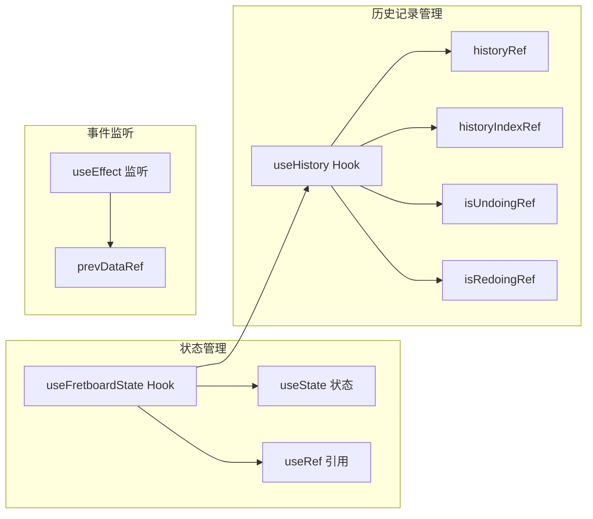
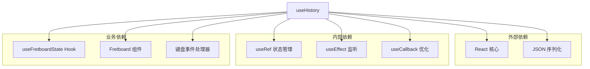

# useHistory 撤销重做管理

<cite>
**本文档引用的文件**
- [useHistory.js](file://src/hooks/useHistory.js)
- [useFretboardState.js](file://src/hooks/useFretboardState.js)
- [Fretboard.jsx](file://src/Fretboard.jsx)
- [keyboardHandlers.js](file://src/handlers/keyboardHandlers.js)
- [fretboardHistory.js](file://src/utils/fretboardHistory.js)
- [useNoteEditing.js](file://src/hooks/useNoteEditing.js)
- [useConnectionState.js](file://src/hooks/useConnectionState.js)
</cite>

## 目录
1. [简介](#简介)
2. [项目结构](#项目结构)
3. [核心组件](#核心组件)
4. [架构概览](#架构概览)
5. [详细组件分析](#详细组件分析)
6. [依赖关系分析](#依赖关系分析)
7. [性能考量](#性能考量)
8. [故障排除指南](#故障排除指南)
9. [结论](#结论)

## 简介

useHistory 是一个自定义 React Hook，专门用于管理指板图编辑器应用中的撤销/重做功能。该 Hook 通过 useRef 维护历史记录栈和当前索引，实现了智能的历史记录管理和防抖机制，确保用户在编辑音符、连接线等操作时能够安全地进行撤销和重做操作。

## 项目结构

该项目采用模块化的架构设计，useHistory Hook 位于 hooks 目录下，与业务逻辑紧密集成：

**图表来源**
- [useHistory.js](file://src/hooks/useHistory.js#L1-L109)
- [Fretboard.jsx](file://src/Fretboard.jsx#L1-L811)

**章节来源**
- [useHistory.js](file://src/hooks/useHistory.js#L1-L109)
- [Fretboard.jsx](file://src/Fretboard.jsx#L1-L811)

## 核心组件

useHistory Hook 的核心功能包括：

### 历史记录管理
- 使用 useRef 维护历史记录数组和当前索引
- 支持分支历史的智能处理
- 历史记录数量限制（最多50条）

### 防抖机制
- 通过 isUndoingRef 和 isRedoingRef 标志防止循环触发
- 在撤销/重做过程中阻止新的历史记录保存

### 安全的状态解析
- 使用 JSON.parse 确保历史记录的完整性
- 异常处理机制保护应用稳定性

**章节来源**
- [useHistory.js](file://src/hooks/useHistory.js#L3-L109)

## 架构概览

useHistory Hook 在整个应用架构中的位置和作用：

**图表来源**
- [useHistory.js](file://src/hooks/useHistory.js#L11-L107)
- [keyboardHandlers.js](file://src/handlers/keyboardHandlers.js#L61-L75)

## 详细组件分析

### useHistory Hook 实现详解

#### 历史记录栈管理

useHistory Hook 使用四个 useRef 变量来维护历史记录状态：

**图表来源**
- [useHistory.js](file://src/hooks/useHistory.js#L4-L8)

#### saveToHistory 函数实现

该函数负责处理历史记录的保存逻辑：

**图表来源**
- [useHistory.js](file://src/hooks/useHistory.js#L11-L33)

#### 撤销功能实现

撤销操作的安全实现机制：

**图表来源**
- [useHistory.js](file://src/hooks/useHistory.js#L36-L58)

#### 重做功能实现

重做操作与撤销的对称实现：

**图表来源**
- [useHistory.js](file://src/hooks/useHistory.js#L61-L83)

### 与 useFretboardState 的协同工作机制

useHistory Hook 与 useFretboardState Hook 的深度集成：

**图表来源**
- [useFretboardState.js](file://src/hooks/useFretboardState.js#L1-L190)
- [useHistory.js](file://src/hooks/useHistory.js#L86-L102)

### 键盘快捷键集成

应用通过键盘事件处理器集成撤销/重做功能：

| 快捷键组合 | 功能 | 触发条件 |
|-----------|------|----------|
| Ctrl+Z | 撤销 | 无修饰键 + Z 键 |
| Ctrl+Shift+Z | 重做 | Ctrl+Shift + Z 键 |
| Ctrl+S | 保存状态 | Ctrl+S |
| Ctrl+Shift+S | 强制新建状态 | Ctrl+Shift+S |

**章节来源**
- [keyboardHandlers.js](file://src/handlers/keyboardHandlers.js#L61-L75)

## 依赖关系分析

useHistory Hook 的依赖关系和耦合度分析：

**图表来源**
- [useHistory.js](file://src/hooks/useHistory.js#L1-L109)
- [Fretboard.jsx](file://src/Fretboard.jsx#L27-L27)

**章节来源**
- [useHistory.js](file://src/hooks/useHistory.js#L1-L109)
- [Fretboard.jsx](file://src/Fretboard.jsx#L27-L27)

## 性能考量

### 内存使用优化

- 历史记录数量限制：最多保存50条历史记录
- JSON 序列化开销：每次状态变更都会进行序列化
- useRef 使用：避免不必要的组件重渲染

### 性能监控指标

| 指标 | 目标值 | 说明 |
|------|--------|------|
| 历史记录数量 | ≤ 50 | 限制内存占用 |
| 序列化时间 | < 10ms | 确保响应速度 |
| 撤销/重做延迟 | < 50ms | 提升用户体验 |
| 组件重渲染次数 | 最小化 | 通过 useCallback 优化 |

## 故障排除指南

### 常见问题及解决方案

#### 撤销/重做循环触发
**问题描述**：撤销或重做操作触发了无限循环
**解决方案**：
- 检查 isUndoingRef 和 isRedoingRef 标志位
- 确保 setTimeout 正确重置标志位

#### 历史记录丢失
**问题描述**：历史记录在分支操作后丢失
**解决方案**：
- 确保 saveToHistory 正确处理分支历史
- 检查 slice 操作是否正确截断后续记录

#### JSON 解析错误
**问题描述**：撤销时出现 JSON 解析异常
**解决方案**：
- 检查历史记录的完整性
- 添加适当的错误处理和日志记录

**章节来源**
- [useHistory.js](file://src/hooks/useHistory.js#L49-L51)
- [useHistory.js](file://src/hooks/useHistory.js#L74-L76)

## 结论

useHistory Hook 通过精心设计的 useRef 状态管理和防抖机制，为指板图编辑器提供了稳定可靠的撤销/重做功能。其核心优势包括：

1. **安全性**：通过标志位防止循环触发，确保撤销/重做操作的原子性
2. **效率性**：合理的内存管理策略，限制历史记录数量
3. **可靠性**：完善的错误处理机制，保证应用稳定性
4. **可扩展性**：与现有组件架构无缝集成，支持未来功能扩展

该实现为类似复杂状态管理的应用提供了优秀的参考模式，特别是在需要精确控制状态变更历史的场景中。