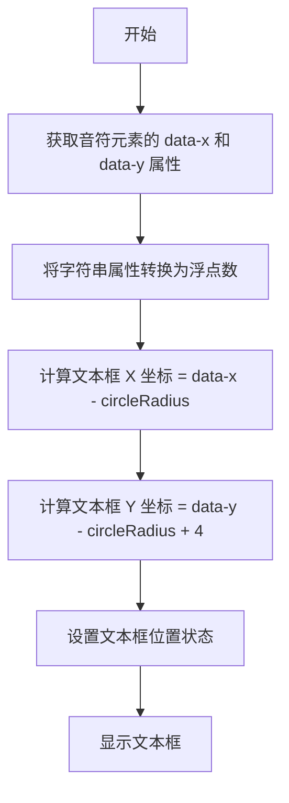
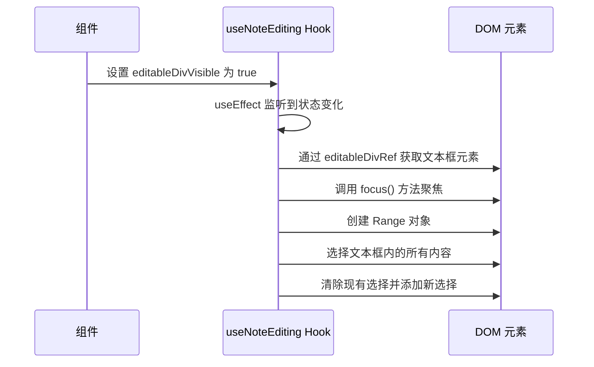
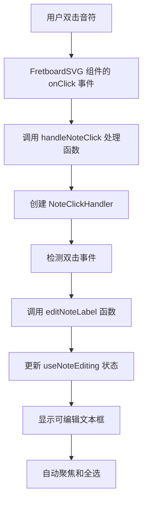
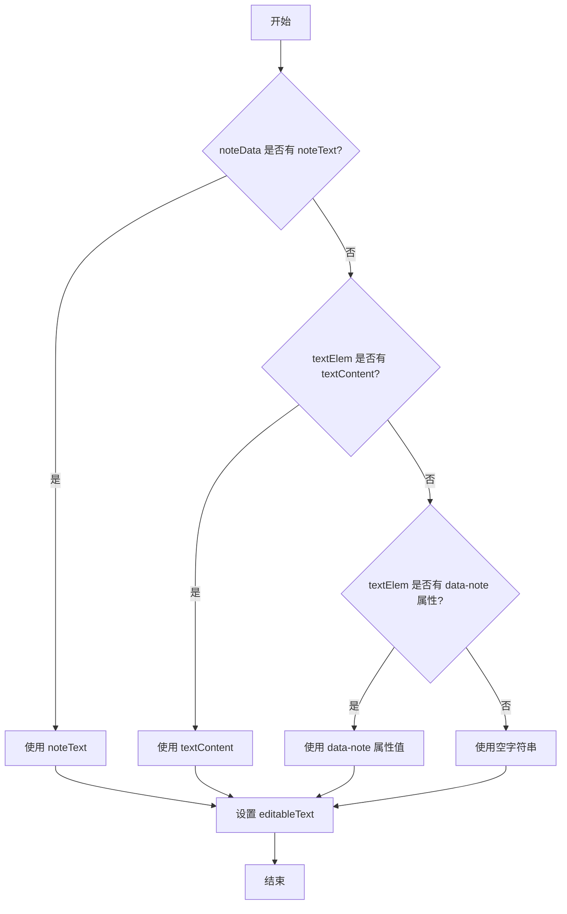
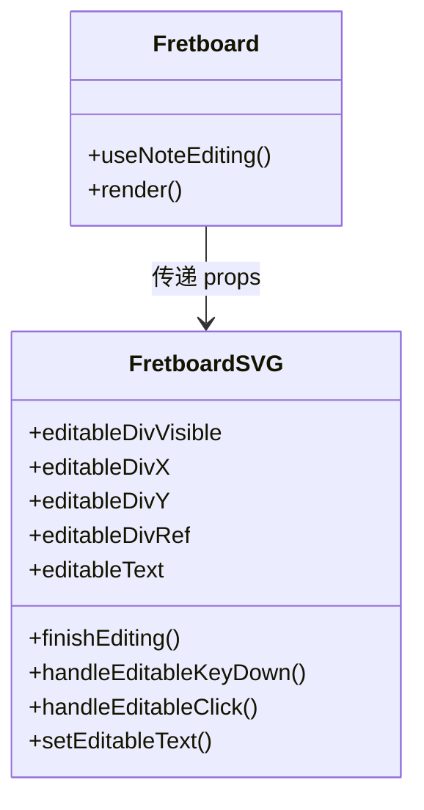

# useNoteEditing 音符编辑管理

<cite>
**本文档引用文件**   
- [useNoteEditing.js](file://src/hooks/useNoteEditing.js)
- [FretboardSVG.jsx](file://src/components/FretboardSVG.jsx)
- [Fretboard.jsx](file://src/Fretboard.jsx)
- [noteHandlers.js](file://src/handlers/noteHandlers.js)
- [fretboardCalculations.js](file://src/utils/fretboardCalculations.js)
- [constants.js](file://src/constants.js)
</cite>

## 目录
1. [简介](#简介)
2. [核心状态管理](#核心状态管理)
3. [文本框位置计算](#文本框位置计算)
4. [自动聚焦与全选机制](#自动聚焦与全选机制)
5. [调用流程分析](#调用流程分析)
6. [文本内容优先级逻辑](#文本内容优先级逻辑)
7. [与 FretboardSVG 组件的交互](#与-fretboardsvg-组件的交互)

## 简介
`useNoteEditing` 是一个自定义 Hook，用于管理吉他指板应用中音符标签的编辑功能。该 Hook 负责处理可编辑文本框的状态管理、位置计算、自动聚焦和全选等核心功能。当用户双击音符时，该 Hook 会触发编辑模式，显示一个可编辑的文本框，允许用户修改音符的显示文本。本文档将详细说明该 Hook 的实现细节和工作原理。

## 核心状态管理

`useNoteEditing` Hook 管理了多个关键状态，用于控制音符编辑功能的各个方面：

- `editableText`: 存储当前可编辑文本框中的文本内容
- `editingNote`: 存储当前正在编辑的音符的 ID
- `editableDivVisible`: 控制可编辑文本框的可见性
- `editableDivX` 和 `editableDivY`: 控制可编辑文本框的位置坐标
- `editableDivRef`: 对可编辑文本框 DOM 元素的引用

这些状态通过 `useState` 钩子进行管理，并通过 Hook 的返回值暴露给使用它的组件。当用户双击一个音符时，`editNoteLabel` 函数会被调用，设置这些状态值，从而显示可编辑文本框。

**Section sources**
- [useNoteEditing.js](file://src/hooks/useNoteEditing.js#L5-L10)

## 文本框位置计算

`editNoteLabel` 函数负责计算可编辑文本框的位置。该函数接收三个参数：音符 ID、音符的 DOM 元素和音符数据对象。位置计算基于音符在 SVG 中的位置信息：

**Diagram sources **
- [useNoteEditing.js](file://src/hooks/useNoteEditing.js#L32-L35)
- [constants.js](file://src/constants.js#L9)

该计算过程确保文本框精确地定位在音符的中心位置。具体来说，文本框的 X 坐标是音符的 X 坐标减去圆的半径，Y 坐标是音符的 Y 坐标减去圆的半径再加上 4 个像素的偏移量。这种计算方式考虑了文本框的尺寸和音符圆圈的半径，确保文本框与音符对齐。

**Section sources**
- [useNoteEditing.js](file://src/hooks/useNoteEditing.js#L24-L37)

## 自动聚焦与全选机制

当可编辑文本框显示时，需要自动聚焦并全选其中的文本，以提供更好的用户体验。这一功能通过 `useEffect` 钩子实现：

**Diagram sources **
- [useNoteEditing.js](file://src/hooks/useNoteEditing.js#L13-L22)

`useEffect` 钩子监听 `editableDivVisible` 状态的变化。当文本框变为可见时，钩子会执行以下操作：
1. 检查 `editableDivRef.current` 是否存在
2. 调用 `focus()` 方法使文本框获得焦点
3. 创建一个 `Range` 对象
4. 使用 `selectNodeContents()` 方法选择文本框内的所有内容
5. 通过 `window.getSelection()` 获取当前选择，并应用新的选择范围

这种实现确保了每次显示文本框时，用户可以直接开始编辑，而无需手动选择文本或点击文本框。

**Section sources**
- [useNoteEditing.js](file://src/hooks/useNoteEditing.js#L13-L22)

## 调用流程分析

`useNoteEditing` Hook 的调用流程始于用户与音符的交互。当用户双击一个音符时，会触发一系列事件，最终调用 `editNoteLabel` 函数：

**Diagram sources **
- [FretboardSVG.jsx](file://src/components/FretboardSVG.jsx#L250)
- [Fretboard.jsx](file://src/Fretboard.jsx#L268)
- [noteHandlers.js](file://src/handlers/noteHandlers.js#L33)

在 `Fretboard` 组件中，`useNoteEditing` Hook 被调用并解构出相关状态和函数。这些值随后作为 props 传递给 `FretboardSVG` 组件。当用户双击音符时，`FretboardSVG` 组件的 `onClick` 事件处理器会调用 `handleNoteClick`，该函数最终会调用 `editNoteLabel` 来启动编辑流程。

**Section sources**
- [Fretboard.jsx](file://src/Fretboard.jsx#L28)
- [Fretboard.jsx](file://src/Fretboard.jsx#L70-L77)
- [Fretboard.jsx](file://src/Fretboard.jsx#L553)

## 文本内容优先级逻辑

`useNoteEditing` Hook 实现了文本内容的优先级逻辑，决定在编辑时显示哪个文本。该逻辑在 `editNoteLabel` 函数中实现，遵循以下优先级顺序：

1. 优先使用用户手动编辑的文本（`noteData.noteText`）
2. 其次使用音符元素中显示的文本（`textElem.textContent`）
3. 最后使用音符的 data-note 属性值

**Diagram sources **
- [useNoteEditing.js](file://src/hooks/useNoteEditing.js#L27-L28)
- [fretboardCalculations.js](file://src/utils/fretboardCalculations.js#L29-L32)

这种优先级逻辑确保了用户编辑的文本始终优先于自动生成的文本。在 `fretboardCalculations.js` 文件中，`generateNotes` 函数也实现了类似的逻辑，确保在生成音符时优先显示用户编辑的文本。

**Section sources**
- [useNoteEditing.js](file://src/hooks/useNoteEditing.js#L24-L29)
- [fretboardCalculations.js](file://src/utils/fretboardCalculations.js#L28-L32)

## 与 FretboardSVG 组件的交互

`useNoteEditing` Hook 与 `FretboardSVG` 组件通过 props 进行交互。在 `Fretboard` 组件中，Hook 的返回值被解构并作为 props 传递给 `FretboardSVG` 组件：

**Diagram sources **
- [Fretboard.jsx](file://src/Fretboard.jsx#L70-L77)
- [Fretboard.jsx](file://src/Fretboard.jsx#L566-L574)
- [FretboardSVG.jsx](file://src/components/FretboardSVG.jsx#L47-L56)

`FretboardSVG` 组件使用这些 props 来渲染可编辑文本框。当 `editableDivVisible` 为 true 时，组件会渲染一个 `foreignObject`，其中包含一个可编辑的 `div` 元素。该 `div` 元素使用 `editableDivRef` 作为引用，`editableDivX` 和 `editableDivY` 作为位置坐标，`editableText` 作为初始文本内容。

**Section sources**
- [Fretboard.jsx](file://src/Fretboard.jsx#L566-L574)
- [FretboardSVG.jsx](file://src/components/FretboardSVG.jsx#L761-L791)