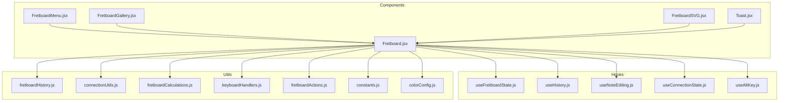
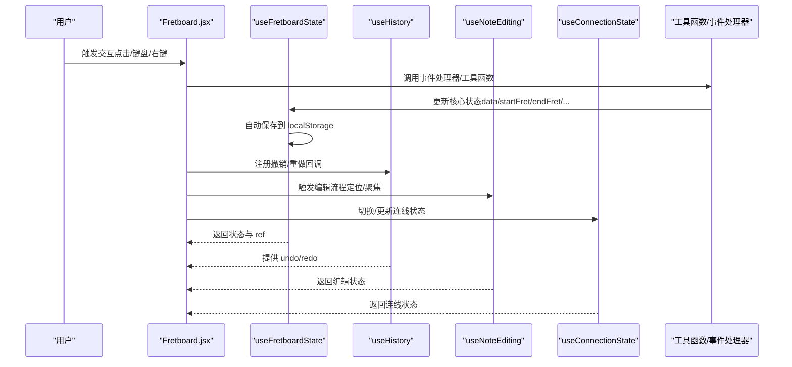
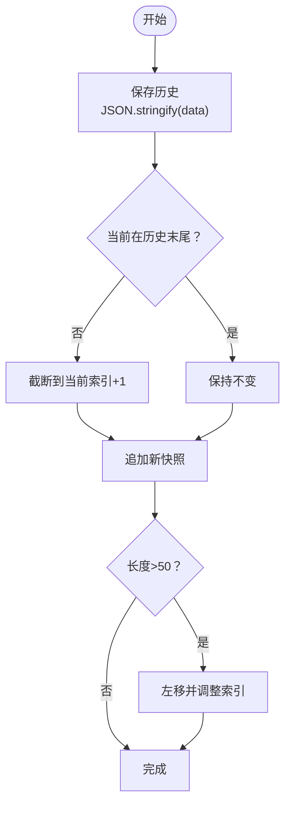
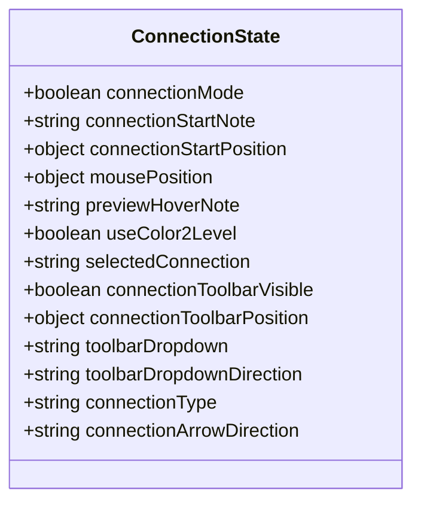
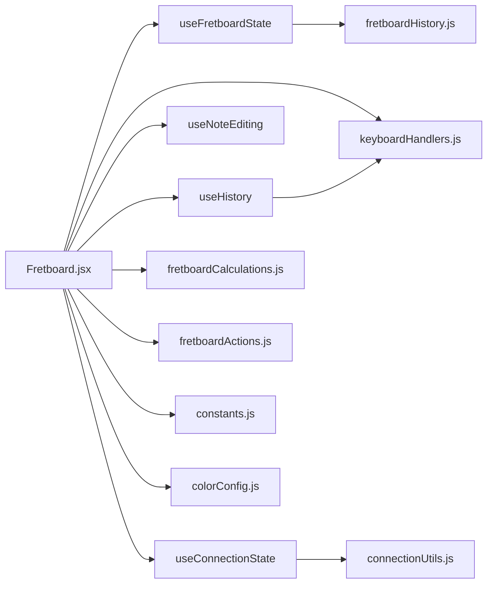

# 状态管理

<cite>
**本文引用的文件列表**
- [useFretboardState.js](file://src/hooks/useFretboardState.js)
- [useHistory.js](file://src/hooks/useHistory.js)
- [useNoteEditing.js](file://src/hooks/useNoteEditing.js)
- [useConnectionState.js](file://src/hooks/useConnectionState.js)
- [useAltKey.js](file://src/hooks/useAltKey.js)
- [Fretboard.jsx](file://src/Fretboard.jsx)
- [fretboardHistory.js](file://src/utils/fretboardHistory.js)
- [connectionUtils.js](file://src/utils/connectionUtils.js)
- [fretboardCalculations.js](file://src/utils/fretboardCalculations.js)
- [keyboardHandlers.js](file://src/handlers/keyboardHandlers.js)
- [fretboardActions.js](file://src/utils/fretboardActions.js)
- [constants.js](file://src/constants.js)
- [colorConfig.js](file://src/colorConfig.js)
</cite>

## 目录
1. [简介](#简介)
2. [项目结构](#项目结构)
3. [核心组件](#核心组件)
4. [架构总览](#架构总览)
5. [详细组件分析](#详细组件分析)
6. [依赖关系分析](#依赖关系分析)
7. [性能考量](#性能考量)
8. [故障排查指南](#故障排查指南)
9. [结论](#结论)
10. [附录](#附录)

## 简介
本文件系统化梳理项目中基于 React Hooks 的状态管理架构，重点围绕以下五个自定义 Hook：
- useFretboardState：集中管理指板核心状态（音符数据、品格范围、升降号设置、显示模式、颜色、历史状态等）
- useHistory：提供撤销/重做能力，维护轻量历史栈
- useNoteEditing：管理音符标签编辑流程（可编辑 div 的定位、聚焦、文本）
- useConnectionState：管理音符间连接状态（连线模式、起止点、预览、工具栏、连线类型与箭头方向等）
- useAltKey：跟踪 Alt 键状态，用于交互控制

这些 Hook 将复杂的状态逻辑封装为简洁的 API，供组件直接消费，同时通过工具模块与事件处理器协同，形成清晰的单向数据流与可维护的交互体系。

## 项目结构
本项目采用“按职责分层”的组织方式：
- hooks：自定义 Hook，封装状态与副作用
- utils：纯函数与工具方法（计算、历史、连接、动作等）
- handlers：事件处理器工厂（鼠标、键盘、SVG 等）
- components：UI 组件（菜单、画廊、SVG、提示等）
- 根组件：App.jsx、Fretboard.jsx

图表来源
- [Fretboard.jsx](file://src/Fretboard.jsx#L1-L800)
- [useFretboardState.js](file://src/hooks/useFretboardState.js#L1-L190)
- [useHistory.js](file://src/hooks/useHistory.js#L1-L109)
- [useNoteEditing.js](file://src/hooks/useNoteEditing.js#L1-L52)
- [useConnectionState.js](file://src/hooks/useConnectionState.js#L1-L65)
- [useAltKey.js](file://src/hooks/useAltKey.js#L1-L30)
- [fretboardHistory.js](file://src/utils/fretboardHistory.js#L1-L333)
- [connectionUtils.js](file://src/utils/connectionUtils.js#L1-L196)
- [fretboardCalculations.js](file://src/utils/fretboardCalculations.js#L1-L135)
- [keyboardHandlers.js](file://src/handlers/keyboardHandlers.js#L1-L227)
- [fretboardActions.js](file://src/utils/fretboardActions.js#L1-L878)
- [constants.js](file://src/constants.js#L1-L19)
- [colorConfig.js](file://src/colorConfig.js#L1-L162)

章节来源
- [Fretboard.jsx](file://src/Fretboard.jsx#L1-L800)

## 核心组件
本节概述五个自定义 Hook 的职责与对外 API，帮助快速理解其作用域与边界。

- useFretboardState
  - 负责：音符数据、品格范围、升降号、显示模式、根音、可见性、颜色选择、历史状态、提示信息、当前时间等
  - 关键特性：本地持久化恢复与自动保存、历史状态匹配、ref 同步 data 避免闭包陷阱
  - 返回：大量状态 setter 与派生值（如 dataRef、selectedTimeoutRef）

- useHistory
  - 负责：基于 JSON 字符串的历史栈管理，支持撤销/重做，限制最大长度，分支历史清理
  - 关键特性：防并发（撤销/重做期间不保存）、监听 data 变化自动保存、初始化一次性注入

- useNoteEditing
  - 负责：音符标签编辑的 UI 控制（可编辑 div 的可见性、定位、聚焦与选中）
  - 关键特性：自动聚焦并全选文本；提供 editNoteLabel 以定位与初始化编辑内容

- useConnectionState
  - 负责：连线模式的生命周期与工具栏状态（起止点、预览、颜色层级、类型与箭头方向等）
  - 关键特性：预设配置导出；工具栏方向动态检测

- useAltKey
  - 负责：全局 Alt 键状态跟踪，便于快捷键组合判断

章节来源
- [useFretboardState.js](file://src/hooks/useFretboardState.js#L1-L190)
- [useHistory.js](file://src/hooks/useHistory.js#L1-L109)
- [useNoteEditing.js](file://src/hooks/useNoteEditing.js#L1-L52)
- [useConnectionState.js](file://src/hooks/useConnectionState.js#L1-L65)
- [useAltKey.js](file://src/hooks/useAltKey.js#L1-L30)

## 架构总览
整体采用“Hook 封装 + 工具函数 + 事件处理器”的分层设计：
- Hook 层：集中管理状态与副作用，暴露稳定 API
- 工具层：纯函数负责计算、历史、连接、动作等
- 事件层：将用户交互映射为状态变更
- 组件层：渲染与组合 UI，调用 Hook 与工具函数

图表来源
- [Fretboard.jsx](file://src/Fretboard.jsx#L1-L800)
- [useFretboardState.js](file://src/hooks/useFretboardState.js#L1-L190)
- [useHistory.js](file://src/hooks/useHistory.js#L1-L109)
- [useNoteEditing.js](file://src/hooks/useNoteEditing.js#L1-L52)
- [useConnectionState.js](file://src/hooks/useConnectionState.js#L1-L65)
- [keyboardHandlers.js](file://src/handlers/keyboardHandlers.js#L1-L227)
- [fretboardHistory.js](file://src/utils/fretboardHistory.js#L1-L333)

## 详细组件分析

### useFretboardState：指板核心状态管理
- 状态清单与职责
  - 选择与悬停：selected、hoveredNoteId、hoveredConnectionId
  - 显示与范围：visibility、startFret、endFret、displayMode、rootNote、enharmonic
  - 颜色：selectedColorLevel、selectedColor
  - 数据与历史：data、historyStates、selectedHistoryState
  - 通知与时间：toastMessage、toastType、currentDateTime
  - 引用：dataRef、selectedTimeoutRef
- 生命周期与持久化
  - 首次挂载从 localStorage 恢复当前状态；若无则按屏幕宽度推导初始 endFret
  - 状态变化时自动保存至 localStorage（防抖避免初始化即保存）
  - 加载历史记录并尝试匹配当前状态到历史项
- 复杂度与性能
  - dataRef 用于避免闭包捕获旧 data，减少不必要的重渲染
  - 自动保存使用 useRef 控制首次挂载跳过
- 使用示例（路径）
  - 在组件中解构使用：见 [Fretboard.jsx](file://src/Fretboard.jsx#L25-L52)
  - 自动保存触发：见 [Fretboard.jsx](file://src/Fretboard.jsx#L412-L435)
  - 历史状态匹配与选中：见 [useFretboardState.js](file://src/hooks/useFretboardState.js#L86-L122)

章节来源
- [useFretboardState.js](file://src/hooks/useFretboardState.js#L1-L190)
- [Fretboard.jsx](file://src/Fretboard.jsx#L1-L800)

### useHistory：历史状态的保存与恢复
- 设计要点
  - 基于 JSON 字符串的历史栈，限制最大长度（50）
  - 分支历史：当前不在末尾时，删除后续记录再追加
  - 并发保护：撤销/重做过程中禁止保存新历史
  - 初始化：首次挂载时注入初始状态快照
- 撤销/重做流程
  - 撤销：索引减一，解析字符串并 setData
  - 重做：索引加一，解析字符串并 setData
  - 使用 setTimeout 确保 setData 完成后再重置标志位
- 使用示例（路径）
  - 在 Fretboard 中注册：见 [Fretboard.jsx](file://src/Fretboard.jsx#L27)
  - 键盘快捷键触发：见 [keyboardHandlers.js](file://src/handlers/keyboardHandlers.js#L12-L75)

图表来源
- [useHistory.js](file://src/hooks/useHistory.js#L10-L33)

章节来源
- [useHistory.js](file://src/hooks/useHistory.js#L1-L109)
- [keyboardHandlers.js](file://src/handlers/keyboardHandlers.js#L1-L227)

### useNoteEditing：音符编辑流程
- 功能
  - 管理可编辑 div 的可见性、定位（基于 note 的 data-x/data-y）
  - 自动聚焦并全选文本，提升编辑体验
  - 提供 editNoteLabel：从 note 元素与 data 中提取当前显示文本，初始化编辑框
- 使用示例（路径）
  - 初始化编辑框：见 [useNoteEditing.js](file://src/hooks/useNoteEditing.js#L24-L37)
  - 自动聚焦与选中：见 [useNoteEditing.js](file://src/hooks/useNoteEditing.js#L13-L22)
  - 在 Fretboard 中使用：见 [Fretboard.jsx](file://src/Fretboard.jsx#L566-L575)

章节来源
- [useNoteEditing.js](file://src/hooks/useNoteEditing.js#L1-L52)
- [Fretboard.jsx](file://src/Fretboard.jsx#L1-L800)

### useConnectionState：音符间连接状态
- 状态
  - 连线模式与起止点：connectionMode、connectionStartNote、connectionStartPosition
  - 鼠标与预览：mousePosition、previewHoverNote
  - 工具栏：selectedConnection、connectionToolbarVisible、position、dropdown、方向
  - 连线属性：type（line/arc）、arrowDirection（none/start/end/both）
  - 颜色层级：useColor2Level
- 预设
  - 提供两种连线预设（类型、箭头、粗细、弧度）
- 使用示例（路径）
  - 在 Fretboard 中解构使用：见 [Fretboard.jsx](file://src/Fretboard.jsx#L54-L68)
  - 工具栏打开与定位：见 [connectionUtils.js](file://src/utils/connectionUtils.js#L56-L74)
  - 工具栏方向检测：见 [connectionUtils.js](file://src/utils/connectionUtils.js#L3-L54)

图表来源
- [useConnectionState.js](file://src/hooks/useConnectionState.js#L1-L65)
- [connectionUtils.js](file://src/utils/connectionUtils.js#L1-L196)

章节来源
- [useConnectionState.js](file://src/hooks/useConnectionState.js#L1-L65)
- [connectionUtils.js](file://src/utils/connectionUtils.js#L1-L196)
- [Fretboard.jsx](file://src/Fretboard.jsx#L1-L800)

### useAltKey：Alt 键状态跟踪
- 功能
  - 监听全局 keydown/keyup，设置/清除 isAltPressed
  - 组件卸载时清理事件监听
- 使用示例（路径）
  - 在 Fretboard 中使用：见 [Fretboard.jsx](file://src/Fretboard.jsx#L467-L490)

章节来源
- [useAltKey.js](file://src/hooks/useAltKey.js#L1-L30)
- [Fretboard.jsx](file://src/Fretboard.jsx#L1-L800)

## 依赖关系分析
- 组件与 Hook 的耦合
  - Fretboard.jsx 通过多个 Hook 获得状态与行为，统一通过工具函数与事件处理器协调
- 工具函数与 Hook 的协作
  - useFretboardState 与 fretboardHistory.js 协作实现状态保存/恢复与缩略图生成
  - useConnectionState 与 connectionUtils.js 协作实现工具栏方向与连线颜色更新
  - useHistory 与 keyboardHandlers.js 协作实现撤销/重做快捷键
- 关键依赖链
  - Fretboard.jsx -> useFretboardState -> localStorage（自动保存/恢复）
  - Fretboard.jsx -> useHistory -> data 变化触发保存
  - Fretboard.jsx -> useNoteEditing -> noteHandlers（编辑流程）
  - Fretboard.jsx -> useConnectionState + connectionUtils.js -> 连线工具栏与颜色更新
  - Fretboard.jsx -> keyboardHandlers.js -> 快捷键驱动

图表来源
- [Fretboard.jsx](file://src/Fretboard.jsx#L1-L800)
- [useFretboardState.js](file://src/hooks/useFretboardState.js#L1-L190)
- [useHistory.js](file://src/hooks/useHistory.js#L1-L109)
- [useNoteEditing.js](file://src/hooks/useNoteEditing.js#L1-L52)
- [useConnectionState.js](file://src/hooks/useConnectionState.js#L1-L65)
- [fretboardHistory.js](file://src/utils/fretboardHistory.js#L1-L333)
- [connectionUtils.js](file://src/utils/connectionUtils.js#L1-L196)
- [fretboardCalculations.js](file://src/utils/fretboardCalculations.js#L1-L135)
- [keyboardHandlers.js](file://src/handlers/keyboardHandlers.js#L1-L227)
- [fretboardActions.js](file://src/utils/fretboardActions.js#L1-L878)
- [constants.js](file://src/constants.js#L1-L19)
- [colorConfig.js](file://src/colorConfig.js#L1-L162)

章节来源
- [Fretboard.jsx](file://src/Fretboard.jsx#L1-L800)

## 性能考量
- 避免闭包陷阱
  - useFretboardState 使用 dataRef 同步最新 data，避免回调中捕获旧值
- 减少重渲染
  - useMemo 包裹计算结果（如 notes/markers/fretPath），依赖项明确
  - useCallback 包裹事件处理器，减少子组件重渲染
- 历史保存防抖
  - useHistory 在撤销/重做期间禁用保存，避免并发写入
  - useFretboardState 首次挂载跳过自动保存，避免初始化即保存
- DOM 更新优化
  - 连线颜色更新仅在必要时批量更新，避免逐条重绘
  - 可编辑 div 自动聚焦与选中仅在可见性变化时触发

[本节为通用性能建议，无需特定文件来源]

## 故障排查指南
- 状态未持久化
  - 检查 localStorage 是否可用；查看 useFretboardState 的自动保存与恢复逻辑
  - 参考：[useFretboardState.js](file://src/hooks/useFretboardState.js#L36-L65)、[useFretboardState.js](file://src/hooks/useFretboardState.js#L124-L148)
- 撤销/重做无效
  - 确认撤销/重做期间不会保存新历史；检查 isUndoingRef/isRedoingRef 标志位
  - 参考：[useHistory.js](file://src/hooks/useHistory.js#L11-L33)、[useHistory.js](file://src/hooks/useHistory.js#L36-L83)
- 连线颜色未更新
  - 确认 updateConnectionColors 的依赖与 setData 调用顺序
  - 参考：[Fretboard.jsx](file://src/Fretboard.jsx#L164-L166)、[connectionUtils.js](file://src/utils/connectionUtils.js#L87-L195)
- 编辑框未聚焦
  - 检查 editableDivVisible 变化与 ref 是否存在
  - 参考：[useNoteEditing.js](file://src/hooks/useNoteEditing.js#L13-L22)
- Alt 键状态异常
  - 确认事件监听器已正确注册与清理
  - 参考：[useAltKey.js](file://src/hooks/useAltKey.js#L6-L26)

章节来源
- [useFretboardState.js](file://src/hooks/useFretboardState.js#L1-L190)
- [useHistory.js](file://src/hooks/useHistory.js#L1-L109)
- [useNoteEditing.js](file://src/hooks/useNoteEditing.js#L1-L52)
- [useAltKey.js](file://src/hooks/useAltKey.js#L1-L30)
- [connectionUtils.js](file://src/utils/connectionUtils.js#L1-L196)

## 结论
本项目通过一组职责清晰的自定义 Hook，将复杂的指板状态管理、历史记录、编辑流程与连接工具抽象为简洁的 API。配合纯函数工具与事件处理器，实现了高内聚、低耦合的状态管理架构。建议在扩展新功能时遵循：
- 将状态收敛到 Hook，避免跨组件共享复杂状态
- 使用 useMemo/useCallback 降低重渲染
- 通过工具函数分离计算与副作用
- 保持撤销/重做与历史保存的幂等性与一致性

[本节为总结性内容，无需特定文件来源]

## 附录
- Hook 使用示例（路径）
  - useFretboardState：见 [Fretboard.jsx](file://src/Fretboard.jsx#L25-L52)
  - useHistory：见 [Fretboard.jsx](file://src/Fretboard.jsx#L27)
  - useNoteEditing：见 [Fretboard.jsx](file://src/Fretboard.jsx#L28-L77)
  - useConnectionState：见 [Fretboard.jsx](file://src/Fretboard.jsx#L54-L68)
  - useAltKey：见 [Fretboard.jsx](file://src/Fretboard.jsx#L467-L490)
- 关键工具函数（路径）
  - 状态保存/恢复：见 [fretboardHistory.js](file://src/utils/fretboardHistory.js#L39-L173)
  - 连线工具栏与颜色更新：见 [connectionUtils.js](file://src/utils/connectionUtils.js#L56-L195)
  - 键盘快捷键：见 [keyboardHandlers.js](file://src/handlers/keyboardHandlers.js#L3-L200)
  - 颜色配置与变体：见 [colorConfig.js](file://src/colorConfig.js#L58-L161)
  - 指板计算：见 [fretboardCalculations.js](file://src/utils/fretboardCalculations.js#L13-L135)