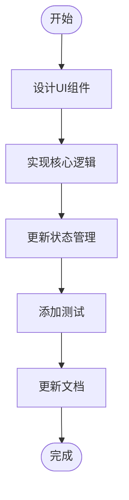
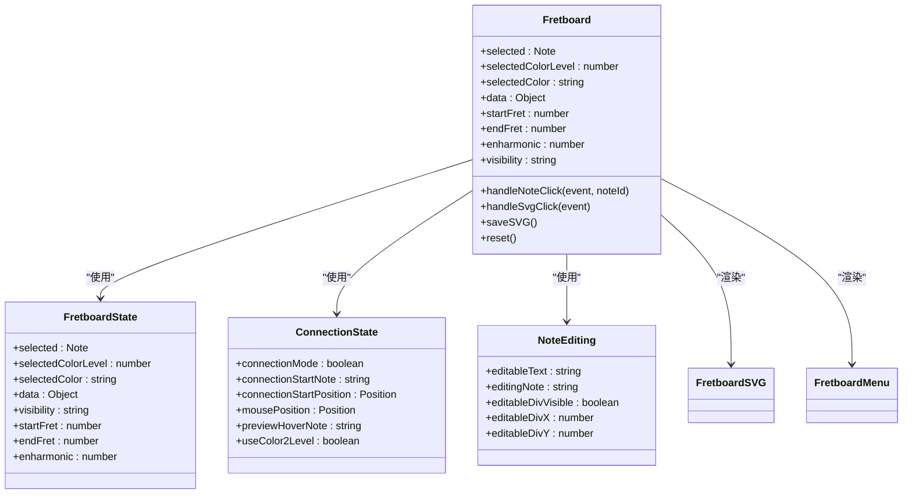
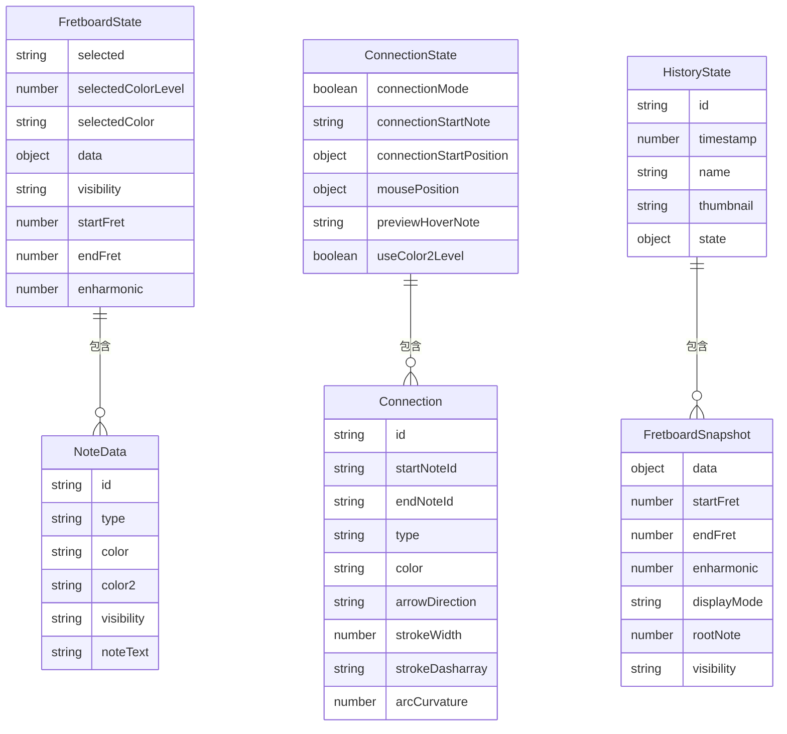

# 贡献指南

<cite>
**本文档引用的文件**   
- [README.md](file://README.md)
- [package.json](file://package.json)
- [vite.config.js](file://vite.config.js)
- [Dockerfile](file://Dockerfile)
- [start-dev.sh](file://start-dev.sh)
- [src/Fretboard.jsx](file://src/Fretboard.jsx)
- [src/App.jsx](file://src/App.jsx)
- [src/main.jsx](file://src/main.jsx)
- [src/colorConfig.js](file://src/colorConfig.js)
- [src/constants.js](file://src/constants.js)
- [src/utils/fretboardCalculations.js](file://src/utils/fretboardCalculations.js)
- [src/hooks/useFretboardState.js](file://src/hooks/useFretboardState.js)
- [src/components/FretboardMenu.jsx](file://src/components/FretboardMenu.jsx)
- [src/components/FretboardSVG.jsx](file://src/components/FretboardSVG.jsx)
- [src/utils.js](file://src/utils.js)
</cite>

## 目录
1. [简介](#简介)
2. [开发环境设置](#开发环境设置)
3. [代码风格规范](#代码风格规范)
4. [提交信息格式](#提交信息格式)
5. [分支管理策略](#分支管理策略)
6. [测试要求](#测试要求)
7. [PR审查流程](#pr审查流程)
8. [功能开发指南](#功能开发指南)
9. [调试技巧](#调试技巧)
10. [总结](#总结)

## 简介
本指南旨在为fretboard_diagram项目提供全面的贡献说明。该项目是一个简单的在线工具，用于创建吉他指板图，支持自由选择音符、编辑音符标签、为音符着色、选择指板的一部分、将图表保存为SVG以及分享和导入功能。通过本指南，贡献者将了解如何遵循项目的代码风格、提交信息格式、分支管理策略、测试要求和PR审查流程，并学习如何添加新功能、修复bug或改进UI。

## 开发环境设置
### 环境要求
- Node.js 18.0 或更高版本
- pnpm 包管理器（推荐）或 npm/yarn

### 安装步骤
1. **检查 Node.js 版本**
   首先确保已安装 Node.js，并检查版本：
   ```bash
   node --version
   ```
   如果版本低于 18.0，请访问 [Node.js 官网](https://nodejs.org/) 下载并安装最新版本。

2. **安装 pnpm**
   如果尚未安装 pnpm，可以使用以下命令安装：
   ```bash
   npm install -g pnpm
   ```

3. **安装项目依赖**
   在项目根目录下运行以下命令安装依赖：
   ```bash
   pnpm install
   ```

### 应用启动
- **开发模式**：启动开发服务器
  ```bash
  pnpm dev
  ```
  开发服务器启动后，在浏览器中访问显示的本地地址（通常是 `http://localhost:5173`）。

- **构建生产版本**：构建用于生产环境的优化版本
  ```bash
  pnpm build
  ```
  构建产物将输出到 `dist` 目录。

- **预览生产构建**：预览生产构建的结果
  ```bash
  pnpm preview
  ```

### Docker 部署
项目支持 Docker 部署，使用多阶段构建：
1. 构建阶段：使用 `node:20-alpine` 镜像安装依赖并构建应用
2. 生产阶段：使用 `nginx:alpine` 镜像提供静态文件服务

构建和运行命令：
```bash
docker-compose up --build
```

**Section sources**
- [README.md](file://README.md#L22-L107)
- [package.json](file://package.json#L5-L8)
- [Dockerfile](file://Dockerfile#L1-L36)
- [start-dev.sh](file://start-dev.sh#L1-L4)

## 代码风格规范
### JavaScript/JSX 规范
- 使用 ES6+ 语法和现代 JavaScript 特性
- 遵循 React 最佳实践，使用函数组件和 Hooks
- 代码缩进使用 4 个空格
- 字符串使用单引号
- 语句结尾使用分号
- 使用 camelCase 命名变量和函数
- 组件名称使用 PascalCase
- 文件命名使用 kebab-case

### React 组件结构
组件应遵循以下结构：
1. 导入语句
2. 函数定义
3. 状态管理（使用 useState, useEffect 等）
4. 自定义 Hooks 使用
5. 事件处理器定义
6. 渲染函数

### CSS 规范
- 使用 CSS 变量进行颜色管理
- 类名使用语义化命名
- 避免使用 !important
- 使用 BEM 命名约定（块__元素--修饰符）

### 目录结构
项目遵循以下目录结构：
```
src/
├── components/         # React 组件
├── handlers/           # 事件处理器
├── hooks/              # 自定义 React Hooks
├── utils/              # 工具函数
├── App.jsx             # 主应用组件
├── Fretboard.jsx       # 指板组件（核心功能）
├── main.jsx            # 应用入口文件
```

**Section sources**
- [src/Fretboard.jsx](file://src/Fretboard.jsx#L1-L811)
- [src/App.jsx](file://src/App.jsx#L1-L13)
- [src/main.jsx](file://src/main.jsx#L1-L12)
- [src/colorConfig.js](file://src/colorConfig.js#L1-L162)
- [src/constants.js](file://src/constants.js#L1-L19)

## 提交信息格式
### 提交信息结构
提交信息应遵循以下格式：
```
<类型>(<范围>): <简短描述>

<详细描述>

<关联的issue>
```

### 类型说明
- **feat**: 新功能
- **fix**: bug 修复
- **docs**: 文档更新
- **style**: 代码格式调整（不影响代码运行）
- **refactor**: 代码重构（既不修复bug也不增加新功能）
- **test**: 增加测试
- **chore**: 构建过程或辅助工具的变动

### 示例
```
feat(Fretboard): 添加新的音符标记类型

实现新的音符标记类型，支持和弦音程标记
用户可以通过右键菜单选择不同的标记类型

Closes #123
```

```
fix(FretboardMenu): 修复颜色选择器在移动设备上的点击问题

修复了在移动设备上颜色选择器无法正确响应点击事件的问题
添加了 touchstart 事件监听器

Closes #456
```

**Section sources**
- [README.md](file://README.md#L139-L154)

## 分支管理策略
### 分支命名规范
- **main**: 主分支，用于生产环境
- **develop**: 开发分支，用于集成所有功能
- **feature/<功能名称>**: 功能分支，用于开发新功能
- **bugfix/<问题描述>**: 修复分支，用于修复bug
- **hotfix/<紧急问题>**: 紧急修复分支，用于生产环境的紧急修复

### 工作流程
1. 从 `develop` 分支创建新分支
2. 在新分支上进行开发
3. 完成开发后，提交 Pull Request 到 `develop` 分支
4. 经过代码审查后合并到 `develop` 分支
5. 定期将 `develop` 分支合并到 `main` 分支

### 示例
```bash
# 创建功能分支
git checkout -b feature/new-note-markers develop

# 开发完成后提交
git add .
git commit -m "feat(Fretboard): 添加新的音符标记类型"
git push origin feature/new-note-markers

# 创建 Pull Request 到 develop 分支
```

**Section sources**
- [README.md](file://README.md#L139-L154)

## 测试要求
### 测试策略
本项目目前主要依赖手动测试，但鼓励贡献者为新功能添加单元测试和集成测试。

### 测试覆盖范围
- **核心功能测试**：确保指板的基本功能正常工作
  - 音符选择和编辑
  - 颜色更改
  - 品格范围设置
  - SVG 导出

- **边界情况测试**：测试各种边界情况
  - 最小和最大品格范围
  - 特殊音符组合
  - 不同的显示模式

- **用户交互测试**：确保所有用户交互正常
  - 鼠标点击和右键
  - 键盘快捷键
  - 触摸设备支持

### 测试工具
推荐使用以下测试工具：
- **Jest**: 用于单元测试
- **React Testing Library**: 用于组件测试
- **Cypress**: 用于端到端测试

### 测试文件结构
测试文件应放在与源文件相同的目录下，文件名以 `.test.js` 结尾：
```
src/
├── components/
│   ├── FretboardMenu.jsx
│   └── FretboardMenu.test.js
├── hooks/
│   ├── useFretboardState.js
│   └── useFretboardState.test.js
```

**Section sources**
- [src/Fretboard.jsx](file://src/Fretboard.jsx#L23-L811)
- [src/components/FretboardMenu.jsx](file://src/components/FretboardMenu.jsx#L1-L243)
- [src/hooks/useFretboardState.js](file://src/hooks/useFretboardState.js#L1-L190)

## PR审查流程
### PR创建要求
1. **清晰的标题**：PR标题应清晰描述更改内容
2. **详细的描述**：PR描述应包含：
   - 更改的目的和背景
   - 实现的详细说明
   - 测试方法
   - 相关的issue链接
3. **小的增量更改**：尽量保持PR小而专注，避免一次性提交大量更改
4. **代码格式化**：确保代码符合项目的代码风格规范

### 审查标准
审查者将根据以下标准评估PR：
- **功能正确性**：更改是否正确实现了预期功能
- **代码质量**：代码是否清晰、可维护、符合项目规范
- **测试覆盖**：是否有足够的测试覆盖新功能
- **文档更新**：是否更新了相关文档
- **性能影响**：更改是否对性能有负面影响
- **安全性**：更改是否存在安全漏洞

### 审查流程
1. PR创建后，系统会自动运行CI/CD流程
2. 至少一名核心维护者进行代码审查
3. 审查者提出反馈和建议
4. 贡献者根据反馈进行修改
5. 审查通过后，PR被合并到 `develop` 分支

### 常见反馈
- **代码重复**：避免重复代码，提取公共逻辑到工具函数
- **复杂性过高**：简化复杂逻辑，添加注释说明
- **缺少错误处理**：添加适当的错误处理和边界检查
- **性能问题**：优化性能关键代码，避免不必要的重新渲染

**Section sources**
- [README.md](file://README.md#L139-L154)
- [src/Fretboard.jsx](file://src/Fretboard.jsx#L23-L811)

## 功能开发指南
### 添加新功能
#### 添加新的音符标记类型
1. **确定需求**：明确新标记类型的功能和用途
2. **设计UI**：在 `FretboardMenu` 组件中添加新的标记类型选择器
3. **实现逻辑**：在 `Fretboard` 组件中添加处理新标记类型的逻辑
4. **更新状态管理**：在 `useFretboardState` Hook 中添加必要的状态
5. **添加测试**：为新功能添加相应的测试



**Diagram sources**
- [src/components/FretboardMenu.jsx](file://src/components/FretboardMenu.jsx#L8-L243)
- [src/Fretboard.jsx](file://src/Fretboard.jsx#L23-L811)
- [src/hooks/useFretboardState.js](file://src/hooks/useFretboardState.js#L5-L190)

#### 修复bug
1. **复现问题**：确认bug的复现步骤
2. **定位问题**：使用调试工具定位问题代码
3. **分析原因**：分析问题的根本原因
4. **实现修复**：编写代码修复问题
5. **验证修复**：确保修复解决了问题且没有引入新问题
6. **添加测试**：为修复添加回归测试

#### 改进UI
1. **评估需求**：确定UI改进的目标和范围
2. **设计原型**：创建UI改进的原型或草图
3. **实现更改**：在相关组件中实现UI更改
4. **测试兼容性**：确保更改在不同设备和浏览器上正常工作
5. **优化性能**：确保UI更改不会影响性能

### 核心组件分析
#### Fretboard 组件
`Fretboard` 组件是应用的核心，负责管理所有指板逻辑和UI。



**Diagram sources**
- [src/Fretboard.jsx](file://src/Fretboard.jsx#L23-L811)
- [src/hooks/useFretboardState.js](file://src/hooks/useFretboardState.js#L5-L190)
- [src/components/FretboardSVG.jsx](file://src/components/FretboardSVG.jsx#L6-L800)
- [src/components/FretboardMenu.jsx](file://src/components/FretboardMenu.jsx#L8-L243)

#### 状态管理
项目使用 React Hooks 进行状态管理，主要状态包括：



**Diagram sources**
- [src/Fretboard.jsx](file://src/Fretboard.jsx#L30-L49)
- [src/hooks/useFretboardState.js](file://src/hooks/useFretboardState.js#L6-L25)
- [src/utils/fretboardHistory.js](file://src/utils/fretboardHistory.js#L1-L100)

**Section sources**
- [src/Fretboard.jsx](file://src/Fretboard.jsx#L23-L811)
- [src/hooks/useFretboardState.js](file://src/hooks/useFretboardState.js#L5-L190)
- [src/components/FretboardSVG.jsx](file://src/components/FretboardSVG.jsx#L6-L800)
- [src/components/FretboardMenu.jsx](file://src/components/FretboardMenu.jsx#L8-L243)
- [src/utils/fretboardCalculations.js](file://src/utils/fretboardCalculations.js#L1-L135)

## 调试技巧
### 开发工具
- **浏览器开发者工具**：使用 Chrome DevTools 进行调试
- **React DevTools**：用于检查 React 组件树和状态
- **Vite HMR**：热模块替换功能，修改代码后自动刷新

### 常见问题排查
#### 状态更新问题
如果状态更新没有正确反映在UI上，检查：
1. 是否正确使用了 `useState` 的 setter 函数
2. 是否在 `useEffect` 依赖数组中包含了所有相关状态
3. 是否在事件处理器中正确传递了回调函数

#### SVG渲染问题
如果SVG渲染出现问题，检查：
1. `viewBox` 和 `width`/`height` 属性是否正确
2. 坐标计算是否准确
3. CSS样式是否正确应用

#### 事件处理问题
如果事件处理不正常，检查：
1. 事件处理器是否正确绑定
2. 事件冒泡是否被正确处理
3. 阻止默认行为是否必要

### 日志调试
使用 `console.log` 进行调试：
```javascript
// 在关键位置添加日志
console.log('Current state:', fretboardState);
console.log('Event triggered:', event.type);
console.log('Note data:', data[noteId]);
```

### 断点调试
在代码中设置断点，逐步执行并检查变量值：
```javascript
// 在需要调试的地方设置断点
debugger;
// 或者在开发者工具中手动设置断点
```

**Section sources**
- [src/Fretboard.jsx](file://src/Fretboard.jsx#L126-L161)
- [src/hooks/useFretboardState.js](file://src/hooks/useFretboardState.js#L36-L65)
- [src/utils.js](file://src/utils.js#L168-L273)

## 总结
本贡献指南为fretboard_diagram项目提供了全面的开发指导。通过遵循这些规范和流程，贡献者可以有效地参与项目开发，确保代码质量和项目稳定性。我们欢迎所有贡献，无论是新功能、bug修复还是文档改进。请记住，良好的沟通和协作是开源项目成功的关键。

**Section sources**
- [README.md](file://README.md#L1-L203)
- [src/Fretboard.jsx](file://src/Fretboard.jsx#L1-L811)