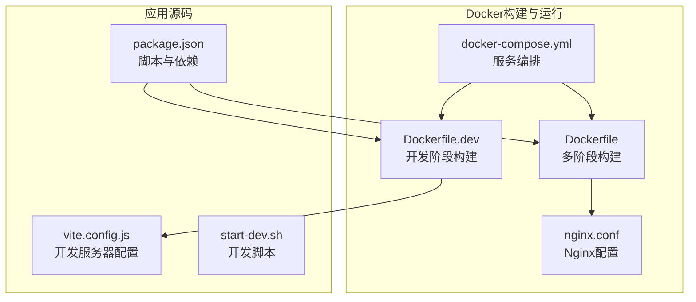
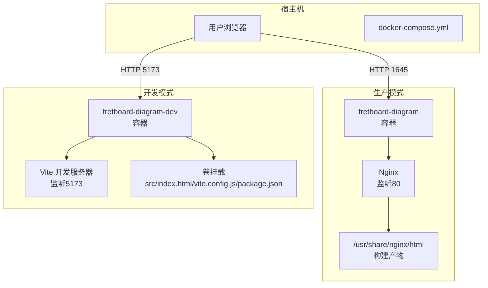
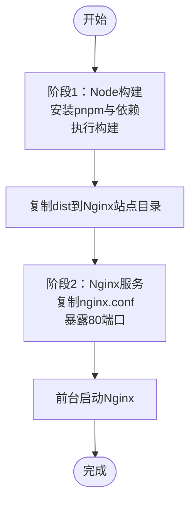
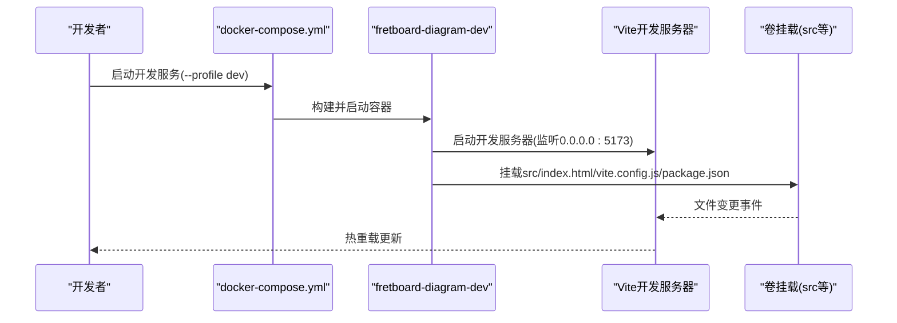
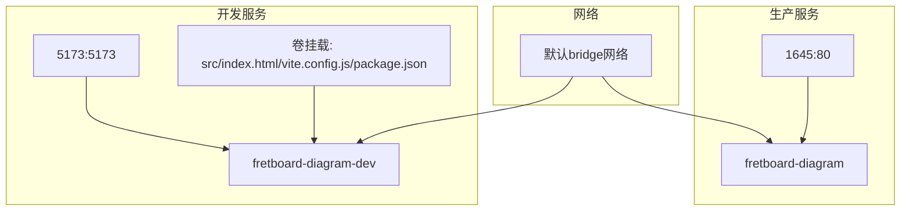
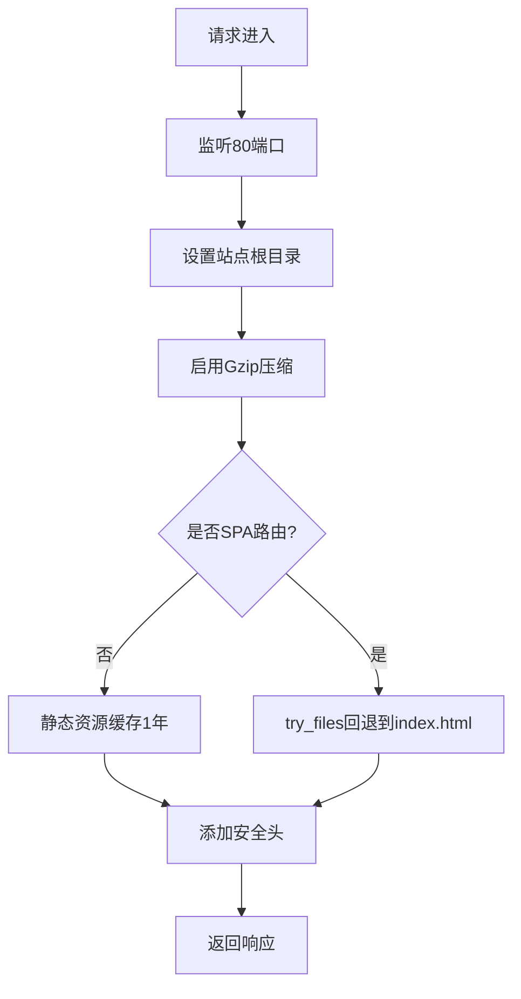
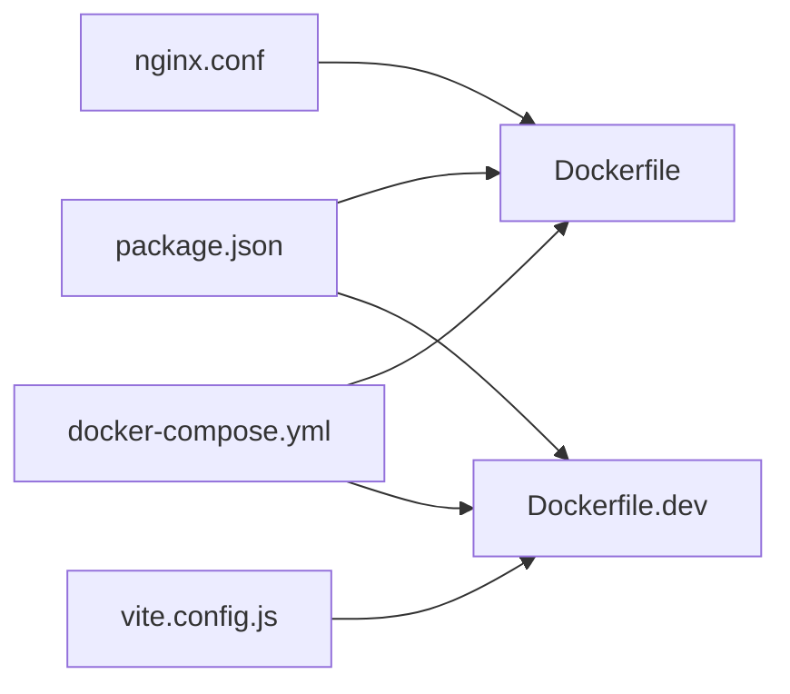

# Docker部署

<cite>
**本文引用的文件**
- [Dockerfile](file://Dockerfile)
- [Dockerfile.dev](file://Dockerfile.dev)
- [docker-compose.yml](file://docker-compose.yml)
- [nginx.conf](file://nginx.conf)
- [README.Docker.md](file://README.Docker.md)
- [package.json](file://package.json)
- [vite.config.js](file://vite.config.js)
- [.dockerignore](file://.dockerignore)
- [start-dev.sh](file://start-dev.sh)
</cite>

## 目录
1. [简介](#简介)
2. [项目结构](#项目结构)
3. [核心组件](#核心组件)
4. [架构总览](#架构总览)
5. [详细组件分析](#详细组件分析)
6. [依赖关系分析](#依赖关系分析)
7. [性能考虑](#性能考虑)
8. [故障排查指南](#故障排查指南)
9. [结论](#结论)
10. [附录](#附录)

## 简介
本项目提供两套Docker部署方案：
- 生产环境：基于多阶段构建，使用Nginx提供静态文件服务，端口对外映射为1645。
- 开发环境：基于单阶段构建，使用Vite开发服务器，端口对外映射为5173，支持热重载。

通过docker-compose.yml实现服务编排，包含容器间网络配置、卷挂载以及环境变量设置；nginx.conf负责反向代理与静态文件服务的优化配置。

## 项目结构
与Docker部署直接相关的文件组织如下：
- Dockerfile：生产环境多阶段构建，先用Node打包构建，再由Nginx提供静态服务。
- Dockerfile.dev：开发环境单阶段构建，直接运行Vite开发服务器。
- docker-compose.yml：服务编排，定义生产与开发两个服务，端口映射、卷挂载、环境变量与可选profiles。
- nginx.conf：Nginx配置，包含Gzip压缩、SPA路由回退、静态资源缓存与安全头。
- README.Docker.md：Docker使用说明，包含常用命令与注意事项。
- package.json：脚本定义，包含dev/build/preview等命令。
- vite.config.js：Vite开发服务器配置，允许跨主机访问。
- .dockerignore：构建时排除规则，减少镜像体积与构建时间。
- start-dev.sh：开发脚本（非Docker使用场景），用于本地开发。

**图表来源**
- [Dockerfile](file://Dockerfile#L1-L36)
- [Dockerfile.dev](file://Dockerfile.dev#L1-L24)
- [docker-compose.yml](file://docker-compose.yml#L1-L33)
- [nginx.conf](file://nginx.conf#L1-L29)
- [package.json](file://package.json#L1-L19)
- [vite.config.js](file://vite.config.js#L1-L11)
- [start-dev.sh](file://start-dev.sh#L1-L4)

**章节来源**
- [Dockerfile](file://Dockerfile#L1-L36)
- [Dockerfile.dev](file://Dockerfile.dev#L1-L24)
- [docker-compose.yml](file://docker-compose.yml#L1-L33)
- [nginx.conf](file://nginx.conf#L1-L29)
- [README.Docker.md](file://README.Docker.md#L1-L73)
- [package.json](file://package.json#L1-L19)
- [vite.config.js](file://vite.config.js#L1-L11)
- [.dockerignore](file://.dockerignore#L1-L16)
- [start-dev.sh](file://start-dev.sh#L1-L4)

## 核心组件
- 生产镜像构建（Dockerfile）
  - 多阶段构建：第一阶段使用Node安装pnpm与依赖并执行构建；第二阶段使用Nginx提供静态文件服务。
  - 构建产物复制至Nginx默认站点目录，并覆盖默认配置文件。
  - 暴露80端口，以“前台守护进程”方式启动Nginx。
- 开发镜像构建（Dockerfile.dev）
  - 单阶段构建：安装pnpm与依赖后直接运行Vite开发服务器。
  - 暴露5173端口，允许外部访问。
- 服务编排（docker-compose.yml）
  - 生产服务：映射1645:80，设置NODE_ENV=production。
  - 开发服务：映射5173:5173，挂载src、index.html、vite.config.js、package.json等以实现热重载，设置NODE_ENV=development，启用profiles: dev。
- Web服务器（nginx.conf）
  - Gzip压缩、SPA路由回退、静态资源缓存、安全头设置。
- 开发服务器（vite.config.js）
  - 允许host为true，并在allowedHosts中加入特定主机名，便于容器内或跨主机访问。

**章节来源**
- [Dockerfile](file://Dockerfile#L1-L36)
- [Dockerfile.dev](file://Dockerfile.dev#L1-L24)
- [docker-compose.yml](file://docker-compose.yml#L1-L33)
- [nginx.conf](file://nginx.conf#L1-L29)
- [vite.config.js](file://vite.config.js#L1-L11)

## 架构总览
下图展示生产与开发两种部署模式的容器架构与数据流。

**图表来源**
- [docker-compose.yml](file://docker-compose.yml#L1-L33)
- [Dockerfile](file://Dockerfile#L22-L36)
- [Dockerfile.dev](file://Dockerfile.dev#L1-L24)
- [nginx.conf](file://nginx.conf#L1-L29)

## 详细组件分析

### 生产环境镜像构建（Dockerfile）
- 多阶段构建策略
  - 第一阶段（builder）：使用Node基础镜像，安装pnpm，复制并锁定依赖，构建应用，输出dist目录。
  - 第二阶段（nginx）：使用Nginx基础镜像，复制构建产物到Nginx默认站点目录，替换默认配置文件，暴露80端口，前台启动Nginx。
- 静态资源与Nginx服务
  - 构建产物复制至Nginx站点根目录，配合nginx.conf实现SPA路由回退与静态资源缓存。
- 环境变量
  - 在docker-compose.yml中设置NODE_ENV=production，影响Vite构建行为与运行时环境。

**图表来源**
- [Dockerfile](file://Dockerfile#L1-L36)
- [nginx.conf](file://nginx.conf#L1-L29)

**章节来源**
- [Dockerfile](file://Dockerfile#L1-L36)
- [nginx.conf](file://nginx.conf#L1-L29)
- [docker-compose.yml](file://docker-compose.yml#L11-L12)

### 开发环境镜像构建（Dockerfile.dev）
- 单阶段构建：安装pnpm与依赖后直接运行Vite开发服务器。
- 端口映射：对外暴露5173端口，允许从宿主机访问。
- 热重载机制：通过卷挂载src、index.html、vite.config.js、package.json，使容器内Vite监听文件变更并实时刷新。

**图表来源**
- [Dockerfile.dev](file://Dockerfile.dev#L1-L24)
- [docker-compose.yml](file://docker-compose.yml#L14-L33)
- [vite.config.js](file://vite.config.js#L6-L9)

**章节来源**
- [Dockerfile.dev](file://Dockerfile.dev#L1-L24)
- [docker-compose.yml](file://docker-compose.yml#L14-L33)
- [vite.config.js](file://vite.config.js#L1-L11)

### docker-compose.yml服务编排
- 生产服务（fretboard-diagram）
  - 使用Dockerfile构建，容器名为fretboard-diagram，端口映射1645:80，重启策略unless-stopped，设置NODE_ENV=production。
- 开发服务（fretboard-diagram-dev）
  - 使用Dockerfile.dev构建，容器名为fretboard-diagram-dev，端口映射5173:5173，重启策略unless-stopped，设置NODE_ENV=development。
  - 卷挂载src、index.html、vite.config.js、package.json，启用profiles: dev，仅在指定profile下启动。
- 容器间网络
  - 两个服务在同一默认网络中，可通过服务名互相访问（若后续增加后端服务）。

**图表来源**
- [docker-compose.yml](file://docker-compose.yml#L1-L33)

**章节来源**
- [docker-compose.yml](file://docker-compose.yml#L1-L33)

### Nginx配置（nginx.conf）
- 基础设置：监听80端口，站点根目录指向构建产物目录，首页为index.html。
- Gzip压缩：开启并限定类型，提升传输效率。
- SPA路由支持：location /使用try_files回退到index.html，适配前端路由。
- 静态资源缓存：对JS/CSS/图片/字体等文件设置一年缓存与immutable标志。
- 安全头：X-Frame-Options、X-Content-Type-Options、X-XSS-Protection。

**图表来源**
- [nginx.conf](file://nginx.conf#L1-L29)

**章节来源**
- [nginx.conf](file://nginx.conf#L1-L29)

### 环境变量与脚本
- 环境变量
  - NODE_ENV=production：在生产服务中设置，影响Vite构建与运行时行为。
  - NODE_ENV=development：在开发服务中设置，启用开发特性。
- 脚本命令
  - package.json中定义了dev/build/preview脚本，分别对应Vite开发、构建与预览。
  - start-dev.sh提供本地开发启动脚本（非Docker使用场景）。

**章节来源**
- [docker-compose.yml](file://docker-compose.yml#L11-L12)
- [docker-compose.yml](file://docker-compose.yml#L29-L30)
- [package.json](file://package.json#L5-L9)
- [start-dev.sh](file://start-dev.sh#L1-L4)

## 依赖关系分析
- 构建依赖
  - Dockerfile依赖package.json中的脚本与依赖，以及vite.config.js的开发服务器配置。
  - Dockerfile.dev同样依赖package.json与vite.config.js。
- 运行依赖
  - 生产镜像依赖nginx.conf作为Nginx配置文件。
  - 开发镜像依赖卷挂载以实现热重载。
- 编排依赖
  - docker-compose.yml同时依赖两个Dockerfile与nginx.conf。

**图表来源**
- [package.json](file://package.json#L1-L19)
- [Dockerfile](file://Dockerfile#L1-L36)
- [Dockerfile.dev](file://Dockerfile.dev#L1-L24)
- [vite.config.js](file://vite.config.js#L1-L11)
- [nginx.conf](file://nginx.conf#L1-L29)
- [docker-compose.yml](file://docker-compose.yml#L1-L33)

**章节来源**
- [package.json](file://package.json#L1-L19)
- [Dockerfile](file://Dockerfile#L1-L36)
- [Dockerfile.dev](file://Dockerfile.dev#L1-L24)
- [vite.config.js](file://vite.config.js#L1-L11)
- [nginx.conf](file://nginx.conf#L1-L29)
- [docker-compose.yml](file://docker-compose.yml#L1-L33)

## 性能考虑
- 多阶段构建
  - 生产镜像仅包含Nginx与构建产物，不包含Node与开发工具，显著减小镜像体积。
- Gzip压缩与静态资源缓存
  - nginx.conf启用Gzip与长期缓存，降低带宽与提高首屏加载速度。
- 构建缓存
  - .dockerignore排除不必要的文件与目录，减少构建上下文大小，提升构建速度。
- 端口与网络
  - 明确的端口映射避免冲突，容器间在同一网络内通信开销低。

[本节为通用性能建议，无需特定文件引用]

## 故障排查指南
- 权限错误
  - 症状：容器启动后Nginx无法读取静态文件或写入日志。
  - 排查：确认Nginx在容器内的用户权限与站点目录权限一致；检查卷挂载路径是否存在且可读。
  - 参考：Nginx默认站点目录与配置文件路径。
- 端口冲突
  - 症状：启动失败提示端口已被占用。
  - 排查：检查宿主机1645或5173端口是否被占用；修改docker-compose.yml中的映射端口。
  - 参考：生产与开发服务的端口映射。
- 构建缓存问题
  - 症状：构建结果异常或依赖未更新。
  - 排查：清理构建缓存并强制重建；检查.pnpm-lock.yaml与package.json一致性；确认.dockerignore未误排除必要文件。
  - 参考：Dockerfile中的依赖安装与构建步骤、.dockerignore排除规则。
- 热重载无效
  - 症状：修改源码后页面不刷新。
  - 排查：确认卷挂载是否正确；检查vite.config.js的host与allowedHosts配置；确保容器内Vite监听0.0.0.0。
  - 参考：Dockerfile.dev的端口与命令、vite.config.js的server配置。
- 日志查看
  - 命令：查看容器日志以便定位问题。
  - 参考：README.Docker.md中的日志命令示例。

**章节来源**
- [Dockerfile](file://Dockerfile#L22-L36)
- [Dockerfile.dev](file://Dockerfile.dev#L19-L24)
- [docker-compose.yml](file://docker-compose.yml#L8-L10)
- [docker-compose.yml](file://docker-compose.yml#L20-L22)
- [.dockerignore](file://.dockerignore#L1-L16)
- [vite.config.js](file://vite.config.js#L6-L9)
- [README.Docker.md](file://README.Docker.md#L33-L37)

## 结论
本项目通过Docker实现了生产与开发双环境的标准化部署：
- 生产环境采用多阶段构建与Nginx静态服务，具备较小镜像体积与良好性能。
- 开发环境通过卷挂载与Vite热重载，提供高效的迭代体验。
- docker-compose.yml统一管理服务编排、端口映射与环境变量，便于维护与扩展。
- nginx.conf提供SPA路由支持与安全头，保障用户体验与安全性。

[本节为总结性内容，无需特定文件引用]

## 附录
- 常用命令示例（来自README.Docker.md）
  - 启动生产环境：docker-compose up -d
  - 启动开发环境：docker-compose --profile dev up
  - 查看日志：docker-compose logs -f
  - 重新构建并启动：docker-compose up -d --build
  - 进入容器：docker-compose exec fretboard-diagram sh
  - 停止服务：docker-compose down
- 端口说明
  - 生产：1645:80
  - 开发：5173:5173
- 环境变量
  - NODE_ENV=production（生产）
  - NODE_ENV=development（开发）

**章节来源**
- [README.Docker.md](file://README.Docker.md#L1-L73)
- [docker-compose.yml](file://docker-compose.yml#L8-L10)
- [docker-compose.yml](file://docker-compose.yml#L20-L22)
- [docker-compose.yml](file://docker-compose.yml#L11-L12)
- [docker-compose.yml](file://docker-compose.yml#L29-L30)