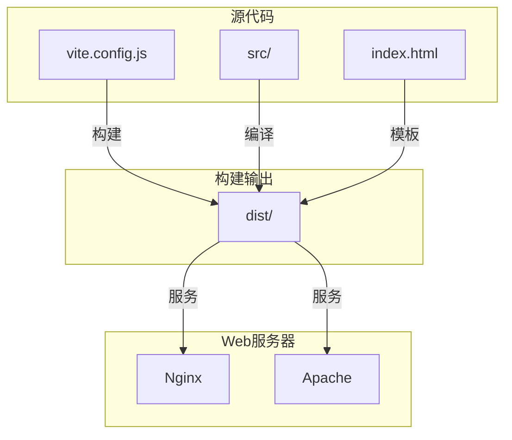
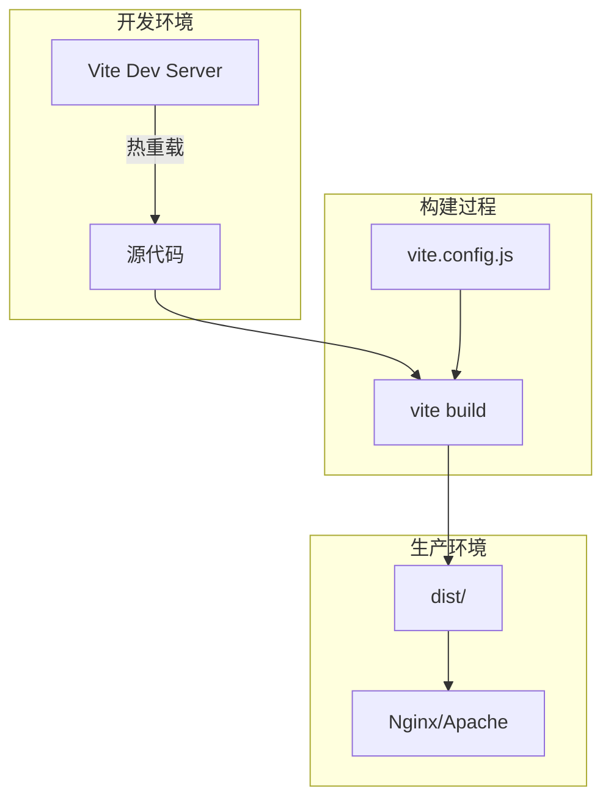
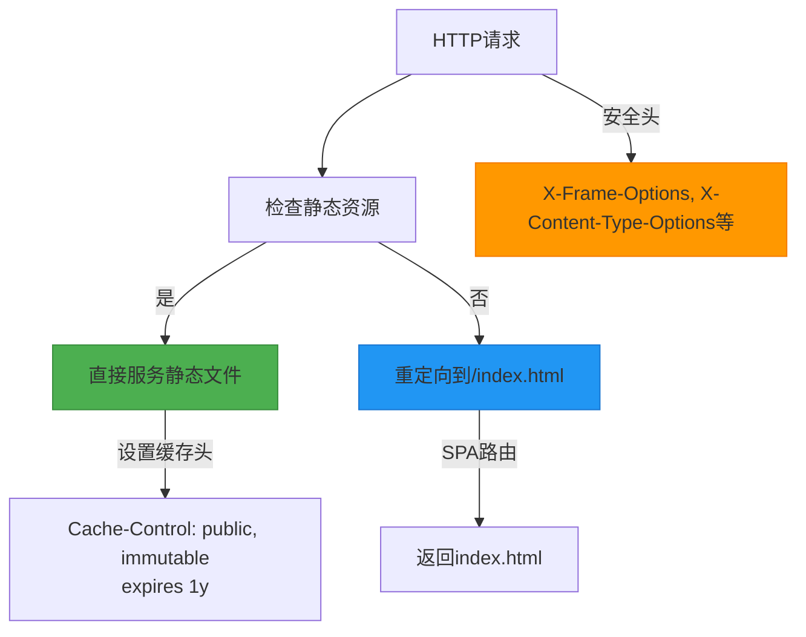
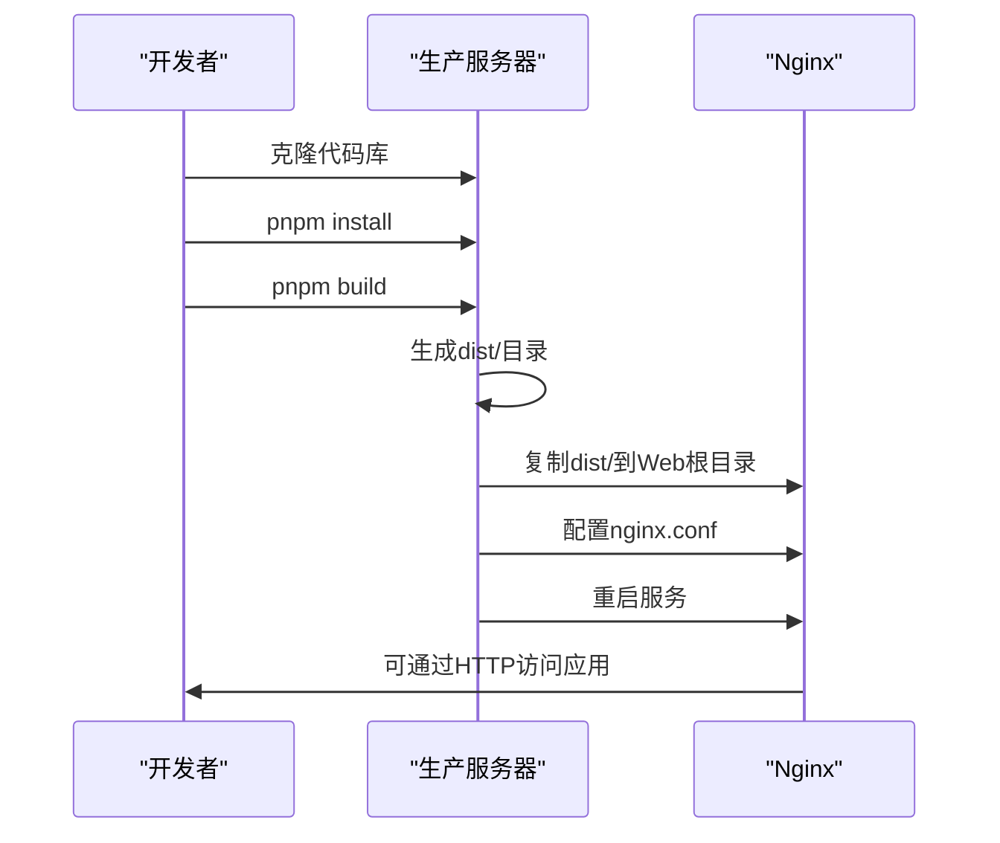

# 传统部署

<cite>
**本文档引用的文件**   
- [vite.config.js](file://vite.config.js)
- [package.json](file://package.json)
- [nginx.conf](file://nginx.conf)
- [index.html](file://index.html)
- [Dockerfile](file://Dockerfile)
- [Dockerfile.dev](file://Dockerfile.dev)
- [docker-compose.yml](file://docker-compose.yml)
- [start-dev.sh](file://start-dev.sh)
- [src/main.jsx](file://src/main.jsx)
- [src/App.jsx](file://src/App.jsx)
</cite>

## 目录
1. [简介](#简介)
2. [项目结构](#项目结构)
3. [核心组件](#核心组件)
4. [架构概览](#架构概览)
5. [详细组件分析](#详细组件分析)
6. [依赖分析](#依赖分析)
7. [性能考虑](#性能考虑)
8. [故障排除指南](#故障排除指南)
9. [结论](#结论)

## 简介
本文档详细说明了如何在不依赖 Docker 的情况下部署基于 Vite 的前端应用。文档涵盖了从构建配置、静态资源优化、Web 服务器配置到高级部署技巧的完整流程。通过分析 `vite.config.js`、`nginx.conf` 和 `package.json` 等关键文件，提供了生产级部署的全面指导，包括环境变量管理、CDN 集成和缓存失效策略，并列举了常见问题的解决方案。

## 项目结构
本项目是一个基于 Vite 和 React 的单页应用（SPA），用于创建吉他指板图。项目采用标准的前端项目结构，源代码位于 `src/` 目录下，包含组件、工具函数和 React Hooks。构建工具为 Vite，包管理器为 pnpm。项目提供了 Docker 和传统部署两种方案，其中传统部署方案通过直接构建静态文件并使用 Nginx 或 Apache 等 Web 服务器进行服务。



**Diagram sources**
- [vite.config.js](file://vite.config.js#L1-L11)
- [index.html](file://index.html#L1-L14)

**Section sources**
- [vite.config.js](file://vite.config.js#L1-L11)
- [index.html](file://index.html#L1-L14)
- [package.json](file://package.json#L1-L19)

## 核心组件
项目的核心功能由 `src/Fretboard.jsx` 组件实现，该组件管理指板的状态、用户交互和 SVG 渲染。应用通过 `src/main.jsx` 作为入口点，使用 React 18 的 `createRoot` API 渲染 `App` 组件。`App.jsx` 是根组件，负责挂载 `Fretboard` 组件。项目使用 `lz-string` 库进行数据压缩，实现了完全离线的分享和导入功能，无需后端支持。

**Section sources**
- [src/main.jsx](file://src/main.jsx#L1-L12)
- [src/App.jsx](file://src/App.jsx#L1-L13)
- [README.md](file://README.md#L159-L164)

## 架构概览
该项目采用现代前端架构，基于 Vite 构建工具和 React 框架。开发阶段使用 Vite 内置的开发服务器提供热模块替换（HMR）功能。生产阶段通过 `vite build` 命令将应用构建为静态文件，输出到 `dist` 目录。这些静态文件可以被任何 Web 服务器（如 Nginx 或 Apache）托管。项目支持 SPA 路由，通过 Web 服务器配置将所有非资源请求重定向到 `index.html`。



**Diagram sources**
- [vite.config.js](file://vite.config.js#L1-L11)
- [package.json](file://package.json#L6-L8)
- [nginx.conf](file://nginx.conf#L1-L29)

## 详细组件分析

### 构建配置分析
Vite 配置文件 `vite.config.js` 定义了开发服务器的行为，包括允许的主机列表。虽然当前配置未显式定义构建选项，但 Vite 提供了默认的生产构建配置，包括代码分割、Tree Shaking 和资源优化。`package.json` 中的 `build` 脚本直接调用 `vite build`，遵循 Vite 的默认约定，将构建产物输出到 `dist` 目录。

**Section sources**
- [vite.config.js](file://vite.config.js#L1-L11)
- [package.json](file://package.json#L7-L8)

### Web服务器配置分析
Nginx 配置文件 `nginx.conf` 为生产环境提供了完整的静态资源服务方案。配置包括监听 80 端口、启用 Gzip 压缩以减小传输体积、通过 `try_files` 指令支持 SPA 路由，以及为静态资源设置长期缓存策略。安全头的设置增强了应用的安全性。该配置可以直接用于生产环境，无需修改。



**Diagram sources**
- [nginx.conf](file://nginx.conf#L1-L29)

**Section sources**
- [nginx.conf](file://nginx.conf#L1-L29)

### 传统部署流程
传统部署流程不依赖 Docker，直接在目标服务器上操作。首先确保服务器安装了 Node.js 18+ 和 pnpm。然后克隆项目代码，运行 `pnpm install` 安装依赖，执行 `pnpm build` 生成 `dist` 目录。最后将 `dist` 目录的内容复制到 Web 服务器的根目录（如 `/usr/share/nginx/html`），并使用提供的 `nginx.conf` 配置重启 Nginx 服务。



**Diagram sources**
- [package.json](file://package.json#L7-L8)
- [nginx.conf](file://nginx.conf#L1-L29)

**Section sources**
- [README.md](file://README.md#L82-L90)
- [Dockerfile](file://Dockerfile#L19-L20)

## 依赖分析
项目依赖关系简单明了。生产依赖包括 React、React DOM 和用于数据压缩的 lz-string 库。开发依赖为 Vite 和 Vite 的 React 插件。`Dockerfile` 显示了多阶段构建过程，第一阶段使用 Node.js 镜像进行构建，第二阶段使用 Nginx 镜像服务静态文件。`docker-compose.yml` 定义了生产和服务开发两个服务，展示了容器化部署的完整配置。

```mermaid
graph LR
A[package.json] --> B[dependencies]
A --> C[devDependencies]
B --> D[react]
B --> E[react-dom]
B --> F[lz-string]
C --> G[vite]
C --> H[@vitejs/plugin-react]
I[Dockerfile] --> J[builder阶段: Node.js]
I --> K[生产阶段: Nginx]
J --> |构建| L[dist/]
K --> |服务| L
```

**Diagram sources**
- [package.json](file://package.json#L10-L18)
- [Dockerfile](file://Dockerfile#L1-L36)

**Section sources**
- [package.json](file://package.json#L10-L18)
- [Dockerfile](file://Dockerfile#L1-L36)
- [docker-compose.yml](file://docker-compose.yml#L1-L33)

## 性能考虑
项目的性能优化主要体现在构建和部署层面。Vite 在生产构建时自动进行代码分割、Tree Shaking 和资源压缩。Nginx 配置通过 Gzip 压缩进一步减小传输体积，并为静态资源（JS、CSS、图片等）设置了 1 年的缓存有效期和 `immutable` 指令，极大减少了重复请求。`index.html` 作为入口文件，由于其内容可能变化，不设置长期缓存，由浏览器默认策略处理。

## 故障排除指南
### 构建失败
如果 `pnpm build` 失败，请检查：
- Node.js 版本是否为 18.0 或更高
- `pnpm install` 是否成功完成
- 代码中是否存在语法错误或未处理的异常

### 资源404错误
如果部署后出现资源 404 错误：
- 确认 `dist` 目录已完整复制到 Web 服务器根目录
- 检查 Nginx 配置中的 `root` 路径是否正确
- 确认文件权限允许 Web 服务器读取

### 路由刷新错误
对于 SPA 应用，直接访问非根路径时可能出现 404。解决方案是确保 Web 服务器配置了正确的 SPA 路由支持，即所有非资源请求都重定向到 `index.html`。Nginx 配置中的 `try_files $uri $uri/ /index.html;` 指令已解决此问题。

**Section sources**
- [README.md](file://README.md#L190-L196)
- [nginx.conf](file://nginx.conf#L14-L16)

## 结论
本项目提供了完整的传统部署方案，通过 Vite 构建静态文件并使用 Nginx 服务，实现了高性能、安全的生产环境部署。文档详细说明了从构建到部署的每个步骤，包括关键配置文件的作用和高级优化技巧。提供的 Nginx 配置已经包含了 Gzip 压缩、缓存策略和安全头等最佳实践，可直接用于生产环境。对于希望避免 Docker 复杂性的用户，这种传统部署方式简单、高效且易于维护。