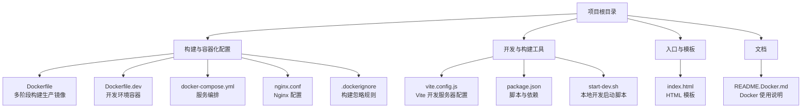
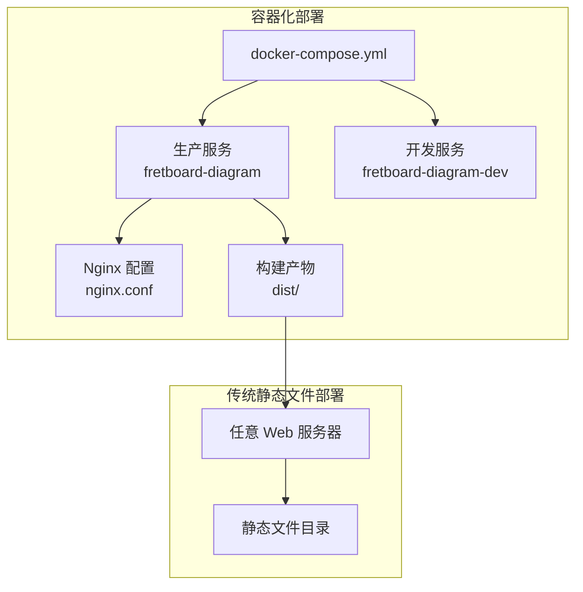
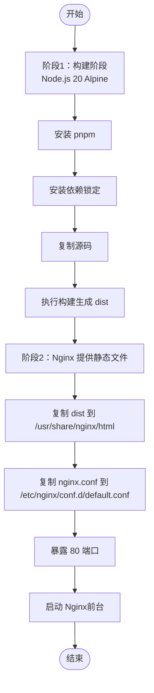
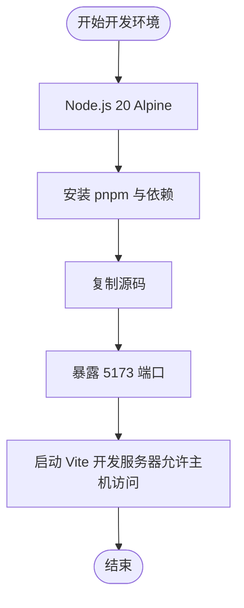
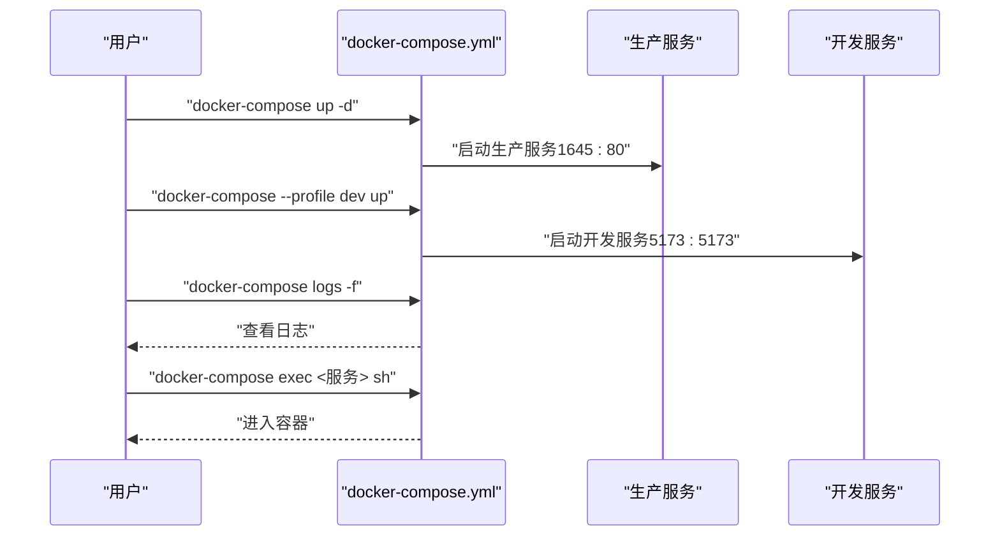
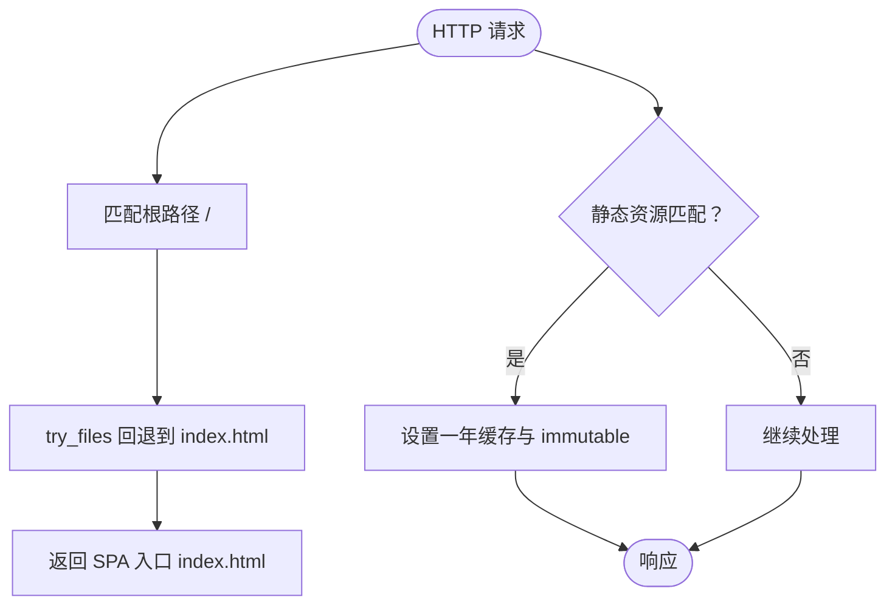
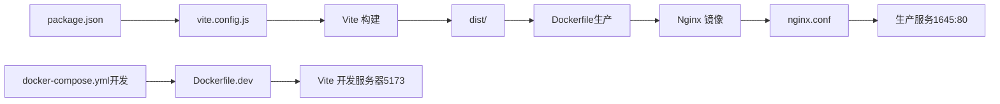

# 部署

<cite>
**本文引用的文件**
- [Dockerfile](file://Dockerfile)
- [Dockerfile.dev](file://Dockerfile.dev)
- [docker-compose.yml](file://docker-compose.yml)
- [nginx.conf](file://nginx.conf)
- [start-dev.sh](file://start-dev.sh)
- [vite.config.js](file://vite.config.js)
- [package.json](file://package.json)
- [README.Docker.md](file://README.Docker.md)
- [.dockerignore](file://.dockerignore)
- [index.html](file://index.html)
</cite>

## 目录
1. [简介](#简介)
2. [项目结构](#项目结构)
3. [核心组件](#核心组件)
4. [架构总览](#架构总览)
5. [详细组件分析](#详细组件分析)
6. [依赖关系分析](#依赖关系分析)
7. [性能考虑](#性能考虑)
8. [故障排除指南](#故障排除指南)
9. [结论](#结论)
10. [附录](#附录)

## 简介
本项目是一个基于 React 与 Vite 的吉他指板图创建工具，提供两种部署方案：
- 容器化部署：使用多阶段 Docker 构建生产镜像，结合 Nginx 提供静态文件服务；同时提供开发环境容器，支持热重载。
- 传统静态文件部署：直接构建静态产物并在任意 Web 服务器上托管。

本文档将详细说明开发与生产环境的部署流程、Dockerfile 如何构建生产镜像、Dockerfile.dev 如何设置开发环境、docker-compose.yml 如何编排服务、nginx.conf 中的 Web 服务器配置、start-dev.sh 启动脚本的作用以及 vite.config.js 中的部署相关设置，并给出容器化与传统静态文件两种部署方案的完整步骤。

## 项目结构
该仓库采用前端单页应用（SPA）结构，核心文件包括：
- 构建与容器化配置：Dockerfile、Dockerfile.dev、docker-compose.yml、nginx.conf、.dockerignore
- 开发与构建工具：vite.config.js、package.json、start-dev.sh
- 入口与模板：index.html
- 文档：README.Docker.md

**章节来源**
- [Dockerfile](file://Dockerfile#L1-L36)
- [Dockerfile.dev](file://Dockerfile.dev#L1-L24)
- [docker-compose.yml](file://docker-compose.yml#L1-L33)
- [nginx.conf](file://nginx.conf#L1-L29)
- [.dockerignore](file://.dockerignore#L1-L16)
- [vite.config.js](file://vite.config.js#L1-L11)
- [package.json](file://package.json#L1-L19)
- [start-dev.sh](file://start-dev.sh#L1-L4)
- [index.html](file://index.html#L1-L14)
- [README.Docker.md](file://README.Docker.md#L1-L73)

## 核心组件
- 多阶段 Docker 构建（生产镜像）
  - 使用 Node.js 20 Alpine 作为构建基础，安装 pnpm 并锁定依赖，复制源码后执行构建，最终将 dist 目录复制到 Nginx Alpine 镜像中提供静态服务。
- 开发环境容器
  - 使用 Node.js 20 Alpine，安装 pnpm 与依赖，暴露 Vite 开发服务器端口，启动开发服务器并允许从主机访问。
- 服务编排
  - docker-compose.yml 定义两个服务：生产服务（映射 1645:80）与开发服务（映射 5173:5173），开发服务挂载源代码目录以支持热重载。
- Nginx 配置
  - 启用 Gzip 压缩、SPA 路由回退到 index.html、静态资源长期缓存、安全头设置。
- Vite 配置
  - 开放开发服务器监听主机地址，允许特定主机名访问，便于在不同网络环境下调试。
- 启动脚本
  - start-dev.sh 提供本地非容器开发的便捷启动方式。

**章节来源**
- [Dockerfile](file://Dockerfile#L1-L36)
- [Dockerfile.dev](file://Dockerfile.dev#L1-L24)
- [docker-compose.yml](file://docker-compose.yml#L1-L33)
- [nginx.conf](file://nginx.conf#L1-L29)
- [vite.config.js](file://vite.config.js#L1-L11)
- [start-dev.sh](file://start-dev.sh#L1-L4)

## 架构总览
容器化部署采用“多阶段构建 + Nginx 提供静态文件”的架构，开发环境通过 Vite 提供热重载。传统静态文件部署则直接将构建产物分发到任意 Web 服务器。

**图示来源**
- [docker-compose.yml](file://docker-compose.yml#L1-L33)
- [Dockerfile](file://Dockerfile#L1-L36)
- [Dockerfile.dev](file://Dockerfile.dev#L1-L24)
- [nginx.conf](file://nginx.conf#L1-L29)

## 详细组件分析

### Dockerfile（生产镜像）
- 多阶段构建
  - 第一阶段：Node.js 20 Alpine，安装 pnpm，复制并锁定依赖，复制源码，执行构建，生成 dist。
  - 第二阶段：Nginx Alpine，复制第一阶段的 dist 到 /usr/share/nginx/html，覆盖默认配置，暴露 80 端口，以前台模式启动 Nginx。
- 关键点
  - 使用 --frozen-lockfile 确保依赖一致性。
  - 构建产物直接作为静态文件提供，无需 Node.js 运行时。

**图示来源**
- [Dockerfile](file://Dockerfile#L1-L36)

**章节来源**
- [Dockerfile](file://Dockerfile#L1-L36)

### Dockerfile.dev（开发环境）
- 基础镜像：Node.js 20 Alpine
- 步骤：安装 pnpm，复制并锁定依赖，复制源码，暴露 Vite 开发服务器端口，启动开发服务器并允许从主机访问。
- 用途：快速搭建开发环境，支持热重载。

**图示来源**
- [Dockerfile.dev](file://Dockerfile.dev#L1-L24)

**章节来源**
- [Dockerfile.dev](file://Dockerfile.dev#L1-L24)

### docker-compose.yml（服务编排）
- 生产服务
  - 使用 Dockerfile 构建镜像，容器名 fretboard-diagram，映射宿主 1645:80，环境变量 NODE_ENV=production。
- 开发服务
  - 使用 Dockerfile.dev 构建镜像，容器名 fretboard-diagram-dev，映射宿主 5173:5173，挂载 src、index.html、vite.config.js、package.json，环境变量 NODE_ENV=development，启用 dev profile。
- 作用：一键启动生产或开发环境，支持日志查看与容器进入。

**图示来源**
- [docker-compose.yml](file://docker-compose.yml#L1-L33)

**章节来源**
- [docker-compose.yml](file://docker-compose.yml#L1-L33)
- [README.Docker.md](file://README.Docker.md#L1-L73)

### nginx.conf（Web 服务器配置）
- 监听 80 端口，根目录指向 /usr/share/nginx/html，首页 index.html。
- 启用 Gzip 压缩，指定压缩类型与最小长度。
- SPA 路由支持：当请求的文件不存在时回退到 index.html。
- 静态资源缓存：对 JS/CSS/图片/字体等资源设置一年缓存与 immutable 标记。
- 安全头：X-Frame-Options、X-Content-Type-Options、X-XSS-Protection。

**图示来源**
- [nginx.conf](file://nginx.conf#L1-L29)

**章节来源**
- [nginx.conf](file://nginx.conf#L1-L29)

### start-dev.sh（本地开发启动脚本）
- 作用：进入项目目录并启动 pnpm dev，便于非容器环境下的本地开发。
- 适用场景：未使用 Docker 的开发环境或需要直接在宿主机运行开发服务器时。

**章节来源**
- [start-dev.sh](file://start-dev.sh#L1-L4)

### vite.config.js（部署相关设置）
- 开发服务器 host 设为 true，允许从外部访问开发服务器。
- allowedHosts 列表包含特定主机名与 localhost，便于在不同网络环境下调试。
- 与 docker-compose.yml 的开发服务端口 5173 对应。

**章节来源**
- [vite.config.js](file://vite.config.js#L1-L11)
- [docker-compose.yml](file://docker-compose.yml#L14-L32)

### package.json（脚本与依赖）
- scripts：dev、build、preview，分别对应 Vite 开发、构建与预览。
- 依赖：React、React DOM、LZ-String；构建工具 Vite 与 @vitejs/plugin-react。
- 与 Vite 配置配合，确保开发与构建流程一致。

**章节来源**
- [package.json](file://package.json#L1-L19)

### index.html（入口模板）
- 作为 SPA 入口，包含基本 meta 信息与 React 应用挂载点。
- 与 Nginx 的 SPA 回退策略配合，确保路由跳转正确加载应用。

**章节来源**
- [index.html](file://index.html#L1-L14)

## 依赖关系分析
- 构建链路
  - package.json -> vite.config.js -> Vite 构建 -> dist
  - Dockerfile -> Node 构建阶段 -> dist -> Nginx 提供静态文件
- 容器编排
  - docker-compose.yml -> Dockerfile/Dockerfile.dev -> 服务镜像 -> 容器
  - 生产服务依赖 nginx.conf 提供静态文件与路由回退
- 开发链路
  - vite.config.js -> Vite 开发服务器 -> 浏览器热重载
  - start-dev.sh -> pnpm dev -> 本地开发

**图示来源**
- [package.json](file://package.json#L1-L19)
- [vite.config.js](file://vite.config.js#L1-L11)
- [Dockerfile](file://Dockerfile#L1-L36)
- [Dockerfile.dev](file://Dockerfile.dev#L1-L24)
- [docker-compose.yml](file://docker-compose.yml#L1-L33)
- [nginx.conf](file://nginx.conf#L1-L29)

**章节来源**
- [package.json](file://package.json#L1-L19)
- [vite.config.js](file://vite.config.js#L1-L11)
- [Dockerfile](file://Dockerfile#L1-L36)
- [Dockerfile.dev](file://Dockerfile.dev#L1-L24)
- [docker-compose.yml](file://docker-compose.yml#L1-L33)
- [nginx.conf](file://nginx.conf#L1-L29)

## 性能考虑
- 生产镜像体积与启动速度
  - 多阶段构建仅保留 dist 产物，避免 Node.js 运行时与构建工具进入最终镜像，减小镜像体积并提升启动速度。
- Nginx 配置优化
  - Gzip 压缩减少传输体积；静态资源一年缓存与 immutable 标记降低带宽与服务器压力。
- 开发体验
  - 开发容器挂载源代码目录，实现热重载；Vite 开发服务器开放主机访问，便于跨设备调试。

[本节为通用指导，不涉及具体文件分析]

## 故障排除指南
- 端口冲突
  - 开发端口 5173 被占用时，Vite 会自动尝试下一个可用端口；可在 vite.config.js 中调整端口。
- 依赖安装失败
  - 清理 pnpm store、删除 node_modules 与锁文件后重新安装。
- 构建失败
  - 检查 Node.js 版本、依赖完整性与代码语法。
- 容器无法访问
  - 确认 docker-compose 命令与端口映射正确；查看日志定位问题。

**章节来源**
- [README.Docker.md](file://README.Docker.md#L176-L196)
- [vite.config.js](file://vite.config.js#L1-L11)

## 结论
本项目提供了完善的容器化与传统静态文件部署方案。生产环境通过多阶段 Docker 构建与 Nginx 提供静态文件，具备较小镜像体积与良好性能；开发环境通过 Vite 实现热重载与跨设备调试。结合 docker-compose.yml 的服务编排与 nginx.conf 的 Web 服务器配置，可快速在本地或生产环境中部署该前端应用。

[本节为总结，不涉及具体文件分析]

## 附录

### 容器化部署步骤
- 生产环境
  - 使用 docker-compose 启动生产服务，访问 http://localhost:1645。
  - 可通过 docker-compose build、logs、down、exec 等命令管理镜像与容器。
- 开发环境
  - 使用 docker-compose --profile dev 启动开发服务，访问 http://localhost:5173。
  - 源代码挂载至容器，支持热重载；可通过 exec 进入容器进行调试。

**章节来源**
- [README.Docker.md](file://README.Docker.md#L1-L73)
- [docker-compose.yml](file://docker-compose.yml#L1-L33)

### 传统静态文件部署步骤
- 在本地或 CI/CD 环境中执行构建，生成 dist 目录。
- 将 dist 目录中的静态文件部署到任意 Web 服务器（如 Nginx/Apache/IIS）。
- 确保服务器根目录指向 dist，并配置 SPA 路由回退到 index.html。
- 若使用 Nginx，可参考 nginx.conf 中的配置项（Gzip、缓存、安全头、SPA 回退）。

**章节来源**
- [Dockerfile](file://Dockerfile#L19-L20)
- [nginx.conf](file://nginx.conf#L1-L29)

### .dockerignore（构建忽略规则）
- 忽略 node_modules、dist、日志、IDE 配置、文档、备份文件等，减少构建上下文大小，提升构建效率。

**章节来源**
- [.dockerignore](file://.dockerignore#L1-L16)