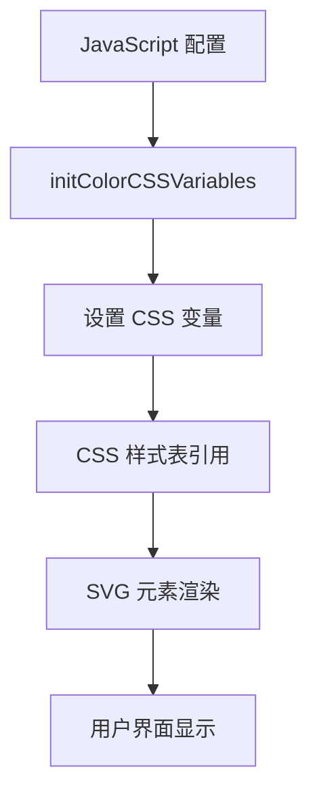

# 应用配置

<cite>
**本文档引用的文件**
- [colorConfig.js](file://src/colorConfig.js)
- [constants.js](file://src/constants.js)
- [fretboard.css](file://src/fretboard.css)
- [Fretboard.jsx](file://src/Fretboard.jsx)
- [ColorPalette.jsx](file://src/components/ColorPalette.jsx)
- [utils.js](file://src/utils.js)
</cite>

## 目录
1. [颜色配置](#颜色配置)
2. [常量配置](#常量配置)
3. [CSS变量与样式同步](#css变量与样式同步)
4. [实用配置示例](#实用配置示例)

## 颜色配置

应用的颜色配置通过 `colorConfig.js` 文件集中管理，定义了音符的填充色、描边色以及调色盘按钮的样式。该文件通过 JavaScript 配置与 CSS 变量的结合，实现了主题颜色的动态控制。

### 第一层级颜色（LEVEL1_COLORS）

`LEVEL1_COLORS` 对象定义了音符的填充色和调色盘按钮的背景色。每个颜色包含 `fill` 和 `button` 两个属性：

- `fill`：用于音符的填充颜色
- `button`：用于调色盘按钮的背景颜色

支持的颜色包括 `trans`（透明）、`blue`、`red`、`green`、`brown` 和 `gray`。这些颜色通过 CSS 变量（如 `--color-level1-blue-fill`）在样式表中引用，确保了 JavaScript 配置与 CSS 样式的同步。

**调用逻辑**：
- `getLevel1FillColor(colorName)` 函数根据颜色名称返回对应的填充色
- `getLevel1ButtonColor(colorName)` 函数返回对应的按钮背景色
- 这些函数在用户选择颜色时被调用，通过 `selectColor` 工具函数更新音符状态

**Section sources**
- [colorConfig.js](file://src/colorConfig.js#L6-L31)
- [Fretboard.jsx](file://src/Fretboard.jsx#L13)
- [ColorPalette.jsx](file://src/components/ColorPalette.jsx#L2)

### 第二层级颜色（LEVEL2_COLORS）

`LEVEL2_COLORS` 对象定义了音符的描边颜色，用于区分不同类型的音符标记。与第一层级不同，第二层级颜色仅包含单一颜色值。

支持的颜色包括 `orange`、`cyan`、`pink`、`grass-green`、`yellow` 和 `white`。这些颜色通过 `getLevel2Color(colorName)` 函数获取，并在音符描边时应用。

**调用逻辑**：
- 当用户启用描边功能时，`useColor2Level` 状态被激活
- `selectColor` 函数根据当前层级（1 或 2）选择对应的颜色配置
- 描边颜色通过 `updateNote` 函数直接设置到 SVG 元素的 `stroke` 属性

**Section sources**
- [colorConfig.js](file://src/colorConfig.js#L34-L41)
- [utils.js](file://src/utils.js#L83-L85)
- [Fretboard.jsx](file://src/Fretboard.jsx#L13)

### 颜色变体生成

`generateTintVariants` 函数负责生成颜色的淡色版本，创建从深到浅的 5 个变体。该函数通过 HSL 色彩空间进行颜色变换：

1. 将输入的基准颜色转换为 RGB 值
2. 将 RGB 转换为 HSL（色相、饱和度、亮度）
3. 应用预定义的饱和度和亮度调整
4. 生成 5 个变体：浓二档、浓一档、原色、淡一档、淡二档
5. 反转数组顺序，使浅色在前

**调用逻辑**：
- 当用户双击调色盘按钮时，触发 `doubleClickColorMemo` 回调
- 该回调调用 `generateTintVariants` 生成变体
- 根据层级选择默认变体（第一层级选浓一档，第二层级选淡一档）
- 进入"异色模式"，允许用户使用变体颜色

**Section sources**
- [colorConfig.js](file://src/colorConfig.js#L59-L96)
- [Fretboard.jsx](file://src/Fretboard.jsx#L349-L357)

## 常量配置

`constants.js` 文件定义了指板的核心结构参数，通过 `CONSTS` 对象集中管理所有常量配置。

### 指板结构参数

| 配置项 | 说明 | 默认值 |
|--------|------|--------|
| `offsetX` | 指板X轴偏移量 | 40 |
| `offsetY` | 指板Y轴偏移量 | 30 |
| `stringIntervals` | 弦的音程间隔 | [24,19,15,10,5,0] |
| `markers` | 品位标记位置 | [1,3,5,7,9,12,15,17,19,21] |
| `fretWidth` | 品位宽度 | 75 |
| `stringSpacing` | 弦间距 | 51 |
| `circleRadius` | 音符半径 | 18 |

### 动态计算属性

`CONSTS` 对象还包含两个动态计算的属性：

- `numStrings`：通过 `stringIntervals` 数组长度自动计算弦数
- `fretHeight`：根据弦数和弦间距计算指板总高度

这些常量在 `fretboardCalculations.js` 中被广泛使用，用于计算音符位置、生成指板路径和标记位置。

**调用逻辑**：
- `generateNotes` 函数使用 `fretWidth` 和 `stringSpacing` 计算每个音符的坐标
- `generateMarkers` 函数使用 `markers` 数组确定品位标记的位置
- `generateStringPath` 函数使用 `fretWidth` 生成弦的路径数据

**Section sources**
- [constants.js](file://src/constants.js#L1-L19)
- [fretboardCalculations.js](file://src/utils/fretboardCalculations.js#L1)

## CSS变量与样式同步

应用通过 CSS 变量实现了 JavaScript 配置与样式表的无缝同步，确保了主题颜色的一致性。

### CSS变量定义

在 `fretboard.css` 文件中，通过 `:root` 选择器定义了全局 CSS 变量：

```css
:root {
    --background-color: black;
    --text-color: #aaaaaa;
}
```

### 变量同步机制

`initColorCSSVariables` 函数在组件挂载时被调用，负责将 JavaScript 配置同步到 CSS 变量：

1. 遍历 `LEVEL1_COLORS` 对象，为每个颜色创建对应的 CSS 变量
2. 遍历 `LEVEL2_COLORS` 对象，创建描边颜色的 CSS 变量
3. 使用 `document.documentElement.style.setProperty` 方法设置变量值

生成的 CSS 变量命名规则：
- 第一层级填充色：`--color-level1-{colorName}-fill`
- 第一层级按钮色：`--color-level1-{colorName}-button`
- 第二层级描边色：`--color-level2-{colorName}`

### 主题与响应式实现

应用实现了深色主题支持和响应式布局：

**主题颜色**：
- 通过 `@media (prefers-color-scheme: dark)` 媒体查询检测系统偏好
- 在深色模式下自动调整背景颜色

**文本颜色**：
- 使用 `--text-color` 变量统一管理所有文本颜色
- 在 SVG 元素和 HTML 组件中保持一致

**响应式布局**：
- 使用 `max-width: 100vw` 确保内容不超出视口
- 通过 `overflow-x: auto` 实现水平滚动
- 使用 `flexbox` 布局实现自适应容器



**Diagram sources**
- [colorConfig.js](file://src/colorConfig.js#L144-L161)
- [fretboard.css](file://src/fretboard.css#L8-L11)
- [Fretboard.jsx](file://src/Fretboard.jsx#L127)

## 实用配置示例

### 修改颜色方案

要修改应用的颜色方案，只需编辑 `colorConfig.js` 文件中的 `LEVEL1_COLORS` 和 `LEVEL2_COLORS` 对象：

```javascript
export const LEVEL1_COLORS = {
    blue: {
        fill: '#1e90ff',           // 改为深天蓝色
        button: '#1e90ff'
    },
    red: {
        fill: '#ff4500',           // 改为橙红色
        button: '#ff4500'
    }
};
```

### 调整指板尺寸

通过修改 `constants.js` 中的常量来调整指板尺寸：

```javascript
export const CONSTS = {
    fretWidth: 85,           // 增加品位宽度
    stringSpacing: 55,       // 增加弦间距
    circleRadius: 20         // 增加音符半径
};
```

### 扩展音符标记

要添加新的音符标记，可以扩展 `markers` 数组：

```javascript
export const CONSTS = {
    markers: [1, 3, 5, 7, 9, 12, 15, 17, 19, 21, 24]  // 添加24品标记
};
```

或者通过 `stringIntervals` 数组调整弦的音程：

```javascript
export const CONSTS = {
    stringIntervals: [28, 23, 19, 14, 9, 4]  // 调整为降半音调弦
};
```

**Section sources**
- [colorConfig.js](file://src/colorConfig.js)
- [constants.js](file://src/constants.js)
- [fretboard.css](file://src/fretboard.css)