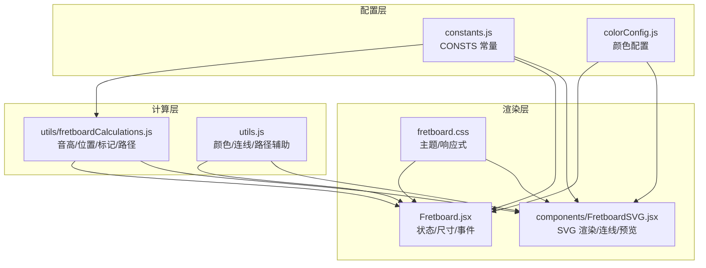
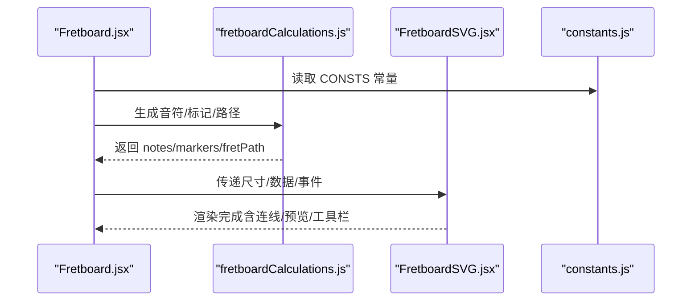
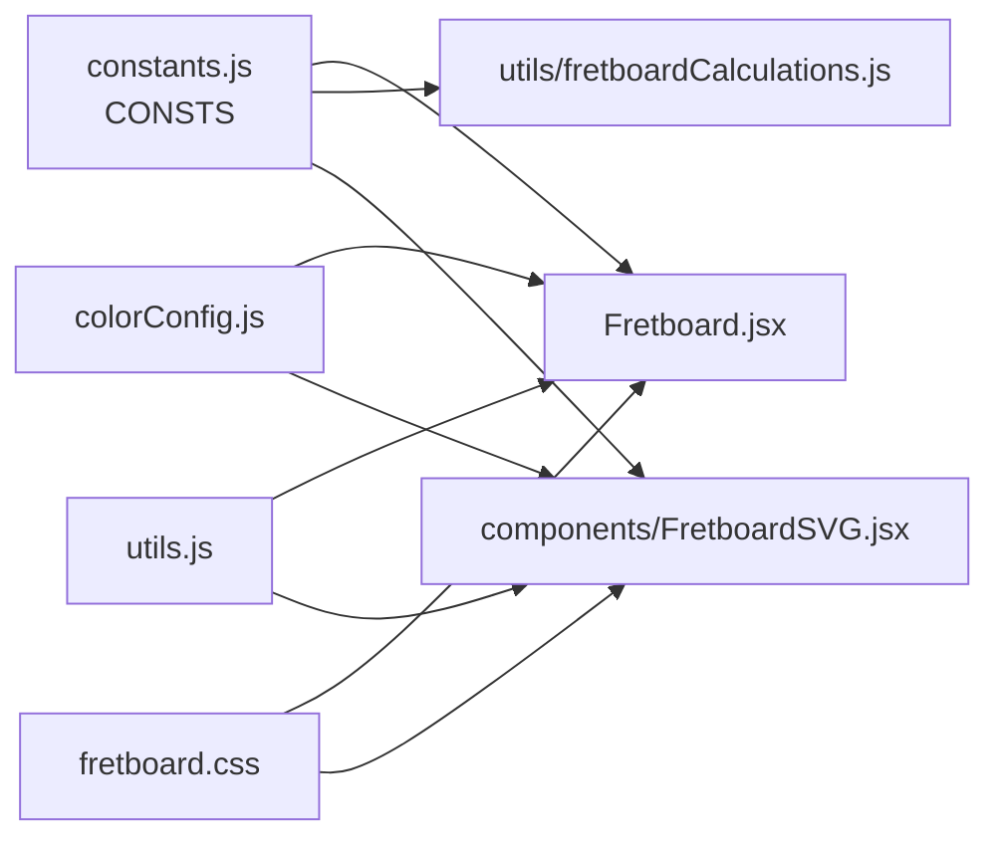

# 指板结构配置

<cite>
**本文引用的文件**
- [src/constants.js](file://src/constants.js)
- [src/utils/fretboardCalculations.js](file://src/utils/fretboardCalculations.js)
- [src/Fretboard.jsx](file://src/Fretboard.jsx)
- [src/components/FretboardSVG.jsx](file://src/components/FretboardSVG.jsx)
- [src/fretboard.css](file://src/fretboard.css)
- [src/colorConfig.js](file://src/colorConfig.js)
- [src/utils.js](file://src/utils.js)
- [src/components/FretboardMenu.jsx](file://src/components/FretboardMenu.jsx)
</cite>

## 目录
1. [简介](#简介)
2. [项目结构](#项目结构)
3. [核心组件](#核心组件)
4. [架构总览](#架构总览)
5. [详细组件分析](#详细组件分析)
6. [依赖关系分析](#依赖关系分析)
7. [性能考量](#性能考量)
8. [故障排查指南](#故障排查指南)
9. [结论](#结论)
10. [附录](#附录)

## 简介
本文聚焦于指板的核心结构参数配置，系统梳理 CONSTS 对象中的关键常量（offsetX、offsetY、stringIntervals、markers、fretWidth、stringSpacing、circleRadius、notes、sign 等）如何共同决定指板的几何布局、音高映射、标记显示、视觉样式与响应式适配。我们将结合计算模块、渲染模块与样式模块，给出参数修改建议及对用户体验的影响评估。

## 项目结构
本项目采用“组件驱动 + 工具函数 + 常量配置”的组织方式：
- 常量集中于 constants.js，供计算与渲染模块共享
- 计算模块负责音高、位置、标记等逻辑
- 渲染模块负责 SVG 输出与样式应用
- 样式模块负责主题与响应式布局

图表来源
- [src/constants.js](file://src/constants.js#L1-L19)
- [src/utils/fretboardCalculations.js](file://src/utils/fretboardCalculations.js#L1-L135)
- [src/Fretboard.jsx](file://src/Fretboard.jsx#L1-L120)
- [src/components/FretboardSVG.jsx](file://src/components/FretboardSVG.jsx#L1-L120)
- [src/fretboard.css](file://src/fretboard.css#L1-L120)
- [src/colorConfig.js](file://src/colorConfig.js#L1-L162)
- [src/utils.js](file://src/utils.js#L1-L120)

章节来源
- [src/constants.js](file://src/constants.js#L1-L19)
- [src/utils/fretboardCalculations.js](file://src/utils/fretboardCalculations.js#L1-L135)
- [src/Fretboard.jsx](file://src/Fretboard.jsx#L1-L120)
- [src/components/FretboardSVG.jsx](file://src/components/FretboardSVG.jsx#L1-L120)
- [src/fretboard.css](file://src/fretboard.css#L1-L120)
- [src/colorConfig.js](file://src/colorConfig.js#L1-L162)
- [src/utils.js](file://src/utils.js#L1-L120)

## 核心组件
本节聚焦 CONSTS 对象中的关键参数及其作用域。

- offsetX、offsetY
  - 作用：定义 SVG 画布的左上角偏移，决定第一个品位左侧与上方的空白区域，以及顶部/底部标记的垂直位置基准。
  - 影响：改变整体布局的起始位置，影响视窗与滚动行为。
  - 关联计算：Fretboard.jsx 中基于 offsetX、fretWidth、fretHeight 计算 SVG 宽高与 viewBox。

- stringIntervals
  - 作用：每根弦的空弦音高在半音阶计数中的偏移量，决定各弦的基频音高。
  - 示例：六根弦的空弦音高（E2、A2、D3、G3、B3、E4）对应半音阶索引分别为 3、7、10、14、19、23，经 CONSTS.stringIntervals 的差值映射为 [24, 19, 15, 10, 5, 0]（以 E2 为参考）。
  - 关联计算：fretboardCalculations.js 中 computeNoteIndex 与 computeNoteName 基于此进行音高推导。

- markers
  - 作用：定义需要显示的品格标记（如 1、3、5、7、9、12、15、17、19、21），用于视觉提示。
  - 显示逻辑：Fretboard.jsx 与 fretboardCalculations.js 生成标记列表，分别在顶部与底部对称显示；仅在当前窗口范围内过滤显示。

- fretWidth、stringSpacing
  - 作用：fretWidth 决定相邻品位之间的水平间距；stringSpacing 决定相邻弦之间的垂直间距。
  - 影响：直接影响指板的横向与纵向密度、可读性与视觉比例；fretWidth 还参与 SVG 宽度与 viewBox 的计算。

- circleRadius
  - 作用：音符圆圈的半径，决定点击命中区域与视觉大小。
  - 影响：过大影响弦间距感知，过小影响可点选性；与 stringSpacing、fretWidth 协同决定布局拥挤度。

- notes 与 sign
  - notes：二维数组，每行代表一种升降号体系（如升号与降号）的半音阶映射。
  - sign：符号数组，用于界面按钮显示（♯/♭），配合 enharmonic 状态切换显示风格。
  - 关联：FretboardMenu.jsx 中通过按钮切换 enharmonic，从而影响音名显示；Fretboard.jsx 与 fretboardCalculations.js 在生成音名时根据 enharmonic 选择对应映射行。

章节来源
- [src/constants.js](file://src/constants.js#L1-L19)
- [src/utils/fretboardCalculations.js](file://src/utils/fretboardCalculations.js#L1-L135)
- [src/Fretboard.jsx](file://src/Fretboard.jsx#L94-L120)
- [src/components/FretboardMenu.jsx](file://src/components/FretboardMenu.jsx#L110-L120)

## 架构总览
指板渲染的关键流程如下：
- Fretboard.jsx 计算布局尺寸（基于 CONSTS.fretWidth、fretHeight、offsetX、offsetY）
- fretboardCalculations.js 生成音符位置、音名、标记与弦路径
- FretboardSVG.jsx 渲染 SVG，应用颜色与样式
- colorConfig.js 与 fretboard.css 提供主题与响应式支持

图表来源
- [src/Fretboard.jsx](file://src/Fretboard.jsx#L94-L120)
- [src/utils/fretboardCalculations.js](file://src/utils/fretboardCalculations.js#L13-L135)
- [src/components/FretboardSVG.jsx](file://src/components/FretboardSVG.jsx#L1-L120)
- [src/constants.js](file://src/constants.js#L1-L19)

## 详细组件分析

### 布局与尺寸参数
- offsetX、offsetY
  - 用途：确定 SVG 画布的左上角偏移，保证 0 品左侧与上方留白，以及顶部/底部标记的垂直位置。
  - 计算：Fretboard.jsx 基于 offsetX、fretWidth、fretHeight、stringSpacing 计算 SVG 宽高与 viewBox，确保 0 品边缘与第一个品位边缘对齐。

- fretWidth、stringSpacing
  - 用途：fretWidth 决定品位间距；stringSpacing 决定弦间距。
  - 计算：Fretboard.jsx 通过 numFrets 与 fretWidth 计算 fretboardWidth；通过 (numStrings-1)*stringSpacing 计算 fretHeight；最终用于 viewBox 与字符串路径绘制。

- circleRadius
  - 用途：音符圆圈半径，影响点击命中与视觉大小。
  - 渲染：FretboardSVG.jsx 在每个音符 g 元素内绘制 circle，半径来自 CONSTS.circleRadius。

- fretHeight
  - 用途：由 CONSTS 计算得出，决定弦路径的总高度。
  - 计算：CONSTS.fretHeight = (CONSTS.numStrings - 1) * CONSTS.stringSpacing

章节来源
- [src/Fretboard.jsx](file://src/Fretboard.jsx#L94-L120)
- [src/constants.js](file://src/constants.js#L17-L19)
- [src/components/FretboardSVG.jsx](file://src/components/FretboardSVG.jsx#L276-L289)

### 音高与标记
- stringIntervals
  - 用途：每根弦空弦音高的半音阶偏移，决定各弦基频。
  - 计算：fretboardCalculations.js 中 computeNoteIndex 以 interval = CONSTS.stringIntervals[string] + fret + 1 计算半音阶索引，再取模 12 得到音名索引。

- notes 与 sign
  - 用途：notes 提供两种音名体系（升号/降号）映射；sign 提供界面符号显示。
  - 切换：FretboardMenu.jsx 通过按钮切换 enharmonic，影响音名显示；Fretboard.jsx 与 fretboardCalculations.js 在生成音名时依据 enharmonic 选择对应映射行。

- markers
  - 用途：定义需要显示的标记位置。
  - 过滤与渲染：fretboardCalculations.js 仅保留 startFret~endFret 范围内的标记；Fretboard.jsx 与 FretboardSVG.jsx 分别在顶部与底部对称渲染。

章节来源
- [src/utils/fretboardCalculations.js](file://src/utils/fretboardCalculations.js#L3-L11)
- [src/constants.js](file://src/constants.js#L10-L14)
- [src/components/FretboardMenu.jsx](file://src/components/FretboardMenu.jsx#L110-L120)
- [src/Fretboard.jsx](file://src/Fretboard.jsx#L114-L120)
- [src/utils/fretboardCalculations.js](file://src/utils/fretboardCalculations.js#L86-L111)

### 视觉与样式
- 颜色体系
  - colorConfig.js 定义 LEVEL1_COLORS 与 LEVEL2_COLORS，并通过 initColorCSSVariables 注入 CSS 变量，供 fretboard.css 与 FretboardSVG.jsx 使用。
  - FretboardSVG.jsx 在渲染音符时，根据 color 与 color2 设置填充与描边；当仅存在 color2 时，文本颜色设为白色以提升对比度。

- 文本与连线
  - utils.js 提供 inlineCSS 将 CSS 变量与颜色值内联到 SVG，确保导出的 SVG 保持一致的视觉风格。
  - calculateConnectionColor 与 calculateArcPath 等辅助函数用于连线渲染与路径计算。

章节来源
- [src/colorConfig.js](file://src/colorConfig.js#L1-L162)
- [src/fretboard.css](file://src/fretboard.css#L121-L200)
- [src/components/FretboardSVG.jsx](file://src/components/FretboardSVG.jsx#L195-L293)
- [src/utils.js](file://src/utils.js#L168-L274)

### 响应式布局与 CSS 协同
- fretboard.css 中针对不同屏幕尺寸与主题提供了基础样式与布局策略，例如：
  - figure.half-full 与 svg 的最大宽度与自适应高度，确保在容器内居中显示。
  - 基于 CSS 变量的主题色与文本色，与 colorConfig.js 的颜色注入形成联动。
  - 颜色类名与透明度控制，配合 visibility 与 selected 状态实现交互反馈。

章节来源
- [src/fretboard.css](file://src/fretboard.css#L488-L510)
- [src/fretboard.css](file://src/fretboard.css#L189-L200)
- [src/fretboard.css](file://src/fretboard.css#L82-L120)

## 依赖关系分析
- CONSTS 为全局共享常量，被以下模块广泛使用：
  - Fretboard.jsx：布局尺寸、视窗计算、事件绑定
  - fretboardCalculations.js：音高计算、位置生成、标记过滤
  - FretboardSVG.jsx：渲染圆圈、文本、连线与预览
  - colorConfig.js：颜色注入与变体生成
  - utils.js：颜色/连线/路径辅助

图表来源
- [src/constants.js](file://src/constants.js#L1-L19)
- [src/Fretboard.jsx](file://src/Fretboard.jsx#L1-L120)
- [src/utils/fretboardCalculations.js](file://src/utils/fretboardCalculations.js#L1-L135)
- [src/components/FretboardSVG.jsx](file://src/components/FretboardSVG.jsx#L1-L120)
- [src/colorConfig.js](file://src/colorConfig.js#L1-L162)
- [src/utils.js](file://src/utils.js#L1-L120)
- [src/fretboard.css](file://src/fretboard.css#L1-L120)

章节来源
- [src/constants.js](file://src/constants.js#L1-L19)
- [src/Fretboard.jsx](file://src/Fretboard.jsx#L1-L120)
- [src/utils/fretboardCalculations.js](file://src/utils/fretboardCalculations.js#L1-L135)
- [src/components/FretboardSVG.jsx](file://src/components/FretboardSVG.jsx#L1-L120)
- [src/colorConfig.js](file://src/colorConfig.js#L1-L162)
- [src/utils.js](file://src/utils.js#L1-L120)
- [src/fretboard.css](file://src/fretboard.css#L1-L120)

## 性能考量
- 布局计算集中在 Fretboard.jsx 与 fretboardCalculations.js，采用 useMemo 与 useCallback 优化渲染与事件处理，避免不必要的重算。
- 颜色与连线计算通过 CSS 变量与内联样式减少 DOM 查询与样式重排。
- markers 与 notes 的生成遵循窗口范围过滤，减少渲染节点数量。

[本节为通用指导，无需特定文件引用]

## 故障排查指南
- 音符显示异常或重叠
  - 检查 fretWidth 与 stringSpacing 是否过大或过小；适当增大以缓解拥挤，或减小以提升密度。
  - 检查 circleRadius 是否过小导致点击困难或过大导致拥挤。

- 标记位置不正确
  - 确认 markers 数组与 startFret/endFret 的范围过滤逻辑；检查生成标记的 x/y 计算是否与 fretWidth、offsetX 对齐。

- 颜色不生效或导出 SVG 颜色丢失
  - 确认 colorConfig.js 的 CSS 变量已初始化；检查 utils.js 的 inlineCSS 是否正确替换变量。

- 响应式布局异常
  - 检查 fretboard.css 中 figure.half-full 与 svg 的 max-width/height 设置；确认容器宽度变化时是否重新计算 viewBox。

章节来源
- [src/Fretboard.jsx](file://src/Fretboard.jsx#L94-L120)
- [src/utils/fretboardCalculations.js](file://src/utils/fretboardCalculations.js#L86-L135)
- [src/components/FretboardSVG.jsx](file://src/components/FretboardSVG.jsx#L195-L293)
- [src/utils.js](file://src/utils.js#L168-L274)
- [src/fretboard.css](file://src/fretboard.css#L488-L510)

## 结论
CONSTS 对象是整个指板系统的“几何与音高中枢”。通过合理调整 offsetX/offsetY、fretWidth/stringSpacing、circleRadius、markers、stringIntervals 与 notes/sign，可以在保证可读性的前提下，灵活适配不同屏幕尺寸与使用场景。配合 colorConfig.js 与 fretboard.css 的主题与响应式机制，可实现一致且美观的视觉体验。

[本节为总结，无需特定文件引用]

## 附录

### 实用修改示例与影响评估

- 修改指板尺寸
  - 建议：调整 CONSTS.fretWidth 与 CONSTS.stringSpacing
  - 影响：fretWidth 增大可提升横向可读性，但可能增加横向滚动；stringSpacing 增大可改善纵向拥挤，但可能超出移动端可视范围。
  - 参考路径：
    - [src/constants.js](file://src/constants.js#L6-L8)
    - [src/Fretboard.jsx](file://src/Fretboard.jsx#L94-L107)

- 调整弦数
  - 建议：修改 CONSTS.stringIntervals 长度与数值，确保与目标乐器（如吉他6弦、贝斯4弦）匹配
  - 影响：需同步更新 numStrings 与相关渲染逻辑（如字符串路径数量）
  - 参考路径：
    - [src/constants.js](file://src/constants.js#L4-L17)
    - [src/utils/fretboardCalculations.js](file://src/utils/fretboardCalculations.js#L123-L126)

- 自定义品格标记
  - 建议：修改 CONSTS.markers 数组，添加/删除目标标记位置
  - 影响：仅在 startFret~endFret 范围内生效；注意与常见标记（如12品）的协调
  - 参考路径：
    - [src/constants.js](file://src/constants.js#L5)
    - [src/utils/fretboardCalculations.js](file://src/utils/fretboardCalculations.js#L86-L111)

- 调整音符圆圈半径
  - 建议：适度增大 circleRadius 提升可点选性，或减小以提升密度
  - 影响：与 fretWidth/stringSpacing 协同，避免过度拥挤
  - 参考路径：
    - [src/constants.js](file://src/constants.js#L9)
    - [src/components/FretboardSVG.jsx](file://src/components/FretboardSVG.jsx#L276-L289)

- 切换升降号显示
  - 建议：通过 FretboardMenu.jsx 的按钮切换 enharmonic，观察 notes 数组中两种映射的差异
  - 影响：改变音名显示风格，影响学习与表达习惯
  - 参考路径：
    - [src/constants.js](file://src/constants.js#L10-L14)
    - [src/components/FretboardMenu.jsx](file://src/components/FretboardMenu.jsx#L110-L120)

- 与 CSS 协同适配
  - 建议：结合 fretboard.css 的响应式规则与 colorConfig.js 的 CSS 变量，确保在不同设备与主题下的一致表现
  - 参考路径：
    - [src/fretboard.css](file://src/fretboard.css#L488-L510)
    - [src/colorConfig.js](file://src/colorConfig.js#L145-L161)