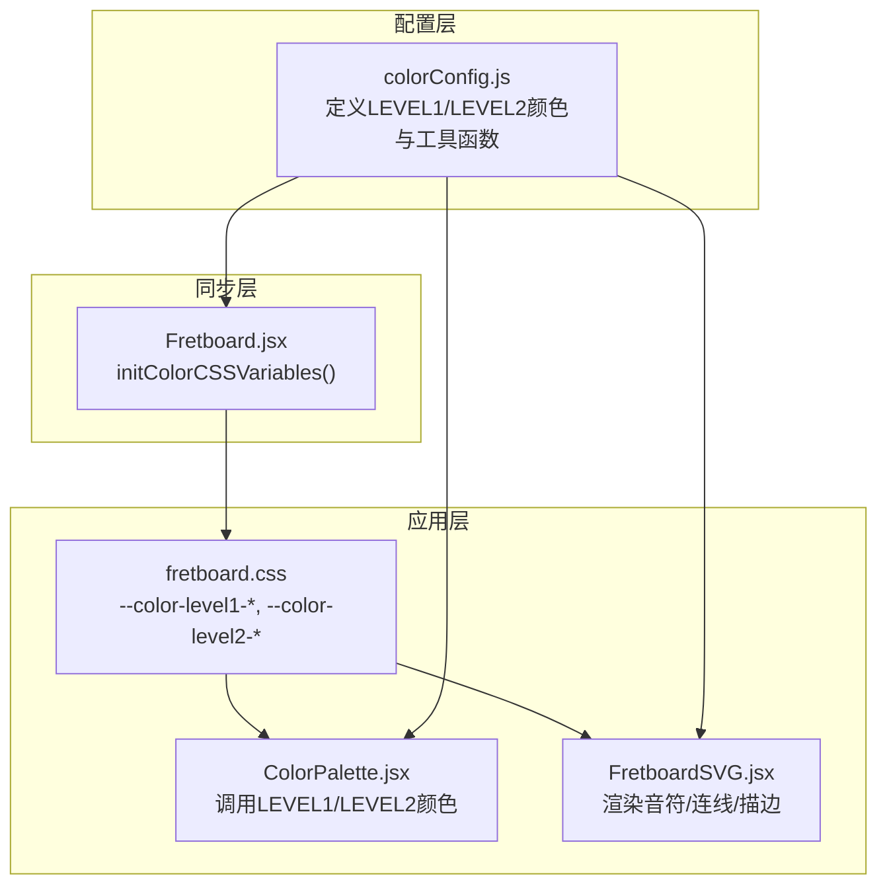
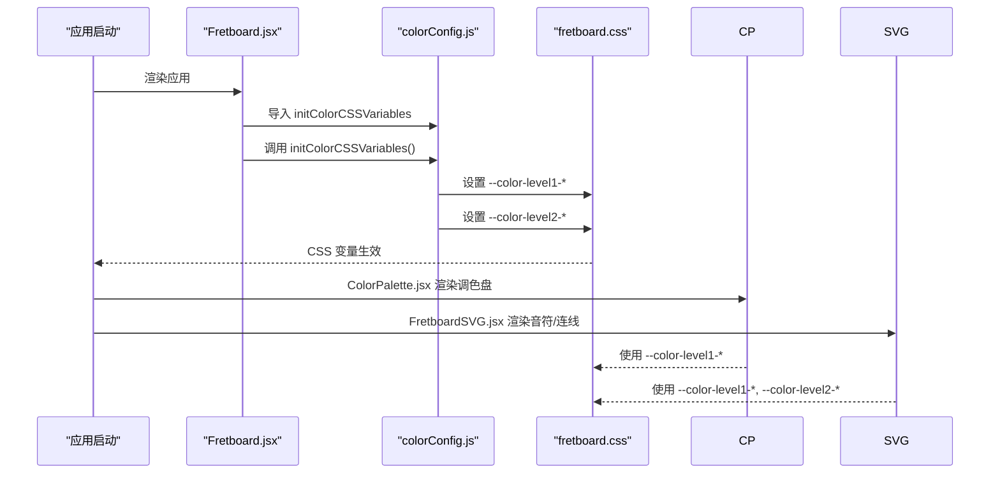
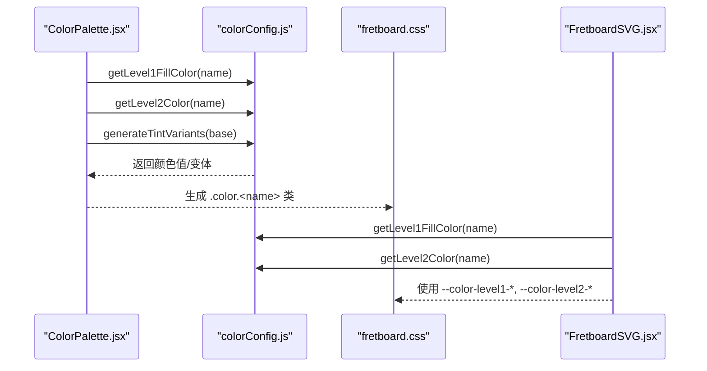
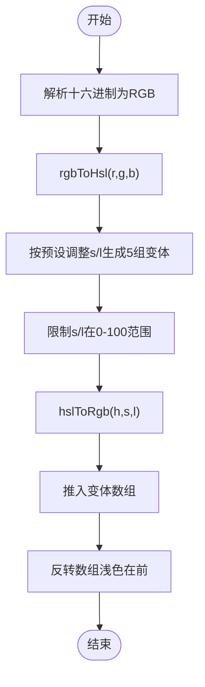
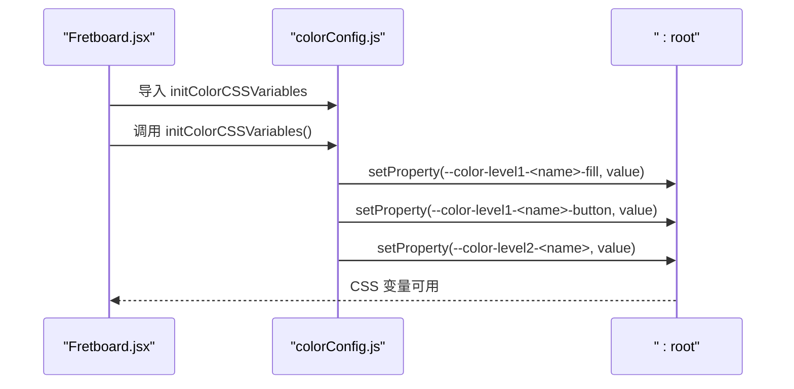
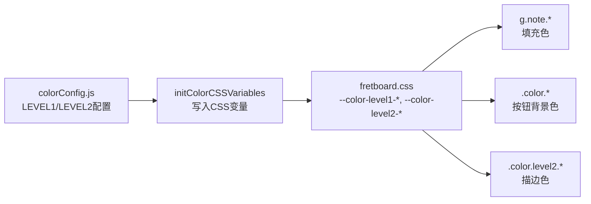
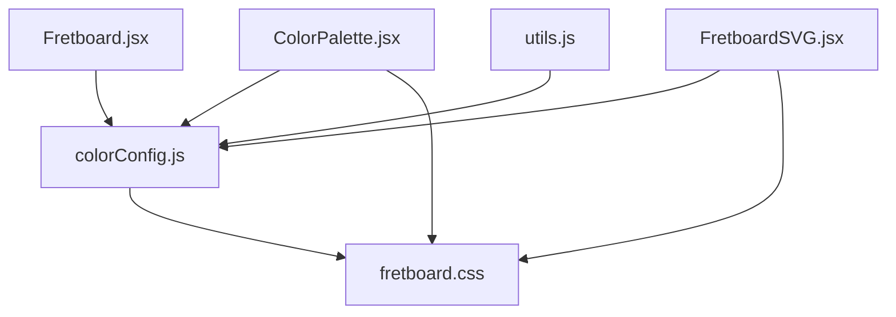

# 颜色配置

<cite>
**本文引用的文件**
- [colorConfig.js](file://src/colorConfig.js)
- [fretboard.css](file://src/fretboard.css)
- [FretboardSVG.jsx](file://src/components/FretboardSVG.jsx)
- [ColorPalette.jsx](file://src/components/ColorPalette.jsx)
- [Fretboard.jsx](file://src/Fretboard.jsx)
- [utils.js](file://src/utils.js)
- [fretboardActions.js](file://src/utils/fretboardActions.js)
</cite>

## 目录
1. [简介](#简介)
2. [项目结构](#项目结构)
3. [核心组件](#核心组件)
4. [架构总览](#架构总览)
5. [详细组件分析](#详细组件分析)
6. [依赖关系分析](#依赖关系分析)
7. [性能考量](#性能考量)
8. [故障排查指南](#故障排查指南)
9. [结论](#结论)
10. [附录](#附录)

## 简介
本文件系统性地文档化了应用的颜色配置体系，涵盖以下关键点：
- LEVEL1_COLORS 与 LEVEL2_COLORS 的结构、用途与层级划分机制
- getLevel1FillColor、getLevel1ButtonColor、getLevel2Color 等函数的调用逻辑与在组件中的使用方式
- generateTintVariants 如何基于 HSL 色彩空间生成颜色变体，以及 rgbToHsl、hslToRgb 辅助函数的算法实现
- initColorCSSVariables 如何将 JavaScript 中的颜色配置同步到 CSS 变量，实现样式统一管理
- 结合 fretboard.css 中 --color-level1-* 与 --color-level2-* 变量的实际应用，展示颜色系统如何贯穿 UI 组件（如 ColorPalette、FretboardSVG）

## 项目结构
颜色系统由三层协同构成：
- 配置层：src/colorConfig.js 定义两级颜色集合与颜色工具函数
- 同步层：Fretboard.jsx 在应用启动时调用 initColorCSSVariables，将配置写入 CSS 变量
- 应用层：CSS 与组件通过 CSS 变量与函数式接口消费颜色，实现统一风格



图表来源
- [colorConfig.js](file://src/colorConfig.js#L1-L162)
- [Fretboard.jsx](file://src/Fretboard.jsx#L126-L128)
- [fretboard.css](file://src/fretboard.css#L121-L424)
- [ColorPalette.jsx](file://src/components/ColorPalette.jsx#L1-L61)
- [FretboardSVG.jsx](file://src/components/FretboardSVG.jsx#L1-L800)

章节来源
- [colorConfig.js](file://src/colorConfig.js#L1-L162)
- [Fretboard.jsx](file://src/Fretboard.jsx#L126-L128)
- [fretboard.css](file://src/fretboard.css#L121-L424)

## 核心组件
- 颜色配置对象
  - LEVEL1_COLORS：用于音符填充与调色盘按钮背景色
  - LEVEL2_COLORS：用于描边（第二层级颜色）
- 颜色访问函数
  - getLevel1FillColor(colorName)：取第一层级填充色
  - getLevel1ButtonColor(colorName)：取第一层级按钮背景色
  - getLevel2Color(colorName)：取第二层级描边色
- 变体生成与转换
  - generateTintVariants(baseColor)：基于 HSL 生成淡/浓变体
  - rgbToHsl(r,g,b)、hslToRgb(h,s,l)：RGB/HSL 互转
- CSS 变量同步
  - initColorCSSVariables()：将配置写入 --color-level1-*/--color-level2-*

章节来源
- [colorConfig.js](file://src/colorConfig.js#L4-L56)
- [colorConfig.js](file://src/colorConfig.js#L58-L161)

## 架构总览
颜色系统采用“配置—同步—应用”的分层设计：
- 配置层集中定义颜色与工具函数
- 同步层在组件挂载时一次性注入 CSS 变量，保证全局一致性
- 应用层通过 CSS 类与变量消费颜色，组件内部通过函数式接口按需取色



图表来源
- [Fretboard.jsx](file://src/Fretboard.jsx#L126-L128)
- [colorConfig.js](file://src/colorConfig.js#L144-L161)
- [fretboard.css](file://src/fretboard.css#L121-L424)
- [ColorPalette.jsx](file://src/components/ColorPalette.jsx#L1-L61)
- [FretboardSVG.jsx](file://src/components/FretboardSVG.jsx#L1-L800)

## 详细组件分析

### 颜色配置对象与层级划分
- 第一层级（LEVEL1_COLORS）
  - 用途：音符填充色与调色盘按钮背景色
  - 结构：键为颜色名，值含 fill 与 button 两个字段
  - 示例键序：trans、blue、red、green、brown、gray
- 第二层级（LEVEL2_COLORS）
  - 用途：描边色（第二层级颜色）
  - 结构：键为颜色名，值为单一颜色值
  - 示例键序：orange、cyan、pink、grass-green、yellow、white

```mermaid
classDiagram
class LEVEL1_COLORS {
+trans : { fill, button }
+blue : { fill, button }
+red : { fill, button }
+green : { fill, button }
+brown : { fill, button }
+gray : { fill, button }
}
class LEVEL2_COLORS {
+orange
+cyan
+pink
+grass-green
+yellow
+white
}
class Functions {
+getLevel1FillColor(name)
+getLevel1ButtonColor(name)
+getLevel2Color(name)
+generateTintVariants(base)
+rgbToHsl(r,g,b)
+hslToRgb(h,s,l)
+initColorCSSVariables()
}
Functions --> LEVEL1_COLORS : "读取"
Functions --> LEVEL2_COLORS : "读取"
```

图表来源
- [colorConfig.js](file://src/colorConfig.js#L4-L41)
- [colorConfig.js](file://src/colorConfig.js#L43-L161)

章节来源
- [colorConfig.js](file://src/colorConfig.js#L4-L41)

### 函数调用逻辑与组件使用
- ColorPalette.jsx
  - 读取 LEVEL1_COLOR_ORDER 与 LEVEL2_COLOR_ORDER
  - 通过 getLevel1FillColor 与 getLevel2Color 获取颜色值
  - 通过 generateTintVariants 生成变体，实现“异色模式”
- FretboardSVG.jsx
  - 渲染音符时根据 note.color 与 note.color2 决定填充与描边
  - 渐变连线时根据起点/终点颜色动态生成渐变或降饱和色
  - 白色分隔描边与第二层描边分别在不同层级绘制，确保视觉层次清晰



图表来源
- [ColorPalette.jsx](file://src/components/ColorPalette.jsx#L16-L60)
- [colorConfig.js](file://src/colorConfig.js#L43-L56)
- [colorConfig.js](file://src/colorConfig.js#L58-L97)
- [fretboard.css](file://src/fretboard.css#L121-L424)
- [FretboardSVG.jsx](file://src/components/FretboardSVG.jsx#L196-L293)

章节来源
- [ColorPalette.jsx](file://src/components/ColorPalette.jsx#L16-L60)
- [FretboardSVG.jsx](file://src/components/FretboardSVG.jsx#L196-L293)

### generateTintVariants 与 HSL 变体生成
- 输入：基础颜色（十六进制）
- 步骤：
  - 解析十六进制为 RGB
  - RGB 转 HSL
  - 在 HSL 空间按预设调整饱和度与亮度，生成 5 个变体
  - 反转数组，使浅色在前（淡二档→淡一档→原色→浓一档→浓二档）
- 输出：变体数组（字符串形式的 rgb(...)）



图表来源
- [colorConfig.js](file://src/colorConfig.js#L58-L97)
- [colorConfig.js](file://src/colorConfig.js#L99-L142)

章节来源
- [colorConfig.js](file://src/colorConfig.js#L58-L97)
- [colorConfig.js](file://src/colorConfig.js#L99-L142)

### initColorCSSVariables 与 CSS 变量同步
- 作用：将 LEVEL1_COLORS 与 LEVEL2_COLORS 的颜色写入 documentElement 的 CSS 变量
- 变量命名规则：
  - --color-level1-<name>-fill
  - --color-level1-<name>-button
  - --color-level2-<name>（支持连字符）
- 触发时机：Fretboard.jsx 组件挂载时执行一次



图表来源
- [Fretboard.jsx](file://src/Fretboard.jsx#L126-L128)
- [colorConfig.js](file://src/colorConfig.js#L144-L161)

章节来源
- [Fretboard.jsx](file://src/Fretboard.jsx#L126-L128)
- [colorConfig.js](file://src/colorConfig.js#L144-L161)

### CSS 变量在 UI 组件中的应用
- 音符填充色：g.note.<color> 使用 var(--color-level1-<color>-fill)
- 调色盘按钮背景色：.color.<color> 使用 var(--color-level1-<color>-button)
- 第二层描边色：.color.level2.<color> 使用 var(--color-level2-<color>)
- 文本与描边：g.note、path.string、path.frets 等使用通用文本色与背景色变量



图表来源
- [colorConfig.js](file://src/colorConfig.js#L4-L41)
- [colorConfig.js](file://src/colorConfig.js#L144-L161)
- [fretboard.css](file://src/fretboard.css#L121-L424)

章节来源
- [fretboard.css](file://src/fretboard.css#L121-L424)

### 函数式接口与组件协作
- ColorPalette.jsx
  - 通过 getLevel1FillColor 与 getLevel2Color 获取颜色值
  - 通过 generateTintVariants 生成变体，实现双击进入“异色模式”
- FretboardSVG.jsx
  - 渲染音符时根据 color 与 color2 决定填充与描边
  - 渐变连线时根据起点/终点颜色动态生成渐变或降饱和色
  - 白色分隔描边与第二层描边分别在不同层级绘制，确保视觉层次清晰

章节来源
- [ColorPalette.jsx](file://src/components/ColorPalette.jsx#L16-L60)
- [FretboardSVG.jsx](file://src/components/FretboardSVG.jsx#L196-L293)
- [fretboardActions.js](file://src/utils/fretboardActions.js#L84-L144)

## 依赖关系分析
- Fretboard.jsx 依赖 colorConfig.js 的 initColorCSSVariables 与颜色工具函数
- ColorPalette.jsx 依赖 colorConfig.js 的 LEVEL1_COLORS、LEVEL2_COLORS 与工具函数
- FretboardSVG.jsx 依赖 colorConfig.js 的 LEVEL1_COLORS、LEVEL2_COLORS 与工具函数
- utils.js 提供 getLevel2Color 包装，便于统一导出
- fretboard.css 依赖 CSS 变量，实现样式与配置解耦



图表来源
- [Fretboard.jsx](file://src/Fretboard.jsx#L13-L13)
- [ColorPalette.jsx](file://src/components/ColorPalette.jsx#L2-L2)
- [FretboardSVG.jsx](file://src/components/FretboardSVG.jsx#L3-L4)
- [utils.js](file://src/utils.js#L80-L85)
- [fretboard.css](file://src/fretboard.css#L121-L424)

章节来源
- [Fretboard.jsx](file://src/Fretboard.jsx#L13-L13)
- [ColorPalette.jsx](file://src/components/ColorPalette.jsx#L2-L2)
- [FretboardSVG.jsx](file://src/components/FretboardSVG.jsx#L3-L4)
- [utils.js](file://src/utils.js#L80-L85)

## 性能考量
- CSS 变量同步仅在应用启动时执行一次，避免运行时重复写入
- generateTintVariants 仅在用户双击进入“异色模式”或批量替换时触发，开销可控
- 颜色访问函数均为常量时间查询，对渲染性能影响极小
- 通过 CSS 变量集中管理，减少内联样式的使用，提升样式缓存效率

## 故障排查指南
- CSS 变量未生效
  - 确认 Fretboard.jsx 是否在组件挂载时调用 initColorCSSVariables
  - 检查浏览器控制台是否存在样式加载异常
- 颜色显示不符合预期
  - 检查 LEVEL1_COLORS 与 LEVEL2_COLORS 中的颜色名是否与 CSS 类名一致
  - 确认 CSS 中是否正确使用了 --color-level1-*/--color-level2-* 变量
- 双击进入“异色模式”无效
  - 检查 generateTintVariants 是否正常返回变体数组
  - 确认 ColorPalette.jsx 与 Fretboard.jsx 的交互逻辑是否正确传递选中颜色

章节来源
- [Fretboard.jsx](file://src/Fretboard.jsx#L126-L128)
- [fretboard.css](file://src/fretboard.css#L121-L424)
- [ColorPalette.jsx](file://src/components/ColorPalette.jsx#L16-L60)
- [fretboardActions.js](file://src/utils/fretboardActions.js#L84-L144)

## 结论
该颜色配置系统通过“配置—同步—应用”的分层设计，实现了颜色的集中管理与跨组件一致性。LEVEL1_COLORS 与 LEVEL2_COLORS 的明确分工，配合 generateTintVariants 的 HSL 变体生成，既满足了基础配色需求，又提供了灵活的“异色模式”。initColorCSSVariables 将配置同步至 CSS 变量，使得样式与逻辑解耦，便于维护与扩展。

## 附录

### 实用示例：自定义新颜色、调整现有颜色或扩展调色盘
- 新增第一层级颜色
  - 在 colorConfig.js 的 LEVEL1_COLORS 中添加新颜色条目（包含 fill 与 button 字段）
  - 在 fretboard.css 中为该颜色名补充 g.note.<name> 与 .color.<name> 样式
  - 重启应用或确保 initColorCSSVariables 生效
- 新增第二层级颜色
  - 在 colorConfig.js 的 LEVEL2_COLORS 中添加新颜色条目
  - 在 fretboard.css 中为该颜色名补充 .color.level2.<name> 样式
- 调整现有颜色
  - 直接修改 colorConfig.js 中对应颜色值
  - CSS 变量会自动更新，无需额外改动
- 扩展调色盘
  - 在 LEVEL1_COLORS/LEVEL2_COLORS 中追加颜色键
  - ColorPalette.jsx 会自动读取新键并渲染按钮
  - 若需自定义样式，可在 fretboard.css 中补充对应类名

修改后的视觉效果
- 第一层级颜色：音符填充与调色盘按钮背景色同步更新
- 第二层级颜色：描边色随调色盘按钮变化而变化
- “异色模式”：双击颜色按钮后，变体数组中的浅/浓色将按顺序切换

章节来源
- [colorConfig.js](file://src/colorConfig.js#L4-L41)
- [fretboard.css](file://src/fretboard.css#L121-L424)
- [ColorPalette.jsx](file://src/components/ColorPalette.jsx#L16-L60)
- [Fretboard.jsx](file://src/Fretboard.jsx#L126-L128)