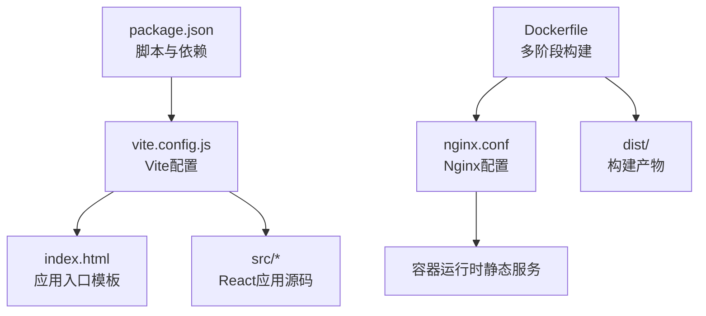
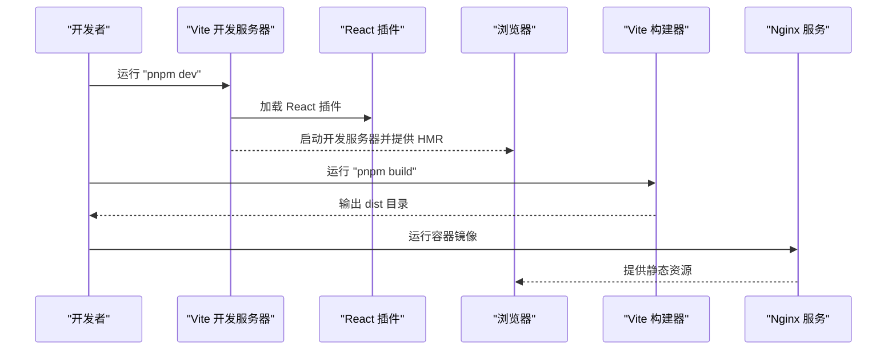
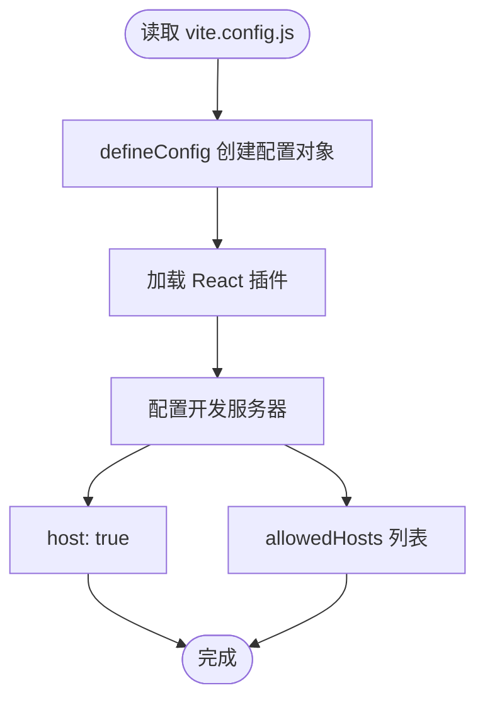
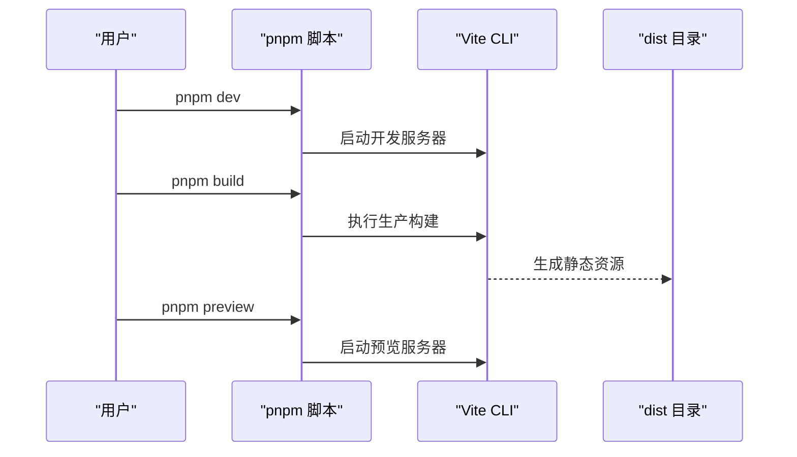
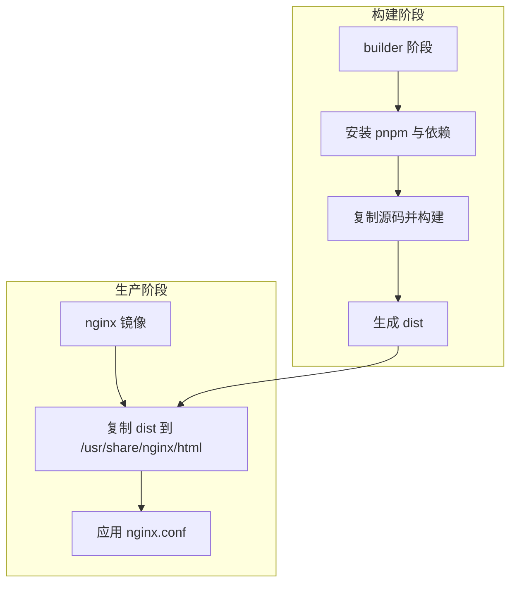
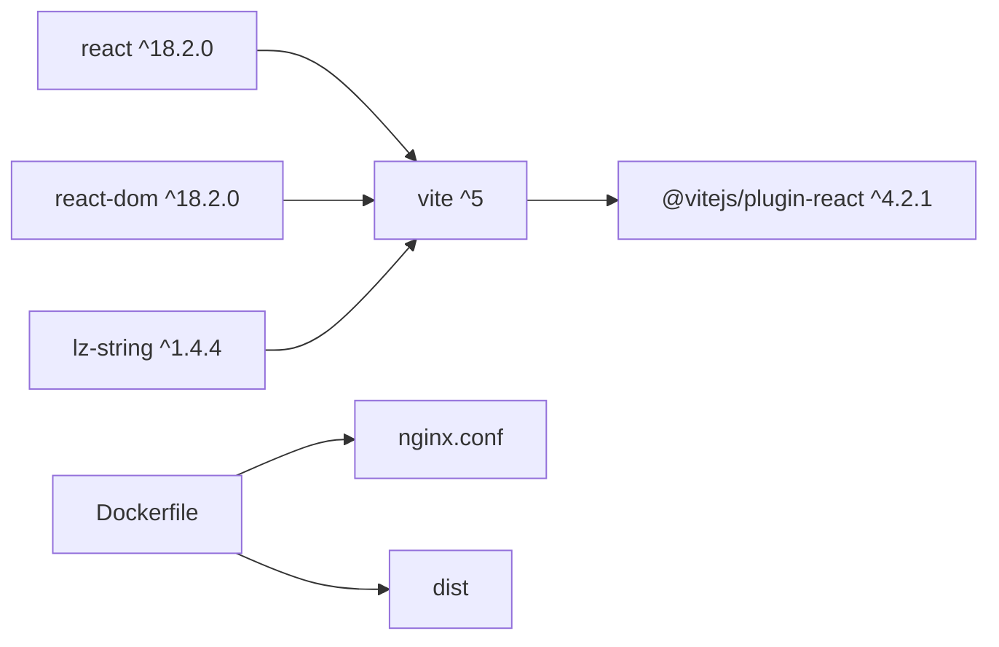

# 构建配置

<cite>
**本文引用的文件**
- [vite.config.js](file://vite.config.js)
- [package.json](file://package.json)
- [README.md](file://README.md)
- [index.html](file://index.html)
- [Dockerfile](file://Dockerfile)
- [Dockerfile.dev](file://Dockerfile.dev)
- [nginx.conf](file://nginx.conf)
</cite>

## 目录
1. [简介](#简介)
2. [项目结构](#项目结构)
3. [核心组件](#核心组件)
4. [架构总览](#架构总览)
5. [详细组件分析](#详细组件分析)
6. [依赖关系分析](#依赖关系分析)
7. [性能考虑](#性能考虑)
8. [故障排查指南](#故障排查指南)
9. [结论](#结论)
10. [附录](#附录)

## 简介
本文件聚焦于项目的构建与运行时配置，围绕 Vite 构建系统、React 插件集成、开发服务器与预览流程、依赖版本约束、以及容器化部署配置展开。目标是帮助开发者快速理解并高效地进行本地开发、生产构建与部署。

## 项目结构
该项目采用 Vite 作为构建工具，React 作为前端框架，使用 pnpm 管理依赖。核心配置集中在 vite.config.js 与 package.json 中；HTML 入口模板位于 index.html；Dockerfile 与 nginx.conf 提供生产环境的多阶段构建与静态资源服务。

**图表来源**
- [package.json](file://package.json#L1-L19)
- [vite.config.js](file://vite.config.js#L1-L11)
- [index.html](file://index.html#L1-L14)
- [Dockerfile](file://Dockerfile#L1-L36)
- [nginx.conf](file://nginx.conf#L1-L29)

**章节来源**
- [package.json](file://package.json#L1-L19)
- [vite.config.js](file://vite.config.js#L1-L11)
- [index.html](file://index.html#L1-L14)
- [Dockerfile](file://Dockerfile#L1-L36)
- [nginx.conf](file://nginx.conf#L1-L29)

## 核心组件
- Vite 构建配置：通过 defineConfig 定义插件与开发服务器行为，启用 React 插件，开放主机访问并限制允许的主机列表。
- React 插件：@vitejs/plugin-react 提供对 JSX 与 React HMR 的支持。
- 开发脚本：dev、build、preview 三个常用脚本分别对应开发服务器、生产构建与本地预览。
- 依赖版本：React 18、React-DOM 18、LZ-String 1.x，以及 Vite 5 与 @vitejs/plugin-react 4.x 的兼容组合。
- 容器化：Dockerfile 多阶段构建，先在 builder 阶段安装依赖并构建，再在 nginx 镜像中提供静态服务。

**章节来源**
- [vite.config.js](file://vite.config.js#L1-L11)
- [package.json](file://package.json#L1-L19)
- [Dockerfile](file://Dockerfile#L1-L36)

## 架构总览
下图展示了从开发到生产的整体流程：本地开发通过 Vite 启动开发服务器，热更新与 HMR 提升开发效率；生产构建生成 dist 目录；Dockerfile 将 dist 复制到 nginx 提供静态服务。

**图表来源**
- [package.json](file://package.json#L5-L8)
- [vite.config.js](file://vite.config.js#L4-L10)
- [Dockerfile](file://Dockerfile#L19-L26)

## 详细组件分析

### Vite 构建配置（vite.config.js）
- defineConfig：使用 Vite 的配置工厂函数统一导出配置对象。
- 插件集成：加载 @vitejs/plugin-react，使 JSX 与 React HMR 正常工作。
- 开发服务器：
  - host: true 表示允许局域网访问开发服务器，便于在其他设备或容器内访问。
  - allowedHosts：限定允许访问的主机名白名单，包括特定域名与 localhost 及其子域，提升安全性，防止 DNS 重绑定攻击。
- 默认端口：若未显式配置，Vite 会在 5173 端口启动；如被占用则自动寻找下一个可用端口。

**图表来源**
- [vite.config.js](file://vite.config.js#L4-L10)

**章节来源**
- [vite.config.js](file://vite.config.js#L1-L11)
- [README.md](file://README.md#L178-L181)

### React 插件与版本兼容性
- @vitejs/plugin-react：用于在 Vite 中启用 React 的 JSX 转换与 HMR。
- Vite 与 React 插件版本：当前使用 Vite 5 与 @vitejs/plugin-react 4.x，二者在语义化版本范围内保持兼容。
- React 生态：React 与 React-DOM 均为 18.x，确保与现代 Vite 生态一致。

**章节来源**
- [package.json](file://package.json#L15-L18)
- [package.json](file://package.json#L10-L14)

### 脚本命令与运行流程
- dev：启动 Vite 开发服务器，支持热更新与源码映射，便于调试。
- build：执行生产构建，输出至 dist 目录。
- preview：在本地预览生产构建结果，验证打包产物的可用性。

**图表来源**
- [package.json](file://package.json#L5-L8)

**章节来源**
- [package.json](file://package.json#L5-L8)
- [README.md](file://README.md#L65-L98)

### 依赖与版本要求
- 运行时依赖：
  - react：^18.2.0
  - react-dom：^18.2.0
  - lz-string：^1.4.4
- 开发依赖：
  - @vitejs/plugin-react：^4.2.1
  - vite：^5.0.0
- 版本兼容性：React 18 与 Vite 5 + plugin-react 4.x 组合稳定；LZ-String 1.x 与现代打包工具兼容良好。

**章节来源**
- [package.json](file://package.json#L10-L18)

### HTML 入口与应用挂载
- index.html 作为应用入口模板，包含基础 meta 信息与挂载点 div#app。
- 应用通过模块脚本引入 src/main.jsx 并挂载到 #app。

**章节来源**
- [index.html](file://index.html#L1-L14)

### 容器化与生产部署
- Dockerfile 多阶段构建：
  - builder 阶段：安装 pnpm、依赖与源码，执行 pnpm build 生成 dist。
  - 生产阶段：基于 nginx:alpine，复制 dist 至 /usr/share/nginx/html，并应用 nginx.conf。
- Dockerfile.dev：开发环境镜像，暴露 5173 端口并启动 pnpm dev --host 0.0.0.0。
- nginx.conf：启用 Gzip、SPA 路由回退、静态资源缓存与安全头。

**图表来源**
- [Dockerfile](file://Dockerfile#L1-L36)
- [nginx.conf](file://nginx.conf#L1-L29)

**章节来源**
- [Dockerfile](file://Dockerfile#L1-L36)
- [Dockerfile.dev](file://Dockerfile.dev#L1-L24)
- [nginx.conf](file://nginx.conf#L1-L29)

## 依赖关系分析
- Vite 与 React 插件：Vite 5 与 @vitejs/plugin-react 4.x 在语义化版本范围内兼容，确保 JSX 转换与 HMR 正常工作。
- React 生态：React 与 React-DOM 18.x 与 Vite 生态无缝衔接。
- LZ-String：用于数据压缩，与打包工具兼容，适合分享/导入场景。
- 容器化：Dockerfile 与 nginx.conf 形成稳定的生产部署链路。

**图表来源**
- [package.json](file://package.json#L10-L18)
- [Dockerfile](file://Dockerfile#L1-L36)
- [nginx.conf](file://nginx.conf#L1-L29)

**章节来源**
- [package.json](file://package.json#L10-L18)
- [Dockerfile](file://Dockerfile#L1-L36)

## 性能考虑
- Gzip 压缩：在 nginx.conf 中启用 Gzip，减少传输体积。
- 静态资源缓存：对 JS/CSS/字体/图标等资源设置一年缓存与 immutable 标记，提升二次加载性能。
- SPA 路由回退：通过 try_files $uri $uri/ /index.html 支持前端路由。
- 开发体验：HMR 与源码映射提升调试效率；host: true 便于跨设备联调。

**章节来源**
- [nginx.conf](file://nginx.conf#L7-L22)
- [vite.config.js](file://vite.config.js#L6-L9)
- [README.md](file://README.md#L77-L81)

## 故障排查指南
- 端口被占用：默认端口 5173 被占用时，Vite 会自动选择下一个可用端口；可在配置中显式指定端口。
- 依赖安装失败：清理 pnpm store、删除 node_modules 与锁文件后重新安装。
- 构建错误：确认 Node.js 版本满足要求，检查依赖安装与代码语法。
- 开发服务器无法从其他设备访问：确保 host: true 且 allowedHosts 包含目标主机名。

**章节来源**
- [README.md](file://README.md#L176-L197)
- [vite.config.js](file://vite.config.js#L6-L9)

## 结论
本项目以 Vite 为核心构建工具，结合 React 插件与现代 React 生态，提供了简洁高效的开发与构建体验。通过合理的 allowedHosts 白名单与容器化部署策略，既保证了开发灵活性，也确保了生产环境的安全与性能。建议在团队协作中统一 Node.js 与 pnpm 版本，遵循现有脚本与配置，以获得最佳一致性与可维护性。

## 附录
- 自定义构建路径：可通过 Vite 配置中的 build.outDir 字段调整输出目录；如需自定义 public 目录，可配置 base 与 publicDir。
- 环境变量：Vite 支持以 VITE_ 前缀的环境变量注入到客户端代码；可在开发与 CI 环境中按需设置。
- 插件扩展：如需 TypeScript、CSS 预处理器或额外优化，可在 plugins 数组中添加相应插件并按需配置。