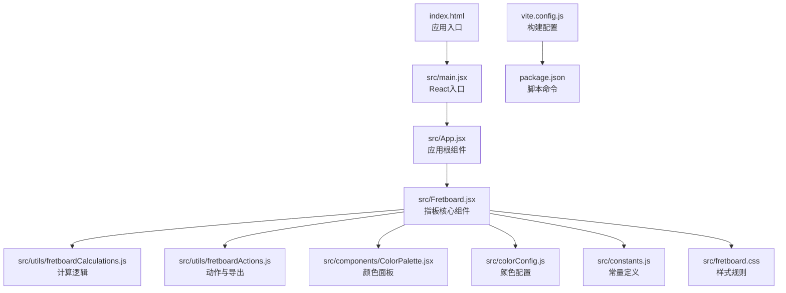
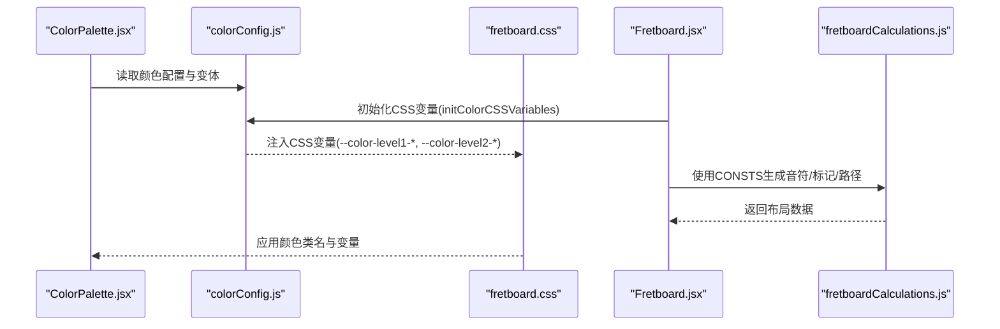
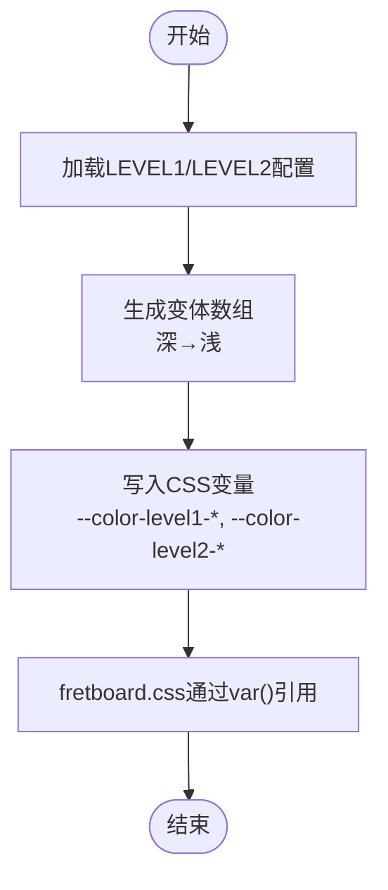
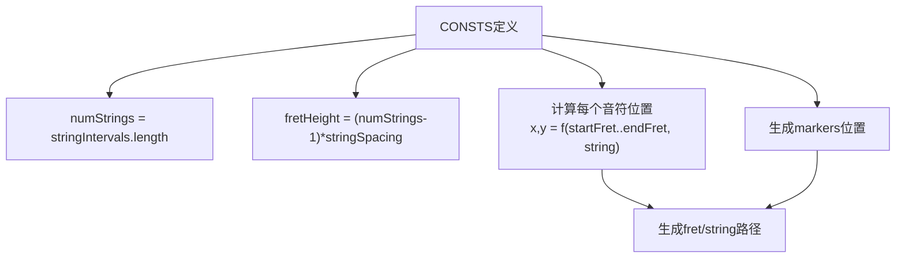
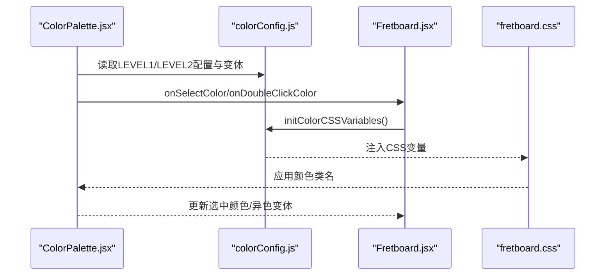
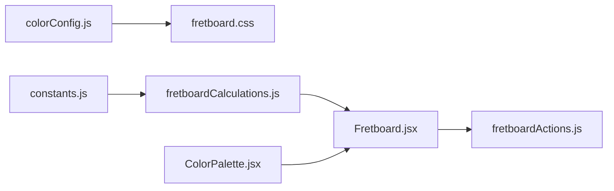

# 配置与定制

<cite>
**本文引用的文件**
- [src/colorConfig.js](file://src/colorConfig.js)
- [src/constants.js](file://src/constants.js)
- [src/fretboard.css](file://src/fretboard.css)
- [vite.config.js](file://vite.config.js)
- [package.json](file://package.json)
- [src/components/ColorPalette.jsx](file://src/components/ColorPalette.jsx)
- [src/Fretboard.jsx](file://src/Fretboard.jsx)
- [src/utils/fretboardCalculations.js](file://src/utils/fretboardCalculations.js)
- [src/utils/fretboardActions.js](file://src/utils/fretboardActions.js)
- [index.html](file://index.html)
</cite>

## 目录
1. [简介](#简介)
2. [项目结构](#项目结构)
3. [核心组件](#核心组件)
4. [架构总览](#架构总览)
5. [详细组件分析](#详细组件分析)
6. [依赖关系分析](#依赖关系分析)
7. [性能考量](#性能考量)
8. [故障排查指南](#故障排查指南)
9. [结论](#结论)
10. [附录](#附录)

## 简介
本章节聚焦于项目的配置选项与定制能力，重点说明以下方面：
- colorConfig.js 中定义的调色盘颜色方案如何通过 CSS 变量影响应用外观；
- constants.js 中定义的常量（如品格数量、弦数、间距等）如何决定指板结构；
- fretboard.css 中的样式规则如何与颜色配置联动；
- vite.config.js 中的构建配置与 package.json 中的脚本命令；
- 如何扩展颜色方案或修改指板布局的实践指导。

## 项目结构
该项目采用 React + Vite 的现代前端架构，核心逻辑集中在 src 目录，样式集中在 fretboard.css，构建与脚本集中在根目录的配置文件中。关键文件如下：
- 颜色配置：src/colorConfig.js
- 常量定义：src/constants.js
- 样式：src/fretboard.css
- 构建配置：vite.config.js
- 脚本命令：package.json
- 组件与逻辑：src/components/ColorPalette.jsx、src/Fretboard.jsx、src/utils/fretboardCalculations.js、src/utils/fretboardActions.js
- 入口页面：index.html

图表来源
- [index.html](file://index.html#L1-L14)
- [src/Fretboard.jsx](file://src/Fretboard.jsx#L1-L25)
- [src/utils/fretboardCalculations.js](file://src/utils/fretboardCalculations.js#L1-L20)
- [src/utils/fretboardActions.js](file://src/utils/fretboardActions.js#L1-L20)
- [src/components/ColorPalette.jsx](file://src/components/ColorPalette.jsx#L1-L20)
- [src/colorConfig.js](file://src/colorConfig.js#L1-L20)
- [src/constants.js](file://src/constants.js#L1-L20)
- [src/fretboard.css](file://src/fretboard.css#L1-L20)
- [vite.config.js](file://vite.config.js#L1-L11)
- [package.json](file://package.json#L1-L19)

章节来源
- [index.html](file://index.html#L1-L14)
- [package.json](file://package.json#L1-L19)
- [vite.config.js](file://vite.config.js#L1-L11)

## 核心组件
本节概述与配置和定制直接相关的三个核心模块及其职责：
- 颜色配置模块（colorConfig.js）：集中定义颜色方案、生成变体、初始化 CSS 变量，供全局样式与组件使用。
- 常量模块（constants.js）：集中定义指板几何参数（偏移、弦间隔、品格宽度、圆点半径、标记位置、音名表等），驱动 SVG 渲染与布局。
- 样式模块（fretboard.css）：通过 CSS 变量与类名绑定颜色配置，实现主题化与响应式外观。

章节来源
- [src/colorConfig.js](file://src/colorConfig.js#L1-L162)
- [src/constants.js](file://src/constants.js#L1-L19)
- [src/fretboard.css](file://src/fretboard.css#L1-L80)

## 架构总览
颜色、常量与样式三者协同工作，形成“配置—计算—渲染”的闭环：
- 颜色配置：提供颜色字典与变体生成函数，并在组件挂载时初始化 CSS 变量。
- 常量定义：提供布局参数，计算模块据此生成音符位置、标记与路径。
- 样式规则：通过 CSS 变量与类名绑定颜色，实现外观一致性与可定制性。

图表来源
- [src/components/ColorPalette.jsx](file://src/components/ColorPalette.jsx#L1-L61)
- [src/colorConfig.js](file://src/colorConfig.js#L144-L162)
- [src/fretboard.css](file://src/fretboard.css#L121-L175)
- [src/Fretboard.jsx](file://src/Fretboard.jsx#L125-L128)
- [src/utils/fretboardCalculations.js](file://src/utils/fretboardCalculations.js#L1-L20)

## 详细组件分析

### 颜色配置与定制（colorConfig.js）
- 颜色分层与用途
  - 第一层颜色（LEVEL1_COLORS）：用于音符填充与调色盘按钮背景，强调主色与对比度。
  - 第二层颜色（LEVEL2_COLORS）：用于描边或轮廓，强调线条与边界。
- 变体生成
  - generateTintVariants：基于 HSL 色彩空间生成从深到浅的多个变体，支持异色模式下的精细调节。
- CSS 变量注入
  - initColorCSSVariables：将颜色配置映射为 CSS 变量，供样式层通过 var(--...) 使用，实现全局主题化。

图表来源
- [src/colorConfig.js](file://src/colorConfig.js#L58-L97)
- [src/colorConfig.js](file://src/colorConfig.js#L144-L162)
- [src/fretboard.css](file://src/fretboard.css#L121-L175)

章节来源
- [src/colorConfig.js](file://src/colorConfig.js#L1-L162)
- [src/fretboard.css](file://src/fretboard.css#L121-L175)

### 常量与指板布局（constants.js）
- 关键常量
  - offsetX、offsetY：整体偏移，决定 SVG 原点与起始位置。
  - stringIntervals：每根弦的起始音程偏移，决定开放弦音高。
  - markers：标记位置集合，决定品数标记的出现位置。
  - fretWidth、stringSpacing：品格宽度与弦间距，决定网格密度与视觉比例。
  - minStringSize、circleRadius：最小弦数与音符半径，影响可读性与交互区域。
  - notes、sign：音名表与升降号符号集，决定显示名称与可选符号。
- 衍生计算
  - numStrings：弦数，由 stringIntervals 长度决定。
  - fretHeight：指板高度，由弦数与间距推导。

图表来源
- [src/constants.js](file://src/constants.js#L1-L19)
- [src/utils/fretboardCalculations.js](file://src/utils/fretboardCalculations.js#L13-L84)
- [src/utils/fretboardCalculations.js](file://src/utils/fretboardCalculations.js#L86-L126)

章节来源
- [src/constants.js](file://src/constants.js#L1-L19)
- [src/utils/fretboardCalculations.js](file://src/utils/fretboardCalculations.js#L1-L135)

### 样式规则与主题化（fretboard.css）
- CSS 变量与主题
  - :root 定义基础变量（背景色、文本色），并根据 prefers-color-scheme 自动切换。
  - 颜色类名与变量绑定：g.note.<color>、.color.<color>、.color.level2.<color> 通过 var(--color-level1-*)、var(--color-level2-*) 应用颜色。
- 交互与状态
  - hover、selected、hidden、transparent 等状态类控制透明度与描边，保证可读性与反馈。
- 组件样式
  - 调色盘按钮、连线工具栏、钢琴键盘等 UI 组件均通过类名与变量实现主题化。

章节来源
- [src/fretboard.css](file://src/fretboard.css#L1-L80)
- [src/fretboard.css](file://src/fretboard.css#L121-L175)
- [src/fretboard.css](file://src/fretboard.css#L368-L425)

### 构建与脚本（vite.config.js 与 package.json）
- Vite 配置
  - 使用 @vitejs/plugin-react，启用 React HMR。
  - server.host: true，允许外网访问；allowedHosts 列表限定受信任主机。
- 脚本命令
  - dev：启动开发服务器（Vite Dev）
  - build：构建生产包（Vite Build）
  - preview：预览生产包（Vite Preview）

章节来源
- [vite.config.js](file://vite.config.js#L1-L11)
- [package.json](file://package.json#L1-L19)

### 组件集成与调用链（Fretboard.jsx 与 ColorPalette.jsx）
- 颜色面板（ColorPalette.jsx）
  - 读取 LEVEL1/LEVEL2 颜色顺序，渲染按钮并处理点击/双击/右键菜单。
  - 双击进入异色模式，使用 generateTintVariants 生成变体并默认选中合适浓度。
- 指板核心（Fretboard.jsx）
  - 挂载时调用 initColorCSSVariables，确保 CSS 变量就绪。
  - 使用 CONSTS 与计算模块生成音符、标记与路径，结合颜色配置与样式类名渲染。
  - 提供动作函数（如替换异色、保存 SVG、重置等）。

图表来源
- [src/components/ColorPalette.jsx](file://src/components/ColorPalette.jsx#L16-L60)
- [src/Fretboard.jsx](file://src/Fretboard.jsx#L125-L128)
- [src/colorConfig.js](file://src/colorConfig.js#L144-L162)
- [src/fretboard.css](file://src/fretboard.css#L121-L175)

章节来源
- [src/components/ColorPalette.jsx](file://src/components/ColorPalette.jsx#L1-L61)
- [src/Fretboard.jsx](file://src/Fretboard.jsx#L125-L128)

## 依赖关系分析
- 颜色配置与样式
  - colorConfig.js 通过 initColorCSSVariables 为 fretboard.css 提供 CSS 变量，后者通过类名与 var() 实现颜色绑定。
- 常量与计算
  - constants.js 为 fretboardCalculations.js 提供布局参数，后者生成音符、标记与路径，再由 Fretboard.jsx 渲染。
- 组件与动作
  - ColorPalette.jsx 与 Fretboard.jsx 通过 colorConfig.js 与 fretboardActions.js 协作，实现颜色选择、异色变体与导出等功能。

图表来源
- [src/colorConfig.js](file://src/colorConfig.js#L144-L162)
- [src/fretboard.css](file://src/fretboard.css#L121-L175)
- [src/constants.js](file://src/constants.js#L1-L19)
- [src/utils/fretboardCalculations.js](file://src/utils/fretboardCalculations.js#L1-L20)
- [src/Fretboard.jsx](file://src/Fretboard.jsx#L1-L25)
- [src/utils/fretboardActions.js](file://src/utils/fretboardActions.js#L1-L20)

章节来源
- [src/colorConfig.js](file://src/colorConfig.js#L1-L162)
- [src/fretboard.css](file://src/fretboard.css#L1-L80)
- [src/constants.js](file://src/constants.js#L1-L19)
- [src/utils/fretboardCalculations.js](file://src/utils/fretboardCalculations.js#L1-L135)
- [src/Fretboard.jsx](file://src/Fretboard.jsx#L1-L25)
- [src/utils/fretboardActions.js](file://src/utils/fretboardActions.js#L1-L80)

## 性能考量
- 颜色变体生成
  - generateTintVariants 在每次双击进入异色模式时生成变体数组，建议在批量操作时避免频繁调用，或缓存结果。
- SVG 渲染与导出
  - 保存 SVG 时会克隆节点、内联样式并裁剪视窗，注意在大量音符与连线场景下的 DOM 操作开销。
- 常量与布局
  - CONSTS 决定网格密度与渲染复杂度，适当调整 fretWidth 与 stringSpacing 可平衡性能与可读性。

[本节为通用指导，不直接分析具体文件]

## 故障排查指南
- 颜色不生效
  - 确认 Fretboard.jsx 是否在挂载时调用了 initColorCSSVariables。
  - 检查 CSS 变量是否正确注入（如 --color-level1-*, --color-level2-*）。
- 样式冲突
  - 若自定义样式覆盖了颜色类名，需确保 var(--color-level1-*)、var(--color-level2-*) 仍被正确应用。
- 构建与预览
  - 若 dev/preview/build 失败，检查 Node.js 版本与依赖安装情况；必要时清理缓存后重装依赖。

章节来源
- [src/Fretboard.jsx](file://src/Fretboard.jsx#L125-L128)
- [src/fretboard.css](file://src/fretboard.css#L121-L175)
- [README.md](file://README.md#L176-L197)

## 结论
本项目通过“颜色配置—常量定义—样式规则”三层协作，实现了高度可定制的主题化外观与稳定的指板布局。开发者可通过扩展 colorConfig.js 的颜色方案、调整 constants.js 的布局参数，以及在 fretboard.css 中补充或覆盖样式，灵活满足不同需求。

[本节为总结性内容，不直接分析具体文件]

## 附录

### 如何扩展颜色方案
- 在 colorConfig.js 中新增颜色键值对，遵循现有结构（LEVEL1_COLORS/LEVEL2_COLORS），并确保顺序与使用处一致。
- 若需异色变体，保持 baseColor 与 generateTintVariants 的配合；若需自定义变体数量，可在 generateTintVariants 中调整 adjustments 数组。
- 在 fretboard.css 中为新增颜色添加对应的类名与变量绑定，确保 UI 与样式一致。

章节来源
- [src/colorConfig.js](file://src/colorConfig.js#L6-L56)
- [src/fretboard.css](file://src/fretboard.css#L121-L175)
- [src/fretboard.css](file://src/fretboard.css#L368-L425)

### 如何修改指板布局
- 调整 constants.js 中的以下参数：
  - fretWidth：改变品格宽度，影响网格密度与横向排布。
  - stringSpacing：改变弦间距，影响纵向排布与整体高度。
  - offsetX、offsetY：改变整体偏移，影响起始位置与留白。
  - markers：调整标记位置集合，控制品数标记的出现。
  - stringIntervals：调整每根弦的起始音程偏移，改变开放弦音高。
- 重新计算派生参数（如 fretHeight）以确保布局一致性。

章节来源
- [src/constants.js](file://src/constants.js#L1-L19)
- [src/utils/fretboardCalculations.js](file://src/utils/fretboardCalculations.js#L113-L126)

### 构建与脚本命令参考
- 开发：pnpm dev
- 生产构建：pnpm build
- 预览：pnpm preview

章节来源
- [package.json](file://package.json#L5-L9)
- [vite.config.js](file://vite.config.js#L1-L11)