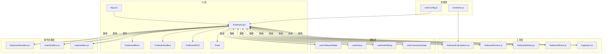
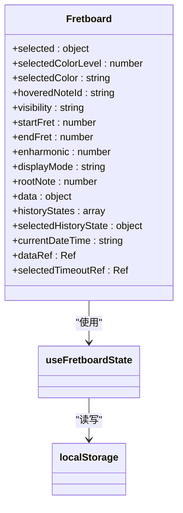
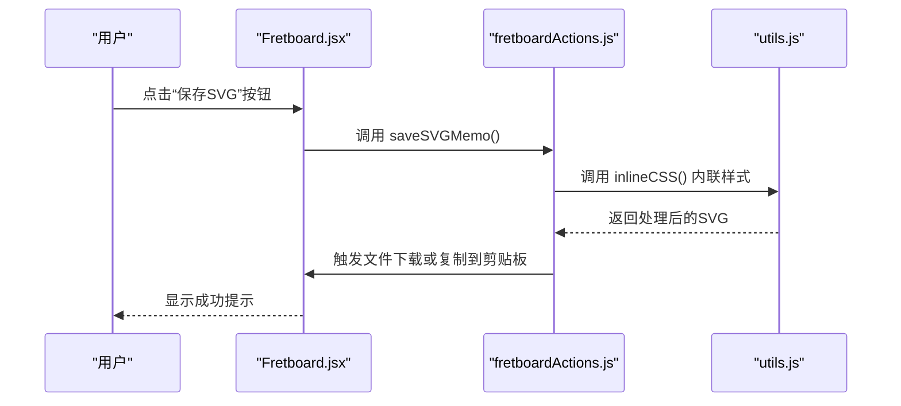
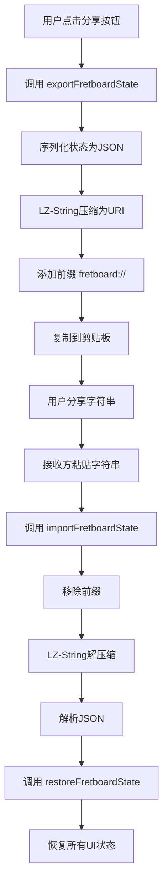
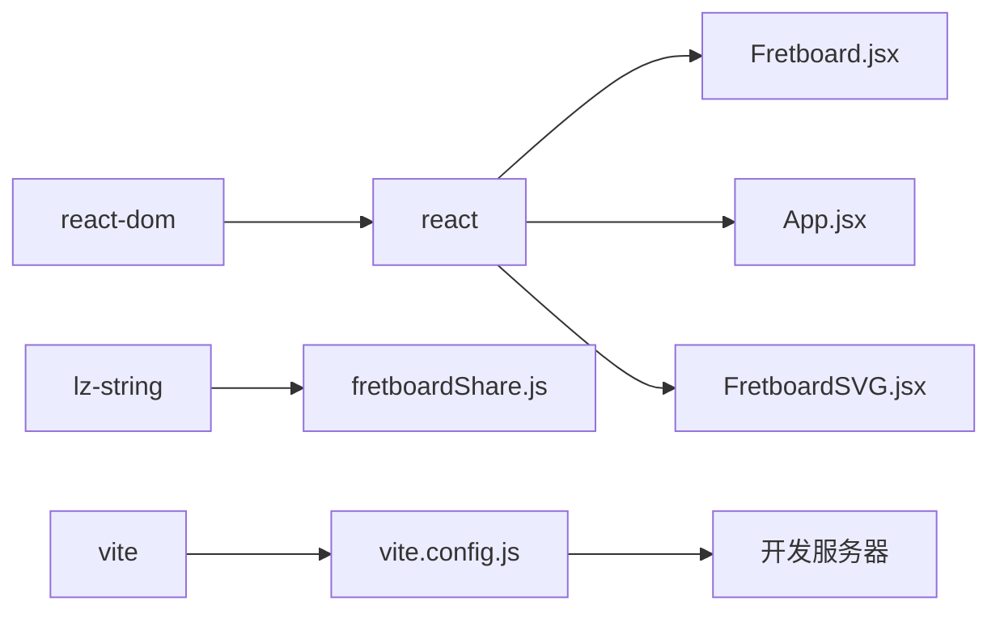

# 项目概述

<cite>
**本文档引用的文件**   
- [README.md](file://README.md)
- [FEATURES.md](file://FEATURES.md)
- [package.json](file://package.json)
- [src/App.jsx](file://src/App.jsx)
- [src/Fretboard.jsx](file://src/Fretboard.jsx)
- [src/main.jsx](file://src/main.jsx)
- [src/constants.js](file://src/constants.js)
- [src/colorConfig.js](file://src/colorConfig.js)
- [src/utils/fretboardCalculations.js](file://src/utils/fretboardCalculations.js)
- [src/hooks/useFretboardState.js](file://src/hooks/useFretboardState.js)
- [src/utils/fretboardActions.js](file://src/utils/fretboardActions.js)
- [src/utils/fretboardHistory.js](file://src/utils/fretboardHistory.js)
- [src/components/FretboardSVG.jsx](file://src/components/FretboardSVG.jsx)
- [src/utils/svgImport.js](file://src/utils/svgImport.js)
- [src/utils/fretboardShare.js](file://src/utils/fretboardShare.js)
- [vite.config.js](file://vite.config.js)
</cite>

## 目录
1. [简介](#简介)
2. [项目结构](#项目结构)
3. [核心组件](#核心组件)
4. [架构概述](#架构概述)
5. [详细组件分析](#详细组件分析)
6. [依赖分析](#依赖分析)
7. [性能考虑](#性能考虑)
8. [故障排除指南](#故障排除指南)
9. [结论](#结论)

## 简介
fretboard_diagram 是一个交互式吉他指板图生成器，旨在为音乐学习者和专业人士提供一个简单而强大的工具，用于创建和分享吉他指板上的音符、和弦和音阶图。该项目完全在客户端运行，无需后端支持，利用现代Web技术栈实现丰富的交互功能。

项目的核心价值在于其简洁性和功能性。用户可以自由选择指板上的音符，为它们着色，编辑标签（用于指示指法或音程），并最终将图表保存为高质量的SVG矢量文件。其独特的分享功能允许用户通过生成一个压缩字符串来保存和分享整个指板状态，接收方只需粘贴该字符串即可完全恢复原始图表，实现了无缝的协作和知识共享。

本项目特别适合初学者用于理解音阶和和弦的构成，也适合高级用户进行复杂的音乐理论研究和教学材料的制作。无论是创建一个简单的C大调和弦图，还是设计一个复杂的五声音阶练习图，fretboard_diagram 都能提供直观且高效的解决方案。

## 项目结构
fretboard_diagram 项目遵循一个清晰的模块化结构，将代码按功能和职责进行组织。这种结构提高了代码的可维护性和可扩展性。

```
fretboard-diagram/
├── src/
│   ├── components/         # React 组件
│   ├── handlers/           # 事件处理器函数
│   ├── hooks/              # 自定义 React Hooks
│   ├── utils/              # 工具函数和业务逻辑
│   ├── App.jsx             # 主应用组件
│   ├── Fretboard.jsx       # 指板核心组件
│   ├── main.jsx            # 应用入口文件
│   ├── constants.js        # 常量定义
│   ├── colorConfig.js      # 颜色配置
│   └── utils.js            # 通用工具函数
├── README.md               # 项目文档
├── FEATURES.md             # 功能详细说明
├── package.json            # 项目配置和依赖
└── vite.config.js          # Vite 构建配置
```

- **src/components/**: 包含可复用的UI组件，如调色板、菜单和画廊。
- **src/handlers/**: 包含处理用户交互的函数，如键盘、音符和SVG事件。
- **src/hooks/**: 包含自定义的React Hooks，用于封装复杂的逻辑，如状态管理。
- **src/utils/**: 包含核心的业务逻辑和工具函数，如指板计算、状态保存和SVG操作。
- **src/Fretboard.jsx**: 项目的主组件，集成了所有功能，是整个应用的控制中心。

**Diagram sources**
- [src/Fretboard.jsx](file://src/Fretboard.jsx#L23-L811)
- [src/App.jsx](file://src/App.jsx#L1-L13)
- [src/main.jsx](file://src/main.jsx#L1-L12)

**Section sources**
- [src/Fretboard.jsx](file://src/Fretboard.jsx#L23-L811)
- [src/App.jsx](file://src/App.jsx#L1-L13)
- [src/main.jsx](file://src/main.jsx#L1-L12)

## 核心组件
`Fretboard.jsx` 是整个应用的核心，它负责协调所有其他组件和逻辑。该组件使用多个自定义Hook来管理复杂的状态，包括音符数据、颜色选择、可见性模式和历史状态。

组件通过`useMemo`和`useCallback`等React Hook优化了性能，确保只有在相关依赖发生变化时才重新计算数据或创建函数。例如，`notes`数组是通过`useMemo`根据当前的`startFret`、`endFret`和`data`状态动态生成的，这避免了不必要的重复计算。

`Fretboard.jsx` 还负责处理全局键盘事件。它通过`useEffect`在组件挂载时注册一个`keydown`事件监听器，并使用`createKeyboardHandler`工厂函数来创建具体的处理逻辑。这种方式将键盘快捷键的处理逻辑与UI组件解耦，使代码更加清晰。

**Section sources**
- [src/Fretboard.jsx](file://src/Fretboard.jsx#L23-L811)

## 架构概述
fretboard_diagram 项目采用基于React的组件化架构，结合了函数式编程和Hooks的现代React开发模式。整体架构遵循单一职责原则，将不同的功能分离到独立的模块中。



**Diagram sources**
- [src/Fretboard.jsx](file://src/Fretboard.jsx#L23-L811)
- [src/hooks/useFretboardState.js](file://src/hooks/useFretboardState.js#L5-L189)
- [src/utils/fretboardCalculations.js](file://src/utils/fretboardCalculations.js#L3-L135)
- [src/utils/fretboardActions.js](file://src/utils/fretboardActions.js#L78-L800)
- [src/utils/fretboardHistory.js](file://src/utils/fretboardHistory.js#L38-L333)
- [src/utils/fretboardShare.js](file://src/utils/fretboardShare.js#L12-L171)
- [src/utils/svgImport.js](file://src/utils/svgImport.js#L139-L1141)
- [src/handlers/keyboardHandlers.js](file://src/handlers/keyboardHandlers.js)
- [src/handlers/noteHandlers.js](file://src/handlers/noteHandlers.js)
- [src/handlers/svgHandlers.js](file://src/handlers/svgHandlers.js)
- [src/constants.js](file://src/constants.js#L1-L19)
- [src/colorConfig.js](file://src/colorConfig.js#L6-L162)

## 详细组件分析

### Fretboard 组件分析
`Fretboard` 组件是整个应用的控制中心，它集成了状态管理、用户交互和数据持久化等功能。

#### 状态管理
组件使用 `useFretboardState` Hook 来集中管理所有状态。该Hook使用 `useState` 定义了多个状态变量，如 `selected`（当前选中的音符）、`data`（所有音符的数据）、`visibility`（未选中音符的可见性）等。这些状态通过 `useRef` 和 `useEffect` 进行同步和持久化，确保在页面刷新后能恢复到之前的状态。



**Diagram sources**
- [src/Fretboard.jsx](file://src/Fretboard.jsx#L30-L52)
- [src/hooks/useFretboardState.js](file://src/hooks/useFretboardState.js#L6-L190)

#### 数据流与交互
用户与指板的交互（如点击音符、拖动连线）会触发事件处理器。这些处理器（位于 `handlers/` 目录）会调用 `fretboardActions.js` 中的函数来更新状态。例如，`selectColor` 函数会更新当前选中的颜色，而 `saveSVG` 函数则负责生成和导出SVG文件。



**Diagram sources**
- [src/Fretboard.jsx](file://src/Fretboard.jsx#L401-L408)
- [src/utils/fretboardActions.js](file://src/utils/fretboardActions.js#L317-L800)
- [src/utils/index.js](file://src/utils/index.js)

### 功能特性分析
项目实现了丰富的功能，这些功能通过清晰的代码结构得以实现。

#### 音符标记与颜色设置
用户可以通过点击音符来选中它们，并通过调色板按钮或键盘快捷键（B, D, G, W, R）来更改颜色。颜色信息存储在 `data` 对象中，每个音符都有一个 `color` 属性。调色板组件 `ColorPalette.jsx` 会根据当前选中的颜色来高亮显示对应的按钮。

#### 标签编辑
双击或按住Ctrl键点击音符可以进入编辑模式。该功能利用SVG的 `foreignObject` 元素嵌入一个可编辑的 `div`，允许用户输入自定义文本。编辑完成后，文本会保存在音符的 `noteText` 属性中。

#### SVG导出
`saveSVG` 函数是导出功能的核心。它会克隆当前的SVG元素，内联所有CSS样式，移除不必要的元素（如编辑框），然后根据用户设置（是否包含品数标记、是否仅复制到剪贴板）生成最终的SVG文件或图片。

#### 状态分享
分享功能是本项目的一大亮点。它使用 `LZ-String` 库将整个指板状态（包括音符颜色、位置、标签等）压缩成一个短字符串。该字符串以 `fretboard://` 为前缀，便于识别。导入时，系统会解压缩字符串并恢复所有状态。



**Diagram sources**
- [src/utils/fretboardShare.js](file://src/utils/fretboardShare.js#L12-L171)
- [src/utils/fretboardHistory.js](file://src/utils/fretboardHistory.js#L263-L333)

**Section sources**
- [src/utils/fretboardShare.js](file://src/utils/fretboardShare.js#L12-L171)
- [src/utils/fretboardHistory.js](file://src/utils/fretboardHistory.js#L263-L333)

## 依赖分析
项目依赖关系清晰，主要依赖于现代前端生态中的关键库。



- **React 18**: 作为核心框架，提供了组件化开发和Hooks API。
- **Vite**: 作为构建工具，提供了快速的开发服务器和高效的生产构建。
- **LZ-String**: 用于数据压缩，是实现无后端状态分享功能的关键。
- **SVG**: 作为渲染技术，确保了图表的高质量和可缩放性。

**Diagram sources**
- [package.json](file://package.json#L1-L19)
- [vite.config.js](file://vite.config.js#L1-L11)

**Section sources**
- [package.json](file://package.json#L1-L19)
- [vite.config.js](file://vite.config.js#L1-L11)

## 性能考虑
项目在性能方面做了多项优化：
- **React Hooks**: 使用 `useMemo` 缓存计算结果，`useCallback` 缓存函数，避免不必要的重新渲染。
- **防抖**: 在保存状态到 `localStorage` 时使用了防抖机制，防止过于频繁的磁盘写入。
- **DOM 操作最小化**: 通过React的虚拟DOM和状态管理，减少了直接的DOM操作。
- **懒加载**: 虽然本项目较小，但其模块化结构为未来可能的代码分割和懒加载奠定了基础。

## 故障排除指南
根据 `README.md` 中的信息，常见的问题及解决方案包括：

- **端口被占用**: Vite 会自动尝试下一个可用端口，或者可以在 `vite.config.js` 中手动配置。
- **依赖安装失败**: 清除 `pnpm` 缓存 (`pnpm store prune`) 并重新安装。
- **构建错误**: 检查 Node.js 版本是否符合要求（18.0 或更高）。

**Section sources**
- [README.md](file://README.md#L176-L197)

## 结论
fretboard_diagram 项目是一个设计精良、功能完整的交互式吉他指板图生成器。它成功地将复杂的音乐理论可视化需求，通过一个简洁、直观的Web界面实现。项目采用现代技术栈（React 18, Vite, SVG），并巧妙地利用 `LZ-String` 实现了无后端的状态分享，体现了优秀的架构设计和工程实践。

对于初学者，它提供了一个低门槛的入口来探索吉他指板；对于高级用户，其丰富的功能（如自定义标签、多层级颜色、连线）支持了深度的音乐分析。该项目的代码结构清晰，模块化程度高，易于理解和维护，是一个优秀的前端开发范例。